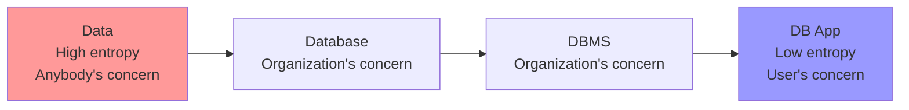
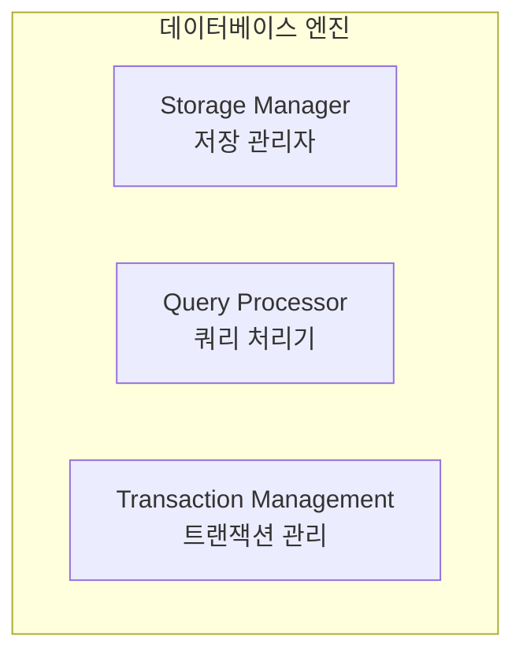

# 데이터베이스 시스템 개요

한양대학교 데이터베이스시스템및응용 강의의 첫 번째 내용으로, 데이터베이스 시스템의 기본 개념들을 정리해보겠습니다.

## 1. Data, Database, DBMS, DB App의 관계

### 🔄 엔트로피 관점에서 본 데이터의 진화



데이터베이스 시스템을 **엔트로피(entropy)** 관점에서 보면:
- **Data**: 높은 엔트로피 상태, 누구든지 관심을 가질 수 있는 무질서한 정보
- **Database**: 조직의 관심사로 구조화된 데이터
- **DBMS**: 데이터를 지능적으로 관리하는 시스템
- **DB Application**: 낮은 엔트로피 상태, 사용자 중심의 완성된 서비스

## 2. Database와 DBMS의 정의

### 📊 Database (데이터베이스)

**상위 개념**: 관심 있는 데이터의 집합 (A collection of concerned data)

**주요 도전 과제**:
- 관심 있는 데이터를 **논리적으로 조직화** (Logically organize)
- 데이터 간의 **관계 유지** (Maintaining relationships among data)
- 데이터의 **중복성 최소화** (Minimizing redundancy of data)

### 🖥️ Database Management System (DBMS)

**상위 개념**: 관심 있는 데이터의 지능적 서비스 제공자 (An intelligent service provider of concerned data)

**주요 도전 과제**:
- 관심 있는 데이터를 **물리적으로 조직화** (Physically organize)
- **인덱스 구조**를 사용한 데이터 접근 가속화 (Expediting data accesses using index structures)
- **데이터 일관성과 무결성** 유지 (Maintaining data consistency and integrity)
- 예측 불가능한 **모든 종류의 장애 허용** (Tolerating any kind of unpredictable faults)

## 3. 데이터 모델 (Data Models)

### 🗃️ 관계형 모델 (Relational Model) - Ted Codd

- **데이터베이스는 테이블의 집합**
- 각 테이블은 **관련된 데이터(레코드)의 집합**을 나타냄

**예시**: instructor 테이블
```sql
CREATE TABLE instructor (
    ID char(5),
    name varchar(20),
    dept_name varchar(20),
    salary numeric(8,2)
);
```

| ID | name | dept_name | salary |
|---|---|---|---|
| 22222 | Einstein | Physics | 95000 |
| 12121 | Wu | Finance | 90000 |
| 98345 | Kim | Elec. Eng. | 80000 |

### 🔗 개체-관계 데이터 모델 (Entity-Relationship Model)

- **주로 데이터베이스 설계**에 사용
- **실세계 개체와 그들의 관계**를 표현
- **설계 과정**: E-R 모델 → 구현 (관계형 모델)

### 📄 반구조화 데이터 모델 (Semi-structured Data Model)

- **JSON, XML** 형태
- **같은 타입의 데이터도 서로 다른 속성**을 가질 수 있음

## 4. 스키마와 인스턴스 (Schemas and Instances)

### 📋 스키마 (Schema)
> 프로그래밍 언어의 변수(타입)와 유사한 개념

#### **논리적 스키마 (Logical Schema)**
- 데이터베이스의 **전체 논리적 구조(설계)**
- 예시: "데이터베이스는 은행의 고객과 계좌 정보, 그리고 이들 간의 관계로 구성됨"
- 프로그램의 **타입 정보**와 유사

#### **물리적 스키마 (Physical Schema)**
- 데이터베이스의 **전체 물리적 구조(설계)**
- **물리적 데이터 독립성**: 논리적 스키마를 변경하지 않고 물리적 스키마 수정 가능

### 📊 인스턴스 (Instance)
- **특정 시점에서 데이터베이스의 실제 내용**
- 프로그래밍 언어의 **값**과 유사한 개념

## 5. 데이터베이스 언어

### 📝 데이터 정의 언어 (DDL - Data Definition Language)

**목적**: 데이터베이스 스키마를 정의하는 명세 표기법

```sql
CREATE TABLE instructor (
    ID char(5),
    name varchar(20),
    dept_name varchar(20),
    salary numeric(8,2)
);
```

**DDL 컴파일러의 역할**:
- **데이터 딕셔너리**에 저장되는 테이블 템플릿 생성
- **메타데이터** (데이터에 대한 데이터) 포함:
  - 데이터베이스 스키마
  - 무결성 제약조건 (Primary key 등)
  - 권한 (누가 무엇에 접근할 수 있는지)

### 🔍 데이터 조작 언어 (DML - Data Manipulation Language)

**목적**: 적절한 데이터 모델로 조직된 데이터에 접근하고 업데이트하는 언어

#### **두 가지 유형**:

1. **절차적 DML (Procedural DML)**
   - **무엇이 필요한지 + 어떻게 얻을지** 모두 명시
   
2. **선언적 DML (Declarative DML)**
   - **무엇이 필요한지만** 명시 (어떻게 얻을지는 명시하지 않음)
   - 절차적 DML보다 **학습과 사용이 쉬움**
   - **비절차적 DML**이라고도 함

#### **쿼리 언어 (Query Language)**
- DML 중에서 **정보 검색**을 담당하는 부분

## 6. SQL 언어

### 🔧 SQL의 특징

- **DDL과 DML 역할을 모두 수행**
- **비절차적(nonprocedural)** 쿼리 언어
- **여러 테이블을 입력**으로 받아 **항상 단일 테이블을 반환**

### 📋 SQL 예시

```sql
-- Comp. Sci. 학과의 모든 교수 이름 찾기
SELECT name
FROM instructor
WHERE dept_name = 'Comp. Sci.';
```

### ⚠️ SQL의 한계

- **튜링 머신과 동등하지 않은 언어**
- **복잡한 함수 계산**을 위해서는 더 고급 언어에 **임베드**되어 사용
- **애플리케이션 프로그램**은 다음 방법으로 데이터베이스에 접근:
  - **임베드된 SQL**을 허용하는 언어 확장
  - **API** (ODBC/JDBC 등)를 통한 SQL 쿼리 전송

## 7. 데이터베이스 설계 (Database Design)

### 🎯 설계의 목적
**데이터베이스의 일반적인 구조를 설계하는 과정**

#### **논리적 설계 (Logical Design)**
- **데이터베이스 스키마 결정**
- **"좋은" 관계 스키마 집합**을 찾는 것이 필요
- **비즈니스 결정**: 데이터베이스에 어떤 속성을 기록할 것인가?
- **컴퓨터 과학 결정**: 어떤 관계 스키마를 가져야 하고, 속성을 어떻게 분산시킬 것인가?

#### **물리적 설계 (Physical Design)**
- **데이터베이스의 물리적 레이아웃 결정**

## 8. 데이터베이스 엔진 (Database Engine)

### 🏗️ 시스템 구조

데이터베이스 시스템은 **각 책임을 다루는 모듈들로 분할**됩니다.



#### **1️⃣ 저장 관리자 (Storage Manager)**

**역할**: 저수준 데이터와 응용 프로그램/쿼리 간의 인터페이스 제공

**주요 작업**:
- OS 파일 관리자와의 상호작용
- 데이터의 효율적인 저장, 검색, 업데이트

**구성 요소**:
- Authorization and integrity manager
- Transaction manager, File manager, Buffer manager

**구현하는 데이터 구조**:
- **Data files**: 데이터베이스 자체를 저장
- **Data dictionary**: 데이터베이스 구조에 대한 메타데이터 저장
- **Indices**: 빠른 데이터 접근을 위한 포인터 제공

#### **2️⃣ 쿼리 처리기 (Query Processor)**

**구성 요소**:
- **DDL 해석기**: DDL 문을 해석하고 데이터 딕셔너리에 정의 기록
- **DML 컴파일러**: DML 문을 저수준 명령어로 구성된 평가 계획으로 변환
  - **쿼리 최적화** 수행: 여러 대안 중 최저 비용 평가 계획 선택
- **쿼리 평가 엔진**: DML 컴파일러가 생성한 저수준 명령어 실행

**쿼리 처리 과정**:


#### **3️⃣ 트랜잭션 관리 (Transaction Management)**

**트랜잭션**: 데이터베이스 애플리케이션에서 **단일 논리적 기능을 수행하는 연산의 집합**

**ACID 특성**:
- **A**tomicity (원자성)
- **C**onsistency (일관성)  
- **I**solation (고립성)
- **D**urability (영속성)

**구성 요소**:

**복구 관리자 (Recovery Manager)**:
- 시스템 장애와 트랜잭션 장애에도 **데이터베이스의 일관된 상태** 유지
- **원자성과 영속성** 보장

**동시성 제어 관리자 (Concurrency-control Manager)**:
- **동시 트랜잭션 간의 상호작용** 제어
- **일관성과 고립성** 보장

## 9. 정리 및 다음 학습

### 📝 핵심 내용 정리

1. **데이터베이스**는 조직의 관심 데이터를 논리적으로 구조화한 집합
2. **DBMS**는 데이터를 물리적으로 관리하는 지능적 서비스 제공자
3. **관계형 모델**이 현재 가장 널리 사용되는 데이터 모델
4. **SQL**은 DDL과 DML 기능을 모두 제공하는 비절차적 언어
5. **데이터베이스 엔진**은 저장 관리자, 쿼리 처리기, 트랜잭션 관리로 구성

### 🔜 다음 학습 계획

다음 포스트에서는 **관계형 모델(Relational Model)**에 대해 자세히 학습하겠습니다:
- 관계형 모델의 구조
- 관계형 스키마와 인스턴스
- 키와 제약 조건
- 관계 대수 연산

---

## 📚 참고 자료
- 한양대학교 데이터베이스시스템및응용 강의자료
- Database System Concepts (Silberschatz, Galvin, Gagne)

> 💡 **학습 팁**: 데이터베이스의 개념을 이해할 때는 엔트로피 관점에서 생각해보세요. 무질서한 데이터가 체계적으로 정리되어 사용자에게 의미 있는 정보로 제공되는 과정을 상상하면 도움이 됩니다!