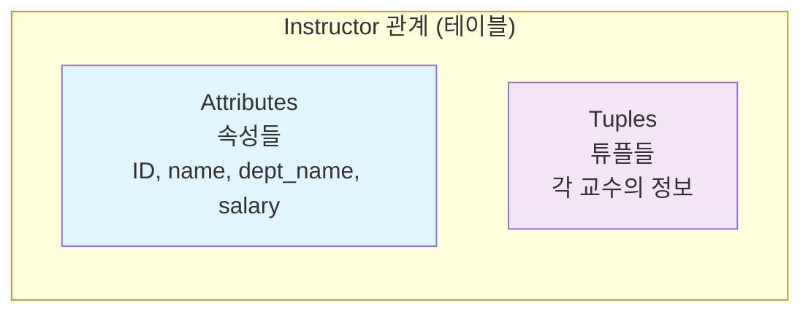
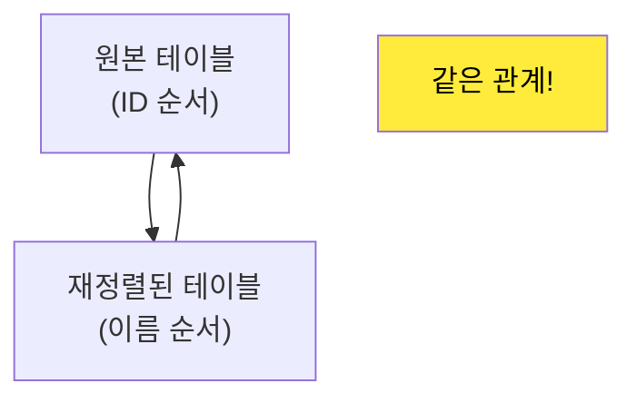
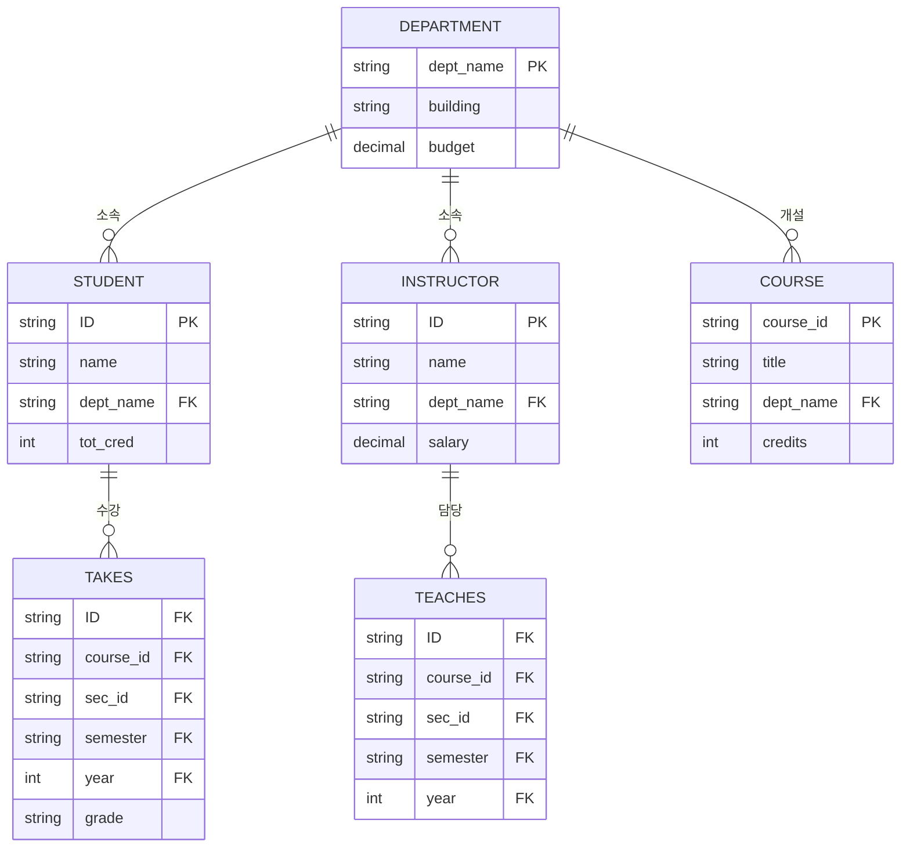
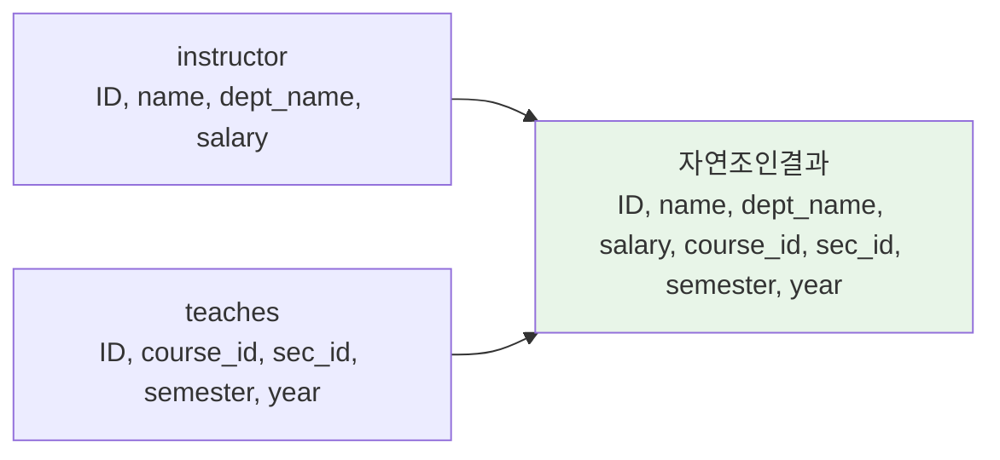

# 관계형 모델 (Relational Model)

한양대학교 데이터베이스시스템및응용 강의의 두 번째 내용으로, 관계형 모델의 핵심 개념들을 자세히 살펴보겠습니다.

## 1. 관계형 데이터베이스와 관계형 모델의 기본 개념

### 📊 관계형 데이터베이스의 정의

**관계형 데이터베이스**는 **테이블들의 집합**입니다.

관계형 모델에서 사용하는 용어들:
- **Relation (관계)**: 테이블을 지칭하는 용어
- **Tuple (튜플)**: 테이블의 행(row)을 지칭하는 용어  
- **Attribute (속성)**: 테이블의 열(column)을 지칭하는 용어



### 🗃️ 실제 예시: Instructor 관계

| ID | name | dept_name | salary |
|---|---|---|---|
| 10101 | Srinivasan | Comp. Sci. | 65000 |
| 12121 | Wu | Finance | 90000 |
| 15151 | Mozart | Music | 40000 |
| 22222 | Einstein | Physics | 95000 |
| 32343 | El Said | History | 60000 |

## 2. 관계 스키마와 인스턴스 (Relation Schema and Instance)

### 📋 관계 스키마 (Relation Schema)

- **A₁, A₂, ..., Aₙ**은 속성들(attributes)
- **R = (A₁, A₂, ..., Aₙ)**은 관계 스키마(relation schema)

**예시**: `instructor = (ID, name, dept_name, salary)`

### 📊 관계 인스턴스 (Relation Instance)

- 스키마 R에 대해 정의된 관계 인스턴스 r은 **r(R)**로 표기
- **특정 시점에서 관계의 실제 내용**을 나타냄

> **프로그래밍 언어와의 비교**
> - **스키마**: 변수의 타입 정보와 유사
> - **인스턴스**: 변수의 실제 값과 유사

## 3. 속성 (Attributes)

### 🔍 속성의 특성

#### **도메인 (Domain)**
각 속성에 대해 허용되는 값들의 집합을 **도메인**이라고 합니다.

#### **원자성 (Atomicity)**
속성 값은 일반적으로 **원자적(atomic)**이어야 합니다. 즉, 더 이상 나눌 수 없어야 합니다.

**원자성의 예시**:
```
전화번호 = 국가코드 + 지역코드 + 지역번호

❌ 원자적이 아님: 각 코드/번호를 개별적으로 사용하는 경우
✅ 원자적임: 전체 전화번호를 하나의 값으로 사용하는 경우
```

#### **NULL 값**
- 모든 도메인의 구성원
- **"알 수 없는" 값**을 나타냄
- 많은 연산의 정의에서 복잡성을 야기

## 4. 관계의 순서 없음 (Relations are Unordered)

### 🔄 관계는 집합

- 관계는 튜플들의 **집합(set)**
- **튜플의 순서는 무관함** (임의의 순서로 저장 가능)



## 5. 데이터베이스 스키마 (Database Schema)

### 🏗️ 데이터베이스 스키마의 구성

**데이터베이스 스키마**: 관계 스키마들의 집합으로 구성된 데이터베이스의 논리적 구조

**대학 데이터베이스 스키마 예시**:
```sql
instructor (ID, name, dept_name, salary)
department (dept_name, building, budget)
course (course_id, title, dept_name, credits)
section (course_id, sec_id, semester, year, building, room_number, time_slot_id)
prereq (course_id, prereq_id)
teaches (ID, course_id, sec_id, semester, year)
student (ID, name, dept_name, tot_cred)
adviser (s_id, i_id)
takes (ID, course_id, sec_id, semester, year, grade)
classroom (building, room_number, capacity)
time_slot (time_slot_id, day, start_time, end_time)
```

**데이터베이스 인스턴스**: 특정 시점에서 데이터베이스 내 데이터의 스냅샷

## 6. 키 (Keys)

### 🔑 키의 종류와 정의

#### **슈퍼키 (Superkey)**
- K ⊆ R (관계 스키마 R의 속성들의 부분집합)
- K의 값들이 각 가능한 관계 인스턴스 r(R)에서 **고유한 튜플을 식별**하기에 충분한 경우

**예시**: `{ID}`와 `{ID, name}` 모두 instructor의 슈퍼키

#### **후보키 (Candidate Key)**
- 슈퍼키 K가 **최소(minimal)**인 경우
- 즉, K의 어떤 진부분집합도 슈퍼키가 아닌 경우

**예시**: `{ID}`는 instructor의 후보키이지만, `{ID, name}`은 후보키가 아님

#### **기본키 (Primary Key)**
- 후보키 중 하나를 선택하여 **기본키**로 지정
- **값이 절대 변경되지 않거나 매우 드물게 변경되는** 속성을 선택해야 함

> **💡 실생활 예시: 여권 영문명 변경이 어려운 이유**
> 
> - **한국**: 모든 국민이 고유한 주민등록번호를 가지므로 이름은 키로 사용되지 않음
> - **외국**: 종종 (이름, 생년월일) 쌍을 키로 사용
> - **여권 영문명 변경** → 다른 나라 출입국 데이터베이스의 키 값 변경 필요 → 쉽게 수용되지 않음

### 🔗 외래키 (Foreign Key)

#### **외래키 제약조건**

관계 r₁의 속성 A에서 관계 r₂의 기본키 B로의 외래키 제약조건:

> **모든 데이터베이스 인스턴스에서, r₁의 각 튜플에 대한 A의 값이 r₂의 어떤 튜플의 B 값과 반드시 동일해야 함**

**구성 요소**:
- **A**: 외래키 (r₁에서 r₂를 참조)
- **r₁**: 참조하는 관계 (referencing relation)
- **r₂**: 참조되는 관계 (referenced relation)

**예시**: `instructor`의 `dept_name`은 `department`를 참조하는 외래키

#### **참조 무결성 제약조건 (Referential Integrity Constraint)**

외래키 제약조건의 일반화된 버전으로, 참조되는 속성이 반드시 기본키일 필요는 없음.

### 📊 대학 데이터베이스 스키마 다이어그램



> **📌 주요 포인트**
> - 밑줄 친 속성들은 기본키
> - 화살표는 외래키 관계를 나타냄
> - `takes` 관계는 4개 속성으로 구성된 외래키를 가짐

## 7. 관계형 질의 언어 (Relational Query Languages)

### 🔄 절차적 vs 비절차적

#### **"순수" 언어들**

1. **관계 대수 (Relational Algebra)** - 절차적
2. **튜플 관계 해석 (Tuple Relational Calculus)** - 비절차적
3. **도메인 관계 해석 (Domain Relational Calculus)** - 비절차적

> 위 3가지 순수 언어들은 **계산 능력이 동등**합니다.

#### **특징**
- **튜링 머신과 동등하지 않음**
- 관계 대수는 **6개의 기본 연산**으로 구성

## 8. 관계 대수 (Relational Algebra)

### 🧮 관계 대수의 정의

**절차적 언어**로서 다음과 같은 특징을 가집니다:
- **하나 또는 두 개의 관계**를 입력으로 받음
- **새로운 관계**를 결과로 생성

### 🔧 6가지 기본 연산자

| 연산자 | 기호 | 설명 |
|--------|------|------|
| **Select** | σ | 조건을 만족하는 튜플 선택 |
| **Project** | Π | 특정 속성들만 선택 |
| **Union** | ∪ | 합집합 |
| **Set Difference** | − | 차집합 |
| **Cartesian Product** | × | 카르테시안 곱 |
| **Rename** | ρ | 이름 변경 |

### 🎯 Select 연산 (σ)

**목적**: 주어진 조건(predicate)을 만족하는 튜플들을 선택

**표기법**: `σ_p(r)`
- p: 선택 조건 (selection predicate)
- r: 관계

**예시**:
```sql
σ_dept_name="Physics"(instructor)
```

**결과**:
| ID | name | dept_name | salary |
|---|---|---|---|
| 22222 | Einstein | Physics | 95000 |
| 33456 | Gold | Physics | 87000 |

#### **고급 Select 연산**

**비교 연산자**: `=, ≠, >, ≥, <, ≤`

**논리 연결자**: `∧ (and), ∨ (or), ¬ (not)`

**예시**:
```sql
-- Physics 학과의 급여 90,000 이상인 교수
σ_dept_name="Physics" ∧ salary > 90,000(instructor)

-- 학과명과 건물명이 같은 학과
σ_dept_name=building(department)
```

### 📊 Project 연산 (Π)

**목적**: 특정 속성들만 선택하여 새로운 관계 생성

**표기법**: `Π_A1, A2, ..., Ak(r)`

**특징**: 중복 행은 자동으로 제거됨 (관계는 집합이므로)

**예시**:
```sql
Π_ID, name, salary(instructor)
```

**결과**:
| ID | name | salary |
|---|---|---|
| 10101 | Srinivasan | 65000 |
| 12121 | Wu | 90000 |
| 15151 | Mozart | 40000 |
| 22222 | Einstein | 95000 |
| ... | ... | ... |

### 🔗 연산 조합 (Composition of Operations)

관계 대수 연산의 결과도 관계이므로, **연산들을 조합**할 수 있습니다.

**예시**: Physics 학과 교수들의 이름 찾기
```sql
Π_name(σ_dept_name="Physics"(instructor))
```

### ✖️ 카르테시안 곱 (Cartesian Product)

**목적**: 두 관계의 모든 가능한 튜플 쌍을 조합

**표기법**: `instructor × teaches`

**문제점**: 관련 없는 데이터까지 모두 조합되어 매우 큰 결과 생성

### 🤝 조인 연산 (Join Operations)

#### **세타 조인 (Theta Join)**

**정의**: Select와 Cartesian Product를 결합한 연산

**표기법**: `r ⋈_θ s = σ_θ(r × s)`

**예시**:
```sql
instructor ⋈_instructor.ID = teaches.ID teaches
```

#### **자연 조인 (Natural Join)**

**표기법**: `r ⋈ s`

**동작 방식**:
1. 두 관계의 **공통 속성**을 찾음
2. 공통 속성의 값이 **같은 튜플들**만 결합
3. 결과에서 **중복 속성 제거**

**예시**: `instructor ⋈ teaches`



### 🔢 집합 연산들

#### **합집합 (Union) - ∪**

**조건**:
1. 두 관계의 **arity(속성 개수)가 동일**해야 함
2. 대응되는 속성의 **도메인이 호환**되어야 함

**예시**: Fall 2017 또는 Spring 2018에 개설된 모든 과목
```sql
Π_course_id(σ_semester="Fall" ∧ year=2017(section)) ∪
Π_course_id(σ_semester="Spring" ∧ year=2018(section))
```

#### **교집합 (Intersection) - ∩**

**예시**: Fall 2017과 Spring 2018 모두에 개설된 과목
```sql
Π_course_id(σ_semester="Fall" ∧ year=2017(section)) ∩
Π_course_id(σ_semester="Spring" ∧ year=2018(section))
```

#### **차집합 (Set Difference) - −**

**예시**: Fall 2017에는 개설되었지만 Spring 2018에는 개설되지 않은 과목
```sql
Π_course_id(σ_semester="Fall" ∧ year=2017(section)) −
Π_course_id(σ_semester="Spring" ∧ year=2018(section))
```

### 📝 대입 연산 (Assignment Operation)

**목적**: 복잡한 관계 대수 식을 단계별로 작성할 수 있게 해줌

**표기법**: `←`

**예시**: Physics와 Music 학과의 모든 교수 찾기
```sql
Physics ← σ_dept_name="Physics"(instructor)
Music ← σ_dept_name="Music"(instructor)
Physics ∪ Music
```

### 🏷️ 이름 변경 연산 (Rename Operation)

**목적**: 관계 대수 식의 결과에 이름을 부여

**표기법**: 
- `ρ_x(E)`: 결과를 x라는 이름으로 지정
- `ρ_x(A1,A2,...,An)(E)`: 속성 이름도 함께 변경

## 9. 동등한 질의 (Equivalent Queries)

### 🔄 관계 대수의 다양한 표현

하나의 질의를 여러 방식으로 표현할 수 있습니다.

**예시 1**: Physics 학과의 급여 90,000 이상인 교수
```sql
-- 방법 1
σ_dept_name="Physics" ∧ salary > 90,000(instructor)

-- 방법 2  
σ_dept_name="Physics"(σ_salary > 90,000(instructor))
```

**예시 2**: Physics 학과 교수가 가르치는 과목 정보
```sql
-- 방법 1
σ_dept_name="Physics"(instructor ⋈_instructor.ID = teaches.ID teaches)

-- 방법 2
(σ_dept_name="Physics"(instructor)) ⋈_instructor.ID = teaches.ID teaches
```

> **💡 동등성의 의미**: 서로 다른 질의이지만 모든 데이터베이스에서 **동일한 결과**를 반환

## 10. 데이터베이스 수정 연산

### ✏️ 수정 연산의 종류

모든 수정 연산은 **대입 연산자**를 사용하여 표현됩니다:

1. **삭제 (Deletion)**
2. **삽입 (Insertion)**  
3. **갱신 (Updating)**

#### **삭제 연산**

**형식**: `r ← r − E`

**예시**:
```sql
-- Perryridge 지점의 모든 계좌 삭제
account ← account − σ_branch-name = "Perryridge"(account)

-- 금액이 0~50 사이인 대출 삭제  
loan ← loan − σ_amount ≥ 0 ∧ amount ≤ 50(loan)
```

#### **삽입 연산**

**형식**: `r ← r ∪ E`

**예시**:
```sql
-- Smith가 A-973 계좌에 $1200 보유 정보 삽입
account ← account ∪ {("Perryridge", A-973, 1200)}
depositor ← depositor ∪ {("Smith", A-973)}
```

#### **갱신 연산**

**형식**: `r ← Π_F1, F2, ..., Fn(r)`

각 Fi는:
- i번째 속성이 갱신되지 않으면: 원래 속성값
- i번째 속성이 갱신되면: 새로운 값을 계산하는 식

**예시**:
```sql
-- 모든 잔액을 5% 인상
account ← Π_AN, BN, BAL * 1.05(account)
```

## 11. 정리 및 다음 학습

### 📝 핵심 내용 정리

1. **관계형 모델**은 테이블 기반의 데이터 표현 방식
2. **스키마**는 구조, **인스턴스**는 실제 데이터
3. **키**는 튜플을 고유하게 식별하는 속성 집합
4. **관계 대수**는 6개 기본 연산으로 구성된 절차적 질의 언어
5. **조인 연산**은 여러 관계의 정보를 결합하는 핵심 연산

### 🔜 다음 학습 계획

다음 포스트에서는 **SQL 언어**에 대해 자세히 학습하겠습니다:
- SQL 기본 구조 (SELECT, FROM, WHERE)
- SQL 조인 연산
- 집계 함수와 그룹화
- 부질의와 고급 SQL 기능

---

## 📚 참고 자료
- 한양대학교 데이터베이스시스템및응용 강의자료
- Database System Concepts (Silberschatz, Galvin, Gagne)

> 💡 **학습 팁**: 관계 대수의 각 연산을 실제 SQL 쿼리와 연결지어 생각해보세요. 이론적 기반을 이해하면 SQL 작성이 훨씬 쉬워집니다!