# E-R 모델을 이용한 데이터베이스 설계

한양대학교 데이터베이스시스템및응용 강의의 네 번째 내용으로, E-R 모델을 이용한 데이터베이스 설계 방법론을 자세히 살펴보겠습니다.

## 1. 데이터베이스 설계 과정

### 🎯 설계의 3단계

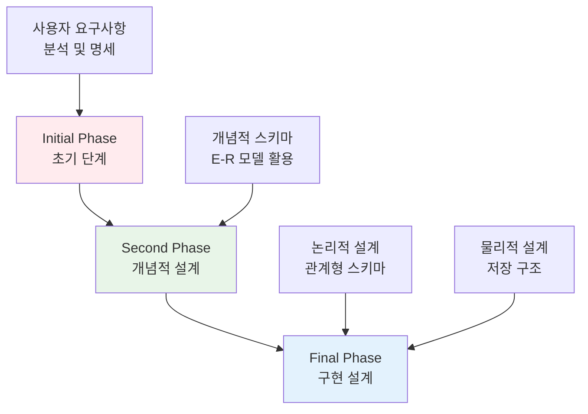

#### **1️⃣ 초기 단계 (Initial Phase)**
- **목적**: 잠재적 데이터베이스 사용자들의 데이터 요구사항을 완전히 파악
- **결과물**: 사용자 요구사항 명세서

#### **2️⃣ 개념적 설계 단계 (Second Phase)**
- **목적**: 데이터 모델을 선택하고 사용자 요구사항을 개념적 스키마로 변환
- **결과물**: 개념적 스키마 (E-R 다이어그램)
- **기능 요구사항**: 데이터에 수행될 연산(트랜잭션) 종류 기술

#### **3️⃣ 구현 설계 단계 (Final Phase)**
- **논리적 설계**: 데이터베이스 스키마 결정
  - **비즈니스 결정**: 어떤 속성을 기록할 것인가?
  - **컴퓨터 과학적 결정**: 어떤 관계 스키마를 가져야 하고, 속성을 어떻게 분산시킬 것인가?
- **물리적 설계**: 데이터베이스의 물리적 레이아웃 결정

### 🔧 설계 접근 방법

#### **E-R 모델 (Entity-Relationship Model)**
- **특징**: 기업을 개체(entities)와 관계(relationships)의 집합으로 모델링
- **개체**: 기업에서 다른 객체와 구별되는 "사물" 또는 "객체"
- **관계**: 여러 개체 간의 연관성
- **표현**: E-R 다이어그램으로 시각적 표현

#### **정규화 이론 (Normalization Theory)**
- **특징**: 나쁜 설계를 형식화하고 이를 테스트하는 방법 제공

## 2. 개체 집합 (Entity Sets)

### 📦 개체와 개체 집합의 정의

#### **개체 (Entity)**
- **정의**: 존재하며 다른 객체와 구별 가능한 객체
- **예시**: 특정 사람, 회사, 사건

#### **개체 집합 (Entity Set)**
- **정의**: 동일한 유형이고 같은 속성을 공유하는 개체들의 집합
- **예시**: 모든 사람들의 집합, 회사들의 집합, 나무들의 집합

#### **속성 (Attributes)**
- **정의**: 개체 집합의 모든 구성원이 가지는 서술적 특성
- **도메인**: 각 속성에 대해 허용되는 값들의 집합
- **기본키**: 개체 집합에서 각 구성원을 고유하게 식별하는 속성들의 부분집합

### 🏗️ E-R 다이어그램 표현

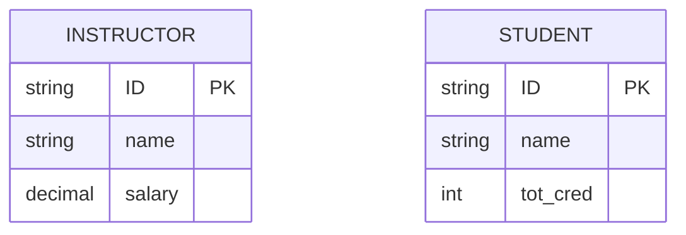

**표현 규칙**:
- **직사각형**: 개체 집합 표현
- **속성**: 개체 직사각형 내부에 나열
- **밑줄**: 기본키 속성 표시

### 📊 실제 예시: 대학 데이터베이스

**instructor 개체 집합**:
```
instructor = (ID, name, salary)
```

| ID | name | salary |
|---|---|---|
| 76766 | Crick | 72000 |
| 45565 | Katz | 75000 |
| 10101 | Srinivasan | 65000 |
| 98345 | Kim | 80000 |

## 3. 관계 집합 (Relationship Sets)

### 🔗 관계와 관계 집합의 정의

#### **관계 (Relationship)**
- **정의**: 여러 개체 간의 연관성
- **예시**: student 개체 44553 (Peltier)과 instructor 개체 22222 (Einstein) 간의 advisor 관계

#### **관계 집합 (Relationship Set)**
- **정의**: n ≥ 2 개의 개체들 간의 수학적 관계
- **형식**: R = {(e₁, e₂, …, eₙ) | e₁ ∈ E₁, e₂ ∈ E₂, …, eₙ ∈ Eₙ}

### 🎯 관계의 차수 (Degree of Relationship)

#### **이진 관계 (Binary Relationship)**
- **정의**: 두 개체 집합을 포함 (차수 2)
- **특징**: 데이터베이스 시스템에서 가장 일반적
- **예시**: instructor와 student 간의 advisor 관계

#### **삼진 관계 (Ternary Relationship)**
- **정의**: 세 개체 집합을 포함 (차수 3)
- **예시**: instructor, student, project 간의 proj_guide 관계

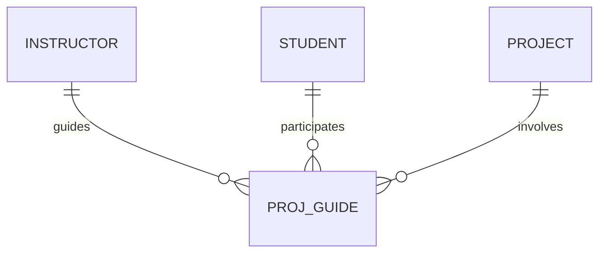

#### **역할 (Roles)**
개체 집합이 관계에서 두 번 이상 참여할 때 사용:

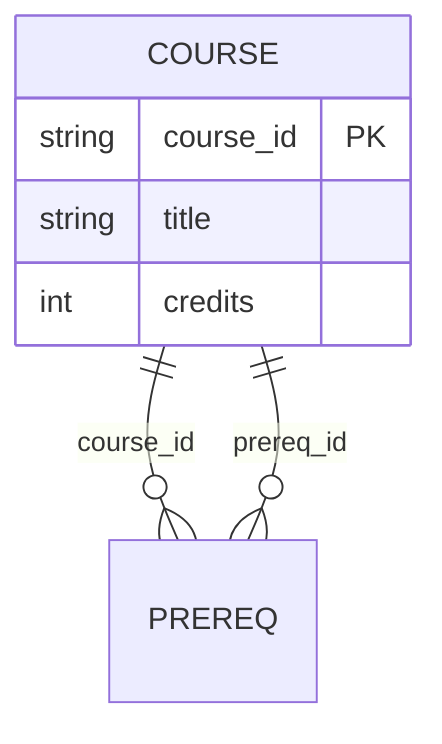

### 📋 관계 속성

관계 집합도 속성을 가질 수 있습니다:

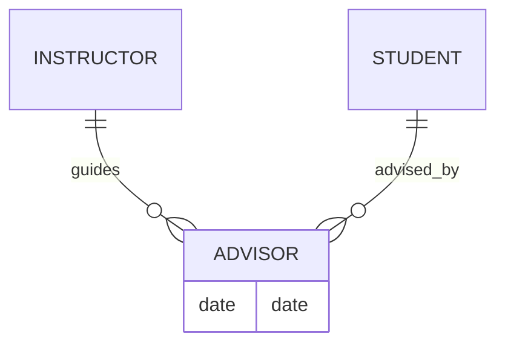

**예시**: advisor 관계의 date 속성
- 학생이 언제부터 해당 교수의 지도를 받기 시작했는지 추적

## 4. 복합 속성 (Complex Attributes)

### 🎯 속성의 유형

#### **단순 vs 복합 속성**
- **단순 속성**: 더 이상 나눌 수 없는 값 (예: first_name, last_name)
- **복합 속성**: 여러 부분으로 구성 (예: name = (first_name, last_name))

#### **단일값 vs 다중값 속성**
- **단일값 속성**: 하나의 값 (예: name)
- **다중값 속성**: 여러 값 (예: phone_numbers)

#### **유도 속성**
- **정의**: 다른 속성으로부터 계산 가능
- **예시**: age (date_of_birth로부터 계산)

### 🌳 복합 속성의 계층 구조

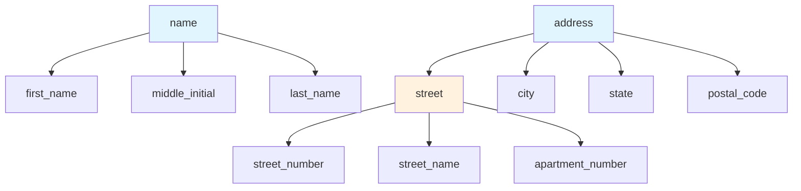

### 📊 E-R 다이어그램에서의 표현

```sql
instructor:
    ID
    name
        first_name
        middle_initial
        last_name
    address
        street
            street_number
            street_name
            apt_number
        city
        state
        zip
    { phone_number }  -- 다중값 속성
    date_of_birth
    age ( )          -- 유도 속성
```

## 5. 매핑 카디널리티 제약조건

### 🔄 카디널리티의 종류

이진 관계 집합에서 가능한 매핑 카디널리티:

#### **1:1 (일대일)**
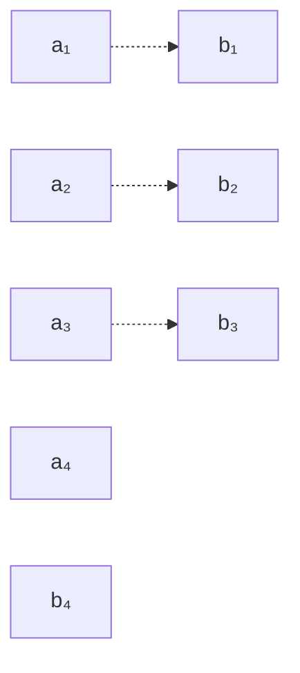

#### **1:N (일대다)**
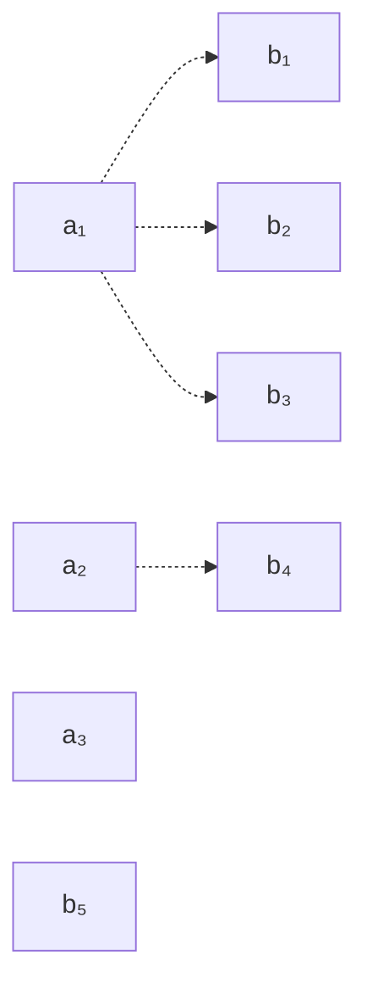

#### **N:1 (다대일)**
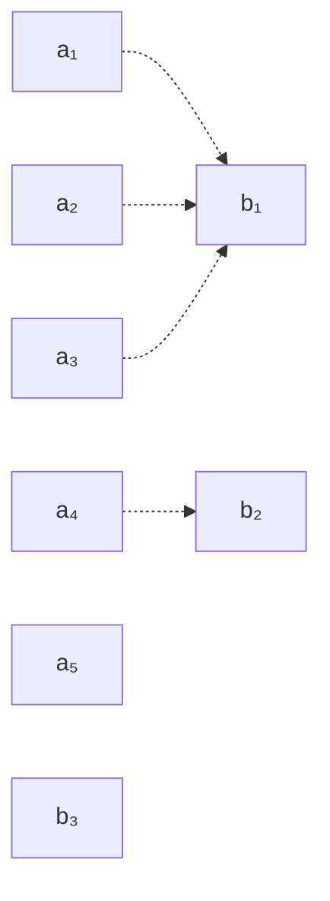

#### **M:N (다대다)**
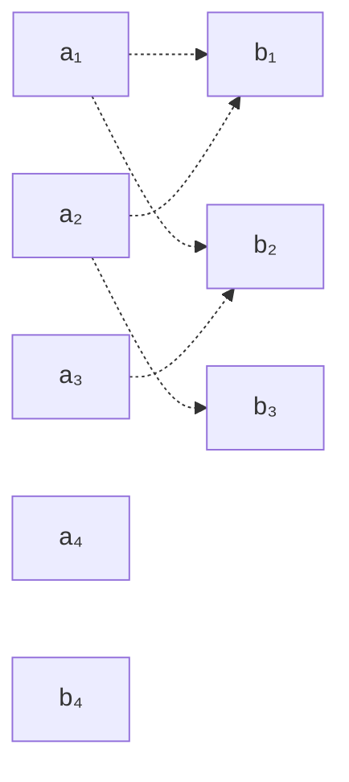

### 📐 E-R 다이어그램에서의 표현

#### **화살표 표기법**
- **→**: "one" (일)을 의미하는 방향 화살표
- **—**: "many" (다)를 의미하는 무방향 선

#### **일대다 관계 예시**
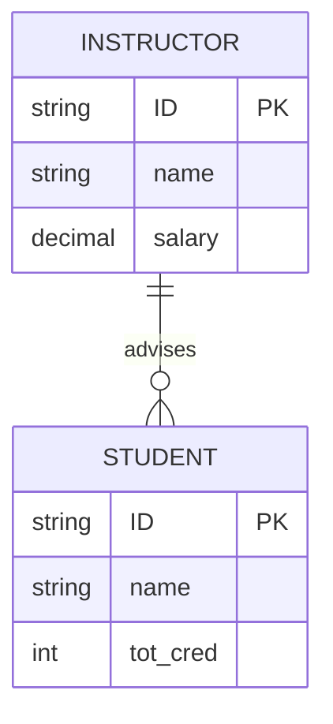

### 🔢 상세한 카디널리티 표기법

**l..h 형식**: l은 최소값, h는 최대값

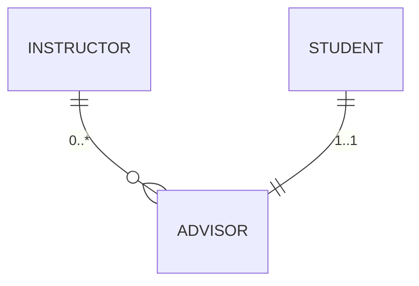

**의미**:
- **교수**: 0명 이상의 학생을 지도 가능
- **학생**: 정확히 1명의 지도교수 필요

## 6. 참여 제약조건

### 🎯 전체 참여 vs 부분 참여

#### **전체 참여 (Total Participation)**
- **정의**: 개체 집합의 모든 개체가 최소 하나의 관계에 참여
- **표기**: 이중선으로 표시
- **예시**: 모든 학생은 지도교수가 있어야 함

#### **부분 참여 (Partial Participation)**
- **정의**: 일부 개체만 관계에 참여해도 됨
- **표기**: 단일선으로 표시 (기본값)
- **예시**: 모든 교수가 학생을 지도할 필요는 없음

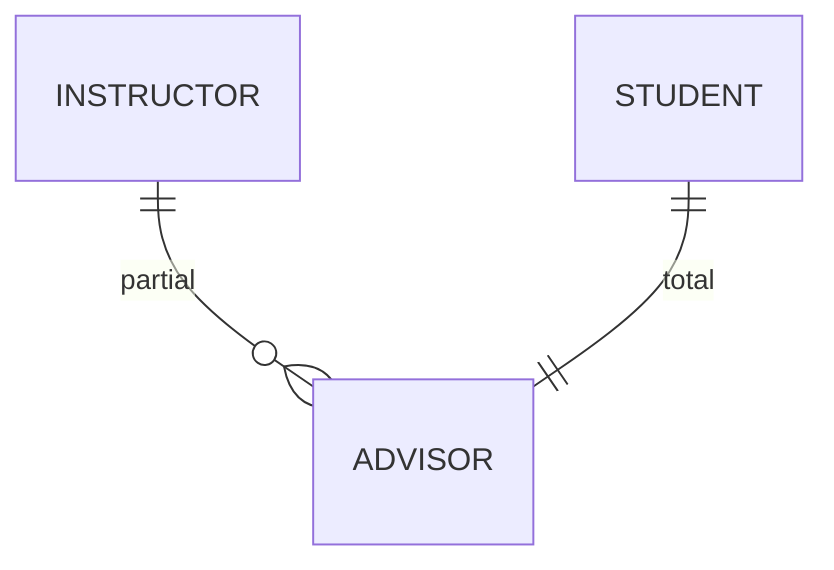

## 7. 기본키 (Primary Keys)

### 🔑 개체 집합의 기본키

#### **기본 원칙**
- **정의상**: 개별 개체들은 구별됨
- **데이터베이스 관점**: 속성 값으로 구별되어야 함
- **고유성**: 개체 집합에서 모든 속성값이 동일한 두 개체는 허용되지 않음

#### **키의 정의**
개체 집합에서 개체들을 서로 구별하기에 충분한 속성들의 집합

### 🔗 관계 집합의 기본키

#### **기본 규칙**
관계 집합 R에 참여하는 개체 집합들 E₁, E₂, …, Eₙ에 대해:

```
PK(R) = PK(E₁) ∪ PK(E₂) ∪ … ∪ PK(Eₙ)
```

#### **예시**: advisor 관계
```
PK(advisor) = {instructor.ID, student.ID}
```

### ⚖️ 카디널리티에 따른 기본키 선택

| 카디널리티 | 기본키 선택 | 설명 |
|-------------|-------------|------|
| **다대다** | PK(E₁) ∪ PK(E₂) | 전체 속성 조합 |
| **일대다** | PK(E₂) | "다" 쪽의 기본키 |
| **다대일** | PK(E₁) | "다" 쪽의 기본키 |
| **일대일** | PK(E₁) 또는 PK(E₂) | 둘 중 하나 선택 |

## 8. 약한 개체 집합 (Weak Entity Sets)

### 🔍 약한 개체 집합의 개념

#### **문제 상황**
section 개체를 생각해보면:
```
section = (course_id, section_id, semester, year, building, room_number, time_slot_id)
```

- section은 course와 관련이 있음
- course_id가 중복되므로 관계가 모호해질 수 있음

#### **해결 방법**
course_id를 section에서 제거하고 관계로만 표현:
```
section = (section_id, semester, year, building, room_number, time_slot_id)
```

### 💪 강한 개체 집합 vs 약한 개체 집합

#### **강한 개체 집합 (Strong Entity Set)**
- **정의**: 자체적인 기본키를 가진 일반적인 개체 집합

#### **약한 개체 집합 (Weak Entity Set)**
- **정의**: 기본키를 형성하기에 충분한 속성을 가지지 않은 개체 집합
- **의존성**: 식별하는 개체 집합(강한 개체 집합)에 의존
- **구별자**: 약한 개체를 고유하게 식별하기 위한 추가 속성들

#### **기본키 구성**
```
PK(약한 개체 집합) = PK(식별하는 개체 집합) + 구별자
```

**예시**:
```
PK(section) = (course_id, sec_id, semester, year)
```

### 🎨 E-R 다이어그램 표현

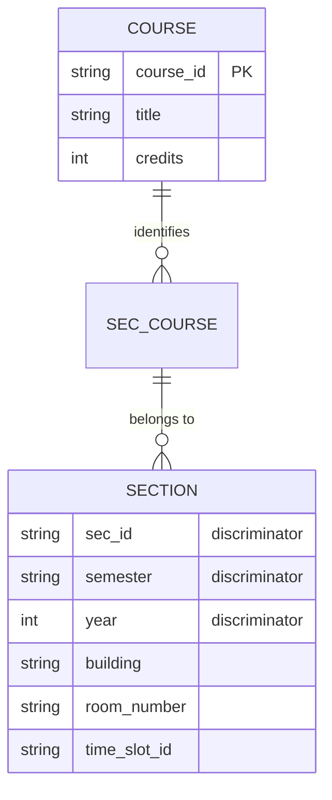

**표기법**:
- **이중 직사각형**: 약한 개체 집합
- **점선 밑줄**: 구별자 속성
- **이중 다이아몬드**: 식별 관계

### 🔄 존재 의존성

#### **특성**
- **존재 의존성**: 모든 약한 개체는 식별하는 개체와 연관되어야 함
- **종속 삭제**: 식별하는 개체가 삭제되면 연관된 모든 약한 개체도 삭제
- **소유권**: 식별하는 개체 집합이 약한 개체 집합을 "소유"

## 9. E-R 다이어그램을 관계형 스키마로 변환

### 🔄 변환의 기본 규칙

#### **기본 원칙**
- **각 개체 집합** → 고유한 관계 스키마
- **각 관계 집합** → 고유한 관계 스키마
- **각 스키마**: 여러 열(속성)을 가지며, 고유한 이름 보유

### 📦 개체 집합 표현

#### **강한 개체 집합**
```sql
-- 원본 개체 집합
student(ID, name, tot_cred)

-- 변환된 관계 스키마
CREATE TABLE student (
    ID          char(5) PRIMARY KEY,
    name        varchar(20) NOT NULL,
    tot_cred    numeric(3,0)
);
```

#### **약한 개체 집합**
```sql
-- 식별하는 개체의 기본키 포함
section(course_id, sec_id, semester, year)

CREATE TABLE section (
    course_id   varchar(8),
    sec_id      varchar(8),
    semester    varchar(6),
    year        numeric(4,0),
    PRIMARY KEY (course_id, sec_id, semester, year),
    FOREIGN KEY (course_id) REFERENCES course
);
```

### 🎨 복합 속성 처리

#### **평면화 (Flattening)**
복합 속성은 구성 요소별로 분리:

```sql
-- 원본 복합 속성
name = (first_name, middle_initial, last_name)
address = (street(street_number, street_name, apt_number), city, state, zip)

-- 변환된 스키마
instructor(
    ID,
    first_name,         -- name.first_name
    middle_initial,     -- name.middle_initial  
    last_name,          -- name.last_name
    street_number,      -- address.street.street_number
    street_name,        -- address.street.street_name
    apt_number,         -- address.street.apt_number
    city,               -- address.city
    state,              -- address.state
    zip_code,           -- address.zip
    date_of_birth
);
```

### 📞 다중값 속성 처리

#### **별도 스키마 생성**
다중값 속성 M을 가진 개체 E에 대해 별도 스키마 EM 생성:

```sql
-- 원본: instructor의 phone_number (다중값)
-- 변환된 스키마
inst_phone(ID, phone_number)

-- 예시 데이터
INSERT INTO inst_phone VALUES 
    ('22222', '456-7890'),
    ('22222', '123-4567');
```

### 🔗 관계 집합 표현

#### **다대다 관계의 기본 규칙**
```sql
-- advisor 관계 집합
advisor(s_ID, i_ID)

CREATE TABLE advisor (
    s_ID    char(5),
    i_ID    char(5),
    PRIMARY KEY (s_ID, i_ID),
    FOREIGN KEY (s_ID) REFERENCES student,
    FOREIGN KEY (i_ID) REFERENCES instructor
);
```

### ⚡ 중복성 제거를 위한 스키마 결합

#### **일대다/다대일 관계 (전체 참여)**
별도 스키마 대신 "다" 쪽에 외래키 추가:

```sql
-- 원래: instructor와 department 간의 inst_dept 관계
-- 결합된 스키마
instructor(ID, name, salary, dept_name)

CREATE TABLE instructor (
    ID          char(5) PRIMARY KEY,
    name        varchar(20) NOT NULL,
    salary      numeric(8,2),
    dept_name   varchar(20),
    FOREIGN KEY (dept_name) REFERENCES department
);
```

#### **결합 조건**
- **전체 참여**: "다" 쪽이 관계에 전체 참여하는 경우만
- **부분 참여**: NULL 값이 발생할 수 있으므로 별도 스키마 유지

#### **약한 개체의 식별 관계**
약한 개체 스키마에 이미 식별 개체의 기본키가 포함되므로 중복:

```sql
-- section 스키마에 course_id가 이미 포함
-- sec_course 관계 스키마는 불필요
section(course_id, sec_id, semester, year, building, room_number, time_slot_id)
```

## 10. 확장된 E-R 기능

### 🎯 특수화 (Specialization)

#### **개념**
- **정의**: 개체 집합 내에서 다른 개체들과 구별되는 하위 그룹 지정
- **방향**: 상위에서 하위로 (Top-down)
- **예시**: person → employee, student

#### **ISA 관계**
- **의미**: "is a" 관계 (예: student "is a" person)
- **속성 상속**: 하위 레벨 개체는 상위 레벨의 모든 속성과 관계를 상속

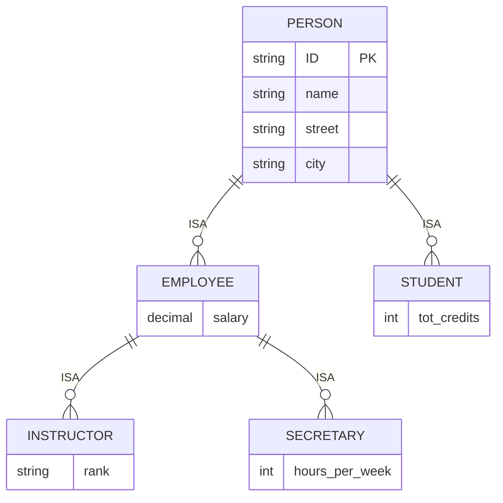

#### **특수화 유형**

**중복 특수화 (Overlapping Specialization)**:
- 개체가 여러 특수화된 개체 집합에 속할 수 있음
- 각 특수화된 개체 집합마다 별도 화살표 사용
- 예시: employee와 student (한 사람이 동시에 직원이면서 학생)

**분리 특수화 (Disjoint Specialization)**:
- 개체가 최대 하나의 특수화된 개체 집합에만 속함
- 단일 화살표 사용
- 예시: instructor와 secretary

### ⬆️ 일반화 (Generalization)

#### **개념**
- **정의**: 공통 특성을 가진 여러 개체 집합을 상위 레벨 개체 집합으로 결합
- **방향**: 하위에서 상위로 (Bottom-up)
- **관계**: 특수화와 일반화는 서로의 역과정

### ✅ 완전성 제약조건 (Completeness Constraint)

#### **전체 (Total)**
- **의미**: 상위 레벨 개체는 반드시 하나 이상의 하위 레벨 개체 집합에 속해야 함
- **표기**: "total" 키워드와 점선으로 연결

#### **부분 (Partial)**
- **의미**: 상위 레벨 개체가 하위 레벨 개체 집합에 속하지 않아도 됨 (기본값)

### 📊 특수화의 스키마 변환

#### **방법 1: 상위/하위 분리**
```sql
-- 상위 레벨 스키마
person(ID, name, street, city)

-- 하위 레벨 스키마 (상위 기본키 포함)
student(ID, tot_cred)
employee(ID, salary)
```

**장점**: 명확한 분리
**단점**: employee 정보 조회 시 두 테이블 접근 필요

#### **방법 2: 모든 속성 포함**
```sql
-- 각 개체 집합마다 모든 속성 포함
person(ID, name, street, city)
student(ID, name, street, city, tot_cred)
employee(ID, name, street, city, salary)
```

**장점**: 단일 테이블 접근
**단점**: employee이면서 student인 경우 중복 저장

## 11. 집약 (Aggregation)

### 🎯 집약의 필요성

#### **문제 상황**
삼진 관계 proj_guide에 평가(evaluation) 정보를 추가해야 하는 경우:

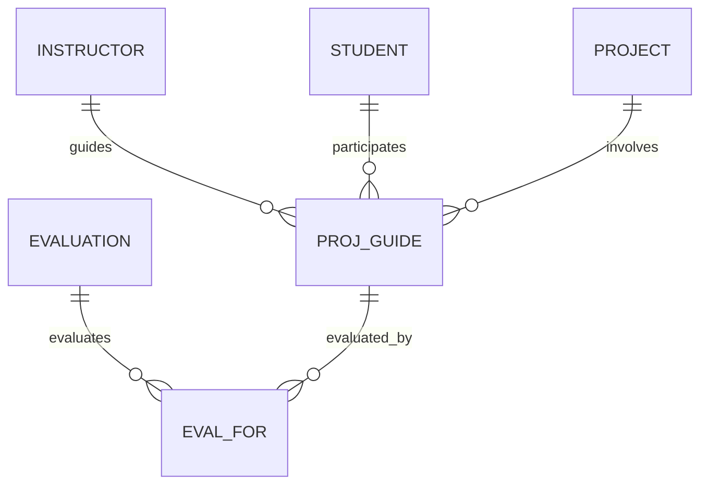

**문제점**:
- eval_for와 proj_guide 관계 집합이 정보 중복
- 모든 eval_for는 proj_guide에 대응되지만, 역은 성립하지 않음

### 💡 집약을 통한 해결

#### **집약의 개념**
- **정의**: 관계를 개념적 상위 레벨 개체로 추상화
- **효과**: 관계 간의 관계 허용
- **목적**: 중복성 제거 없이 중복 정보 처리

#### **집약 다이어그램**

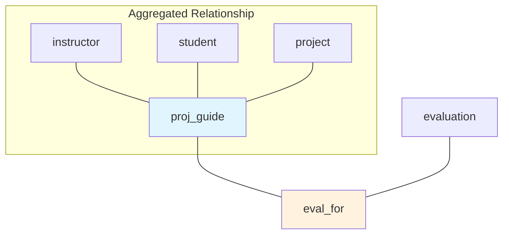

**집약 상자**: proj_guide 관계를 하나의 개체로 취급

### 🔄 집약의 관계형 스키마 변환

#### **집약 표현 스키마**
```sql
-- 집약 관계 스키마
eval_for(s_ID, project_id, i_ID, evaluation_id)

CREATE TABLE eval_for (
    s_ID            char(5),
    project_id      varchar(20),
    i_ID            char(5),
    evaluation_id   varchar(20),
    PRIMARY KEY (s_ID, project_id, i_ID, evaluation_id),
    FOREIGN KEY (s_ID) REFERENCES student,
    FOREIGN KEY (project_id) REFERENCES project,
    FOREIGN KEY (i_ID) REFERENCES instructor,
    FOREIGN KEY (evaluation_id) REFERENCES evaluation
);
```

#### **중요한 점**
- **proj_guide 스키마는 불필요**: eval_for 스키마가 모든 정보 포함
- **집약된 관계의 스키마 생성 불필요**: 정의하는 관계(eval_for) 스키마 사용

## 12. 설계 고려사항 및 일반적인 실수

### ⚠️ 일반적인 E-R 다이어그램 실수

#### **실수 1: 부적절한 속성 사용**
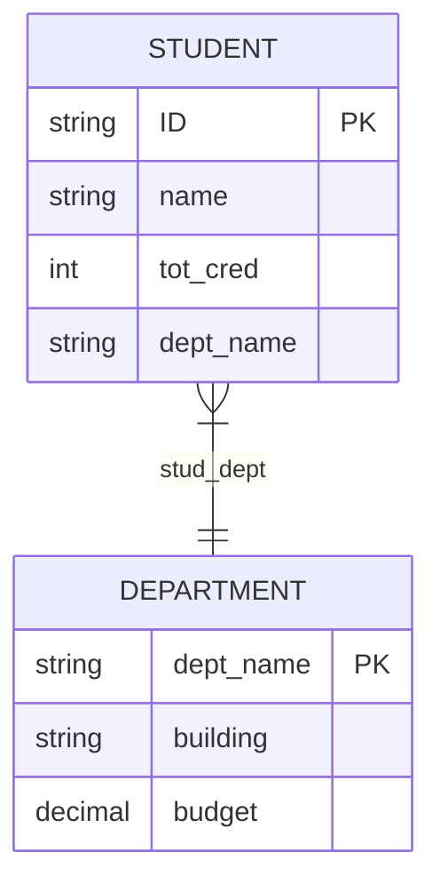

**문제**: student에서 dept_name 속성과 stud_dept 관계가 중복
**해결**: 속성 제거하고 관계만 사용

#### **실수 2: 부적절한 관계 속성**
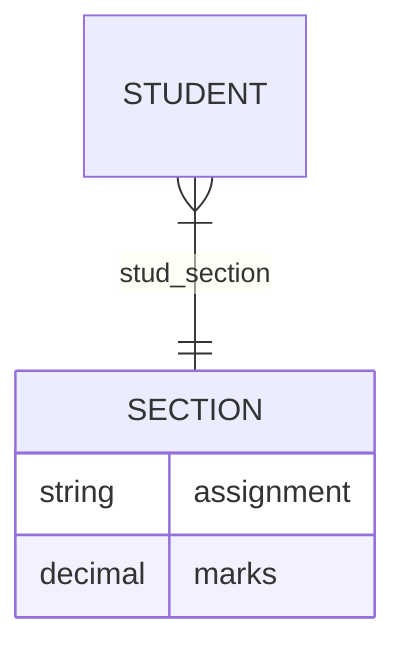

**문제**: 한 과목에 여러 과제가 있을 수 있는데 단일값 속성 사용
**해결**: assignment를 별도 개체로 모델링

#### **올바른 해결책**
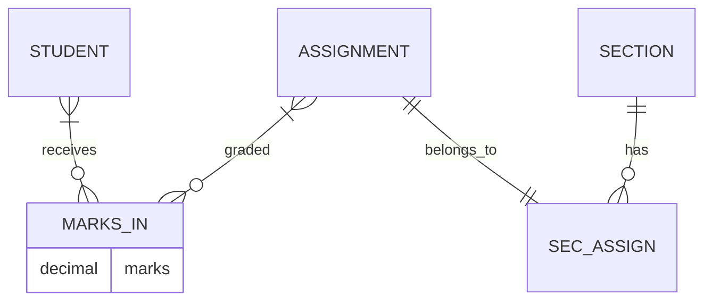

### 🎯 설계 결정 사항들

#### **1. 속성 vs 개체 집합**
- **속성으로**: 단순한 값, 추가 정보 불필요
- **개체 집합으로**: 복잡한 구조, 다른 개체와의 관계 필요

#### **2. 개체 집합 vs 관계 집합**
- **개체 집합**: 독립적으로 존재 가능한 개념
- **관계 집합**: 다른 개체들 간의 연관성

#### **3. 이진 vs 삼진 관계**
- **이진 관계 쌍**: 복잡하지만 더 명확할 수 있음
- **삼진 관계**: 간단하지만 제약이 있을 수 있음

#### **4. 강한 vs 약한 개체**
- **강한 개체**: 독립적인 식별 가능
- **약한 개체**: 다른 개체에 의존적인 식별

#### **5. 특수화/일반화 사용**
- **장점**: 설계의 모듈성 증진
- **고려사항**: 구현 복잡성과 성능

#### **6. 집약 사용**
- **장점**: 내부 구조 세부사항 고려 없이 집합체를 단일 단위로 처리
- **적용**: 관계 간의 관계가 필요한 경우

## 13. 정리 및 다음 학습

### 📝 핵심 내용 정리

1. **E-R 모델**은 개체와 관계로 현실 세계를 모델링하는 개념적 설계 도구
2. **개체 집합**은 동일한 속성을 가진 개체들의 집합
3. **관계 집합**은 여러 개체 간의 연관성을 표현
4. **카디널리티 제약조건**은 관계의 참여 정도를 명시
5. **약한 개체 집합**은 다른 개체에 의존하여 식별되는 개체
6. **특수화/일반화**는 계층적 개체 구조를 표현
7. **집약**은 관계를 상위 레벨 개체로 추상화

### 🔜 다음 학습 계획

다음 포스트에서는 **관계형 데이터베이스 정규화**에 대해 학습하겠습니다:
- 함수적 종속성과 정규형
- 1NF, 2NF, 3NF, BCNF의 개념과 적용
- 정규화 과정과 비정규화
- 정규화의 장단점과 실무 적용

---

## 📚 참고 자료
- 한양대학교 데이터베이스시스템및응용 강의자료
- Database System Concepts (Silberschatz, Galvin, Gagne)

> 💡 **학습 팁**: E-R 다이어그램은 데이터베이스 설계의 청사진입니다. 실제 프로젝트에서 요구사항을 개체와 관계로 나누어 생각하는 연습을 해보세요. 복잡한 시스템도 기본 구성 요소들의 조합으로 이해할 수 있습니다!