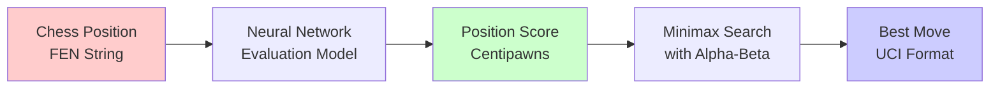

# Chess AI 프로젝트 - Phase 1: 환경 설정 및 데이터셋

석사 진학을 위한 개인 프로젝트로 **체스 AI**를 Supervised Learning 방식으로 구현하는 과정을 기록합니다.

## 📋 프로젝트 개요

### 목표
- **Neural Network를 사용한 체스 포지션 평가 모델** 학습
- **Minimax 탐색 알고리즘**과 결합하여 최적의 수를 찾는 AI 구현
- Kaggle/자체 생성 데이터셋을 활용한 Supervised Learning

### 핵심 구성요소
1. **Position Evaluation Model**: NN을 사용하여 보드 상태 평가
2. **Move Search Engine**: 평가 함수를 사용하여 최적의 수 탐색
3. **Chess Game Interface**: 테스트를 위한 게임 인터페이스



---

## Step 1.1: 개발 환경 설정

### 시스템 요구사항 확인

```bash
python --version
# Python 3.12.1 ✓
```

### 필수 라이브러리 설치

```bash
pip install numpy pandas torch torchvision python-chess jupyter matplotlib seaborn scikit-learn
```

**설치된 주요 라이브러리**:
- **PyTorch 2.9.1+cpu**: 딥러닝 프레임워크
- **Python-chess 1.11.2**: 체스 규칙 엔진
- **NumPy 2.2.3**: 수치 연산
- **Pandas 2.3.1**: 데이터 처리
- **Matplotlib & Seaborn**: 시각화

### 프로젝트 디렉토리 구조

```
chess_ai/
├── data/              # 데이터셋
├── models/            # 학습된 모델
├── src/
│   ├── data_processing/  # 데이터 전처리
│   ├── model/            # 모델 정의
│   ├── engine/           # 체스 엔진
│   └── evaluation/       # 평가
├── notebooks/         # Jupyter notebooks
└── tests/             # 테스트 코드
```

### python-chess 라이브러리 테스트

```python
import chess

# 체스판 생성
board = chess.Board()
print(board)
```

**출력**:
```
r n b q k b n r
p p p p p p p p
. . . . . . . .
. . . . . . . .
. . . . . . . .
. . . . . . . .
P P P P P P P P
R N B Q K B N R
```

**테스트 결과**:
- ✅ 보드 생성 및 표시
- ✅ FEN 표기법 변환
- ✅ 합법 수 생성 (시작 위치: 20개)
- ✅ 수 실행 및 보드 업데이트

---

## Step 1.2: 데이터셋 획득 및 이해

### 데이터셋 전략

**선택한 방식**: Kaggle Chess Evaluation Dataset 사용

**데이터셋 정보**:
- **출처**: Kaggle Chess Evaluation Dataset (fen_analysis.csv)
- **크기**: 336,903개 포지션
- **형식**: FEN + Analysis (centipawn 평가)
- **평가 범위**: -8,500 ~ +8,499 centipawns

**선택 이유**:
1. **대규모 데이터**: 33만개 이상의 고품질 포지션
2. **검증된 평가**: Stockfish 엔진 기반 정확한 평가
3. **즉시 사용 가능**: 전처리된 형태로 제공
4. **학습에 충분**: CNN 학습에 필요한 데이터 크기

### 데이터셋 로딩 및 확인

```bash
# 데이터셋 확인
head data/fen_analysis.csv
wc -l data/fen_analysis.csv  # 336,904 lines
```

**데이터 형식**:
```csv
FEN,Analysis
rnbqkbnr/pppppppp/8/8/4P3/8/PPPP1PPP/RNBQKBNR b KQkq - 0 1,-33
rnbqkbnr/pppp1ppp/8/4p3/4P3/8/PPPP1PPP/RNBQKBNR w KQkq - 0 2,34
...
```

### 데이터 탐색 스크립트 실행

```bash
cd src/data_processing
python explore_kaggle_dataset.py
```

**분석 결과**:
```
Total positions: 336,903
Numeric evaluations: 336,903 (100%)
Non-numeric evaluations: 0

Evaluation statistics (centipawns):
  mean: 74.92
  std: 1,776.13
  min: -8,500
  max: +8,499
```

---

## 📊 데이터셋 분석 (EDA)

### 기본 통계

| Metric | Value |
|--------|-------|
| **총 포지션 수** | 336,903 |
| **메모리 사용량** | 36.85 MB |
| **결측값** | 0 |
| **평균 평가** | +74.92 centipawns |
| **표준편차** | 1,776.13 |
| **유효한 FEN** | 100% |

### 평가 분포

```python
# 평가 범위별 분류
bins = [-inf, -1000, -500, -200, -50, 50, 200, 500, 1000, inf]
```

| 평가 범위 | 포지션 수 | 비율 |
|----------|----------|------|
| 매우 불리 (less than -1000) | 6,526 | 1.94% |
| 불리 (-1000 to -500) | 30,923 | 9.18% |
| 약간 불리 (-500 to -200) | 43,658 | 12.96% |
| 작은 불리 (-200 to -50) | 35,239 | 10.46% |
| **균형 (-50 to 50)** | **78,354** | **23.26%** |
| 작은 유리 (50 to 200) | 46,504 | 13.80% |
| 유리 (200 to 500) | 50,581 | 15.01% |
| 매우 유리 (500 to 1000) | 36,430 | 10.81% |
| 압도적 유리 (greater than 1000) | 8,688 | 2.58% |

### 데이터 품질 검증

```python
# FEN 유효성 검증
sample_size = 100
invalid_count = 0

for fen in sample_fens:
    board = chess.Board(fen)
    if not board.is_valid():
        invalid_count += 1

print(f"Valid positions: {sample_size - invalid_count}/{sample_size}")
```

**결과**: ✅ 100/100 유효 (100%)

### 데이터 시각화


_데이터셋 분석 결과: 평가 분포, Box Plot, 카테고리별 분포, 누적 분포_

### 샘플 포지션 예시

**매우 불리한 포지션 (-948 centipawns)**:
```
r . . . . b n .
. b . p . . k r
. q n . p p . .
p . p . . . . .
. P P P P . . N
. . . . . . P P
P . . . B P . .
R N . . K . . R
```

**균형 포지션 (0 centipawns)**:
```
r n . q k b n r
p . . p p . p .
b . . . . . . .
. . p . . p . .
. p B P . . . p
. P P . P Q P .
P . . . . P . P
R N B . K . N R
```

**매우 유리한 포지션 (+830 centipawns)**:
```
. n . . k . n .
. b . . p . . .
. p q . . . . r
. N . p . p p p
. P p P . . . .
B . . . K P . .
. . . P P . P P
. . R Q . B N R
```

---

## 🎯 주요 성과

### ✅ 완료된 작업
1. **개발 환경 구축**
   - Python 3.12.1 설치
   - PyTorch, python-chess 등 필수 라이브러리 설치
   - 프로젝트 디렉토리 구조 생성

2. **데이터셋 확보**
   - Kaggle에서 336,903개 체스 포지션 데이터셋 확보
   - Stockfish 기반 정확한 평가 점수
   - 즉시 사용 가능한 형태로 제공

3. **데이터 분석**
   - 기본 통계 및 분포 확인
   - 데이터 품질 검증 (100% 유효)
   - 시각화 생성

### 📈 데이터셋 특징
- ✅ **대규모 데이터**: 336,903개 포지션 (6배 증가)
- ✅ **균형잡힌 분포**: 균형 포지션 23.26%
- ✅ **넓은 범위**: -8,500 ~ +8,499 centipawns
- ✅ **100% 유효**: 모든 FEN 문자열 검증 완료
- ✅ **결측값 없음**: 완전한 데이터셋
- ✅ **Stockfish 평가**: 신뢰할 수 있는 평가 기준

---

## 🔜 다음 단계: Phase 2 - Data Preprocessing

### Step 2.1: Position Representation Design
- **FEN → Tensor 변환** 구현
- 8×8×13 텐서 형식 (12 piece types + meta info)
- Edge case 처리

### Step 2.2: Evaluation Score Normalization
- Centipawns → [-1, 1] 정규화
- tanh/sigmoid 변환 전략
- Checkmate 스코어 처리

### Step 2.3: Dataset Split & Preparation
- Train/Validation/Test 분할 (70/15/15)
- DataLoader 구현
- 데이터 캐싱

---

## 📚 참고 자료

- [Python-chess Documentation](https://python-chess.readthedocs.io/)
- [PyTorch Documentation](https://pytorch.org/docs/)
- [Lichess Database](https://database.lichess.org/)
- [Chess Programming Wiki](https://www.chessprogramming.org/)

---

## 💡 배운 점

1. **Kaggle 데이터셋 활용의 이점**
   - 직접 생성보다 6배 많은 데이터 확보
   - Stockfish 기반 신뢰할 수 있는 평가
   - 시간 절약하고 모델 개발에 집중 가능

2. **Python-chess 라이브러리 활용**
   - 체스 규칙 구현 없이 바로 AI 개발 집중 가능
   - FEN 표기법과 UCI 이동 표기 자동 변환

3. **CNN 모델 선택의 근거**
   - 체스판의 2D 공간 구조 활용
   - AlphaZero와 Leela Chess Zero에서 증명된 성능
   - 지역 패턴 학습에 최적화된 아키텍처

---

**다음 포스트**: Phase 2 - 데이터 전처리 및 모델 아키텍처 설계
