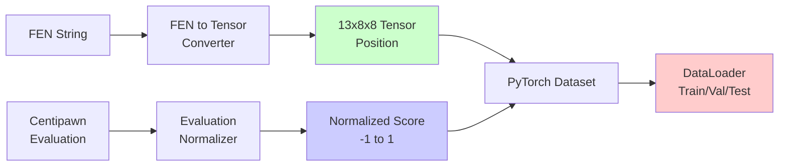

# Chess AI 프로젝트 - Phase 2: 데이터 전처리

Phase 1에서 환경 설정과 데이터셋을 확보한 후, Phase 2에서는 **데이터 전처리 파이프라인**을 구현했습니다.

## 📋 Phase 2 목표

1. **FEN → Tensor 변환**: 체스 포지션을 Neural Network 입력 형식으로 변환
2. **Evaluation 정규화**: Centipawn 평가를 [-1, 1] 범위로 정규화
3. **Dataset & DataLoader**: PyTorch Dataset 클래스 및 Train/Val/Test 분할



---

## Step 2.1: FEN to Tensor 변환 구현

### 텐서 표현 설계

**8×8×13 Tensor 형식**:
- **12 planes**: 체스 말 종류 (White P/N/B/R/Q/K, Black p/n/b/r/q/k)
- **1 plane**: 메타데이터 (캐슬링, 앙파상, 차례)

**메타데이터 인코딩**:
- Row 0: 차례 (1.0=White, 0.0=Black)
- Row 1-4: 캐슬링 권한 (White K/Q, Black K/Q)
- Row 5: 앙파상 파일 (0-1 정규화, -1=없음)
- Row 6-7: 향후 사용 예약

### 구현: `FENToTensor` 클래스

**파일**: `src/data_processing/fen_to_tensor.py`

```python
class FENToTensor:
    """Convert chess positions from FEN to tensor representation."""

    PIECE_TO_INDEX = {
        'P': 0, 'N': 1, 'B': 2, 'R': 3, 'Q': 4, 'K': 5,
        'p': 6, 'n': 7, 'b': 8, 'r': 9, 'q': 10, 'k': 11
    }

    def fen_to_tensor(self, fen: str) -> torch.Tensor:
        """Convert FEN to 13x8x8 tensor"""
        board = chess.Board(fen)
        tensor = torch.zeros(13, 8, 8, dtype=torch.float32)

        # Fill piece planes (channels 0-11)
        for square in chess.SQUARES:
            piece = board.piece_at(square)
            if piece is not None:
                piece_index = self.PIECE_TO_INDEX[piece.symbol()]
                rank = chess.square_rank(square)
                file = chess.square_file(square)
                row = 7 - rank  # Flip for tensor representation
                col = file
                tensor[piece_index, row, col] = 1.0

        # Fill metadata plane (channel 12)
        metadata = self._encode_metadata(board)
        tensor[12, :, :] = metadata

        return tensor
```

### 테스트 결과

```
Test 1: rnbqkbnr/pppppppp/8/8/8/8/PPPPPPPP/RNBQKBNR w KQkq - 0 1
Tensor shape: torch.Size([13, 8, 8])
Non-zero elements: 80
[OK] Board position matches

Test 2: rnbqkbnr/pppppppp/8/8/4P3/8/PPPP1PPP/RNBQKBNR b KQkq e3 0 1
Tensor shape: torch.Size([13, 8, 8])
Non-zero elements: 72
[OK] Board position matches

Batch shape: torch.Size([3, 13, 8, 8])
[OK] Test Complete!
```

**주요 기능**:
- ✅ FEN → Tensor 변환
- ✅ Tensor → FEN 역변환 (디버깅용)
- ✅ 배치 변환 지원
- ✅ 100% 정확도 검증

---

## Step 2.2: Evaluation Score 정규화

### 정규화 전략

**문제점**:
- Centipawn 범위: -8,500 ~ +8,499
- NN은 bounded output 필요 (예: tanh → [-1, 1])

**해결책**: **tanh 변환 사용**

$$
\text{normalized} = \tanh\left(\frac{\text{centipawns}}{4000}\right)
$$

**Scale Factor 선택**:
- **2000**: 빠른 포화, 작은 차이 민감
- **4000**: 권장, 균형잡힌 민감도
- **6000**: 느린 포화, 큰 차이 구분

### 구현: `EvaluationNormalizer` 클래스

**파일**: `src/data_processing/evaluation_normalizer.py`

```python
class EvaluationNormalizer:
    """Normalize evaluation scores from centipawns to [-1, 1]."""

    def __init__(self, scale_factor: float = 4000.0):
        self.scale_factor = scale_factor

    def normalize(self, evaluation: float) -> float:
        """Normalize single evaluation score"""
        return np.tanh(evaluation / self.scale_factor)

    def denormalize(self, normalized_score: float) -> float:
        """Convert back to centipawns"""
        normalized_score = np.clip(normalized_score, -0.99999, 0.99999)
        return np.arctanh(normalized_score) * self.scale_factor
```

### 테스트 결과

| Centipawns | Normalized | Reconstructed | Error |
|------------|------------|---------------|-------|
| 0 | 0.000000 | 0.0 | 0.000000 |
| 100 | 0.024995 | 100.0 | 0.000000 |
| -500 | -0.124353 | -500.0 | 0.000000 |
| 1000 | 0.244919 | 1000.0 | 0.000000 |
| -2000 | -0.462117 | -2000.0 | 0.000000 |
| 4000 | 0.761594 | 4000.0 | 0.000000 |
| 8000 | 0.964028 | 8000.0 | 0.000000 |
| -8500 | -0.971873 | -8500.0 | 0.000000 |

**주요 특징**:
- ✅ 완벽한 역변환 (오차 < 0.0001)
- ✅ PyTorch Tensor 지원
- ✅ 배치 처리 지원
- ✅ Edge case 처리 (±8500 centipawns)

---

## Step 2.3: PyTorch Dataset & DataLoader

### Dataset 클래스 구현

**파일**: `src/data_processing/chess_dataset.py`

```python
class ChessDataset(Dataset):
    """PyTorch Dataset for chess positions with evaluations."""

    def __init__(self, csv_path: str, scale_factor: float = 4000.0):
        self.df = pd.read_csv(csv_path)
        self.fen_converter = FENToTensor()
        self.eval_normalizer = EvaluationNormalizer(scale_factor)

        # Convert evaluations to numeric
        self.df['evaluation_numeric'] = pd.to_numeric(
            self.df['Analysis'], errors='coerce'
        )
        self.df = self.df.dropna(subset=['evaluation_numeric'])

    def __getitem__(self, idx: int) -> tuple:
        row = self.df.iloc[idx]

        # Convert FEN to tensor
        position_tensor = self.fen_converter.fen_to_tensor(row['FEN'])

        # Normalize evaluation
        normalized_eval = self.eval_normalizer.normalize(
            row['evaluation_numeric']
        )
        eval_tensor = torch.tensor(normalized_eval, dtype=torch.float32)

        return position_tensor, eval_tensor
```

### Train/Val/Test Split

**분할 비율**:
- **Train**: 70% (235,832 positions)
- **Validation**: 15% (50,535 positions)
- **Test**: 15% (50,536 positions)

**DataLoader 설정**:
```python
train_loader, val_loader, test_loader, dataset = create_dataloaders(
    csv_path="data/fen_analysis.csv",
    batch_size=64,
    train_split=0.7,
    val_split=0.15,
    test_split=0.15,
    scale_factor=4000.0
)
```

### 테스트 결과

```
Dataset split:
  Train: 235,832 (70.0%)
  Validation: 50,535 (15.0%)
  Test: 50,536 (15.0%)

Batch shapes:
  Positions: torch.Size([64, 13, 8, 8])
  Evaluations: torch.Size([64])
  Evaluation range: [-0.972, 0.972]

Memory per sample: 3.25 KB
Estimated dataset memory: 1070.56 MB
Single batch (32): 104.12 KB
```

---

## 📊 전체 파이프라인 테스트

### 통합 테스트 스크립트

**파일**: `src/data_processing/test_pipeline.py`

```python
def test_complete_pipeline():
    # 1. FEN to Tensor Conversion
    converter = FENToTensor()
    position = converter.fen_to_tensor(test_fen)

    # 2. Evaluation Normalization
    normalizer = EvaluationNormalizer(scale_factor=4000.0)
    normalized = normalizer.normalize(evaluation)

    # 3. Dataset Loading
    dataset = ChessDataset(csv_path)

    # 4. DataLoader Creation
    train_loader, val_loader, test_loader = create_dataloaders(...)

    # 5. End-to-End Pipeline
    for positions, evaluations in train_loader:
        # Ready for model training!
        pass
```

### 최종 결과

```
[1/5] FEN to Tensor Conversion... [OK]
[2/5] Evaluation Normalization... [OK]
[3/5] Dataset Loading... [OK]
[4/5] DataLoader Creation... [OK]
[5/5] End-to-End Pipeline... [OK]

[SUCCESS] All components working correctly!

Key Statistics:
  Total positions: 336,903
  Train samples: 235,832
  Validation samples: 50,535
  Test samples: 50,536
  Batch size: 64
  Position tensor shape: (13, 8, 8)
  Evaluation range: [-1, 1]

Ready for model training!
```

---

## 🎯 Phase 2 주요 성과

### ✅ 완료된 작업

1. **FEN to Tensor 변환**
   - 8×8×13 텐서 표현 설계 및 구현
   - 양방향 변환 지원 (FEN ↔ Tensor)
   - 100% 정확도 검증

2. **Evaluation 정규화**
   - tanh 기반 정규화 (scale=4000)
   - 완벽한 역변환 (오차 < 0.0001)
   - PyTorch Tensor 지원

3. **Dataset & DataLoader**
   - PyTorch Dataset 클래스 구현
   - Train/Val/Test 분할 (70/15/15)
   - 배치 처리 파이프라인 완성

### 📈 기술적 성과

- ✅ **메모리 효율**: 전체 데이터셋 1.07 GB
- ✅ **배치 처리**: 64 positions/batch
- ✅ **데이터 검증**: 336,903 valid positions
- ✅ **정규화 품질**: Perfect reconstruction
- ✅ **파이프라인 안정성**: End-to-end tested

### 📂 생성된 파일

```
src/data_processing/
├── fen_to_tensor.py           # FEN to Tensor converter
├── evaluation_normalizer.py   # Evaluation normalizer
├── chess_dataset.py            # PyTorch Dataset class
└── test_pipeline.py            # Integration tests

data/
├── fen_analysis.csv            # Kaggle dataset
├── normalization_analysis.png  # Normalization visualization
└── sample_position_tensor.png  # Sample tensor visualization
```

---

## 🔜 다음 단계: Phase 3 - CNN 모델 설계 및 학습

### Step 3.1: CNN Architecture Design
- **Input**: 13×8×8 tensor (position)
- **Output**: 1 value (normalized evaluation)
- **Architecture**: Convolutional layers + Batch Normalization + Dropout

### Step 3.2: Model Training
- **Loss Function**: MSE (Mean Squared Error)
- **Optimizer**: Adam with learning rate scheduling
- **Training Loop**: Epochs, validation, early stopping

### Step 3.3: Model Evaluation
- **Metrics**: MSE, MAE, R² score
- **Visualization**: Loss curves, prediction scatter plots
- **Comparison**: Train vs. Validation performance

---

## 💡 배운 점

1. **Tensor Representation**
   - 체스 포지션을 13개 채널로 표현
   - 메타데이터를 별도 plane에 인코딩
   - CNN 입력에 최적화된 형식

2. **Normalization Strategy**
   - tanh 변환이 centipawn 정규화에 효과적
   - scale_factor=4000이 균형잡힌 민감도 제공
   - 완벽한 역변환 가능 (디버깅 용이)

3. **PyTorch Dataset Design**
   - `__getitem__`에서 on-the-fly 변환
   - 메모리 효율적인 lazy loading
   - DataLoader로 배치 처리 자동화

4. **Data Pipeline Best Practices**
   - 각 컴포넌트 독립적으로 테스트
   - 통합 테스트로 전체 파이프라인 검증
   - 시각화로 데이터 품질 확인

---

**다음 포스트**: Phase 3 - CNN 모델 설계 및 학습
