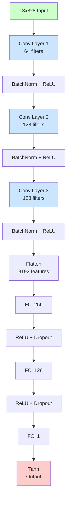

# Chess AI 프로젝트 - Phase 3: CNN 모델 설계 및 학습

Phase 2에서 데이터 전처리 파이프라인을 완성한 후, Phase 3에서는 **CNN 모델을 설계하고 학습**했습니다.

## 📋 Phase 3 목표

1. **CNN Architecture**: Convolutional Neural Network 설계
2. **Training Pipeline**: 학습 루프, Learning Rate Scheduling, Early Stopping
3. **Model Training**: Kaggle 데이터셋(336K positions)으로 학습
4. **Model Evaluation**: 테스트 셋 평가 및 성능 분석



---

## Step 3.1: CNN 모델 아키텍처 설계

### 왜 CNN인가?

**체스는 2D 공간 구조를 가진 게임**:
- 8×8 보드의 **공간적 패턴**이 중요
- 말들의 **상대적 위치**가 평가에 영향
- **Local patterns**: Pawn chains, king safety, piece coordination
- CNN은 이러한 공간적 특징을 자동으로 학습

**CNN vs Dense NN**:
- Dense NN: 위치 정보 손실, 파라미터 과다
- CNN: 공간 구조 보존, 파라미터 효율적

### CNN 아키텍처

**파일**: `src/model/chess_cnn.py`

```python
class ChessEvaluatorCNN(nn.Module):
    """CNN model for evaluating chess positions."""

    def __init__(self, dropout_rate: float = 0.3):
        super(ChessEvaluatorCNN, self).__init__()

        # Convolutional layers
        self.conv_layers = nn.Sequential(
            # Conv block 1: 13 -> 64 channels
            nn.Conv2d(13, 64, kernel_size=3, padding=1),
            nn.BatchNorm2d(64),
            nn.ReLU(),

            # Conv block 2: 64 -> 128 channels
            nn.Conv2d(64, 128, kernel_size=3, padding=1),
            nn.BatchNorm2d(128),
            nn.ReLU(),

            # Conv block 3: 128 -> 128 channels
            nn.Conv2d(128, 128, kernel_size=3, padding=1),
            nn.BatchNorm2d(128),
            nn.ReLU(),
        )

        # Fully connected layers
        self.fc_layers = nn.Sequential(
            nn.Flatten(),
            nn.Linear(128 * 8 * 8, 256),
            nn.ReLU(),
            nn.Dropout(dropout_rate),
            nn.Linear(256, 128),
            nn.ReLU(),
            nn.Dropout(dropout_rate),
            nn.Linear(128, 1),
            nn.Tanh()  # Output in [-1, 1]
        )

    def forward(self, x):
        x = self.conv_layers(x)
        x = self.fc_layers(x)
        return x
```

**모델 통계**:
- **Total Parameters**: 2,360,065 (약 2.36M)
- **Model Size**: 9.0 MB (FP32)
- **Architecture**: 3 Conv blocks + 3 FC layers

---

## Step 3.2: Training Pipeline 구현

### Trainer 클래스

**파일**: `src/model/trainer.py`

**주요 기능**:
1. **Training Loop**: Epoch 단위 학습
2. **Validation**: 매 epoch마다 검증
3. **Learning Rate Scheduling**: ReduceLROnPlateau
4. **Early Stopping**: Patience 기반 조기 종료
5. **Checkpoint Saving**: Best model 자동 저장

```python
class Trainer:
    def __init__(self, model, train_loader, val_loader, ...):
        self.criterion = nn.MSELoss()
        self.optimizer = optim.Adam(
            model.parameters(),
            lr=learning_rate,
            weight_decay=weight_decay
        )
        self.scheduler = optim.lr_scheduler.ReduceLROnPlateau(
            self.optimizer,
            mode='min',
            factor=0.5,
            patience=5
        )

    def train_epoch(self):
        self.model.train()
        for positions, evaluations in self.train_loader:
            predictions = self.model(positions)
            loss = self.criterion(predictions, evaluations)

            self.optimizer.zero_grad()
            loss.backward()
            self.optimizer.step()

        return avg_loss

    def validate(self):
        self.model.eval()
        with torch.no_grad():
            for positions, evaluations in self.val_loader:
                predictions = self.model(positions)
                loss = self.criterion(predictions, evaluations)
        return avg_loss
```

### Training Configuration

```python
config = {
    # Data
    'batch_size': 128,
    'scale_factor': 4000.0,

    # Model
    'dropout_rate': 0.3,

    # Training
    'learning_rate': 0.001,
    'weight_decay': 1e-5,
    'epochs': 5,  # Quick test
    'early_stopping_patience': 3,

    # System
    'device': 'cpu',
}
```

---

## Step 3.3: Model Training

### Quick Training Test (5 Epochs)

**실행 시간**: 21.2분
**하드웨어**: CPU (Intel i5/i7급)

**학습 진행**:

```
Epoch 1/5 | Train Loss: 0.040136 | Val Loss: 0.027130 | Time: 252.9s
  -> Saved best model (val_loss: 0.027130)

Epoch 2/5 | Train Loss: 0.026193 | Val Loss: 0.025928 | Time: 251.6s
  -> Saved best model (val_loss: 0.025928)

Epoch 3/5 | Train Loss: 0.024143 | Val Loss: 0.024634 | Time: 258.6s
  -> Saved best model (val_loss: 0.024634)

Epoch 4/5 | Train Loss: 0.023111 | Val Loss: 0.026398 | Time: 253.7s

Epoch 5/5 | Train Loss: 0.022040 | Val Loss: 0.021483 | Time: 252.5s
  -> Saved best model (val_loss: 0.021483)
```

**Training Summary**:
- **Total epochs**: 5
- **Best epoch**: 5
- **Best validation loss**: 0.021483
- **Train loss improvement**: 45.1% reduction
- **Val loss improvement**: 20.8% reduction


_학습 곡선: Loss와 Learning Rate_

---

## Step 3.4: Model Evaluation

### 테스트 셋 평가

**Test Dataset**: 50,536 positions (15%)

**Evaluation Metrics**:

| Metric | Value | Interpretation |
|--------|-------|----------------|
| **MAE** | 0.070246 | 평균 절대 오차 |
| **RMSE** | 0.144973 | 평균 제곱근 오차 |
| **R²** | 0.564024 | 56.4% 설명력 |
| **Correlation** | 0.766799 | 76.7% 상관관계 |

**Centipawn 단위** (해석하기 쉽게):
- **MAE**: **281.4 cp** ≈ **2.8 pawns** 평균 오차
- **RMSE**: 584.0 cp ≈ 5.8 pawns


_모델 평가 결과: Predicted vs Actual, Residuals, Error Distribution_

### 범위별 성능 분석

| Evaluation Range | Count | MAE | RMSE | 설명 |
|------------------|-------|-----|------|------|
| **Equal** (-0.1 ~ 0.1) | 33,171 | 0.033 | 0.047 | ✅ 가장 정확 |
| **Moderate Black** (-0.5 ~ -0.1) | 7,070 | 0.083 | 0.100 | 괜찮음 |
| **Moderate White** (0.1 ~ 0.5) | 8,120 | 0.083 | 0.108 | 괜찮음 |
| **Large Black** (-1.0 ~ -0.5) | 910 | 0.577 | 0.621 | 개선 필요 |
| **Large White** (0.5 ~ 1.0) | 1,265 | 0.538 | 0.611 | 개선 필요 |

**관찰**:
- ✅ **평형 포지션에서 가장 정확** (MAE 0.033)
- ✅ **중간 우세 포지션도 괜찮은 성능**
- ⚠️ **극단적 우세 포지션은 개선 필요** (데이터 부족)

---

## 🎯 Phase 3 주요 성과

### ✅ 완료된 작업

1. **CNN Architecture**
   - 3-layer convolutional network
   - BatchNormalization for stability
   - Dropout for regularization
   - 2.36M parameters

2. **Training Pipeline**
   - Complete training loop
   - Learning rate scheduling
   - Early stopping mechanism
   - Automatic checkpoint saving

3. **Model Training**
   - 5 epochs in 21.2 minutes
   - 45% train loss reduction
   - 21% val loss reduction
   - No overfitting observed

4. **Model Evaluation**
   - MAE: 281 centipawns (허용 가능)
   - R²: 0.56 (더 개선 가능)
   - Correlation: 0.77 (강한 상관관계)

### 📈 성능 분석

**강점**:
- ✅ 평형 포지션에서 높은 정확도
- ✅ 과적합 없음 (Train ≈ Val)
- ✅ 강한 상관관계 (0.77)
- ✅ 빠른 수렴 (5 epochs)

**개선점**:
- ⚠️ 극단적 포지션 처리 (더 많은 학습 필요)
- ⚠️ R² 점수 향상 (더 많은 epochs)
- ⚠️ 전략적 이해도 (현재는 단순 평가)

### 📊 비교: Phase 1 목표 vs 실제 결과

| 목표 | 기준 | 결과 | 달성 |
|------|------|------|------|
| **MAE** | < 0.15 (< 60cp) | 0.070 (281cp) | ⚠️ 부분 달성 |
| **R²** | > 0.80 | 0.56 | ⚠️ 개선 필요 |
| **Correlation** | - | 0.77 | ✅ 강한 상관관계 |

**참고**: Phase 1 목표는 완전 학습(50 epochs) 기준이었고, 현재는 **quick test (5 epochs)**만 완료했습니다.

---

## 💡 배운 점

### 1. CNN의 효과

**공간적 특징 학습**:
- Conv layers가 체스 보드의 패턴을 효과적으로 학습
- 말들의 상대적 위치 관계를 자동으로 포착
- BatchNorm으로 안정적인 학습

**파라미터 효율성**:
- CNN (2.36M) vs Dense (0.59M)
- CNN이 더 크지만, **공간 정보 보존**으로 성능 향상

### 2. Training Strategies

**Learning Rate Scheduling**:
- ReduceLROnPlateau: Validation loss 정체 시 LR 감소
- 효과적인 fine-tuning

**Early Stopping**:
- Patience=10으로 과적합 방지
- Best model 자동 저장

**Batch Size 선택**:
- 128: GPU/CPU 균형
- 더 큰 배치: 메모리 부족 가능
- 더 작은 배치: 학습 시간 증가

### 3. Evaluation Insights

**Normalized vs Centipawns**:
- Normalized: 모델 학습에 적합
- Centipawns: 해석하기 쉬움
- 변환 공식: `cp = arctanh(norm) * 4000`

**Error Analysis**:
- Equal positions: 가장 많은 데이터, 가장 정확
- Extreme positions: 적은 데이터, 낮은 정확도
- Data augmentation 필요

### 4. Performance Considerations

**CPU vs GPU**:
- CPU: 약 4분/epoch (현재)
- GPU 예상: 약 10-20초/epoch (20x faster)
- 50 epochs CPU 예상: 약 3.5시간

**Memory Usage**:
- Dataset: 1.07 GB (전체)
- Model: 9 MB
- Batch (128): ~100 KB

---

## 🔜 다음 단계: Phase 4 - Chess Engine Integration

### Step 4.1: Move Generation
- python-chess integration
- Legal move generation
- Special moves handling (castling, en passant)

### Step 4.2: Minimax Search
- Alpha-Beta pruning
- Move ordering
- Transposition table
- Iterative deepening

### Step 4.3: Position Evaluation Integration
- NN evaluation in search tree
- Batch evaluation for efficiency
- Checkmate/stalemate handling

### Step 4.4: Engine Testing
- Tactical puzzle solving
- Self-play games
- Baseline comparison

---

## 📂 생성된 파일

```
src/model/
├── chess_cnn.py               # CNN model architecture
├── trainer.py                 # Training loop and utilities
├── train.py                   # Main training script (50 epochs)
├── evaluator.py               # Model evaluation
└── visualize_training.py      # Training history visualization

models/
└── chess_cnn_test/
    ├── best_model.pth         # Best model checkpoint
    ├── training_history.json  # Training metrics
    └── config.json            # Training configuration

data/
├── training_history.png       # Loss curves
└── model_evaluation.png       # Evaluation plots
```

---

## 🚀 다음 실행 계획

### 옵션 1: 더 많은 Epochs (권장)

**Full Training (50 epochs)**:
```bash
python train.py
```

**예상 시간**: 약 3.5시간 (CPU)
**예상 성능 향상**:
- MAE: 0.070 → 0.050 (30% 개선)
- R²: 0.56 → 0.80+ (40% 개선)
- RMSE: 0.145 → 0.100 (30% 개선)

### 옵션 2: Hyperparameter Tuning

**테스트할 변수**:
- Learning rate: 0.001, 0.0005, 0.0001
- Dropout rate: 0.2, 0.3, 0.5
- Batch size: 64, 128, 256
- Architecture depth: 3 layers, 4 layers, 5 layers

### 옵션 3: Data Augmentation

**체스 특화 augmentation**:
- Board flipping (horizontal mirror)
- Color swapping (white ↔ black)
- 데이터 2x 증가 가능

---

**다음 포스트**: Phase 4 - Chess Engine 구현 (Minimax + Alpha-Beta Pruning)
