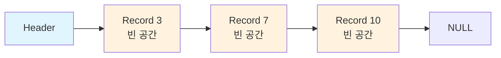
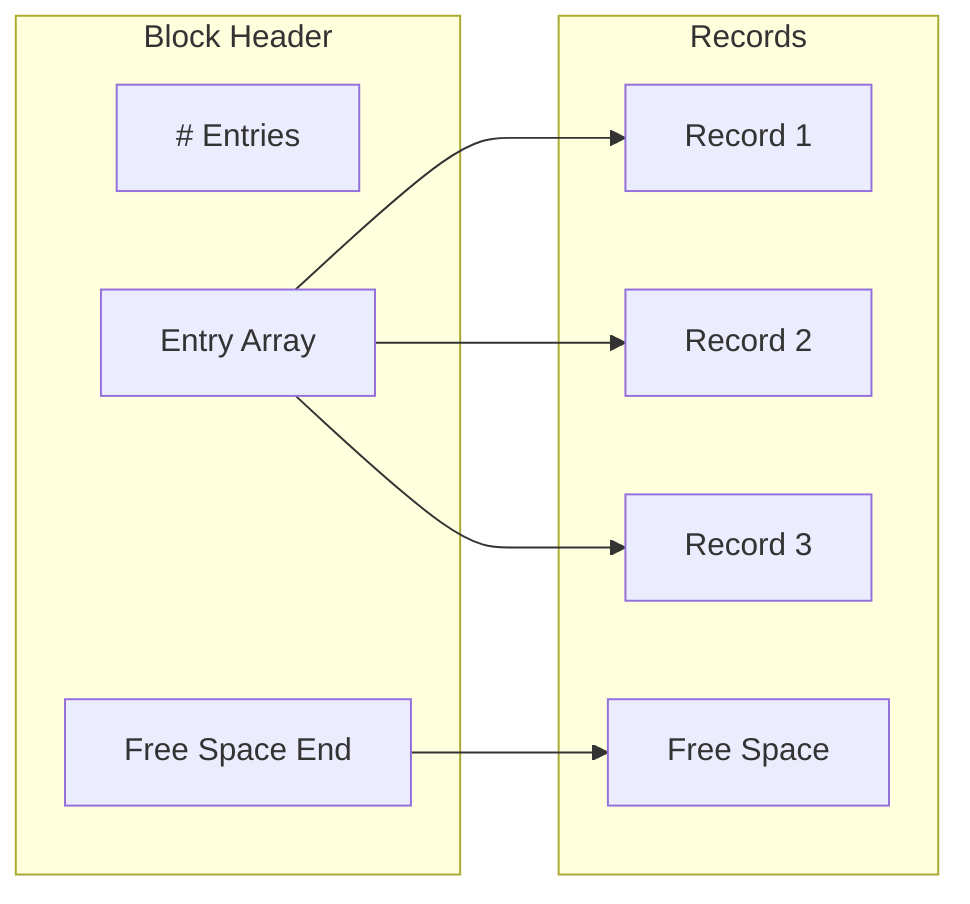

## 1. 개요

데이터베이스 시스템은 디스크에 데이터를 효율적으로 저장하고 빠르게 접근하기 위한 다양한 저장 구조를 사용합니다. 이번 포스트에서는 파일 조직 방법, 레코드 저장 방식, 버퍼 관리, 그리고 컬럼 지향 저장소에 대해 학습합니다.

### 학습 목표

- 파일 조직의 기본 개념 이해
- 고정 길이 및 가변 길이 레코드 표현
- 다양한 파일 조직 방법 비교
- 버퍼 관리자의 역할과 동작 원리
- 컬럼 지향 저장소의 장단점

---

## 2. 파일 조직 (File Organization)

### 2.1 기본 개념

**데이터베이스 저장 계층 구조:**
- **데이터베이스**: 파일(files)의 집합
- **파일**: 레코드(records)의 논리적 시퀀스
- **블록(Block)**: 고정 길이 저장 단위
  - 저장 공간 할당과 데이터 전송의 기본 단위
  - 하나의 블록에 여러 레코드 포함 가능
- **레코드**: 필드(fields)의 시퀀스

### 2.2 기본 가정

**실용적인 가정들:**
1. 레코드 크기가 블록 크기보다 작음 (대부분의 DBMS에서 현실적)
   - 블록보다 큰 레코드는 비연속적으로 메모리 버퍼로 가져올 수 있음
2. 각 레코드는 단일 블록 내에 완전히 포함 (블록 경계를 넘지 않음)
   - 두 블록에 걸친 레코드도 비연속적으로 버퍼로 가져올 수 있음
3. 각 파일은 하나의 특정 타입의 레코드만 포함
   - 서로 다른 릴레이션은 서로 다른 파일 사용

---

## 3. 고정 길이 레코드 (Fixed-Length Records)

### 3.1 단순한 접근 방법

**저장 방식:**
- i번째 레코드(i ≥ 0)를 바이트 n × i에서 시작하도록 저장
  - n: 각 레코드의 크기
- 레코드 접근은 단순하지만 블록 경계를 넘을 수 있음

**개선 방법:**
- 레코드가 블록 경계를 넘지 않도록 제한

### 3.2 예제: instructor 릴레이션

```
| ID    | Name       | Dept_name  | Salary |
|-------|------------|------------|--------|
| 10101 | Srinivasan | Comp. Sci. | 65000  |
| 12121 | Wu         | Finance    | 90000  |
| 15151 | Mozart     | Music      | 40000  |
| 22222 | Einstein   | Physics    | 95000  |
| 32343 | El Said    | History    | 60000  |
| 33456 | Gold       | Physics    | 87000  |
| 45565 | Katz       | Comp. Sci. | 75000  |
| 58583 | Califieri  | History    | 62000  |
| 76543 | Singh      | Finance    | 80000  |
| 76766 | Crick      | Biology    | 72000  |
| 83821 | Brandt     | Comp. Sci. | 92000  |
| 98345 | Kim        | Elec. Eng. | 80000  |
```

### 3.3 레코드 삭제 방법

**대안 1: 레코드 이동 (Move records)**
- i, i+1, ..., n번 레코드를 i, ..., n-1 위치로 이동
- 장점: 연속적인 저장 공간 유지
- 단점: 많은 레코드 이동으로 인한 높은 비용

**대안 2: 마지막 레코드로 대체 (Replace with last)**
- n번 레코드를 i번 위치로 이동
- 장점: 빠른 삭제 (하나의 레코드만 이동)
- 단점: 레코드 순서가 바뀜

**대안 3: 자유 리스트 사용 (Free list) ⭐**
- 레코드를 이동하지 않고, 모든 자유 레코드를 연결 리스트로 관리
- 헤더(header)에서 첫 번째 자유 레코드를 가리킴
- 각 자유 레코드는 다음 자유 레코드를 가리킴
- 장점: 빠른 삭제와 삽입, 레코드 이동 없음
- 실제 DBMS에서 가장 많이 사용하는 방법



---

## 4. 가변 길이 레코드 (Variable-Length Records)

### 4.1 발생 원인

데이터베이스 시스템에서 가변 길이 레코드가 발생하는 경우:

1. **여러 레코드 타입을 하나의 파일에 저장**
2. **가변 길이 필드**: 문자열(varchar) 등
3. **반복 필드**: 배열 (일부 구형 데이터 모델)

### 4.2 단일 레코드 표현

**레코드 구조: 두 부분으로 구성**

1. **고정 길이 부분 (Fixed-length part)**
   - 각 가변 길이 필드에 대한 (offset, length) 정보
   - 고정 길이 필드의 값
   - Null 비트맵

2. **가변 길이 부분 (Variable-length part)**
   - 가변 길이 필드의 실제 값들

**예제: instructor(ID, name, dept_name, salary) 릴레이션**

가정:
- ID, name, dept_name: 가변 길이
- salary: 고정 길이

```
┌─────────────────────────────────────────────────────────────┐
│  Fixed-length part     │  Variable-length part              │
├────┬────┬────┬────┬────┼────────────────────────────────────┤
│21,5│26,10│36,10│65000│0000│10101│Srinivasan│Comp. Sci.   │
└────┴────┴────┴────┴────┴────────────────────────────────────┘
Bytes: 0    4    8    12   20 21  26        36             45

- (21, 5): ID는 바이트 21에서 시작, 길이 5
- (26, 10): name은 바이트 26에서 시작, 길이 10
- (36, 10): dept_name은 바이트 36에서 시작, 길이 10
- 65000: salary 값 (고정 길이)
- 0000: Null 비트맵 (각 비트는 해당 속성이 NULL인지 표시)
```

### 4.3 블록 내 여러 레코드 저장: Slotted Page 구조

**Slotted Page 구조의 특징:**

가변 길이 레코드를 블록 내에 저장하는 일반적인 방법입니다.



**헤더 구성 요소:**
1. **레코드 엔트리 개수**: 헤더 내 엔트리 수
2. **자유 공간의 끝**: 블록 내 자유 공간의 끝 위치
3. **엔트리 배열**: 각 레코드의 위치와 크기를 담은 배열

**주요 특징:**
- 레코드는 페이지 내에서 이동 가능 (삭제나 크기 변경 시)
- 레코드들 사이에 빈 공간이 없도록 연속적으로 유지
- 헤더의 엔트리는 이동에 따라 업데이트됨
- **외부 레코드 포인터는 레코드를 직접 가리키지 않고, 헤더의 엔트리를 가리킴**
  - 레코드가 이동해도 외부 포인터는 유효함

---

## 5. 파일 내 레코드 조직 방법

### 5.1 Heap File Organization (힙 파일 조직)

**특징:**
- 레코드를 **공간이 있는 아무 곳에나** 배치 가능
- **레코드 순서 없음** (정렬되지 않음)
- 삽입이 빠름
- 특정 레코드 검색 시 전체 스캔 필요

**자유 공간 맵 (Free-Space Map):**

파일 내에서 자유 공간이 있는 블록을 효율적으로 찾기 위한 데이터 구조

```
레벨 1 (블록별): [4][2][1][4][7][3][6][5][1][2][0][1][1][0][5][6]
                  └─────┘ └─────┘ └─────┘ └─────┘
레벨 2 (그룹별):    [4]     [7]     [2]     [6]
```

- **블록당 1 엔트리**: 각 엔트리는 3비트 정도 (블록의 자유 공간 비율)
  - 예: 6/8 = 블록의 6/8이 비어 있음
- **2단계 자유 공간 맵**: 대용량 파일에서 검색 속도 향상
  - 레벨 2는 4개의 레벨 1 엔트리 중 최댓값 저장
- 주기적으로 디스크에 저장 (약간 오래된 값 허용)

### 5.2 Sequential File Organization (순차 파일 조직)

**특징:**
- 레코드를 **검색 키(search key) 순서로 저장**
  - 검색 키는 반드시 primary key나 superkey일 필요는 없음
- 순차 처리에 적합
- 물리적 순서를 최대한 유지하여 블록 접근 횟수 최소화
- 포인터 체인으로 레코드 연결

**예제: instructor 파일 (검색 키 = ID)**

```
┌───────┬────────────┬────────────┬───────┬──┐
│ 10101 │ Srinivasan │ Comp. Sci. │ 65000 │ →│
├───────┼────────────┼────────────┼───────┼──┤
│ 12121 │ Wu         │ Finance    │ 90000 │ →│
├───────┼────────────┼────────────┼───────┼──┤
│ 15151 │ Mozart     │ Music      │ 40000 │ →│
├───────┼────────────┼────────────┼───────┼──┤
│ 22222 │ Einstein   │ Physics    │ 95000 │ →│
└───────┴────────────┴────────────┴───────┴──┘
```

**문제점: 물리적 순서 유지의 어려움**

**삭제:**
- 포인터 체인 사용하여 논리적 순서 유지

**삽입:**
1. 자유 공간이 있으면 해당 위치에 삽입
2. 자유 공간이 없으면 **오버플로 블록(overflow block)**에 삽입
3. 포인터 체인 업데이트

```
┌───────┬────────────┬────────────┬───────┬──┐
│ 10101 │ Srinivasan │ Comp. Sci. │ 65000 │ ─┐
├───────┼────────────┼────────────┼───────┼──┤│
│ 12121 │ Wu         │ Finance    │ 90000 │ →││
├───────┼────────────┼────────────┼───────┼──┤│
│ 15151 │ Mozart     │ Music      │ 40000 │ →││
├───────┼────────────┼────────────┼───────┼──┤│
│ 22222 │ Einstein   │ Physics    │ 95000 │ →││
└───────┴────────────┴────────────┴───────┴──┘│
                                               │
       ┌───────────────────────────────────────┘
       │  Overflow Block
       ├───────┬────────┬────────┬───────┬──┐
       │ 32222 │ Verdi  │ Music  │ 48000 │ →│
       └───────┴────────┴────────┴───────┴──┘
```

**문제점:**
- 오버플로 블록의 레코드가 많아지면 물리적 순서가 깨짐
- **재조직(Reorganization)** 필요: 비용이 높은 작업
- **B+-tree 파일 조직**이 이 문제를 해결 (Chapter 14)

### 5.3 Multitable Clustering File Organization

**특징:**
- **여러 릴레이션의 레코드를 하나의 파일에 저장**
- 관련된 레코드를 같은 블록에 저장하여 특정 조인 연산의 I/O 최소화

**예제: department와 instructor 릴레이션**

```
department 릴레이션:
┌───────────┬──────────┬────────┐
│dept_name  │ building │ budget │
├───────────┼──────────┼────────┤
│Comp. Sci. │ Taylor   │ 100000 │
│Physics    │ Watson   │  70000 │
└───────────┴──────────┴────────┘

instructor 릴레이션:
┌───────┬────────────┬───────────┬────────┐
│  ID   │    name    │ dept_name │ salary │
├───────┼────────────┼───────────┼────────┤
│ 10101 │ Srinivasan │Comp. Sci. │  65000 │
│ 33456 │ Gold       │Physics    │  87000 │
│ 45565 │ Katz       │Comp. Sci. │  75000 │
│ 83821 │ Brandt     │Comp. Sci. │  92000 │
└───────┴────────────┴───────────┴────────┘
```

**Multitable Clustering 저장:**

```
┌───────────┬────────┬────────┬───────┬────────────┬───────────┬────────┐
│Comp. Sci. │ Taylor │ 100000 │ 10101 │ Srinivasan │Comp. Sci. │  65000 │
│           │        │        │ 45565 │ Katz       │Comp. Sci. │  75000 │
│           │        │        │ 83821 │ Brandt     │Comp. Sci. │  92000 │
├───────────┼────────┼────────┼───────┼────────────┼───────────┼────────┤
│Physics    │ Watson │  70000 │ 33456 │ Gold       │Physics    │  87000 │
└───────────┴────────┴────────┴───────┴────────────┴───────────┴────────┘
```

**클러스터 키(Cluster Key):**
- 어떤 레코드들을 함께 저장할지 정의하는 속성
- 예제에서는 dept_name

**장점:**
- `department ⋈ instructor` 조인에 유리
- 특정 학과와 그 학과의 교수 정보를 함께 조회하는 쿼리에 효율적

**단점:**
- department나 instructor만 조회하는 쿼리에는 비효율적
- 가변 길이 레코드 발생
- 포인터 체인을 추가하여 특정 릴레이션의 레코드만 연결 가능

### 5.4 기타 파일 조직 방법

**B+-tree File Organization:**
- 삽입, 삭제, 갱신이 빈번한 환경에서도 순서 유지
- Chapter 14에서 상세 설명

**Hashing File Organization:**
- 검색 키에 해시 함수를 적용하여 블록 위치 결정
- Chapter 14에서 상세 설명

---

## 6. 테이블 파티셔닝 (Table Partitioning)

### 6.1 개념

**테이블 파티셔닝:**
- 릴레이션의 레코드를 더 작은 릴레이션들로 분할하여 별도 저장
- 일반적으로 속성 값을 기준으로 파티셔닝

**예제:**
```sql
-- 원래 테이블
transaction (transaction_id, date, amount, ...)

-- 연도별 파티셔닝
transaction_2018 (transaction_id, date, amount, ...)
transaction_2019 (transaction_id, date, amount, ...)
transaction_2020 (transaction_id, date, amount, ...)
```

### 6.2 쿼리 처리

**쿼리 변환:**
```sql
-- 원래 쿼리
SELECT * FROM transaction WHERE year = 2019;

-- 최적화된 쿼리 (쿼리 옵티마이저가 자동 변환)
SELECT * FROM transaction_2019;
```

### 6.3 장점

1. **자유 공간 관리 비용 감소**
   - 비용이 릴레이션 크기에 비례
   - 작은 파티션별로 관리하면 전체 비용 감소

2. **서로 다른 저장 장치 사용 가능**
   - 자주 접근하는 현재 연도: SSD
   - 드물게 접근하는 과거 연도: HDD (자기 디스크)

3. **병렬 처리 가능**
   - 여러 파티션을 동시에 스캔

---

## 7. 데이터 사전 저장 (Data Dictionary Storage)

### 7.1 메타데이터 (Metadata)

**데이터 사전(Data Dictionary) 또는 시스템 카탈로그(System Catalog):**
- "데이터에 관한 데이터" = 메타데이터

**저장하는 정보:**

**1. 릴레이션 정보**
- 릴레이션 이름
- 각 속성의 이름, 타입(도메인), 길이
- 뷰의 이름과 정의
- 무결성 제약조건

**2. 사용자 및 계정 정보**
- 사용자 이름, 비밀번호 및 인증 정보
- 각 사용자의 권한(Authorization) 정보

**3. 통계 및 설명 데이터**
- 각 릴레이션의 튜플 수
- 각 속성의 서로 다른 값의 개수

**4. 물리적 파일 조직 정보**
- 릴레이션 저장 방법 (heap/sequential/hash/...)
- 릴레이션의 물리적 위치
- 인덱스에 관한 정보 (Chapter 14)

### 7.2 관계형 표현

**시스템 메타데이터의 관계형 스키마:**

```
Relation_metadata (
    relation_name,
    number_of_attributes,
    storage_organization,
    location
)

Attribute_metadata (
    relation_name,
    attribute_name,
    domain_type,
    position,
    length
)

Index_metadata (
    index_name,
    relation_name,
    index_type,
    index_attributes
)

User_metadata (
    user_name,
    encrypted_password,
    group
)

View_metadata (
    view_name,
    definition
)
```

**장점:**
1. 시스템 구조 단순화
2. 빠른 시스템 데이터 접근을 위해 데이터베이스의 전체 기능 활용
3. 데이터베이스 시작 시 메타데이터를 인메모리 자료구조로 로드하여 빠른 접근

**대안:**
- 일부 DBMS는 메타데이터를 위해 특화된 자료구조 사용

---

## 8. 저장 장치 접근과 데이터베이스 버퍼

### 8.1 저장 장치 접근 패턴

**순차 접근 패턴 (Sequential Access Pattern):**
- 연속된 블록을 순차적으로 요청
- 첫 블록에만 디스크 탐색(seek) 필요
- 높은 전송 속도

**랜덤 접근 패턴 (Random Access Pattern):**
- 블록 요청이 디스크 어디에나 분산
- 각 접근마다 탐색 필요
- 탐색 시간으로 인한 낮은 전송 속도

**IOPS (I/O Operations Per Second):**
- 디스크가 초당 지원할 수 있는 랜덤 블록 읽기 횟수
- 현재 세대 자기 디스크: 50~200 IOPS

**SSD (Solid-State Drives):**
- NAND 메모리 칩 기반 저장 장치
- 탐색 시간이 매우 짧고 전송 속도가 높음
- 랜덤 읽기와 순차 읽기의 차이가 크지 않음
- 하지만 랜덤 쓰기는 여전히 성능 문제

### 8.2 버퍼 (Buffer)

**필요성:**
- 모든 디스크 블록을 메모리에 저장 불가능
- 디스크 접근 횟수를 최소화하기 위해 가능한 많은 블록을 메모리에 유지

**버퍼:**
- 디스크 블록의 복사본을 저장하는 관리된 메인 메모리 영역
- 디스크 블록은 **버퍼 블록(buffer block)** 또는 **페이지(page)**에 저장됨
- 버퍼의 데이터가 디스크의 데이터보다 최신일 수 있음
  - 데이터베이스 시스템이 버퍼에서 삽입/삭제/갱신을 수행했지만 아직 디스크에 출력하지 않은 경우

**버퍼 관리자 (Buffer Manager):**
- 버퍼 공간 할당을 담당하는 서브시스템

---

## 9. 버퍼 관리자 (Buffer Manager)

### 9.1 기본 동작

**디스크 블록 요청 시:**

**1. 블록이 이미 버퍼에 있는 경우:**
- 버퍼 관리자는 메인 메모리의 블록 주소를 반환

**2. 블록이 버퍼에 없는 경우:**
```
1. 버퍼에 공간 할당
   └─ 필요시 다른 블록을 교체 (Buffer Replacement)
       └─ 교체된 블록이 수정되었다면 디스크에 기록
2. 디스크에서 블록을 버퍼로 읽기
3. 메인 메모리의 블록 주소를 요청자에게 반환
```

### 9.2 Pinned Block (고정된 블록)

**Pinned Block:**
- 디스크에 기록될 수 없도록 잠긴 메모리 블록
- 읽기/쓰기 도중 버퍼 블록이 교체되면 문제 발생 → 교체 방지 필요

**Pin/Unpin 동작:**
```
블록 접근 전: Pin 수행
    ↓
데이터 읽기/쓰기
    ↓
접근 완료 후: Unpin 수행
```

**Pin Count:**
- 여러 프로세스(트랜잭션)가 동시에 pin/unpin 수행 가능
- Pin count 유지: 카운트가 0일 때만 블록 교체 가능

### 9.3 공유 락과 배타 락 (Shared and Exclusive Locks)

**동시성 제어 (Concurrency Control):**
- 여러 프로세스가 동시에 데이터에 접근하면 데이터 불일치 발생 가능
- 예: 한 프로세스가 버퍼 페이지의 튜플을 추가/삭제하며 페이지 내용을 이동하는 동안, 다른 프로세스가 해당 페이지를 읽으면 잘못된 데이터 획득

**락(Lock):**
- 기본적인 동시성 제어 기법 (Chapter 18에서 상세 설명)
- **공유 락(Shared Lock)**: 읽기 작업에 필요
- **배타 락(Exclusive Lock)**: 갱신 작업에 필요

**락 규칙:**

|                    | Process 1 상태  |                |                |
|--------------------|----------------|----------------|----------------|
| **Process 2 시도** | **No lock**    | **Shared**     | **Exclusive**  |
| **No lock**        | O              | O              | O              |
| **Shared lock**    | O              | O              | X              |
| **Exclusive lock** | O              | X              | X              |

- O: 허용 (OK)
- X: 대기 (Wait)

**주요 규칙:**
1. 여러 프로세스가 동시에 공유 락 보유 가능
2. 한 번에 하나의 프로세스만 배타 락 보유 가능
3. 배타 락 보유 중이면 다른 프로세스는 공유 락도 보유 불가
4. 배타 락 요청 시 모든 이전 락이 해제될 때까지 대기
5. 공유 락 요청 시 배타 락 해제까지 대기

**락 획득 및 해제:**
```
Pin the block
    ↓
Acquire lock (shared for read, exclusive for update)
    ↓
Perform operation
    ↓
Release lock
    ↓
Unpin the block
```

### 9.4 블록 출력 (Output of Blocks)

**기본 출력 정책:**
- 다른 블록으로 교체될 때 버퍼 블록을 디스크에 출력

**두 가지 경우:**
1. 로드 후 갱신되지 않음 → 출력하지 않음
2. 갱신됨 → 디스크에 출력 필요

**대안 정책:**
- 교체 전에 미리 갱신된 블록 출력
- 나중에 교체 시 이미 기록되었으므로 출력 불필요

**제약사항 (복구 목적):**
- 대부분의 데이터베이스 시스템은 **갱신 진행 중인 블록을 디스크에 쓰지 못하도록 제한**
  - 여러 프로세스(트랜잭션)가 하나의 블록을 갱신할 수 있음
- 블록을 출력하려는 프로세스는 **블록에 대한 공유 락을 획득해야 함**

**강제 출력 (Forced Output):**
- 디스크의 데이터 일관성을 보장하기 위해 블록을 강제로 출력해야 하는 상황
- 로깅 메커니즘과 함께 사용하여 커밋된 데이터의 복구 가능성 보장 (Chapter 19)

---

## 10. 버퍼 교체 정책 (Buffer-Replacement Policies)

### 10.1 LRU (Least Recently Used) 전략

**가장 일반적인 전략:**
- 운영체제 대부분에서 사용
- **가장 최근에 사용되지 않은 블록(Least Recently Used)**을 교체

**원리:**
- 최선의 정책: 가까운 미래에 사용되지 않을 블록을 교체
- 미래를 어떻게 알 수 있나? → 최근 접근 이력으로 예측
- **LRU의 가정**: 최근에 사용된 블록은 가까운 미래에도 사용될 가능성이 높음

### 10.2 LRU의 문제점

**Nested Loop Join 예제:**
```python
for each tuple t_r of r do:
    for each tuple t_s of s do:
        if the tuples t_r and t_s match ...
```

**문제 상황:**
- 릴레이션 s의 블록 수가 버퍼 블록 수보다 많은 경우
- s의 각 블록을 읽을 때마다 이전에 읽은 블록이 교체됨
- r의 각 튜플에 대해 s를 반복해서 스캔 → 매우 비효율적

**쿼리의 접근 패턴:**
- 쿼리는 **잘 정의된 접근 패턴**을 가짐 (예: 순차 스캔)
- 데이터베이스 시스템은 사용자 쿼리의 정보를 활용하여 미래 참조 예측 가능

### 10.3 개선된 전략

**Toss-immediate 전략:**
- 블록의 마지막 튜플 처리 완료 후 **즉시 공간 해제**
- 해당 블록은 더 이상 참조되지 않을 것이기 때문
- 위 예제에서 r의 블록에 적합

**MRU (Most Recently Used) 전략:**
- LRU의 반대 전략
- **가장 최근에 사용된 블록**을 교체
- 위 예제에서 s의 블록에 적합

**동작 방식:**
```
블록의 마지막 튜플 처리 완료
    ↓
블록 unpin
    ↓
해당 블록이 "가장 최근에 사용된 블록"이 됨
    ↓
다음 교체 대상이 됨
```

**혼합 전략:**
- 쿼리 옵티마이저가 제공하는 힌트와 함께 혼합 전략 사용
- 통계 정보 활용:
  - 예: 데이터 사전은 자주 접근됨
  - **휴리스틱**: 데이터 사전 블록을 메인 메모리 버퍼에 유지

---

## 11. 쓰기 재정렬과 복구 (Reordering of Writes and Recovery)

### 11.1 문제점

**운영체제나 버퍼 관리자의 쓰기 재정렬:**
- 디스크 암(arm) 이동을 최소화하기 위해 쓰기 순서 변경 가능
- 시스템 충돌 시 디스크의 자료구조 손상 가능
  - 예: 연결 리스트의 블록 누락

**충돌 감지:**
- 파일 시스템은 재시작 시 일관성 검사(consistency check) 수행

### 11.2 해결 방법

**신중한 쓰기 순서:**
- 쓰기 순서를 신중하게 정하여 많은 문제 회피
- 단점: 디스크 스케줄링 같은 I/O 최적화 기법 희생 → 갱신 효율 저하

**비휘발성 쓰기 버퍼 (Nonvolatile Write Buffers):**
- 블록을 비휘발성 RAM이나 플래시 메모리 버퍼에 즉시 기록
- 쓰기를 재정렬하여 디스크 암 이동 최소화 가능
- 빠른 디스크 쓰기 제공

**로그 디스크 (Log Disk):**
- 블록 갱신의 순차적 로그를 기록하는 전용 디스크
- 탐색이 필요 없는 순차 쓰기로 매우 빠름
- 로그 디스크의 로그를 사용하여 데이터 디스크의 데이터 복구

**저널링 파일 시스템 (Journaling File System):**
- 별도의 로그 디스크 없이도 로깅을 지원하는 파일 시스템
- 저널링 없는 재정렬: 파일 시스템 데이터 손상 위험

---

## 12. 컬럼 지향 저장소 (Column-Oriented Storage)

### 12.1 개념

**컬럼 지향 저장소 (Columnar Storage):**
- 릴레이션의 **각 속성을 별도로 저장**
- 각 속성의 값들을 연속된 위치에 순차적으로 저장
- i번째 행의 전체 내용 필요 시, 각 컬럼의 i번째 위치 값들을 검색하여 행 재구성

**가장 단순한 형태:**
- 각 속성을 별도 파일에 저장
- 각 파일을 압축

### 12.2 예제

**기존 행 지향 저장 (Row-Oriented Storage):**
```
┌───────┬────────────┬────────────┬────────┐
│ 10101 │ Srinivasan │ Comp. Sci. │  65000 │
│ 33456 │ Gold       │ Physics    │  87000 │
│ 45565 │ Katz       │ Comp. Sci. │  75000 │
│ 83821 │ Brandt     │ Comp. Sci. │  92000 │
└───────┴────────────┴────────────┴────────┘
```

**컬럼 지향 저장 (Column-Oriented Storage):**
```
┌───────┐  ┌────────────┐  ┌────────────┐  ┌────────┐
│ 10101 │  │ Srinivasan │  │ Comp. Sci. │  │  65000 │
│ 12121 │  │ Wu         │  │ Finance    │  │  90000 │
│ 15151 │  │ Mozart     │  │ Music      │  │  40000 │
│ 22222 │  │ Einstein   │  │ Physics    │  │  95000 │
│ 32343 │  │ El Said    │  │ History    │  │  60000 │
│ 33456 │  │ Gold       │  │ Physics    │  │  87000 │
│ 45565 │  │ Katz       │  │ Comp. Sci. │  │  75000 │
│ 58583 │  │ Califieri  │  │ History    │  │  62000 │
│ 76543 │  │ Singh      │  │ Finance    │  │  80000 │
│ 76766 │  │ Crick      │  │ Biology    │  │  72000 │
│ 83821 │  │ Brandt     │  │ Comp. Sci. │  │  92000 │
│ 98345 │  │ Kim        │  │ Elec. Eng. │  │  80000 │
└───────┘  └────────────┘  └────────────┘  └────────┘
  ID          name         dept_name       salary
```

### 12.3 장단점

**장점 (데이터 분석 - OLAP 쿼리에 적합):**

1. **I/O 감소**
   - 많은 행을 처리하지만 일부 속성만 접근하는 쿼리에 유리
   - 필요한 컬럼만 읽으면 됨

2. **향상된 CPU 캐시 성능**
   - 같은 타입의 값들이 연속적으로 저장됨

3. **압축 효과 증가**
   - 같은 타입의 값들을 함께 저장하면 압축률 향상

4. **벡터 처리 가능**
   - 현대 CPU 아키텍처에서 배열의 여러 원소에 CPU 연산을 병렬로 적용

**단점:**

1. **튜플 재구성 비용**
   - 전체 행이 필요한 경우 여러 컬럼에서 값 수집 필요

2. **튜플 삭제 및 갱신 비용**
   - 특히 압축된 경우 비용이 높음

3. **압축 해제 비용**

### 12.4 적용 분야

**OLAP (OnLine Analytical Processing) - 데이터 분석:**
- 많은 행 처리
- 일부 속성만 접근
- 컬럼 지향 저장소 적합 ✓

**OLTP (OnLine Transaction Processing) - 트랜잭션 처리:**
- 전체 행 접근이 빈번
- 행 지향 저장소 적합 ✓

**하이브리드 행/컬럼 저장소 (Hybrid Row/Column Stores):**
- 일부 데이터베이스는 두 표현 방식을 모두 지원
- 쿼리 유형에 따라 적절한 저장 방식 선택

### 12.5 컬럼 파일 형식

**ORC (Optimized Row Columnar) 및 Parquet:**
- 파일 내부에 컬럼 지향 저장을 사용하는 파일 형식
- 빅데이터 애플리케이션에서 매우 인기

**ORC 파일 구조:**

```
┌─────────────┐
│ Index Data  │
├─────────────┤  Stripe 1
│  Row Data   │
├─────────────┤
│Stripe Footer│
├─────────────┤
│ Index Data  │
├─────────────┤  Stripe 2
│  Row Data   │
├─────────────┤
│Stripe Footer│
├─────────────┤
│     ...     │
├─────────────┤
│ Index Data  │
├─────────────┤  Stripe n
│  Row Data   │
├─────────────┤
│Stripe Footer│
├─────────────┤
│ File Footer │
└─────────────┘
```

**Stripe (스트라이프):**
- 수백 MB의 튜플 시퀀스를 컬럼 표현으로 분할한 단위
- 각 스트라이프는 약 250MB 차지

**Row Data 영역:**
- 첫 번째 컬럼의 값들을 압축하여 저장
- 두 번째 컬럼의 값들을 압축하여 저장
- ...

**Index Data 영역:**
- 각 속성에 대해 그룹(예: 10,000개)별 시작 위치 저장
- 특정 범위의 값만 읽을 때 빠른 접근 가능

---

## 13. 요약

### 핵심 개념

1. **파일 조직**: 데이터베이스는 파일 → 레코드 → 블록 → 필드의 계층 구조
2. **고정 길이 레코드**: 간단한 저장, 자유 리스트로 삭제 관리
3. **가변 길이 레코드**: 고정 길이 부분 + 가변 길이 부분, Slotted Page 구조
4. **Heap File**: 순서 없음, 빠른 삽입, 자유 공간 맵 사용
5. **Sequential File**: 검색 키 순서 유지, 순차 처리에 적합, 오버플로 블록 문제
6. **Multitable Clustering**: 조인 최적화, 관련 레코드를 같은 블록에 저장
7. **버퍼 관리자**: 디스크 블록의 메모리 복사본 관리, Pin/Unpin, 공유/배타 락
8. **교체 정책**: LRU, MRU, Toss-immediate, 쿼리 힌트 기반 혼합 전략
9. **컬럼 지향 저장소**: OLAP에 적합, 높은 압축률, 벡터 처리 가능

### 저장 방법 비교

| 특성 | Heap File | Sequential File | Multitable Clustering | Columnar |
|------|-----------|-----------------|----------------------|----------|
| 레코드 순서 | 없음 | 검색 키 순서 | 클러스터 키 순서 | 컬럼별 |
| 삽입 속도 | 빠름 | 느림 (오버플로) | 중간 | 느림 |
| 순차 스캔 | 느림 | 빠름 | 중간 | 빠름 (일부 컬럼) |
| 특정 레코드 검색 | 느림 | 빠름 (검색 키) | 빠름 (클러스터 키) | 느림 |
| 조인 성능 | 일반적 | 일반적 | 우수 (특정 조인) | 일반적 |
| 적용 분야 | 범용 | 순차 처리 | 조인 최적화 | OLAP |

### 버퍼 교체 정책 비교

| 정책 | 특징 | 적합한 상황 |
|------|------|------------|
| LRU | 가장 오래 사용 안 된 블록 교체 | 일반적인 워크로드 |
| MRU | 가장 최근 사용된 블록 교체 | Nested loop의 inner relation |
| Toss-immediate | 사용 완료 즉시 해제 | Nested loop의 outer relation |
| Query Hint | 쿼리 옵티마이저 힌트 기반 | 혼합 워크로드 |

---

## 참고 자료

- Database System Concepts (7th Edition) - Chapter 13
- "Column-Oriented Database Systems" (VLDB 2009)
- ORC File Format Specification
- Apache Parquet Documentation

---

**다음 포스트 예고**: 인덱싱과 해싱에 대해 학습합니다 (Chapter 14).
