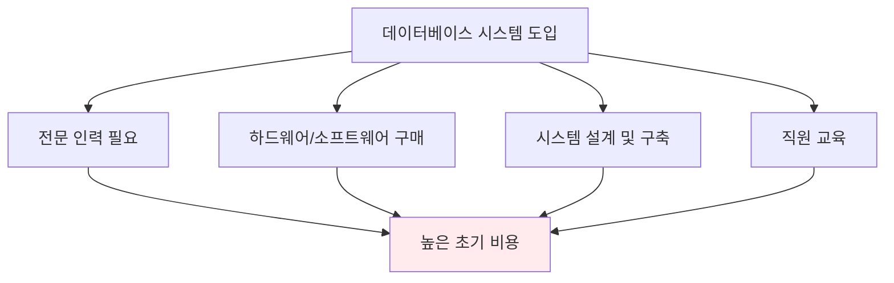
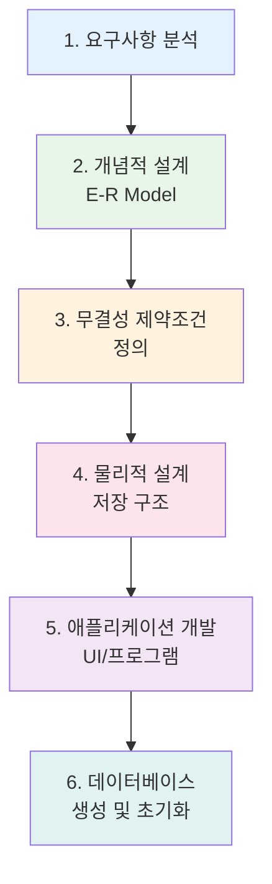
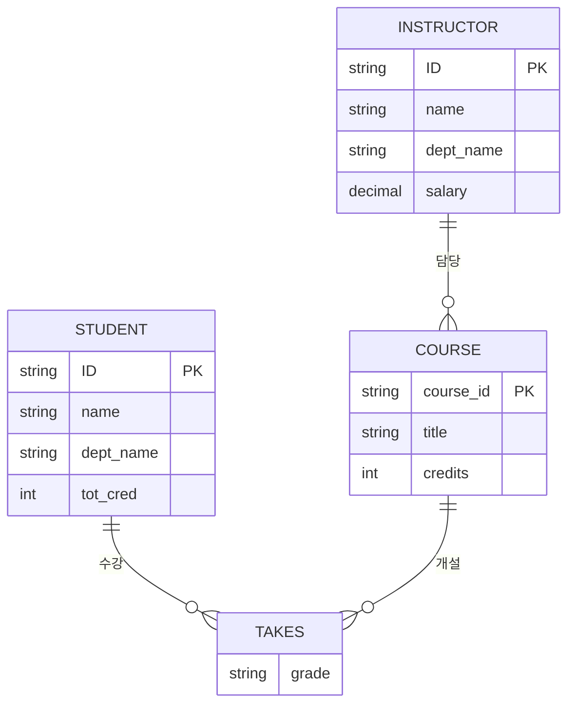
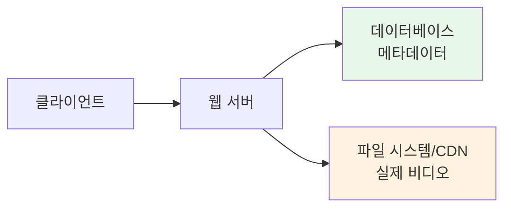

# 데이터베이스 기초 개념 문제 해설

데이터베이스시스템및응용 강의의 첫 번째 장인 "Introduction"에 대한 연습 문제와 상세한 해설입니다.

---

## 문제 1.1: 데이터베이스 시스템의 단점

### 📝 문제
이 장에서는 데이터베이스 시스템의 여러 주요 장점들을 설명했습니다. 두 가지 단점은 무엇입니까?

### ✅ 답안

데이터베이스 시스템과 관련된 두 가지 단점:

**a. 초기 설정 비용**
- 데이터베이스 시스템 설정에는 **더 많은 지식, 비용, 기술, 시간**이 필요합니다.

**b. 성능 문제**
- 데이터베이스의 **복잡성으로 인해 성능 저하**가 발생할 수 있습니다.

### 💡 해설

#### **1️⃣ 초기 설정 비용이 높은 이유**



**구체적인 비용 요소**:
- **지식 (Knowledge)**: DBA, 데이터베이스 설계자, 개발자 등 전문 인력 필요
- **비용 (Money)**: DBMS 라이선스, 서버, 스토리지 등 하드웨어 비용
- **기술 (Skills)**: SQL, 데이터 모델링, 성능 튜닝 등 전문 기술 습득 필요
- **시간 (Time)**: 요구사항 분석, 설계, 구현, 테스트, 배포까지 긴 개발 기간

**vs 파일 시스템**:
- 파일 시스템은 단순히 파일을 생성하고 읽고 쓰는 코드만 작성하면 되므로 초기 진입 장벽이 낮음
- 데이터베이스는 스키마 설계, 정규화, 인덱스 설정 등 추가 작업 필요

#### **2️⃣ 복잡성으로 인한 성능 저하**

**성능 저하 발생 상황**:
1. **과도한 추상화**: 많은 레이어를 거치면서 오버헤드 발생
2. **복잡한 쿼리**: JOIN, 서브쿼리 등이 복잡해지면 실행 시간 증가
3. **동시성 제어**: 트랜잭션 관리로 인한 락(Lock) 대기 시간
4. **소규모 데이터**: 데이터가 적은 경우 DBMS의 복잡성이 오히려 부담

**예시**:
```sql
-- 간단한 데이터 조회도 DBMS는 여러 단계를 거침
SELECT name FROM users WHERE id = 1;

-- DBMS 내부 처리 과정:
-- 1. SQL 파싱 (Parsing)
-- 2. 쿼리 최적화 (Query Optimization)
-- 3. 실행 계획 생성 (Execution Plan)
-- 4. 버퍼 풀 검색 (Buffer Pool Search)
-- 5. 디스크 I/O (필요시)
-- 6. 결과 반환
```

파일 시스템이라면 단순히 파일을 열고 읽기만 하면 되지만, DBMS는 훨씬 복잡한 과정을 거칩니다.

### 🎯 핵심 개념

**데이터베이스의 트레이드오프**:
- **장점**: 데이터 무결성, 동시성 제어, 보안, 회복 기능, 데이터 독립성
- **단점**: 높은 초기 비용, 복잡성으로 인한 성능 저하 가능성

**언제 데이터베이스를 사용해야 하는가?**
- ✅ **사용해야 할 때**: 데이터 무결성이 중요, 다중 사용자 접근, 복잡한 관계, 대용량 데이터
- ❌ **과도한 경우**: 소규모 단순 데이터, 단일 사용자, 읽기 전용, 성능이 최우선

### 💭 실무 관련성

**스타트업의 선택**:
- 초기: SQLite나 파일 시스템으로 빠르게 프로토타입 개발
- 성장: PostgreSQL/MySQL 도입으로 데이터 무결성과 확장성 확보
- 규모화: 분산 데이터베이스, 캐싱 레이어 추가

**성능 최적화**:
- 인덱스 설계로 쿼리 성능 향상
- 캐싱(Redis 등)으로 읽기 성능 개선
- 쿼리 최적화로 복잡성 해소

---

## 문제 1.2: DDL vs 프로그래밍 언어 타입 시스템

### 📝 문제
Java나 C++와 같은 언어의 타입 선언 시스템이 데이터베이스에서 사용되는 데이터 정의 언어(DDL)와 다른 점 다섯 가지를 나열하시오.

### ✅ 답안

**a. 실행 결과의 차이**
- **DDL**: 실행하면 데이터베이스에 **실제 객체가 생성**됨
- **프로그래밍 언어**: 타입 선언은 프로그램에서 사용되는 **추상화**일 뿐

**b. 일관성 제약조건**
- **DDL**: **도메인 제약조건**과 **참조 무결성 제약조건** 명시 가능
- **프로그래밍 언어**: 일반적으로 이러한 제약조건을 허용하지 않음

**c. 권한 부여**
- **DDL**: **서로 다른 사용자에게 다른 접근 권한** 부여 가능
- **프로그래밍 언어**: 이러한 보호 기능을 제공하지 않음 (기껏해야 클래스 간 메서드 접근 제한 정도)

**d. 타입 시스템의 풍부함**
- **프로그래밍 언어**: SQL 타입 시스템보다 **훨씬 풍부함**
- **데이터베이스**: 기본 타입(숫자, 문자열)만 지원 (일부 DB는 배열, 객체 지원)

**e. 초점의 차이**
- **DDL**: 관계의 **속성 타입 명시**에 초점
- **프로그래밍 언어**: **객체와 객체 컬렉션 생성** 가능

### 💡 해설

#### **1️⃣ 실행 결과의 차이**

**프로그래밍 언어**:
```java
// Java 타입 선언 - 메모리에만 존재, 프로그램 종료시 사라짐
class Student {
    int id;
    String name;
    double gpa;
}
```

**데이터베이스 DDL**:
```sql
-- DDL 실행 - 영구적인 스키마가 데이터베이스에 저장됨
CREATE TABLE student (
    id INT PRIMARY KEY,
    name VARCHAR(100),
    gpa DECIMAL(3, 2)
);
-- 이 테이블은 DROP 명령 전까지 영구적으로 존재
```

**핵심 차이**:
- **프로그래밍 언어**: 컴파일 타임의 추상화, 런타임 객체 생성용 템플릿
- **DDL**: 실제 데이터 저장 구조를 영구적으로 정의

#### **2️⃣ 일관성 제약조건**

**데이터베이스의 제약조건**:
```sql
CREATE TABLE instructor (
    id CHAR(5) PRIMARY KEY,
    name VARCHAR(20) NOT NULL,
    dept_name VARCHAR(20),
    salary NUMERIC(8,2) CHECK (salary > 29000),
    FOREIGN KEY (dept_name) REFERENCES department(dept_name)
);
```

**제약조건 종류**:
1. **도메인 제약조건**: `CHECK (salary > 29000)` - 급여는 29,000보다 커야 함
2. **참조 무결성**: `FOREIGN KEY` - dept_name은 department 테이블에 존재해야 함
3. **NOT NULL**: name은 반드시 값이 있어야 함
4. **PRIMARY KEY**: id는 고유하고 NULL 불가

**프로그래밍 언어의 한계**:
```java
class Instructor {
    String id;
    String name;
    String deptName;  // 어떤 값이든 들어갈 수 있음
    double salary;    // 음수도 가능, 제약 없음

    // 제약조건은 별도의 검증 로직으로 구현해야 함
    public void setSalary(double s) {
        if (s <= 29000) throw new IllegalArgumentException();
        this.salary = s;
    }
}
```

#### **3️⃣ 권한 부여**

**데이터베이스 권한 시스템**:
```sql
-- 사용자별로 세밀한 권한 제어
GRANT SELECT ON instructor TO student_user;
GRANT INSERT, UPDATE ON instructor TO staff_user;
GRANT ALL PRIVILEGES ON instructor TO admin_user;

-- 특정 컬럼에 대한 권한도 가능
GRANT SELECT (id, name) ON instructor TO public;
```

**프로그래밍 언어의 접근 제어**:
```java
public class Instructor {
    private String id;          // 클래스 내부에서만 접근
    protected String name;      // 상속 클래스에서 접근
    public String deptName;     // 모든 곳에서 접근
}
// 단순히 코드 수준의 캡슐화, 사용자별 권한은 불가
```

**차이점**:
- **데이터베이스**: 네트워크를 통한 다중 사용자 환경에서 실제 보안 제공
- **프로그래밍 언어**: 코드 구조화를 위한 캡슐화, 실제 보안 아님

#### **4️⃣ 타입 시스템의 풍부함**

**SQL 타입 (제한적)**:
```sql
-- 기본 타입만 주로 지원
INT, BIGINT, DECIMAL, NUMERIC
CHAR, VARCHAR, TEXT
DATE, TIME, TIMESTAMP
BOOLEAN
-- 일부 DBMS: ARRAY, JSON, XML
```

**프로그래밍 언어 타입 (풍부함)**:
```java
// 원시 타입
int, long, double, boolean, char

// 참조 타입
String, Integer, ArrayList<T>

// 제네릭
List<Student>, Map<String, Course>

// 사용자 정의 타입
class Course { ... }
interface Teachable { ... }
enum Semester { SPRING, FALL, SUMMER, WINTER }

// 함수 타입 (Java 8+)
Function<Student, Double> gpaCalculator
```

**왜 데이터베이스 타입이 제한적인가?**
- 데이터의 **영구 저장**과 **검색 효율성**에 초점
- 복잡한 타입은 저장/조회/인덱싱이 어려움
- 최근 PostgreSQL, MongoDB 등은 JSON, 배열 등 지원

#### **5️⃣ 초점의 차이**

**DDL - 관계 중심**:
```sql
-- "관계(테이블)"의 속성들을 정의
CREATE TABLE course (
    course_id VARCHAR(8),
    title VARCHAR(50),
    dept_name VARCHAR(20),
    credits NUMERIC(2,0)
);
-- 데이터를 "표(table)" 형태로 저장
```

**프로그래밍 언어 - 객체 중심**:
```java
// 개별 객체와 객체 컬렉션 생성
Course cs101 = new Course("CS-101", "Intro to CS", 4);
Course cs201 = new Course("CS-201", "Data Structures", 4);

List<Course> courses = new ArrayList<>();
courses.add(cs101);
courses.add(cs201);

// 복잡한 객체 그래프 가능
Student student = new Student("12345", "Kim");
student.enrolledCourses.add(cs101);
cs101.students.add(student);
```

### 🎯 핵심 개념

**DDL과 프로그래밍 언어의 역할 차이**:

| 측면 | DDL | 프로그래밍 언어 |
|------|-----|-----------------|
| **목적** | 데이터의 영구 저장 구조 정의 | 프로그램 로직 구현 |
| **생명주기** | 영구적 (명시적 삭제 전까지) | 일시적 (프로그램 실행 중) |
| **제약조건** | 선언적으로 명시, DBMS가 강제 | 코드로 구현 필요 |
| **보안** | 사용자별 권한 관리 | 코드 수준 캡슐화 |
| **타입 시스템** | 단순, 저장/검색 최적화 | 복잡, 표현력 중시 |

### 💭 실무 관련성

**ORM (Object-Relational Mapping)**:
```java
// Java + JPA/Hibernate
@Entity
@Table(name = "instructor")
public class Instructor {
    @Id
    @Column(name = "id")
    private String id;

    @Column(name = "name", nullable = false)
    private String name;

    @ManyToOne
    @JoinColumn(name = "dept_name")
    private Department department;

    @Column(name = "salary")
    @Min(29000)  // 검증 제약조건
    private BigDecimal salary;
}
```

ORM은 **두 세계의 장점을 결합**:
- 프로그래밍 언어의 풍부한 타입 시스템 활용
- 데이터베이스의 영구성과 제약조건 활용
- 객체와 관계형 데이터의 **임피던스 불일치(Impedance Mismatch)** 해소

---

## 문제 1.3: 데이터베이스 설정 단계

### 📝 문제
특정 기업을 위한 데이터베이스를 설정할 때 수행할 주요 단계 여섯 가지를 나열하시오.

### ✅ 답안

특정 기업을 위한 데이터베이스 설정의 여섯 가지 주요 단계:

1. **기업의 상위 수준 요구사항 정의**
   - 시스템 요구사항 명세서(system requirements specification) 문서 생성

2. **모든 적절한 데이터 타입과 데이터 관계를 포함하는 모델 정의**
   - 개념적 데이터 모델 설계 (E-R 다이어그램 등)

3. **데이터에 대한 무결성 제약조건 정의**
   - 기본키, 외래키, 도메인 제약조건 등

4. **물리적 레벨 정의**
   - 저장 구조, 인덱스, 파일 조직 등

5. **정기적으로 해결해야 할 각 문제에 대해 사용자 인터페이스 정의**
   - 직원이나 웹 사용자가 수행할 작업에 대한 UI
   - UI를 구현하는 애플리케이션 프로그램 작성

6. **데이터베이스 생성/초기화**
   - 실제 데이터베이스 구축 및 초기 데이터 로드

### 💡 해설



#### **1️⃣ 요구사항 정의**

**목적**: 무엇을 만들 것인가를 명확히 함

**예시 - 대학 데이터베이스**:
```
시스템 요구사항 명세서:

1. 기능 요구사항:
   - 학생 등록 및 관리
   - 과목 개설 및 수강 신청
   - 성적 입력 및 조회
   - 교수 정보 관리
   - 학과 정보 관리

2. 데이터 요구사항:
   - 학생: ID, 이름, 학과, 학점
   - 과목: 과목코드, 제목, 학점
   - 수강: 학생-과목 연결, 성적
   - 교수: ID, 이름, 학과, 급여
```

**핵심 질문**:
- 어떤 데이터를 저장해야 하는가?
- 누가 데이터를 사용하는가?
- 어떤 작업을 수행해야 하는가?

#### **2️⃣ 개념적 모델 정의 (E-R 다이어그램)**

**E-R 다이어그램 예시**:


**이 단계의 산출물**:
- 개체(Entity) 식별
- 관계(Relationship) 정의
- 속성(Attribute) 결정
- 카디널리티 명시

#### **3️⃣ 무결성 제약조건 정의**

```sql
-- 기본키 제약조건
PRIMARY KEY (student_id)

-- 외래키 제약조건
FOREIGN KEY (dept_name) REFERENCES department(dept_name)

-- 도메인 제약조건
CHECK (tot_cred >= 0 AND tot_cred <= 200)
CHECK (grade IN ('A', 'B', 'C', 'D', 'F'))

-- NOT NULL 제약조건
name VARCHAR(100) NOT NULL

-- UNIQUE 제약조건
UNIQUE (email)
```

**제약조건의 중요성**:
- 데이터 일관성 보장
- 잘못된 데이터 입력 방지
- 비즈니스 규칙 강제

#### **4️⃣ 물리적 레벨 정의**

**저장 구조 결정**:
```sql
-- 인덱스 생성
CREATE INDEX idx_student_name ON student(name);
CREATE INDEX idx_course_dept ON course(dept_name);

-- 파티셔닝 (대용량 테이블)
CREATE TABLE enrollment_2024 PARTITION OF enrollment
    FOR VALUES FROM ('2024-01-01') TO ('2024-12-31');

-- 클러스터링
CLUSTER student USING idx_student_dept;
```

**고려 사항**:
- 어떤 컬럼에 인덱스를 만들 것인가?
- 테이블을 어떻게 파티셔닝할 것인가?
- 어떤 저장 매체를 사용할 것인가? (SSD vs HDD)

#### **5️⃣ 사용자 인터페이스 및 애플리케이션 개발**

**웹 인터페이스 예시**:
```html
<!-- 학생 등록 폼 -->
<form action="/register-student" method="POST">
    <input name="student_id" placeholder="학번">
    <input name="name" placeholder="이름">
    <select name="dept_name">
        <option>Computer Science</option>
        <option>Physics</option>
    </select>
    <button type="submit">등록</button>
</form>
```

**백엔드 애플리케이션**:
```python
# Flask 예시
@app.route('/register-student', methods=['POST'])
def register_student():
    student_id = request.form['student_id']
    name = request.form['name']
    dept_name = request.form['dept_name']

    conn = get_db_connection()
    conn.execute(
        'INSERT INTO student VALUES (?, ?, ?, 0)',
        (student_id, name, dept_name)
    )
    conn.commit()
    return "등록 완료"
```

**정기적인 작업 자동화**:
- 일일 백업 스크립트
- 성적 처리 배치 작업
- 통계 리포트 생성

#### **6️⃣ 데이터베이스 생성 및 초기화**

```sql
-- 스키마 생성
CREATE DATABASE university;
USE university;

-- 테이블 생성
CREATE TABLE department (...);
CREATE TABLE student (...);
CREATE TABLE course (...);

-- 초기 데이터 로드
INSERT INTO department VALUES ('Comp. Sci.', 'Taylor', 100000);
INSERT INTO department VALUES ('Physics', 'Watson', 70000);

-- 또는 대량 데이터 로드
LOAD DATA INFILE 'students.csv' INTO TABLE student;
```

**초기화 체크리스트**:
- ✅ 모든 테이블 생성 완료
- ✅ 인덱스 및 제약조건 설정
- ✅ 초기 참조 데이터 로드 (학과, 건물 등)
- ✅ 사용자 계정 및 권한 설정
- ✅ 백업 설정
- ✅ 테스트 데이터 준비

### 🎯 핵심 개념

**데이터베이스 설계의 3단계**:
1. **개념적 설계**: E-R 모델로 표현
2. **논리적 설계**: 관계형 스키마로 변환
3. **물리적 설계**: 저장 구조 및 인덱스 결정

**반복적 프로세스**:
- 한 번에 완벽하게 설계하기 어려움
- 요구사항 변경에 따라 반복적으로 개선
- 프로토타입을 만들고 피드백 반영

### 💭 실무 관련성

**애자일 데이터베이스 개발**:
1. **MVP (Minimum Viable Product)**: 핵심 기능만 먼저 구현
2. **점진적 개선**: 사용자 피드백 기반 확장
3. **마이그레이션**: 스키마 변경 관리 (Flyway, Liquibase)

**DevOps 통합**:
```yaml
# CI/CD 파이프라인에 포함
- name: Run database migrations
  run: |
    flyway migrate

- name: Run integration tests
  run: |
    pytest tests/integration/
```

---

## 문제 1.4: 비디오 사이트의 파일 시스템 vs 데이터베이스

### 📝 문제
YouTube와 유사한 비디오 사이트를 구축하려고 합니다. 섹션 1.2에 나열된 파일 처리 시스템에 데이터를 보관하는 것의 단점들을 고려하여, 각 단점이 실제 비디오 데이터와 비디오에 대한 메타데이터(제목, 업로더, 태그, 조회자 등)의 저장에 어떻게 관련되는지 논의하시오.

### ✅ 답안 및 해설

#### **1️⃣ 데이터 중복성과 불일치**

**메타데이터**:
- 어느 정도 관련 있지만, 실제 비디오 데이터는 업데이트되지 않으므로 큰 문제 아님
- 관계가 거의 없어 중복으로 이어지는 경우가 없음

**예시**:
```
비디오 파일: video_12345.mp4
메타데이터 파일: video_12345_meta.json
{
    "title": "데이터베이스 강의",
    "uploader": "교수님",
    "tags": ["database", "lecture"],
    "views": 1000
}
```

파일 시스템에서는 각 비디오가 독립적이므로 중복 문제가 적습니다.

#### **2️⃣ 데이터 접근의 어려움**

**파일 시스템의 한계**:
- 비디오 데이터가 미리 정의된 몇 개의 인터페이스로만 접근된다면 (현재 비디오 공유 사이트처럼) 문제 없음
- **하지만** 특정 검색 조건으로 비디오를 찾아야 한다면?

**복잡한 쿼리 예시**:
```sql
-- 데이터베이스라면 쉬운 쿼리
SELECT video_id, title, views
FROM videos
WHERE uploader = '교수님'
  AND upload_date >= '2024-01-01'
  AND tags LIKE '%database%'
  AND views > 1000
ORDER BY views DESC
LIMIT 10;
```

**파일 시스템에서는**:
```python
# 모든 파일을 읽어서 필터링해야 함
import os
import json

results = []
for filename in os.listdir('videos/'):
    if filename.endswith('_meta.json'):
        with open(filename) as f:
            meta = json.load(f)
            if (meta['uploader'] == '교수님' and
                meta['upload_date'] >= '2024-01-01' and
                'database' in meta['tags'] and
                meta['views'] > 1000):
                results.append(meta)

# 매번 전체 스캔 필요!
```

**결론**: 키워드 검색을 넘어선 **복잡한 검색이 필요하면 데이터베이스가 필수**

#### **3️⃣ 데이터 격리 (Isolation)**

**비디오 사이트의 특성**:
- 데이터는 주로 **업데이트가 아닌 새로 생성**됨
- 조회 기록도 (개념적으로) **추가만** 되므로 격리 문제가 크지 않음

**하지만 권한 부여가 추가되면**:
```sql
-- 동시에 여러 사용자가 접근 권한 변경 시도
UPDATE video_permissions
SET access_level = 'private'
WHERE video_id = 12345;

-- 동시성 제어 필요!
```

**결론**: 단순 읽기/쓰기는 격리 문제가 적지만, **권한 관리 등이 추가되면 필요**

#### **4️⃣ 무결성 문제**

**비디오 사이트의 무결성**:
- 의미 있는 무결성 제약조건이 많지 않음 (기본키 외에는)
- **분산 환경**이라면 기본키 제약조건 강제가 어려울 수 있음

**예시**:
```sql
-- 비디오 ID는 고유해야 함
CREATE TABLE videos (
    video_id INT PRIMARY KEY,
    ...
);

-- 분산 서버에서 동시에 같은 ID 생성 시도?
-- → 데이터베이스가 이를 방지
```

**결론**: 무결성 문제는 **주요 이슈는 아니지만**, 분산 환경에서는 고려 필요

#### **5️⃣ 원자성 문제**

**중요한 시나리오**:
```python
# 비디오 업로드 과정
def upload_video(video_file, metadata):
    # 1. 비디오 파일 저장
    save_video_file(video_file)  # 성공

    # 시스템 장애 발생! 💥

    # 2. 메타데이터 저장 (실행 안 됨)
    save_metadata(metadata)

    # 결과: 비디오는 있는데 메타데이터가 없는 불일치 상태!
```

**데이터베이스라면**:
```sql
BEGIN TRANSACTION;
    INSERT INTO video_files VALUES (...);
    INSERT INTO video_metadata VALUES (...);
COMMIT;
-- 둘 다 성공하거나, 둘 다 실패 (원자성 보장)
```

**결론**: **원자성은 매우 중요**, 회복 메커니즘 필요

#### **6️⃣ 동시 접근 이상 현상**

**비디오 사이트의 특성**:
- 데이터가 업데이트되지 않으므로 **동시 접근 이상이 거의 발생하지 않음**

**조회수 증가는?**:
```python
# 파일 시스템
views = read_views(video_id)  # 1000
views += 1
write_views(video_id, views)  # 1001

# 동시에 다른 사용자도
views = read_views(video_id)  # 1000 (경쟁 조건!)
views += 1
write_views(video_id, views)  # 1001 (하나 손실!)
```

**하지만 실무에서는**:
- 조회수는 정확도보다 성능이 중요
- 캐싱, 비동기 업데이트 등으로 해결

**결론**: 대부분의 작업이 읽기이므로 **큰 문제는 아님**

#### **7️⃣ 보안 문제**

**권한 부여가 있다면**:
```sql
-- 사용자별 접근 제어
GRANT SELECT ON public_videos TO public_user;
GRANT ALL ON my_videos TO owner_user;

-- 비디오별 접근 제어
CREATE TABLE video_permissions (
    video_id INT,
    user_id INT,
    can_view BOOLEAN,
    can_edit BOOLEAN,
    can_delete BOOLEAN
);
```

**파일 시스템**:
- OS 수준 권한만 가능 (파일/디렉토리 단위)
- 세밀한 제어 어려움

**결론**: **권한 시스템을 지원한다면 중요한 문제**

### 🎯 핵심 개념

**비디오 사이트의 데이터 특성**:

| 특성 | 비디오 데이터 | 메타데이터 |
|------|--------------|-----------|
| **업데이트 빈도** | 거의 없음 (불변) | 가끔 (조회수 등) |
| **크기** | 매우 큼 (GB 단위) | 작음 (KB 단위) |
| **검색 필요성** | 낮음 | 높음 |
| **관계** | 없음 | 많음 (사용자-비디오-태그) |

**하이브리드 접근**:


### 💭 실무 관련성

**실제 YouTube 아키텍처**:
1. **메타데이터**: MySQL, Bigtable 등 데이터베이스에 저장
2. **비디오 파일**: Google File System (GFS), CDN에 저장
3. **검색**: 전문 검색 엔진 (Elasticsearch 유사)
4. **조회수**: 캐싱 + 비동기 업데이트

**Netflix 사례**:
- 메타데이터: Cassandra (NoSQL)
- 비디오: S3 + CloudFront CDN
- 추천 시스템: 별도 데이터베이스 + 머신러닝

---

## 문제 1.5: 웹 검색 vs 데이터베이스 쿼리

### 📝 문제
웹 검색에 사용되는 키워드 쿼리는 데이터베이스 쿼리와 상당히 다릅니다. 쿼리가 명시되는 방식과 쿼리 결과 측면에서 두 가지의 주요 차이점을 나열하시오.

### ✅ 답안

**쿼리 명시 방식**:
- **웹 검색**: 특정 구문 없이 키워드 목록 제공
- **데이터베이스**: 복잡한 쿼리를 명시할 수 있는 특정 구문 존재

**쿼리 결과**:
- **웹 검색**: 일반적으로 URL의 정렬된 목록과 URL 내용에 대한 스니펫
- **데이터베이스**: 관계형 세계에서는 항상 테이블

### 💡 해설

#### **1️⃣ 쿼리 명시 방식의 차이**

**웹 검색 (비정형)**:
```
데이터베이스 정규화 BCNF
```

**특징**:
- 자연어에 가까움
- 구문 규칙 없음
- 키워드 순서는 중요도에 영향
- 불리언 연산자도 선택사항

**데이터베이스 쿼리 (정형)**:
```sql
SELECT title, author, publication_year
FROM papers
WHERE topic = 'database'
  AND keywords LIKE '%normalization%'
  AND keywords LIKE '%BCNF%'
ORDER BY citation_count DESC;
```

**특징**:
- 엄격한 구문 규칙 (SQL)
- 정확한 조건 명시
- 복잡한 논리 표현 가능
- 여러 테이블 조인 가능

#### **2️⃣ 쿼리 결과의 차이**

**웹 검색 결과**:
```
검색 결과 약 1,250,000개

1. 데이터베이스 정규화 - BCNF 설명
   www.example.com/db/normalization
   ... BCNF는 모든 결정자가 후보키인 정규형입니다 ...

2. Boyce-Codd Normal Form - Wikipedia
   en.wikipedia.org/wiki/Boyce-Codd
   ... Definition and examples of BCNF ...

3. [PDF] 정규화 이론
   university.edu/lectures/normalization.pdf
   ... 강의 자료 ...
```

**특징**:
- **순위가 매겨진** 결과 (관련도 순)
- **URL + 스니펫**(발췌문)
- 구조화되지 않은 정보
- 개수가 매우 많을 수 있음

**데이터베이스 쿼리 결과**:
```
+----+----------------------------+--------+--------+
| ID | title                      | author | year   |
+----+----------------------------+--------+--------+
| 42 | Normal Forms in RDBMS      | Codd   | 1974   |
| 55 | BCNF Decomposition         | Date   | 1976   |
| 78 | Database Design Principles | Kent   | 1983   |
+----+----------------------------+--------+--------+
3 rows returned
```

**특징**:
- **테이블 형태** (행과 열)
- **정확히 일치**하는 결과만
- 구조화된 데이터
- 정확한 개수

#### **3️⃣ 심화 비교**

**쿼리 의도**:

**웹 검색**:
```
"데이터베이스 공부 방법"
→ 사용자 의도: 학습 가이드, 추천 자료, 경험담 등을 원함
→ 검색 엔진: NLP로 의도 파악, 다양한 결과 제공
```

**데이터베이스**:
```sql
SELECT course_id, title, instructor
FROM courses
WHERE dept = 'Computer Science'
  AND level = 'Introductory';

→ 사용자 의도: 정확히 이 조건을 만족하는 레코드만
→ DBMS: 조건을 엄격히 평가
```

**애매모호함 처리**:

**웹 검색**:
```
"apple"
→ 과일? 회사? 애플파이?
→ 사용자 이력, 위치 등으로 추론
→ 다양한 해석의 결과 모두 표시
```

**데이터베이스**:
```sql
SELECT * FROM products WHERE name = 'apple';
→ 정확히 'apple'인 것만
→ 대소문자 구분 (설정에 따라)
→ 애매모호함 없음
```

### 🎯 핵심 개념

**두 시스템의 목적 차이**:

| 측면 | 웹 검색 | 데이터베이스 |
|------|---------|-------------|
| **목적** | 정보 발견 | 데이터 조회 |
| **데이터** | 비정형 (텍스트, 이미지 등) | 정형 (테이블) |
| **정확도** | 관련성 기반 | 정확한 일치 |
| **사용자** | 일반인 | 개발자, 분석가 |
| **질의 복잡도** | 단순 (키워드) | 복잡 (SQL) |
| **결과 형태** | 순위 목록 | 테이블 |

### 💭 실무 관련성

**하이브리드 접근: 데이터베이스에 검색 기능 추가**

**PostgreSQL 전문 검색**:
```sql
-- 전문 검색 인덱스 생성
CREATE INDEX idx_papers_search ON papers
USING GIN(to_tsvector('english', title || ' ' || abstract));

-- 키워드 검색 (웹 검색처럼)
SELECT title, ts_rank(search_vector, query) AS rank
FROM papers, to_tsquery('database & normalization') AS query
WHERE search_vector @@ query
ORDER BY rank DESC;
```

**Elasticsearch + 데이터베이스**:
```python
# 검색은 Elasticsearch
results = es.search(index='papers', body={
    'query': {
        'match': {
            'content': 'database normalization BCNF'
        }
    }
})

# 상세 데이터는 데이터베이스
for hit in results['hits']['hits']:
    paper_id = hit['_id']
    paper = db.query(f"SELECT * FROM papers WHERE id = {paper_id}")
```

**최근 동향: 자연어 쿼리**:
```
# 자연어로 데이터베이스 쿼리 (AI 활용)
User: "2024년에 가장 많이 인용된 데이터베이스 논문 5개는?"

AI → SQL:
SELECT title, citation_count
FROM papers
WHERE year = 2024 AND topic = 'database'
ORDER BY citation_count DESC
LIMIT 5;
```

---

## 정리 및 핵심 요약

### 📚 배운 핵심 개념

1. **데이터베이스의 트레이드오프**
   - 장점: 무결성, 동시성 제어, 보안, 회복
   - 단점: 초기 비용, 복잡성

2. **DDL vs 프로그래밍 언어**
   - DDL: 영구적, 제약조건, 권한, 관계 중심
   - 프로그래밍 언어: 일시적, 풍부한 타입, 객체 중심

3. **데이터베이스 설정 과정**
   - 요구사항 → 모델링 → 제약조건 → 물리 설계 → 애플리케이션 → 초기화

4. **적절한 저장 방식 선택**
   - 비디오 파일: 파일 시스템/CDN
   - 메타데이터: 데이터베이스
   - 하이브리드 접근이 현실적

5. **웹 검색 vs DB 쿼리**
   - 웹: 비정형, 키워드, 순위 목록
   - DB: 정형, SQL, 테이블

### 💡 실무 적용 팁

1. **프로젝트 시작 시 데이터베이스 선택 기준**
   - 소규모/프로토타입: SQLite, 파일
   - 일반 웹앱: PostgreSQL, MySQL
   - 대규모/분산: NoSQL 고려

2. **하이브리드 접근 활용**
   - 정형 데이터: RDB
   - 비정형 데이터: 파일/객체 스토리지
   - 검색: 전문 검색 엔진

3. **점진적 개선**
   - MVP부터 시작
   - 병목 발생 시 최적화
   - 마이그레이션 전략 수립

---

## 📖 참고 자료
- Database System Concepts (Silberschatz, Korth, Sudarshan)
- 한양대학교 데이터베이스시스템및응용 강의자료

> 💡 **학습 팁**: 이론적 개념을 실제 사례와 연결하여 이해하세요. 각 개념이 왜 필요한지, 실무에서 어떻게 적용되는지 생각해보면 훨씬 깊이 있게 학습할 수 있습니다!
