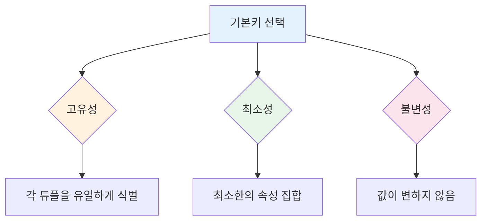
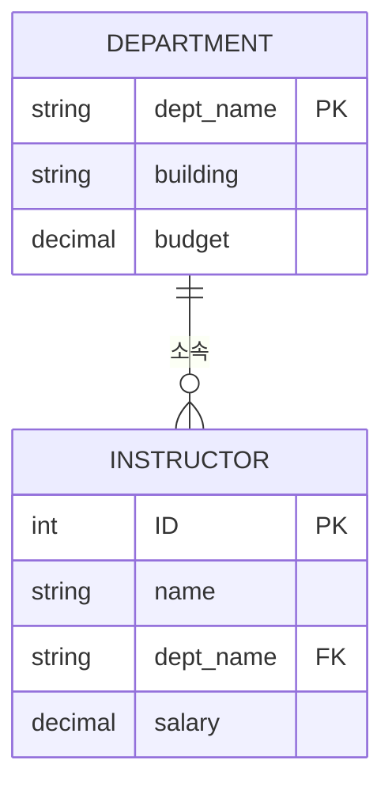
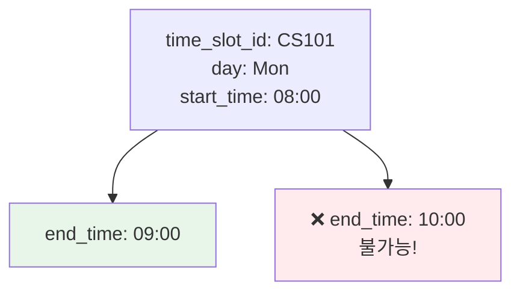
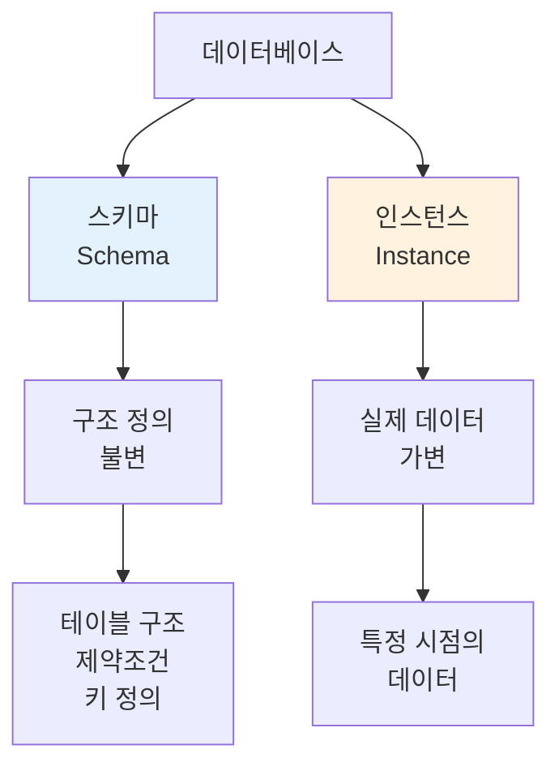

# 관계형 모델 기초 문제 해설

데이터베이스시스템및응용 강의의 두 번째 장인 "Introduction to the Relational Model"에 대한 연습 문제와 상세한 해설입니다.

---

## 문제 2.1: 기본키 식별

### 📝 문제
Figure 2.17의 employee 데이터베이스를 고려하시오. 적절한 기본키는 무엇입니까?

**데이터베이스 스키마**:
```
employee (ID, person_name, street, city)
works (ID, company_name, salary)
company (company_name, city)
```

### ✅ 답안

적절한 기본키는 다음과 같습니다:

- `employee` (<u>person_name</u>, street, city)
- `works` (<u>person_name, company_name</u>, salary)
- `company` (<u>company_name</u>, city)

### 💡 해설

#### **기본키 선택 원칙**



#### **1️⃣ employee 테이블**

**기본키**: `person_name`

**선택 이유**:
- 각 직원을 고유하게 식별
- 이름은 일반적으로 변하지 않음 (실무에서는 ID 사용 권장)

**주의사항**:
```sql
-- 현실적으로는 이름이 중복될 수 있음!
INSERT INTO employee VALUES ('John Smith', 'Main St', 'NYC');
INSERT INTO employee VALUES ('John Smith', 'Park Ave', 'Boston');
-- ❌ 동명이인 문제 발생 가능

-- 실무에서는 ID 사용 권장
employee (ID, person_name, street, city)
-- ID가 기본키로 더 적합
```

#### **2️⃣ works 테이블**

**기본키**: `(person_name, company_name)`

**복합키인 이유**:
- 한 사람이 여러 회사에서 일할 수 있음
- 한 회사에 여러 직원이 있을 수 있음
- 따라서 **두 속성의 조합**이 필요

**예시 데이터**:
```
works 테이블:
+-------------+--------------+--------+
| person_name | company_name | salary |
+-------------+--------------+--------+
| Kim         | Samsung      | 80000  |
| Kim         | LG           | 75000  | ← 동일인이 다른 회사
| Lee         | Samsung      | 90000  | ← 다른 사람이 같은 회사
+-------------+--------------+--------+
```

**왜 복합키인가?**:
- `person_name`만으로는 부족: Kim이 두 번 나타남
- `company_name`만으로는 부족: Samsung이 두 번 나타남
- `(person_name, company_name)` 조합: 각 행을 고유하게 식별 ✓

#### **3️⃣ company 테이블**

**기본키**: `company_name`

**선택 이유**:
- 회사명은 고유함
- 각 회사를 유일하게 식별

**예시**:
```
company 테이블:
+--------------+-------+
| company_name | city  |
+--------------+-------+
| Samsung      | Seoul |
| LG           | Seoul |
| SK           | Seoul |
+--------------+-------+
```

**주의**: `city`는 기본키가 될 수 없음 (여러 회사가 같은 도시에 위치 가능)

### 🎯 핵심 개념

**기본키 vs 후보키**:
- **후보키**: 유일성과 최소성을 만족하는 속성 집합
- **기본키**: 후보키 중에서 선택된 하나

**복합키 (Composite Key)**:
- 두 개 이상의 속성으로 구성된 키
- 각 속성 단독으로는 고유성을 보장하지 못함

### 💭 실무 관련성

**대리키 (Surrogate Key) 사용**:
```sql
-- 실무에서는 자동 증가하는 ID 사용을 권장
employee (
    emp_id INT PRIMARY KEY AUTO_INCREMENT,  -- 대리키
    person_name VARCHAR(100),
    street VARCHAR(200),
    city VARCHAR(100)
);

works (
    work_id INT PRIMARY KEY AUTO_INCREMENT,  -- 대리키
    emp_id INT,                              -- 외래키
    company_id INT,                          -- 외래키
    salary DECIMAL(10, 2),
    FOREIGN KEY (emp_id) REFERENCES employee(emp_id),
    FOREIGN KEY (company_id) REFERENCES company(company_id),
    UNIQUE (emp_id, company_id)  -- 중복 방지
);
```

**장점**:
- 동명이인 문제 해결
- 조인 성능 향상 (정수 비교가 문자열 비교보다 빠름)
- 데이터 변경 시 유연성 (이름 변경 가능)

---

## 문제 2.2: 외래키 제약조건 위반

### 📝 문제
`instructor`의 `dept_name` 속성에서 `department` 관계로의 외래키 제약조건을 고려하시오. 이러한 관계에 대한 삽입 및 삭제의 예를 들어 외래키 제약조건을 위반할 수 있는 경우를 설명하시오.

### ✅ 답안

#### **삽입 위반 사례**

다음 튜플을 삽입하는 경우:
```sql
INSERT INTO instructor VALUES (10111, 'Ostrom', 'Economics', 110000);
```

`department` 테이블에 'Economics' 학과가 존재하지 않는다면 **외래키 제약조건 위반**

#### **삭제 위반 사례**

다음 튜플을 삭제하는 경우:
```sql
DELETE FROM department WHERE dept_name = 'Biology';
```

적어도 한 명의 학생이나 교수의 튜플이 `dept_name`으로 'Biology'를 가지고 있다면 **외래키 제약조건 위반**

### 💡 해설

#### **외래키 제약조건이란?**



**외래키 제약조건**: 참조하는 값은 반드시 참조되는 테이블에 존재해야 함

#### **1️⃣ 삽입 위반 (Insertion Violation)**

**시나리오**:
```sql
-- 현재 department 테이블 상태
SELECT * FROM department;
+-------------+----------+--------+
| dept_name   | building | budget |
+-------------+----------+--------+
| Comp. Sci.  | Taylor   | 100000 |
| Biology     | Watson   | 90000  |
| Physics     | Main     | 70000  |
+-------------+----------+--------+

-- Economics 학과는 없음!

-- 교수 삽입 시도
INSERT INTO instructor VALUES (10111, 'Ostrom', 'Economics', 110000);
-- ❌ 오류: dept_name 'Economics'가 department 테이블에 없음
```

**오류 메시지**:
```
ERROR: Foreign key constraint violation
Cannot add or update a child row:
a foreign key constraint fails (`instructor`,
CONSTRAINT `fk_dept` FOREIGN KEY (`dept_name`)
REFERENCES `department` (`dept_name`))
```

**올바른 순서**:
```sql
-- 1. 먼저 학과 추가
INSERT INTO department VALUES ('Economics', 'Watson', 95000);

-- 2. 그 다음 교수 추가
INSERT INTO instructor VALUES (10111, 'Ostrom', 'Economics', 110000);
-- ✓ 성공
```

#### **2️⃣ 삭제 위반 (Deletion Violation)**

**시나리오**:
```sql
-- instructor 테이블 상태
SELECT * FROM instructor WHERE dept_name = 'Biology';
+-------+--------+---------+--------+
| ID    | name   | dept_name | salary |
+-------+--------+---------+--------+
| 10101 | Srinivasan | Biology | 65000 |
| 12121 | Wu     | Biology | 90000 |
+-------+--------+---------+--------+

-- Biology 학과를 삭제 시도
DELETE FROM department WHERE dept_name = 'Biology';
-- ❌ 오류: 이 학과를 참조하는 교수들이 있음!
```

**문제점**:
- Biology 학과를 삭제하면
- 해당 학과 교수들의 `dept_name`이 "존재하지 않는 학과"를 가리킴
- **참조 무결성 위반!**

**해결 방법**:

**방법 1: 먼저 교수들을 이동 또는 삭제**
```sql
-- 옵션 A: 교수들을 다른 학과로 이동
UPDATE instructor
SET dept_name = 'Comp. Sci.'
WHERE dept_name = 'Biology';

-- 옵션 B: 교수들을 삭제
DELETE FROM instructor WHERE dept_name = 'Biology';

-- 그 다음 학과 삭제
DELETE FROM department WHERE dept_name = 'Biology';
-- ✓ 성공
```

**방법 2: CASCADE 옵션 사용**
```sql
-- 테이블 생성 시 CASCADE 옵션 설정
CREATE TABLE instructor (
    ID INT PRIMARY KEY,
    name VARCHAR(50),
    dept_name VARCHAR(20),
    salary DECIMAL(8, 2),
    FOREIGN KEY (dept_name) REFERENCES department(dept_name)
        ON DELETE CASCADE        -- 부모 삭제 시 자식도 삭제
        ON UPDATE CASCADE        -- 부모 수정 시 자식도 수정
);

-- 이제 학과 삭제 시 해당 학과 교수들도 자동 삭제
DELETE FROM department WHERE dept_name = 'Biology';
-- ✓ Biology 학과와 소속 교수들 모두 삭제됨
```

**방법 3: SET NULL 옵션**
```sql
CREATE TABLE instructor (
    ID INT PRIMARY KEY,
    name VARCHAR(50),
    dept_name VARCHAR(20),
    salary DECIMAL(8, 2),
    FOREIGN KEY (dept_name) REFERENCES department(dept_name)
        ON DELETE SET NULL       -- 부모 삭제 시 자식의 FK를 NULL로
);

-- 학과 삭제 시 교수들의 dept_name이 NULL로 변경
DELETE FROM department WHERE dept_name = 'Biology';
-- ✓ Biology 학과는 삭제되고, 교수들의 dept_name은 NULL
```

### 🎯 핵심 개념

**참조 무결성 (Referential Integrity)**:
- 외래키 값은 참조하는 기본키 값 중 하나이거나 NULL이어야 함
- 데이터 일관성을 보장하는 핵심 메커니즘

**외래키 제약조건 옵션**:

| 옵션 | INSERT | DELETE | UPDATE |
|------|--------|--------|--------|
| **RESTRICT** (기본) | FK가 없으면 거부 | 참조되면 거부 | 참조되면 거부 |
| **CASCADE** | - | 자식도 삭제 | 자식도 수정 |
| **SET NULL** | - | FK를 NULL로 | FK를 NULL로 |
| **SET DEFAULT** | - | FK를 기본값으로 | FK를 기본값으로 |

### 💭 실무 관련성

**실무 시나리오**:
```sql
-- 전자상거래: 주문과 고객
CREATE TABLE customers (
    customer_id INT PRIMARY KEY,
    name VARCHAR(100)
);

CREATE TABLE orders (
    order_id INT PRIMARY KEY,
    customer_id INT,
    order_date DATE,
    FOREIGN KEY (customer_id) REFERENCES customers(customer_id)
        ON DELETE RESTRICT  -- 고객 삭제 시 주문이 있으면 거부
        -- 주문 이력 보존을 위해
);

-- 부서와 직원
CREATE TABLE employees (
    emp_id INT PRIMARY KEY,
    name VARCHAR(100),
    dept_id INT,
    FOREIGN KEY (dept_id) REFERENCES departments(dept_id)
        ON DELETE SET NULL  -- 부서 삭제 시 직원은 유지하되 무소속으로
        ON UPDATE CASCADE   -- 부서 ID 변경 시 직원 정보도 자동 수정
);
```

**설계 고려사항**:
- **RESTRICT**: 중요한 데이터 보존 (주문, 거래 이력 등)
- **CASCADE**: 종속적 데이터 (댓글은 게시글 삭제 시 함께 삭제)
- **SET NULL**: 선택적 관계 (부서는 없어져도 직원은 유지)

---

## 문제 2.3: time_slot 테이블의 기본키

### 📝 문제
`time_slot` 관계를 고려하시오. 특정 시간대가 일주일에 여러 번 만날 수 있다는 점을 고려할 때, `day`와 `start_time`이 이 관계의 기본키의 일부인 이유와 `end_time`은 그렇지 않은 이유를 설명하시오.

### ✅ 답안

속성 `day`와 `start_time`은 특정 수업이 여러 다른 날에 만날 가능성이 높고 하루에 한 번 이상 만날 수도 있기 때문에 기본키의 일부입니다.

그러나 `end_time`은 기본키의 일부가 아닙니다. 특정 날짜의 특정 시간에 시작하는 특정 수업은 한 번 이상의 시간에 끝날 수 없기 때문입니다.

### 💡 해설

#### **time_slot 테이블 구조**

```sql
CREATE TABLE time_slot (
    time_slot_id VARCHAR(10),
    day VARCHAR(10),
    start_time TIME,
    end_time TIME,
    PRIMARY KEY (time_slot_id, day, start_time)
);
```

#### **1️⃣ 왜 day가 기본키에 포함되는가?**

**시나리오**: 월수금 수업
```
time_slot 테이블:
+---------------+--------+------------+----------+
| time_slot_id  | day    | start_time | end_time |
+---------------+--------+------------+----------+
| A             | Mon    | 08:00      | 09:00    |
| A             | Wed    | 08:00      | 09:00    |
| A             | Fri    | 08:00      | 09:00    |
+---------------+--------+------------+----------+
```

**설명**:
- 같은 `time_slot_id = 'A'`가 3번 나타남
- 같은 시간대지만 **다른 요일**
- `day` 없이는 구분 불가능! ❌

#### **2️⃣ 왜 start_time이 기본키에 포함되는가?**

**시나리오**: 하루에 여러 시간
```
time_slot 테이블:
+---------------+--------+------------+----------+
| time_slot_id  | day    | start_time | end_time |
+---------------+--------+------------+----------+
| B             | Mon    | 08:00      | 09:00    |
| B             | Mon    | 13:00      | 14:00    |
| B             | Mon    | 16:00      | 17:00    |
+---------------+--------+------------+----------+
```

**설명**:
- 같은 `time_slot_id = 'B'`, 같은 `day = 'Mon'`
- 하지만 **다른 시작 시간**
- `start_time` 없이는 구분 불가능! ❌

#### **3️⃣ 왜 end_time은 기본키에 포함되지 않는가?**

**핵심 논리**:
```
주어진 정보:
- time_slot_id: A
- day: Monday
- start_time: 08:00

질문: end_time이 여러 개일 수 있는가?
```

**불가능한 시나리오**:
```
❌ 이런 데이터는 말이 안 됨:
+---------------+--------+------------+----------+
| time_slot_id  | day    | start_time | end_time |
+---------------+--------+------------+----------+
| A             | Mon    | 08:00      | 09:00    |
| A             | Mon    | 08:00      | 10:00    |  ← 동일한 수업이
+---------------+--------+------------+----------+    동시에 두 시간에 끝남?
```

**이유**:
- 특정 날짜의 특정 시간에 시작하는 수업은
- **정확히 하나의 종료 시간**만 가질 수 있음
- 따라서 `end_time`은 나머지 속성들에 의해 **함수적으로 결정**됨

**함수적 종속성**:
```
(time_slot_id, day, start_time) → end_time
```

#### **실제 예시**



**올바른 데이터**:
```
Database Systems 수업 (CS101):
- 월요일 08:00-09:00
- 수요일 08:00-09:00
- 금요일 08:00-09:00

+---------------+--------+------------+----------+
| time_slot_id  | day    | start_time | end_time |
+---------------+--------+------------+----------+
| CS101         | Mon    | 08:00      | 09:00    |
| CS101         | Wed    | 08:00      | 09:00    |
| CS101         | Fri    | 08:00      | 09:00    |
+---------------+--------+------------+----------+

기본키: (time_slot_id, day, start_time)
각 행은 "특정 수업의 특정 요일의 특정 시작 시간"을 나타냄
```

### 🎯 핵심 개념

**기본키 선택 원칙 재확인**:
1. **유일성**: 각 튜플을 고유하게 식별
2. **최소성**: 필요한 최소한의 속성만 포함
3. **함수적 종속성**: 기본키가 아닌 속성은 기본키에 함수적으로 종속

**함수적 종속성**:
```
A → B 의미: A가 정해지면 B가 유일하게 결정됨

(time_slot_id, day, start_time) → end_time  ✓
(time_slot_id, day) → start_time             ✗ (여러 시작 시간 가능)
(time_slot_id) → day                         ✗ (여러 요일 가능)
```

### 💭 실무 관련성

**강의 시간표 시스템**:
```sql
-- 강의 기본 정보
CREATE TABLE courses (
    course_id VARCHAR(10) PRIMARY KEY,
    title VARCHAR(100),
    credits INT
);

-- 시간대 정의
CREATE TABLE time_slots (
    time_slot_id VARCHAR(10),
    day VARCHAR(10),
    start_time TIME,
    end_time TIME,
    PRIMARY KEY (time_slot_id, day, start_time)
);

-- 강의-시간대 매핑
CREATE TABLE course_schedule (
    course_id VARCHAR(10),
    sec_id VARCHAR(10),
    semester VARCHAR(10),
    year INT,
    time_slot_id VARCHAR(10),
    PRIMARY KEY (course_id, sec_id, semester, year),
    FOREIGN KEY (course_id) REFERENCES courses(course_id),
    FOREIGN KEY (time_slot_id) REFERENCES time_slots(time_slot_id)
);
```

**실제 쿼리**:
```sql
-- CS101 수업이 언제 있는지 조회
SELECT c.title, ts.day, ts.start_time, ts.end_time
FROM courses c
JOIN course_schedule cs ON c.course_id = cs.course_id
JOIN time_slots ts ON cs.time_slot_id = ts.time_slot_id
WHERE c.course_id = 'CS101'
  AND cs.semester = 'Fall'
  AND cs.year = 2024;

결과:
+-------------------+--------+------------+----------+
| title             | day    | start_time | end_time |
+-------------------+--------+------------+----------+
| Database Systems  | Mon    | 08:00      | 09:00    |
| Database Systems  | Wed    | 08:00      | 09:00    |
| Database Systems  | Fri    | 08:00      | 09:00    |
+-------------------+--------+------------+----------+
```

---

## 문제 2.4: 인스턴스 vs 스키마

### 📝 문제
Figure 2.1에 표시된 `instructor` 인스턴스에서는 두 교수가 같은 이름을 가지지 않습니다. 이것으로부터 `name`을 `instructor`의 슈퍼키(또는 기본키)로 사용할 수 있다고 결론을 내릴 수 있습니까?

### ✅ 답안

**아니오.** 이 `instructor` 테이블의 가능한 인스턴스에서는 이름이 고유하지만, 일반적으로 이것이 항상 그런 것은 아닐 수 있습니다 (대학에 두 교수가 같은 이름을 가질 수 없다는 규칙이 있지 않는 한, 이는 다소 가능성이 낮은 시나리오입니다).

### 💡 해설

#### **핵심 개념: 인스턴스 vs 스키마**



#### **1️⃣ 현재 인스턴스 분석**

**Figure 2.1의 instructor 테이블** (예시):
```
+-------+-----------+-----------+--------+
| ID    | name      | dept_name | salary |
+-------+-----------+-----------+--------+
| 10101 | Srinivasan| Comp. Sci.| 65000  |
| 12121 | Wu        | Finance   | 90000  |
| 15151 | Mozart    | Music     | 40000  |
| 22222 | Einstein  | Physics   | 95000  |
| 32343 | El Said   | History   | 60000  |
+-------+-----------+-----------+--------+
```

**관찰**:
- 모든 name 값이 서로 다름
- 이 **특정 인스턴스**에서는 name이 고유함

**잘못된 추론**:
```
❌ "현재 데이터에서 이름이 고유하다"
   → "이름을 기본키로 사용할 수 있다"
```

#### **2️⃣ 왜 이것이 잘못된 추론인가?**

**반례 시나리오**:
```sql
-- 새로운 교수 채용
INSERT INTO instructor VALUES (10102, 'Wu', 'Comp. Sci.', 70000);

-- 현재 상태:
+-------+-----------+-----------+--------+
| ID    | name      | dept_name | salary |
+-------+-----------+-----------+--------+
| 12121 | Wu        | Finance   | 90000  |
| 10102 | Wu        | Comp. Sci.| 70000  | ← 동명이인!
+-------+-----------+-----------+--------+

-- name을 기본키로 사용했다면?
-- ❌ 기본키 제약조건 위반!
-- 두 개의 'Wu'를 구별할 수 없음
```

**현실적인 시나리오**:
```
대학교에 다음과 같은 교수들이 있을 수 있음:
- John Smith (Computer Science)
- John Smith (Mathematics)
- John Smith (Physics)

한국 대학의 경우:
- 김철수 (컴퓨터공학과)
- 김철수 (전자공학과)
- 김철수 (기계공학과)
```

#### **3️⃣ 올바른 접근**

**키 선택 기준**:
```
❌ 잘못된 기준: "현재 데이터에서 고유하다"
✓ 올바른 기준: "항상 고유함이 보장되는가?"
```

**ID vs Name 비교**:

| 속성 | 고유성 보장 | 불변성 | 최소성 | 기본키 적합성 |
|------|------------|--------|--------|--------------|
| **ID** | ✓ 시스템 할당 | ✓ 변하지 않음 | ✓ 단일 속성 | ✓ **적합** |
| **name** | ❌ 동명이인 가능 | ❌ 개명 가능 | ✓ 단일 속성 | ❌ **부적합** |

**올바른 설계**:
```sql
CREATE TABLE instructor (
    ID INT PRIMARY KEY,              -- ✓ 기본키: 시스템이 관리
    name VARCHAR(50) NOT NULL,       -- 이름은 일반 속성
    dept_name VARCHAR(20),
    salary DECIMAL(8, 2),
    UNIQUE (name, dept_name)         -- 선택사항: 같은 학과 내 동명이인 방지
);
```

#### **4️⃣ 인스턴스 vs 스키마 제약조건**

**인스턴스 제약조건** (현재 데이터):
```
"지금 이 데이터베이스에 동명이인이 없다"
→ 우연일 뿐, 보장되지 않음
```

**스키마 제약조건** (설계 규칙):
```
"이 테이블에서 ID는 항상 고유하다"
→ DBMS가 강제로 보장
```

**예시**:
```sql
-- 인스턴스 수준 관찰
SELECT name, COUNT(*)
FROM instructor
GROUP BY name
HAVING COUNT(*) > 1;
-- 결과: 빈 테이블 (현재는 동명이인 없음)
-- 하지만 이것이 앞으로도 그럴 것이라는 보장은 없음!

-- 스키마 수준 제약
ALTER TABLE instructor
ADD CONSTRAINT pk_instructor PRIMARY KEY (ID);
-- 이제 ID의 고유성은 영구적으로 보장됨
```

### 🎯 핵심 개념

**설계 원칙**:
```
✓ 키는 "현재 데이터"가 아닌 "의미론적 제약"으로 선택
✓ 키는 "가능한 모든 인스턴스"에서 고유해야 함
✓ 키는 "비즈니스 규칙"을 반영해야 함
```

**흔한 실수**:
```
❌ "현재 데이터에서 중복이 없으니 키로 사용"
❌ "이 속성이 대부분 고유하니 키로 사용"
❌ "지금까지 문제없었으니 앞으로도 괜찮을 것"
```

### 💭 실무 관련성

**대리키 (Surrogate Key) 사용 이유**:
```sql
-- 자연키 사용 (문제 발생 가능)
CREATE TABLE employees_bad (
    social_security_number VARCHAR(20) PRIMARY KEY,  -- 민감 정보
    email VARCHAR(100) UNIQUE,                       -- 변경 가능
    name VARCHAR(100)                                -- 중복 가능
);

-- 대리키 사용 (권장)
CREATE TABLE employees_good (
    emp_id INT PRIMARY KEY AUTO_INCREMENT,   -- ✓ 시스템 관리
    ssn VARCHAR(20),                         -- 일반 속성으로
    email VARCHAR(100) UNIQUE,               -- 변경 가능
    name VARCHAR(100),                       -- 중복 가능
    INDEX idx_name (name)                    -- 검색 성능용
);
```

**장점**:
1. **불변성**: ID는 한 번 할당되면 변하지 않음
2. **단순성**: 정수 하나로 관리
3. **성능**: 정수 비교가 빠름
4. **개인정보 보호**: 민감 정보를 키로 사용하지 않음

**UUID 사용**:
```sql
-- 분산 시스템에서는 UUID 사용
CREATE TABLE users (
    user_id CHAR(36) PRIMARY KEY DEFAULT (UUID()),
    email VARCHAR(100) UNIQUE NOT NULL,
    name VARCHAR(100)
);

-- UUID 예시: '550e8400-e29b-41d4-a716-446655440000'
-- 장점: 분산 환경에서 충돌 없이 생성 가능
```

---

## 정리 및 핵심 요약

### 📚 배운 핵심 개념

1. **기본키 선택**
   - 고유성: 각 튜플을 유일하게 식별
   - 최소성: 필요 최소한의 속성
   - 불변성: 값이 변하지 않음

2. **외래키 제약조건**
   - 참조 무결성 보장
   - INSERT/DELETE 시 제약 체크
   - CASCADE, SET NULL 등의 옵션

3. **복합키**
   - 여러 속성의 조합으로 고유성 확보
   - 각 속성 단독으로는 불충분

4. **인스턴스 vs 스키마**
   - 현재 데이터로 키를 결정하면 안 됨
   - 설계는 모든 가능한 인스턴스 고려
   - 비즈니스 규칙 반영 필요

### 💡 실무 적용 팁

1. **대리키 사용**
   - 자동 증가 ID 권장
   - 자연키의 문제점 회피

2. **외래키 옵션 선택**
   - RESTRICT: 중요 데이터 보호
   - CASCADE: 종속 데이터 자동 관리
   - SET NULL: 선택적 관계

3. **설계 검증**
   - 다양한 시나리오 테스트
   - 엣지 케이스 고려
   - 동명이인, 데이터 변경 등

---

## 📖 참고 자료
- Database System Concepts (Silberschatz, Korth, Sudarshan)
- 한양대학교 데이터베이스시스템및응용 강의자료

> 💡 **학습 팁**: 기본키와 외래키는 데이터베이스 설계의 핵심입니다. 단순히 "고유한 값"이 아니라 "의미론적으로 항상 고유함이 보장되는 값"을 선택해야 합니다. 현재 데이터만 보고 판단하지 말고, 미래의 모든 가능한 데이터를 고려하세요!
