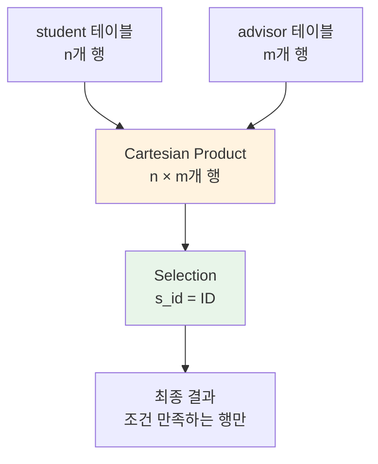
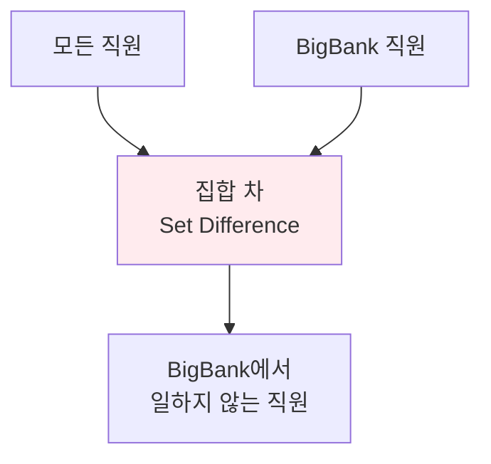
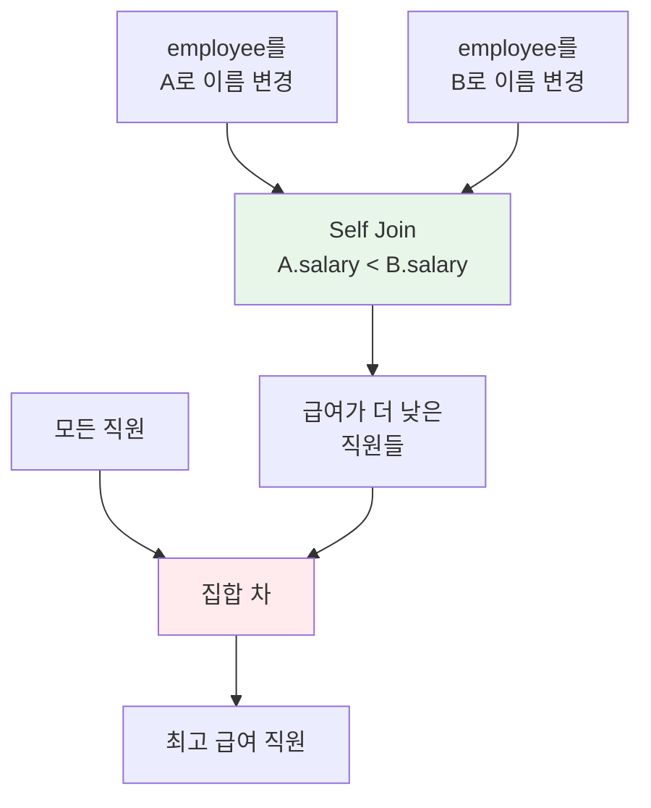
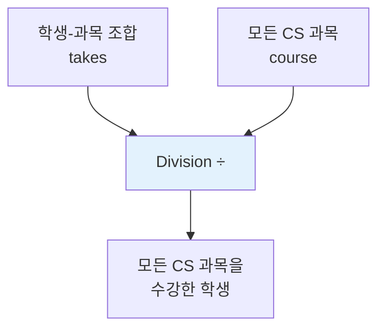
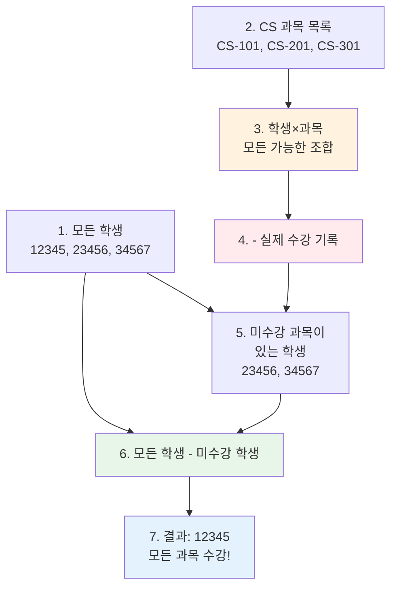

# 관계형 모델 고급 문제 해설 (Part 2)

데이터베이스시스템및응용 강의의 두 번째 장 "Introduction to the Relational Model"에 대한 연습 문제 해설 Part 2입니다. 관계 대수를 사용한 복잡한 쿼리 작성 방법을 학습합니다.

---

## 문제 2.5: Cartesian Product와 Selection

### 📝 문제
`student`와 `advisor`의 Cartesian product를 먼저 수행한 다음, 조건 `s_id = ID`로 selection 연산을 수행한 결과는 무엇입니까?

관계 대수 기호로 표현하면: $\sigma_{s\_id=ID}(student \times advisor)$

### ✅ 답안

결과 속성에는 student의 모든 속성 값과 advisor의 모든 속성이 포함됩니다. 결과의 튜플은 다음과 같습니다:

지도교수가 있는 각 학생에 대해, 결과에는 해당 학생의 속성을 포함하는 행이 있고, 그 뒤에 학생의 ID 속성과 동일한 s_id 속성이 있으며, 그 뒤에 학생의 지도교수 ID를 포함하는 i_id 속성이 있습니다.

지도교수가 없는 학생은 결과에 나타나지 않습니다. 지도교수가 두 명 이상인 학생은 결과에 해당 횟수만큼 나타납니다.

### 💡 해설

#### **Cartesian Product (×) 이해하기**



#### **1️⃣ 단계별 실행 과정**

**Step 1: student 테이블**
```
student:
+-------+----------+-----------+----------+
| ID    | name     | dept_name | tot_cred |
+-------+----------+-----------+----------+
| 12345 | Kim      | Comp. Sci.| 32       |
| 23456 | Lee      | Physics   | 45       |
| 34567 | Park     | Music     | 27       |
| 45678 | Choi     | Comp. Sci.| 80       |
+-------+----------+-----------+----------+
```

**Step 2: advisor 테이블**
```
advisor:
+-------+-------+
| s_id  | i_id  |
+-------+-------+
| 12345 | 10101 |
| 23456 | 22222 |
| 45678 | 10101 |
+-------+-------+
```

**Step 3: Cartesian Product (student × advisor)**

모든 student 행과 모든 advisor 행의 조합:
```
student × advisor (4 × 3 = 12개 행):
+-------+------+-----------+----------+-------+-------+
| ID    | name | dept_name | tot_cred | s_id  | i_id  |
+-------+------+-----------+----------+-------+-------+
| 12345 | Kim  | Comp. Sci.| 32       | 12345 | 10101 | ✓
| 12345 | Kim  | Comp. Sci.| 32       | 23456 | 22222 | ✗
| 12345 | Kim  | Comp. Sci.| 32       | 45678 | 10101 | ✗
| 23456 | Lee  | Physics   | 45       | 12345 | 10101 | ✗
| 23456 | Lee  | Physics   | 45       | 23456 | 22222 | ✓
| 23456 | Lee  | Physics   | 45       | 45678 | 10101 | ✗
| 34567 | Park | Music     | 27       | 12345 | 10101 | ✗
| 34567 | Park | Music     | 27       | 23456 | 22222 | ✗
| 34567 | Park | Music     | 27       | 45678 | 10101 | ✗
| 45678 | Choi | Comp. Sci.| 80       | 12345 | 10101 | ✗
| 45678 | Choi | Comp. Sci.| 80       | 23456 | 22222 | ✗
| 45678 | Choi | Comp. Sci.| 80       | 45678 | 10101 | ✓
+-------+------+-----------+----------+-------+-------+
```

**Step 4: Selection σ_{s_id=ID} (조건: ID = s_id)**

조건을 만족하는 행만 선택:
```
최종 결과 (3개 행):
+-------+------+-----------+----------+-------+-------+
| ID    | name | dept_name | tot_cred | s_id  | i_id  |
+-------+------+-----------+----------+-------+-------+
| 12345 | Kim  | Comp. Sci.| 32       | 12345 | 10101 |
| 23456 | Lee  | Physics   | 45       | 23456 | 22222 |
| 45678 | Choi | Comp. Sci.| 80       | 45678 | 10101 |
+-------+------+-----------+----------+-------+-------+
```

#### **2️⃣ 결과 해석**

**포함되는 학생**:
- ✓ Kim (ID=12345): 지도교수 10101
- ✓ Lee (ID=23456): 지도교수 22222
- ✓ Choi (ID=45678): 지도교수 10101

**포함되지 않는 학생**:
- ✗ Park (ID=34567): advisor 테이블에 없음 (지도교수 없음)

**중복된 s_id 속성**:
- ID와 s_id가 동일한 값을 가짐 (조건이 ID = s_id이므로)
- 이 중복은 Cartesian product의 특성

#### **3️⃣ 이것은 사실상 Natural Join!**

이 연산은 Natural Join과 유사합니다:
```sql
-- 관계 대수
σ_{s_id=ID}(student × advisor)

-- SQL (Natural Join과 유사)
SELECT student.*, advisor.s_id, advisor.i_id
FROM student, advisor
WHERE student.ID = advisor.s_id;

-- 더 명확한 표현 (INNER JOIN)
SELECT s.*, a.s_id, a.i_id
FROM student s
INNER JOIN advisor a ON s.ID = a.s_id;
```

#### **4️⃣ 특수한 경우들**

**지도교수가 없는 학생**:
```
Park (ID=34567)은 결과에 나타나지 않음

이유: advisor 테이블에 s_id=34567인 행이 없음
→ Cartesian product 후 ID=s_id 조건을 만족하는 행이 없음
```

**지도교수가 여러 명인 경우** (가정):
```
만약 advisor 테이블이:
+-------+-------+
| s_id  | i_id  |
+-------+-------+
| 12345 | 10101 |
| 12345 | 22222 | ← Kim의 두 번째 지도교수
| 23456 | 22222 |
+-------+-------+

결과:
+-------+------+-----------+----------+-------+-------+
| ID    | name | dept_name | tot_cred | s_id  | i_id  |
+-------+------+-----------+----------+-------+-------+
| 12345 | Kim  | Comp. Sci.| 32       | 12345 | 10101 |
| 12345 | Kim  | Comp. Sci.| 32       | 12345 | 22222 | ← 중복 출현
| 23456 | Lee  | Physics   | 45       | 23456 | 22222 |
+-------+------+-----------+----------+-------+-------+

Kim이 두 번 나타남!
```

### 🎯 핵심 개념

**Cartesian Product의 특성**:
- 두 관계의 **모든 가능한 조합** 생성
- 결과 행 수 = R의 행 수 × S의 행 수
- 보통 selection과 함께 사용 (조인 구현)

**차이점: Cartesian Product vs Natural Join**:

| 측면 | Cartesian Product + Selection | Natural Join |
|------|------------------------------|--------------|
| **연산** | 모든 조합 후 필터링 | 조건 만족하는 것만 결합 |
| **효율성** | 비효율적 (불필요한 조합 생성) | 효율적 (필요한 것만) |
| **속성 중복** | 있음 (ID와 s_id 모두) | 없음 (공통 속성 하나만) |
| **결과** | 동일 (조건이 같으면) | 동일 |

### 💭 실무 관련성

**SQL에서의 구현**:
```sql
-- 방법 1: Cartesian Product + WHERE (비추천)
SELECT *
FROM student, advisor
WHERE student.ID = advisor.s_id;
-- 모든 조합을 먼저 만들고 필터링 → 비효율적

-- 방법 2: INNER JOIN (권장)
SELECT s.*, a.i_id
FROM student s
INNER JOIN advisor a ON s.ID = a.s_id;
-- 조건 만족하는 것만 결합 → 효율적

-- 방법 3: NATURAL JOIN (가장 간결)
-- (하지만 열 이름이 다르므로 이 경우 사용 불가)
```

**성능 차이**:
```
student: 10,000 rows
advisor: 10,000 rows

Cartesian Product:
- 10,000 × 10,000 = 100,000,000 rows 생성
- 그 중 조건 만족하는 것만 선택
- 💾 메모리: 많이 사용
- ⏱️ 시간: 느림

INNER JOIN:
- 조건 만족하는 ~10,000 rows만 생성
- 💾 메모리: 적게 사용
- ⏱️ 시간: 빠름
```

---

## 문제 2.6~2.8: 관계 대수 표현식 작성

### 📝 문제 2.6

employee 데이터베이스 (Figure 2.17)에서 다음 쿼리를 관계 대수로 표현하시오:

a. Miami에 사는 각 직원의 이름을 찾으시오.
b. 급여가 $100,000보다 많은 각 직원의 이름을 찾으시오.
c. Miami에 살고 급여가 $100,000보다 많은 각 직원의 이름을 찾으시오.

### ✅ 답안 2.6

a. $\Pi_{person\_name}(\sigma_{city="Miami"}(employee))$

b. $\Pi_{person\_name}(\sigma_{salary>100000}(employee \bowtie works))$

c. $\Pi_{person\_name}(\sigma_{city="Miami" \land salary>100000}(employee \bowtie works))$

### 💡 해설 2.6

#### **관계 대수 기본 연산자**

**Selection (σ)**: 조건을 만족하는 행 선택
**Projection (Π)**: 특정 열만 선택
**Join (⋈)**: 두 테이블 결합

#### **a번 문제: Miami에 사는 직원**

```mermaid
graph LR
    A[employee] --> B[σ_{city='Miami'}]
    B --> C[Π_{person_name}]
    C --> D[결과]

    style B fill:#fff3e0
    style C fill:#e3f2fd
```

**단계별 실행**:
```
1. employee 테이블:
+-------+-------------+-----------+--------+
| ID    | person_name | street    | city   |
+-------+-------------+-----------+--------+
| 10001 | Kim         | Main St   | Seoul  |
| 10002 | Lee         | Ocean Dr  | Miami  | ← 선택
| 10003 | Park        | 5th Ave   | NY     |
| 10004 | Choi        | Beach Rd  | Miami  | ← 선택
+-------+-------------+-----------+--------+

2. Selection (city = 'Miami'):
+-------+-------------+-----------+--------+
| ID    | person_name | street    | city   |
+-------+-------------+-----------+--------+
| 10002 | Lee         | Ocean Dr  | Miami  |
| 10004 | Choi        | Beach Rd  | Miami  |
+-------+-------------+-----------+--------+

3. Projection (person_name):
+-------------+
| person_name |
+-------------+
| Lee         |
| Choi        |
+-------------+
```

**SQL 변환**:
```sql
SELECT person_name
FROM employee
WHERE city = 'Miami';
```

#### **b번 문제: 급여 $100,000 이상**

```mermaid
graph LR
    A[employee] --> C[⋈]
    B[works] --> C
    C --> D[σ_{salary>100000}]
    D --> E[Π_{person_name}]
    E --> F[결과]

    style C fill:#e8f5e9
    style D fill:#fff3e0
    style E fill:#e3f2fd
```

**왜 Join이 필요한가?**
- `person_name`은 **employee** 테이블에
- `salary`는 **works** 테이블에
- 두 테이블을 결합해야 함!

**단계별 실행**:
```
1. employee ⋈ works (ID로 조인):
+-------+-------------+-----------+--------+--------------+--------+
| ID    | person_name | street    | city   | company_name | salary |
+-------+-------------+-----------+--------+--------------+--------+
| 10001 | Kim         | Main St   | Seoul  | Samsung      | 95000  |
| 10002 | Lee         | Ocean Dr  | Miami  | Apple        | 120000 | ← 선택
| 10003 | Park        | 5th Ave   | NY     | Google       | 110000 | ← 선택
| 10004 | Choi        | Beach Rd  | Miami  | Tesla        | 85000  |
+-------+-------------+-----------+--------+--------------+--------+

2. Selection (salary > 100000):
+-------+-------------+-----------+--------+--------------+--------+
| ID    | person_name | street    | city   | company_name | salary |
+-------+-------------+-----------+--------+--------------+--------+
| 10002 | Lee         | Ocean Dr  | Miami  | Apple        | 120000 |
| 10003 | Park        | 5th Ave   | NY     | Google       | 110000 |
+-------+-------------+-----------+--------+--------------+--------+

3. Projection (person_name):
+-------------+
| person_name |
+-------------+
| Lee         |
| Park        |
+-------------+
```

**SQL 변환**:
```sql
SELECT e.person_name
FROM employee e
JOIN works w ON e.ID = w.ID
WHERE w.salary > 100000;
```

#### **c번 문제: Miami + 급여 $100,000 이상**

**복합 조건** (AND):
$\sigma_{city="Miami" \land salary>100000}$

**단계별 실행**:
```
1. employee ⋈ works:
(위와 동일)

2. Selection (city = 'Miami' AND salary > 100000):
+-------+-------------+-----------+--------+--------------+--------+
| ID    | person_name | street    | city   | company_name | salary |
+-------+-------------+-----------+--------+--------------+--------+
| 10002 | Lee         | Ocean Dr  | Miami  | Apple        | 120000 |
+-------+-------------+-----------+--------+--------------+--------+

3. Projection (person_name):
+-------------+
| person_name |
+-------------+
| Lee         |
+-------------+
```

**SQL 변환**:
```sql
SELECT e.person_name
FROM employee e
JOIN works w ON e.ID = w.ID
WHERE e.city = 'Miami' AND w.salary > 100000;
```

### 📝 문제 2.7

bank 데이터베이스 (Figure 2.18)에서 다음 쿼리를 관계 대수로 표현하시오:

a. Chicago에 위치한 각 지점의 이름을 찾으시오.
b. Downtown 지점에서 대출을 받은 각 대출자의 ID를 찾으시오.

### ✅ 답안 2.7

a. $\Pi_{branch\_name}(\sigma_{branch\_city="Chicago"}(branch))$

b. $\Pi_{ID}(\sigma_{branch\_name="Downtown"}(borrower \bowtie_{borrower.loan\_number=loan.loan\_number} loan))$

### 💡 해설 2.7

#### **a번 문제**

매우 간단한 single-table 쿼리입니다.

```sql
-- 관계 대수
Π_{branch_name}(σ_{branch_city='Chicago'}(branch))

-- SQL
SELECT branch_name
FROM branch
WHERE branch_city = 'Chicago';
```

#### **b번 문제: 조인 조건 명시**

```mermaid
graph LR
    A[borrower] --> C[⋈_{loan_number}]
    B[loan] --> C
    C --> D[σ_{branch_name='Downtown'}]
    D --> E[Π_{ID}]
    E --> F[결과]

    style C fill:#e8f5e9
    style D fill:#fff3e0
    style E fill:#e3f2fd
```

**왜 명시적 조인 조건이 필요한가?**
- `borrower`와 `loan` 모두 `loan_number` 속성을 가짐
- 하지만 속성 이름이 같다고 자동으로 조인되지 않음
- **명시적으로 조인 조건 지정 필요**: $borrower.loan\_number = loan.loan\_number$

**단계별 실행**:
```
1. borrower:
+-------+-------------+
| ID    | loan_number |
+-------+-------------+
| 10001 | L-001       |
| 10002 | L-002       |
| 10003 | L-003       |
+-------+-------------+

2. loan:
+-------------+-------------+--------+
| loan_number | branch_name | amount |
+-------------+-------------+--------+
| L-001       | Downtown    | 50000  |
| L-002       | Uptown      | 30000  |
| L-003       | Downtown    | 45000  |
+-------------+-------------+--------+

3. borrower ⋈ loan (loan_number로 조인):
+-------+-------------+-------------+--------+
| ID    | loan_number | branch_name | amount |
+-------+-------------+-------------+--------+
| 10001 | L-001       | Downtown    | 50000  | ← 선택
| 10002 | L-002       | Uptown      | 30000  |
| 10003 | L-003       | Downtown    | 45000  | ← 선택
+-------+-------------+-------------+--------+

4. Selection (branch_name = 'Downtown'):
+-------+-------------+-------------+--------+
| ID    | loan_number | branch_name | amount |
+-------+-------------+-------------+--------+
| 10001 | L-001       | Downtown    | 50000  |
| 10003 | L-003       | Downtown    | 45000  |
+-------+-------------+-------------+--------+

5. Projection (ID):
+-------+
| ID    |
+-------+
| 10001 |
| 10003 |
+-------+
```

**SQL 변환**:
```sql
SELECT b.ID
FROM borrower b
JOIN loan l ON b.loan_number = l.loan_number
WHERE l.branch_name = 'Downtown';
```

### 📝 문제 2.8

employee 데이터베이스에서 다음 쿼리를 관계 대수로 표현하시오:

a. BigBank에서 일하지 않는 각 직원의 ID와 이름을 찾으시오.
b. 데이터베이스의 모든 직원만큼 많은 급여를 받는 각 직원의 ID와 이름을 찾으시오.

### ✅ 답안 2.8

a. **Set Difference (집합 차) 사용**:

BigBank에서 일하지 않는 직원 = 모든 직원 - BigBank 직원

```
Π_{ID,person_name}(employee) -
Π_{ID,person_name}(employee ⋈_{employee.ID=works.ID} σ_{company_name='BigBank'}(works))
```

b. **Self-Join과 Set Difference 사용**:

모든 직원보다 급여가 많거나 같음 = 자신보다 급여가 많은 직원이 없음

```
Π_{ID,person_name}(employee) -
Π_{A.ID,A.person_name}(
    ρ_A(employee) ⋈_{A.salary<B.salary} ρ_B(employee)
)
```

### 💡 해설 2.8

#### **a번 문제: 부정 (Negation)**

**논리적 접근**:
```
BigBank에서 일하지 않는 직원
= 모든 직원 - BigBank에서 일하는 직원
```



**단계별 실행**:
```
1. 모든 직원:
+-------+-------------+
| ID    | person_name |
+-------+-------------+
| 10001 | Kim         |
| 10002 | Lee         |
| 10003 | Park        |
| 10004 | Choi        |
+-------+-------------+

2. BigBank 직원 찾기:
works:
+-------+--------------+--------+
| ID    | company_name | salary |
+-------+--------------+--------+
| 10001 | Samsung      | 95000  |
| 10002 | BigBank      | 120000 | ← BigBank
| 10003 | Google       | 110000 |
| 10004 | BigBank      | 105000 | ← BigBank
+-------+--------------+--------+

σ_{company_name='BigBank'}(works):
+-------+--------------+--------+
| ID    | company_name | salary |
+-------+--------------+--------+
| 10002 | BigBank      | 120000 |
| 10004 | BigBank      | 105000 |
+-------+--------------+--------+

employee ⋈ BigBank_works:
+-------+-------------+
| ID    | person_name |
+-------+-------------+
| 10002 | Lee         |
| 10004 | Choi        |
+-------+-------------+

3. 집합 차 (Set Difference):
모든 직원 - BigBank 직원:
+-------+-------------+
| ID    | person_name |
+-------+-------------+
| 10001 | Kim         | ✓
| 10003 | Park        | ✓
+-------+-------------+
```

**SQL 변환**:
```sql
-- 방법 1: NOT IN
SELECT ID, person_name
FROM employee
WHERE ID NOT IN (
    SELECT ID
    FROM works
    WHERE company_name = 'BigBank'
);

-- 방법 2: NOT EXISTS
SELECT e.ID, e.person_name
FROM employee e
WHERE NOT EXISTS (
    SELECT 1
    FROM works w
    WHERE w.ID = e.ID
    AND w.company_name = 'BigBank'
);

-- 방법 3: LEFT JOIN
SELECT e.ID, e.person_name
FROM employee e
LEFT JOIN works w ON e.ID = w.ID AND w.company_name = 'BigBank'
WHERE w.ID IS NULL;
```

#### **b번 문제: 최대값 찾기 (Self-Join)**

**논리적 접근**:
```
모든 직원만큼 급여를 받음
= 자신보다 급여가 많은 직원이 없음
= 최고 급여를 받는 직원들
```

**Renaming (ρ) 사용 이유**:
- 같은 테이블을 두 번 참조해야 함 (자기 자신과 비교)
- A와 B로 이름을 바꿔서 구분



**단계별 실행**:
```
1. employee (급여 정보와 조인 후):
+-------+-------------+--------+
| ID    | person_name | salary |
+-------+-------------+--------+
| 10001 | Kim         | 95000  |
| 10002 | Lee         | 120000 | ← 최고
| 10003 | Park        | 110000 |
| 10004 | Choi        | 85000  |
+-------+-------------+--------+

2. Self-Join (A.salary < B.salary):
"자신보다 급여가 높은 사람이 있는 직원"
+-------+-------------+--------+
| ID    | person_name | salary |
+-------+-------------+--------+
| 10001 | Kim         | 95000  | (Lee, Park보다 낮음)
| 10003 | Park        | 110000 | (Lee보다 낮음)
| 10004 | Choi        | 85000  | (모두보다 낮음)
+-------+-------------+--------+

3. 집합 차:
모든 직원 - 더 낮은 급여 직원:
+-------+-------------+
| ID    | person_name |
+-------+-------------+
| 10002 | Lee         | ← 최고 급여!
+-------+-------------+
```

**SQL 변환**:
```sql
-- 방법 1: Self-Join과 NOT EXISTS
SELECT e1.ID, e1.person_name
FROM employee e1
JOIN works w1 ON e1.ID = w1.ID
WHERE NOT EXISTS (
    SELECT 1
    FROM employee e2
    JOIN works w2 ON e2.ID = w2.ID
    WHERE w2.salary > w1.salary
);

-- 방법 2: MAX 사용 (더 간단!)
SELECT e.ID, e.person_name
FROM employee e
JOIN works w ON e.ID = w.ID
WHERE w.salary = (SELECT MAX(salary) FROM works);

-- 방법 3: ALL 사용
SELECT e.ID, e.person_name
FROM employee e
JOIN works w ON e.ID = w.ID
WHERE w.salary >= ALL (SELECT salary FROM works);
```

**여러 명이 최고 급여인 경우**:
```
+-------+-------------+--------+
| ID    | person_name | salary |
+-------+-------------+--------+
| 10002 | Lee         | 120000 | ← 최고
| 10005 | Jung        | 120000 | ← 최고 (동점)
| 10003 | Park        | 110000 |
+-------+-------------+--------+

결과:
+-------+-------------+
| ID    | person_name |
+-------+-------------+
| 10002 | Lee         |
| 10005 | Jung        |
+-------+-------------+
```

### 🎯 핵심 개념

**Set Operations (집합 연산)**:
- **Union (∪)**: 합집합
- **Intersection (∩)**: 교집합
- **Difference (-)**: 차집합

**Renaming (ρ)**:
- Self-Join 시 필수
- 같은 테이블을 여러 번 참조할 때

**부정 표현 방법**:
1. Set Difference: `모든 것 - 조건 만족하는 것`
2. NOT EXISTS: SQL에서 더 직관적
3. LEFT JOIN + IS NULL: 때로 더 효율적

### 💭 실무 관련성

**성능 고려사항**:
```sql
-- ❌ 느린 방법: NOT IN (NULL 처리 문제)
SELECT * FROM employee
WHERE ID NOT IN (SELECT ID FROM works WHERE company = 'BigBank');

-- ✓ 빠른 방법: NOT EXISTS (조기 종료)
SELECT * FROM employee e
WHERE NOT EXISTS (
    SELECT 1 FROM works w
    WHERE w.ID = e.ID AND w.company = 'BigBank'
);

-- ✓ 빠른 방법: LEFT JOIN (인덱스 활용)
SELECT e.*
FROM employee e
LEFT JOIN works w ON e.ID = w.ID AND w.company = 'BigBank'
WHERE w.ID IS NULL;
```

---

## 문제 2.9: Division 연산

### 📝 문제

관계 대수의 division 연산자 (÷)가 다음과 같이 정의됩니다:

$r(R)$과 $s(S)$가 관계이고, $S \subseteq R$일 때, $r \div s$는 스키마 $R - S$의 관계입니다.

튜플 $t$가 $r \div s$에 속하려면 다음 두 조건을 만족해야 합니다:
1. $t$는 $\Pi_{R-S}(r)$에 있어야 함
2. $s$의 모든 튜플 $t_s$에 대해, $r$에 다음을 만족하는 튜플 $t_r$이 존재:
   - $t_r[S] = t_s[S]$
   - $t_r[R-S] = t$

주어진 정의로:

a. Division 연산자를 사용하여, 모든 Comp. Sci. 과목을 수강한 학생들의 ID를 찾는 관계 대수 표현식을 작성하시오.

b. Division을 사용하지 않고 위의 쿼리를 관계 대수로 작성하시오.

### ✅ 답안

a. **Division 사용**:

```
Π_{ID,course_id}(takes) ÷ Π_{course_id}(σ_{dept_name='Comp. Sci.'}(course))
```

b. **Division 없이 (기본 연산자만 사용)**:

```
r ← Π_{ID,course_id}(takes)
s ← Π_{course_id}(σ_{dept_name='Comp. Sci.'}(course))

Π_{ID}(takes) - Π_{ID}((Π_{ID}(takes) × s) - r)
```

일반 공식:
```
r ÷ s = Π_{R-S}(r) - Π_{R-S}((Π_{R-S}(r) × s) - Π_{R-S,S}(r))
```

### 💡 해설

#### **Division 연산자 이해하기**

**Division (÷)의 의미**:
"모든 ~을 만족하는" 쿼리에 사용



#### **1️⃣ Division 예시**

**데이터**:
```
takes (학생들이 수강한 과목):
+-------+-----------+
| ID    | course_id |
+-------+-----------+
| 12345 | CS-101    |
| 12345 | CS-201    |
| 12345 | CS-301    |
| 23456 | CS-101    |
| 23456 | CS-201    |
| 23456 | MA-101    |
| 34567 | CS-101    |
+-------+-----------+

course (CS 과목 목록):
+-----------+
| course_id |
+-----------+
| CS-101    |
| CS-201    |
| CS-301    |
+-----------+
```

**질문**: "모든 CS 과목을 수강한 학생은?"

**Division 결과**:
```
Π_{ID,course_id}(takes) ÷ Π_{course_id}(CS_courses)

= 학생들 중에서 CS-101, CS-201, CS-301을 모두 수강한 학생

결과:
+-------+
| ID    |
+-------+
| 12345 | ← CS-101, CS-201, CS-301 모두 수강
+-------+

23456은 제외: CS-301을 수강하지 않음
34567은 제외: CS-201, CS-301을 수강하지 않음
```

#### **2️⃣ Division을 기본 연산자로 표현**

**핵심 아이디어**:
```
모든 CS 과목을 수강한 학생
= 전체 학생 - (어떤 CS 과목을 수강하지 않은 학생)
```

**단계별 분해**:

**Step 1: 모든 학생 찾기**
```
Π_{ID}(takes)

+-------+
| ID    |
+-------+
| 12345 |
| 23456 |
| 34567 |
+-------+
```

**Step 2: 학생 × CS 과목 (모든 조합)**
```
Π_{ID}(takes) × Π_{course_id}(CS_courses)

+-------+-----------+
| ID    | course_id |
+-------+-----------+
| 12345 | CS-101    |
| 12345 | CS-201    |
| 12345 | CS-301    |
| 23456 | CS-101    |
| 23456 | CS-201    |
| 23456 | CS-301    |
| 34567 | CS-101    |
| 34567 | CS-201    |
| 34567 | CS-301    |
+-------+-----------+

"각 학생이 모든 CS 과목을 수강했어야 하는 조합"
```

**Step 3: 실제 수강하지 않은 조합 찾기**
```
(학생 × CS 과목) - (실제 수강 기록)

+-------+-----------+
| ID    | course_id |
+-------+-----------+
| 23456 | CS-301    | ← 23456은 CS-301 미수강
| 34567 | CS-201    | ← 34567은 CS-201 미수강
| 34567 | CS-301    | ← 34567은 CS-301 미수강
+-------+-----------+

"빠진 조합" = "수강하지 않은 과목"
```

**Step 4: 미수강 과목이 있는 학생**
```
Π_{ID}(빠진 조합)

+-------+
| ID    |
+-------+
| 23456 | ← 어떤 과목을 안 들음
| 34567 | ← 어떤 과목을 안 들음
+-------+
```

**Step 5: 최종 결과 (모든 학생 - 미수강 학생)**
```
Π_{ID}(takes) - Π_{ID}(빠진 조합)

+-------+
| ID    |
+-------+
| 12345 | ← 모든 CS 과목 수강!
+-------+
```

#### **3️⃣ 시각화**



#### **4️⃣ SQL 구현**

**Division의 SQL 표현**:

```sql
-- 방법 1: NOT EXISTS (이중 부정)
SELECT DISTINCT t1.ID
FROM takes t1
WHERE NOT EXISTS (
    -- CS 과목 중에서
    SELECT course_id
    FROM course
    WHERE dept_name = 'Comp. Sci.'

    AND NOT EXISTS (
        -- 이 학생이 수강하지 않은 과목이 없음
        SELECT *
        FROM takes t2
        WHERE t2.ID = t1.ID
        AND t2.course_id = course.course_id
    )
);

-- 방법 2: HAVING COUNT (더 직관적)
SELECT t.ID
FROM takes t
JOIN course c ON t.course_id = c.course_id
WHERE c.dept_name = 'Comp. Sci.'
GROUP BY t.ID
HAVING COUNT(DISTINCT t.course_id) = (
    SELECT COUNT(*)
    FROM course
    WHERE dept_name = 'Comp. Sci.'
);

-- 방법 3: EXCEPT (집합 차)
SELECT ID
FROM (
    -- 모든 학생
    SELECT DISTINCT ID FROM takes

    EXCEPT

    -- 미수강 학생
    SELECT DISTINCT t.ID
    FROM (
        SELECT DISTINCT takes.ID, course.course_id
        FROM takes, course
        WHERE course.dept_name = 'Comp. Sci.'

        EXCEPT

        SELECT ID, course_id
        FROM takes
    ) t
);
```

### 🎯 핵심 개념

**Division의 특징**:
- **용도**: "모든 ~" 쿼리 표현
- **복잡도**: 다른 연산자로 표현 시 복잡함
- **대안**: SQL의 NOT EXISTS나 HAVING COUNT가 더 직관적

**쿼리 유형**:
```
✓ "모든 CS 과목을 수강한 학생"
✓ "모든 부품을 공급하는 공급업체"
✓ "모든 요구사항을 충족하는 제품"
```

### 💭 실무 관련성

**현실 시나리오**:

```sql
-- 1. "모든 필수 과목을 이수한 학생"
-- (졸업 요건 체크)
SELECT student_id
FROM enrollment
WHERE course_id IN (SELECT course_id FROM required_courses)
GROUP BY student_id
HAVING COUNT(DISTINCT course_id) = (
    SELECT COUNT(*) FROM required_courses
);

-- 2. "모든 지역에 지점이 있는 은행"
SELECT bank_name
FROM branches
GROUP BY bank_name
HAVING COUNT(DISTINCT region_id) = (
    SELECT COUNT(*) FROM regions
);

-- 3. "모든 기능을 지원하는 제품"
SELECT product_id
FROM product_features
WHERE feature_id IN (SELECT feature_id FROM required_features)
GROUP BY product_id
HAVING COUNT(DISTINCT feature_id) = (
    SELECT COUNT(*) FROM required_features
);
```

**성능 고려사항**:
```
Division은 복잡한 연산:
- Cartesian Product 사용
- 여러 번의 Projection
- 집합 차 연산

최적화:
✓ 인덱스: course_id, student_id
✓ 먼저 필터링: 불필요한 데이터 제거
✓ HAVING COUNT: 대부분의 DBMS에서 최적화됨
```

---

## 정리 및 핵심 요약

### 📚 배운 핵심 개념

1. **Cartesian Product와 Selection**
   - 모든 조합 생성 후 필터링
   - Natural Join의 기초
   - 비효율적이지만 이론적으로 중요

2. **관계 대수 표현식**
   - Selection (σ): 행 필터링
   - Projection (Π): 열 선택
   - Join (⋈): 테이블 결합
   - Set Operations (-, ∪, ∩): 집합 연산

3. **부정 표현**
   - Set Difference: 전체 - 조건
   - NOT EXISTS: SQL에서 더 직관적
   - Self-Join: 비교 연산에 활용

4. **Division 연산**
   - "모든 ~" 쿼리 표현
   - 복잡한 이중 부정 로직
   - SQL의 HAVING COUNT가 더 실용적

### 💡 실무 적용 팁

1. **관계 대수 → SQL 변환**
   - 단계적으로 변환
   - 서브쿼리 활용
   - DBMS 최적화 신뢰

2. **쿼리 최적화**
   - NOT IN보다 NOT EXISTS 선호
   - 조기 필터링 (WHERE 먼저)
   - 적절한 인덱스 사용

3. **복잡한 쿼리 작성**
   - 관계 대수로 먼저 설계
   - 단계별로 검증
   - 성능 측정 필수

---

## 📖 참고 자료
- Database System Concepts (Silberschatz, Korth, Sudarshan)
- 한양대학교 데이터베이스시스템및응용 강의자료

> 💡 **학습 팁**: 관계 대수는 SQL의 이론적 기초입니다. 복잡한 쿼리를 작성할 때는 먼저 관계 대수로 논리를 정리한 후 SQL로 변환하면 더 명확하고 정확한 쿼리를 작성할 수 있습니다. 특히 "모든 ~"이나 "~하지 않는" 같은 부정 쿼리는 단계별로 분해해서 생각하는 것이 중요합니다!
