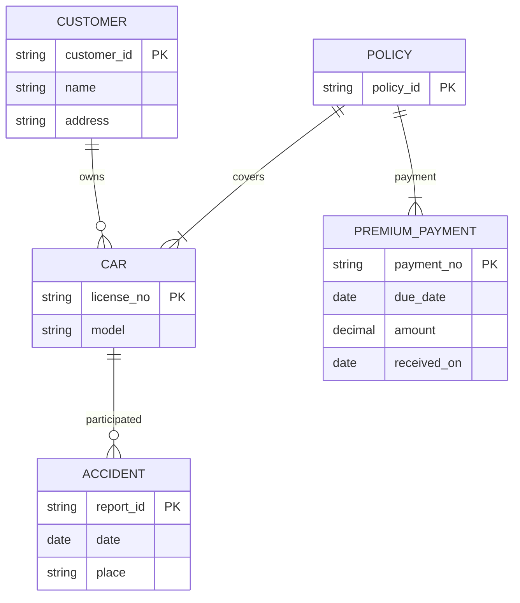
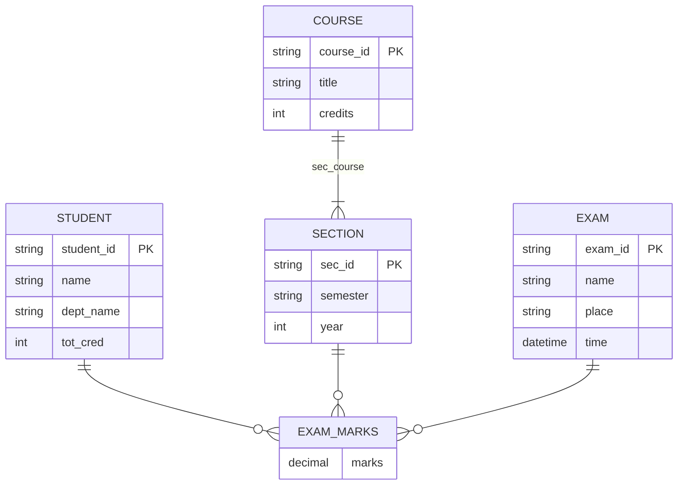
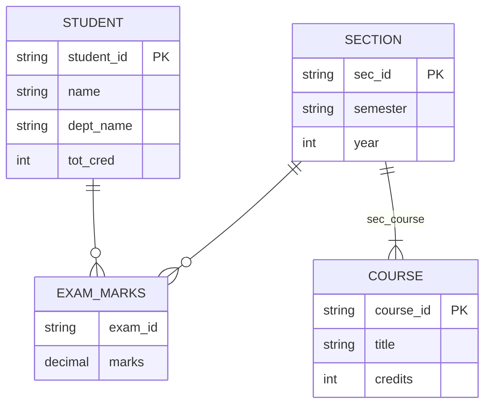
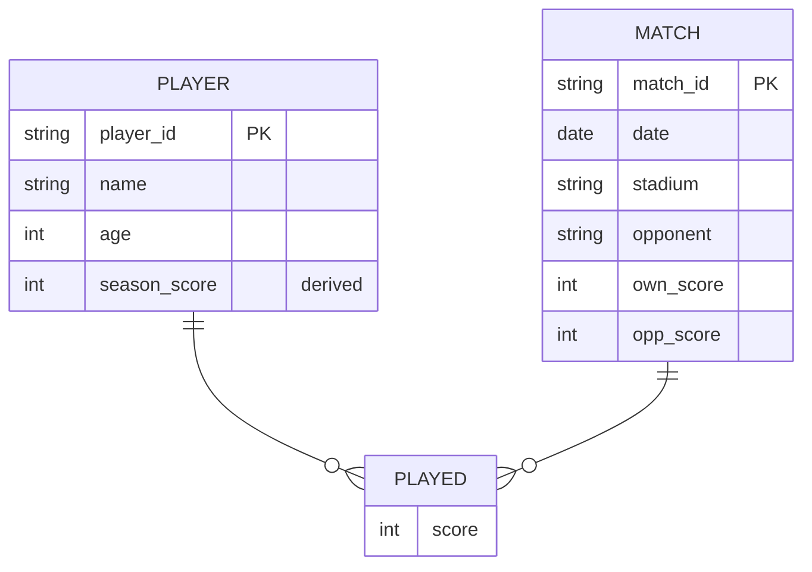
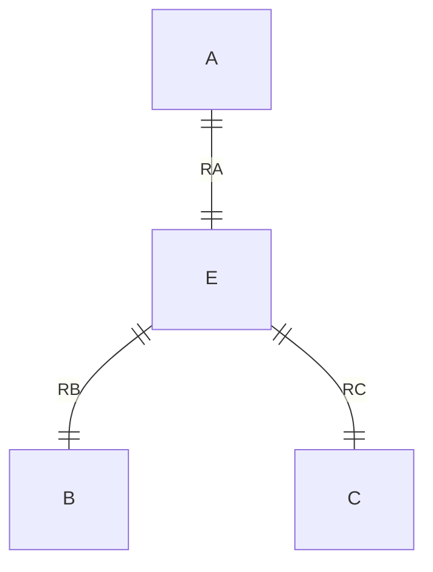

이번 포스트에서는 E-R(Entity-Relationship) 모델을 사용한 데이터베이스 설계 문제들을 다룹니다. 실제 도메인을 E-R 다이어그램으로 모델링하고, 관계형 스키마로 변환하는 과정을 학습합니다.

## 📚 E-R 모델링 기초 개념

### 핵심 구성 요소
1. **개체 집합(Entity Set)**: 사각형으로 표현
2. **관계 집합(Relationship Set)**: 마름모로 표현
3. **속성(Attributes)**: 타원으로 표현
4. **약한 개체(Weak Entity)**: 이중 사각형
5. **식별 관계(Identifying Relationship)**: 이중 마름모

### 제약조건
- **카디널리티(Cardinality)**: 1:1, 1:N, M:N
- **참여 제약(Participation)**: 전체(Total), 부분(Partial)
- **기본키(Primary Key)**: 밑줄
- **복합 속성(Composite Attribute)**: 중첩된 타원
- **다치 속성(Multivalued Attribute)**: 이중 타원
- **유도 속성(Derived Attribute)**: 점선 타원

---

## 문제 6.1 - 자동차 보험 회사 E-R 다이어그램

**문제**: 자동차 보험 회사를 위한 E-R 다이어그램을 작성하시오.

**요구사항**:
- 고객(customer)은 하나 이상의 자동차를 소유
- 각 자동차는 0개 이상의 사고 기록
- 각 보험 정책(policy)은 하나 이상의 자동차를 보장
- 각 정책은 하나 이상의 보험료 납부(premium payment) 기록
- 각 납부는 특정 기간에 대한 것이며, 납부 기한과 실제 납부일을 가짐

**E-R 다이어그램 설계**:



**핵심 설계 결정**:

1. **약한 개체 - premium_payment**:
   - 보험료 납부는 특정 정책에 종속
   - policy_id 없이는 존재 불가
   - payment 관계를 통해 policy와 연결

2. **participated 관계의 부분 참여**:
   - accident의 participated 관계는 total이 아님
   - 이유: 사고 보고서에서 차량이 미확인일 수 있음
   - 차량 정보 없이도 사고 기록 가능

3. **카디널리티**:
   - customer-owns-car: 1:N (한 고객이 여러 차량)
   - car-participated-accident: 1:N (한 차량이 여러 사고)
   - policy-covers-car: M:N (한 정책이 여러 차량, 한 차량이 여러 정책)
   - policy-payment-premium_payment: 1:N (한 정책에 여러 납부)

**관계형 스키마 변환**:
```sql
customer(customer_id, name, address)
car(license_no, model)
accident(report_id, date, place)
owns(customer_id, license_no)
    -- FK: customer_id → customer, license_no → car
participated(report_id, license_no, damage_amount)
    -- FK: report_id → accident, license_no → car
policy(policy_id)
covers(policy_id, license_no)
    -- FK: policy_id → policy, license_no → car
premium_payment(policy_id, payment_no, due_date, amount, received_on)
    -- PK: (policy_id, payment_no)
    -- FK: policy_id → policy
```

---

## 문제 6.2 - 시험 성적 데이터베이스 설계

**문제**: student, course, section 개체와 시험 성적을 기록하는 데이터베이스 설계

### 6.2.a - 3항 관계를 사용한 설계

**E-R 다이어그램**:



**핵심 개념**:
- **3항 관계(Ternary Relationship)**: student-section-exam
- marks는 관계의 속성
- exam을 강한 개체로 모델링
- 시험 정보(이름, 장소, 시간)를 독립적으로 저장

**대안**: exam을 section의 약한 개체로 모델링
- exam이 section에 종속
- marks는 student-exam 이항 관계

### 6.2.b - 이항 관계만 사용한 설계

**E-R 다이어그램**:



**핵심 개념**:
- **복합 다치 속성**: {exam_marks}
- 각 exam_marks는 (exam_id, marks) 쌍
- student-section 쌍당 하나의 관계만 존재
- 다중 시험 성적을 다치 속성으로 표현

**주의사항**:
- 시험 정보(이름, 장소, 시간)를 관계 속성으로 넣으면 중복
- 학생마다 시험 정보가 반복 저장됨
- 학생 없이 시험 정보만 저장 불가

**관계형 스키마 변환**:
```sql
-- 방법 1: 3항 관계
exam_marks(student_id, sec_id, semester, year, exam_id, marks)
    -- FK: student_id → student
    -- FK: (sec_id, semester, year) → section
    -- FK: exam_id → exam

-- 방법 2: 다치 속성
exam_marks(student_id, sec_id, semester, year, exam_id, marks)
    -- PK: (student_id, sec_id, semester, year, exam_id)
    -- FK: student_id → student
    -- FK: (sec_id, semester, year) → section
```

---

## 문제 6.3 - 스포츠 팀 통계 데이터베이스

**문제**: 좋아하는 스포츠 팀의 득점 통계를 추적하는 E-R 다이어그램

**요구사항**:
- 경기 정보 저장
- 각 경기의 점수
- 각 경기의 선수
- 각 경기의 개별 선수 득점 통계
- 요약 통계는 유도 속성으로

**E-R 다이어그램**:



**핵심 설계**:

1. **played 관계**:
   - player와 match 연결
   - score: 해당 경기에서의 선수 득점

2. **유도 속성 - season_score()**:
   - 계산 방법: 선수가 played 관계를 통해 얻은 모든 score의 합
   - SQL 표현:
   ```sql
   SELECT player_id, SUM(score) AS season_score
   FROM played
   GROUP BY player_id;
   ```

3. **match 속성**:
   - own_score: 우리 팀 총 득점
   - opp_score: 상대 팀 득점
   - stadium, opponent: 경기 정보

**관계형 스키마**:
```sql
player(player_id, name, age)
match(match_id, date, stadium, opponent, own_score, opp_score)
played(player_id, match_id, score)
    -- PK: (player_id, match_id)
    -- FK: player_id → player, match_id → match

-- 유도 속성 조회
CREATE VIEW player_stats AS
SELECT p.player_id, p.name, p.age,
       COALESCE(SUM(pl.score), 0) AS season_score
FROM player p
LEFT JOIN played pl ON p.player_id = pl.player_id
GROUP BY p.player_id, p.name, p.age;
```

---

## 문제 6.4 - 개체 집합 중복 표현의 문제점

**문제**: E-R 다이어그램에서 같은 개체 집합이 여러 번 나타나고 속성이 반복되는 것이 왜 나쁜 관행인가?

**답변**:

### 중복이 발생하는 이유
- 다이어그램이 여러 페이지에 걸쳐 있을 때
- 복잡한 관계를 표현하기 위해

### 문제점

1. **불일치 위험**:
   - 같은 개체의 다른 출현이 다른 속성 집합을 가질 수 있음
   - 어느 것이 정확한지 불명확

2. **유지보수 어려움**:
   - 속성 추가/삭제 시 모든 출현을 수정해야 함
   - 일부만 수정하면 불일치 발생

3. **혼란 유발**:
   - 다이어그램 이해가 어려움
   - 속성 정의의 유일한 위치가 없음

### 올바른 관행

**권장 방법**:
- 개체 집합의 속성은 **한 곳에서만** 정의
- 다른 출현에서는 속성 생략
- 빈 개체 집합으로 표시하여 다른 곳에 정의되었음을 표시

**예시**:
```
[첫 번째 페이지]
┌─────────────┐
│   student   │
├─────────────┤
│ student_id  │
│ name        │
│ dept_name   │
│ tot_cred    │
└─────────────┘

[두 번째 페이지 - 속성 없음]
┌─────────────┐
│   student   │
│   (빈 박스)  │
└─────────────┘
```

**이점**:
- 속성 정의의 일관성
- 유지보수 용이
- 명확한 참조 지점

---

## 문제 6.5 - E-R 다이어그램의 그래프 구조

**문제**: E-R 다이어그램을 그래프로 볼 때, 다음의 의미는?

### 6.5.a - 비연결 그래프(Disconnected Graph)

**의미**:
- 개체 집합 쌍이 경로로 연결되지 않음
- 두 개체 집합이 서로 관련 없음

**엔터프라이즈 해석**:
- 완전히 독립적인 두 부분으로 구성
- 별도의 데이터베이스로 분리 가능

**예시**:
```
[부분 1: 대학교]              [부분 2: 병원]
student --- takes --- course   patient --- visits --- doctor
  |                               |
advisor                         treatment
  |                               |
instructor                      medicine
```

**실무 적용**:
- 연결된 컴포넌트별로 분리
- 각각 독립적인 데이터베이스
- 서로 다른 팀이 관리 가능

### 6.5.b - 순환 그래프(Graph with Cycle)

**의미**:
- 순환 상의 모든 개체 쌍이 최소 2가지 방식으로 연결
- 순환이 없으면 유일한 경로 존재

**예시 - 순환 있음**:
```
    student
      / \
   takes advisor
     |     |
   course instructor
      \   /
     teaches
```

**관계 해석**:
- student → course: takes 관계 (직접)
- student → course: student-advisor-instructor-teaches-course (간접)
- 두 가지 경로로 학생과 과목 연결

**순환 없음 (트리 구조)**:
```
department
    |
 instructor
    |
  teaches
    |
  section
```
- 각 개체 쌍 사이에 유일한 경로
- 계층적 구조 명확

**실무 의미**:
- 순환: 복잡한 관계, 다양한 접근 경로
- 비순환: 단순한 계층 구조, 명확한 관계

---

## 문제 6.6 - 3항 관계의 이항 관계 표현

### 6.6.a - 문제 있는 인스턴스

**원래 3항 관계 R(A, B, C)**를 다음과 같이 변환:
```
A --RA-- E --RB-- B
         |
        RC
         |
         C
```

**문제 인스턴스**:
```
E = {e1, e2}
A = {a1, a2}
B = {b1}
C = {c1}
RA = {(e1, a1), (e2, a2)}
RB = {(e1, b1)}
RC = {(e1, c1)}
```

**문제점**:
- e2는 A와만 관련 (RA를 통해 a2와 연결)
- e2는 B, C와 연결 안 됨
- 원래 R에서는 e2가 존재할 수 없음 (B, C와의 관계 필수)

**결론**: 이항 관계 표현이 3항 관계의 제약조건을 보존하지 못함

### 6.6.b - 제약조건 추가

**해결책**: E와 RA, RB, RC 사이에 전체 참여 제약 추가



**제약조건**:
- E의 모든 튜플이 RA와 관계 (전체 참여)
- E의 모든 튜플이 RB와 관계 (전체 참여)
- E의 모든 튜플이 RC와 관계 (전체 참여)

**효과**:
- E의 모든 인스턴스가 A, B, C 모두와 연결
- 3항 관계의 의미 보존

### 6.6.c - 전체 참여 제약조건 처리

**원래 R에서 A가 전체 참여**:
- A와 RA 사이에 전체 참여 추가
- A의 모든 튜플이 RA와 관계 필수

**원래 R에서 B가 전체 참여**:
- B와 RB 사이에 전체 참여 추가

**원래 R에서 C가 전체 참여**:
- C와 RC 사이에 전체 참여 추가

**주의사항**:
- 각 개체의 전체 참여를 독립적으로 표현
- 3항 관계의 제약조건을 이항 관계들의 조합으로 표현

---

## 문제 6.7 - 약한 개체를 강한 개체로 변환

**문제**: 약한 개체에 식별 개체의 기본키 속성을 추가하면 어떤 중복이 발생하는가?

**답변**:

### 약한 개체의 특성
- 식별 개체 없이 존재 불가
- 식별 관계를 통해 기본키 유추 가능

**예시 - premium_payment (약한 개체)**:
```
policy (식별 개체)
  |
payment (식별 관계)
  |
premium_payment (약한 개체)
  - payment_no (부분 키)
  - due_date
  - amount
```

**기본키**: (policy_id, payment_no)
- policy_id: payment 관계에서 유추
- payment_no: 부분 키

### 강한 개체로 변환 시

**변환 후**:
```sql
-- 약한 개체를 강한 개체로
premium_payment(policy_id, payment_no, due_date, amount)
    -- policy_id가 개체의 속성으로 추가됨

-- payment 관계도 유지
payment(policy_id, payment_no)
```

**중복 발생**:
1. policy_id가 두 곳에 존재:
   - premium_payment 개체 자체
   - payment 관계

2. **문제점**:
   - 데이터 불일치 위험
   - 두 policy_id가 항상 같아야 함
   - 업데이트 이상(Update Anomaly)

3. **저장 공간 낭비**:
   - 같은 정보를 두 번 저장

**결론**: 약한 개체로 유지하는 것이 중복 최소화에 유리

---

## 문제 6.8 - 다대일 관계의 카디널리티 제약 강제

**문제**: sec_course (section → course, many-to-one) 관계에서 기본키와 외래키 제약조건이 다대일 카디널리티를 강제하는가?

**답변**:

### 스키마 구조
```sql
section(course_id, sec_id, semester, year)
    -- PK: (course_id, sec_id, semester, year)
course(course_id, title, dept_name, credits)
    -- PK: course_id
sec_course(course_id, sec_id, semester, year, course_id)
    -- PK: (course_id, sec_id, semester, year)
    -- FK: course_id → course
```

### 카디널리티 강제 분석

**다대일 보장**:
- section의 기본키가 sec_course의 기본키
- 특정 section은 sec_course에 **최대 한 번** 나타남
- 따라서 한 section은 한 course에만 대응
- ✅ **Many-to-One 강제됨**

**예시**:
```
section: (CS-101, 1, Fall, 2023)
sec_course에서:
- (CS-101, 1, Fall, 2023, CS-101) ✅ 가능
- (CS-101, 1, Fall, 2023, CS-102) ✅ 기술적으로 가능하지만...
  → 같은 section이 두 course에 매핑? 불가능!
  → PK 제약으로 한 튜플만 허용
```

### 강제할 수 없는 제약

**전체 참여(Total Participation)**:
- course나 section이 sec_course에 참여하지 않을 수 있음
- 기본키/외래키로는 강제 불가

**강제 방법**:
```sql
-- NOT NULL 제약으로는 불가능
-- CHECK 제약 또는 트리거 필요
ALTER TABLE course ADD CONSTRAINT course_participation
CHECK (course_id IN (SELECT DISTINCT course_id FROM sec_course));
```

---

## 문제 6.9 - 일대일 관계의 제약조건

**문제**: advisor 관계가 one-to-one이라면, 일대일 카디널리티를 강제하기 위해 advisor 릴레이션에 어떤 추가 제약이 필요한가?

**답변**:

### 기본 설정
```sql
advisor(s_ID, i_ID)
    -- PK: s_ID
    -- FK: s_ID → student, i_ID → instructor
```

**현재 보장**:
- s_ID가 기본키 → 한 학생은 한 교수만 (일대일의 한 방향)
- 하지만 한 교수가 여러 학생을 지도할 수 있음

### 일대일 강제

**추가 제약**:
```sql
ALTER TABLE advisor ADD UNIQUE(i_ID);
```

**효과**:
- i_ID도 슈퍼키가 됨
- 한 교수도 최대 한 학생만 지도
- ✅ **One-to-One 완전히 강제**

**검증**:
```sql
-- 삽입 가능
INSERT INTO advisor VALUES (1, 101);  -- 학생1 → 교수101
INSERT INTO advisor VALUES (2, 102);  -- 학생2 → 교수102

-- 삽입 불가 (UNIQUE 위반)
INSERT INTO advisor VALUES (3, 101);  -- 교수101은 이미 학생1 지도 중
```

---

## 문제 6.10 - 다대일 관계 결합 시 전체 참여 강제

**문제**: 다대일 관계 R(A → B)이 A와 결합될 때, A의 전체 참여를 NOT NULL로 강제하는 방법

**답변**:

### 결합된 스키마
```sql
-- R을 A에 결합
A_with_R(a_id, a_name, ..., b_id)
    -- PK: a_id
    -- FK: b_id → B
```

### 전체 참여 강제

**NOT NULL 제약**:
```sql
ALTER TABLE A_with_R MODIFY b_id NOT NULL;
```

**효과**:
- A의 모든 튜플이 B와 관계를 가져야 함
- b_id가 NULL이면 삽입/수정 거부
- ✅ **전체 참여 강제**

**작동 원리**:

```sql
-- 참여하지 않는 A의 튜플 삽입 시도
INSERT INTO A_with_R (a_id, a_name, b_id)
VALUES (1, 'Alice', NULL);  -- ❌ 오류: b_id cannot be NULL

-- 올바른 삽입
INSERT INTO A_with_R (a_id, a_name, b_id)
VALUES (1, 'Alice', 101);  -- ✅ 성공
```

**예시 - student와 advisor**:
```sql
-- student와 advisor 결합
student(ID, name, dept_name, tot_cred, advisor_id)
    -- advisor_id NOT NULL → 모든 학생이 지도교수 필수
```

---

## 문제 6.11 - 다대다 관계의 전체 참여 제약

### 6.11.a - 기본키/외래키로 강제할 수 없는 이유

**문제**: 다대다(M:N) 관계나 일대다(1:N)의 "일" 쪽에서 전체 참여를 기본키/외래키만으로 강제할 수 없는 이유

**답변**:

**M:N 관계 예시**:
```sql
student(ID, name)
course(course_id, title)
takes(ID, course_id)
    -- PK: (ID, course_id)
    -- FK: ID → student, course_id → course
```

**문제점**:
- course의 전체 참여를 강제하려면?
- "모든 course가 takes에 나타나야 함"
- takes의 course_id는 unique하지 않음 (여러 학생이 같은 과목 수강)
- **SQL 외래키는 unique한 속성만 참조 가능**
- ❌ 불가능!

**1:N의 "1" 쪽 예시**:
```sql
department(dept_name, building)
instructor(ID, name, dept_name)
    -- FK: dept_name → department
```

**문제점**:
- department의 전체 참여 강제하려면?
- "모든 dept_name이 instructor에 나타나야 함"
- instructor의 dept_name은 unique하지 않음
- ❌ 불가능!

### 6.11.b - CHECK 제약이나 ASSERTION 사용

**답변**:

**M:N 관계 - CHECK 제약**:
```sql
-- "일" 쪽 개체 B에 제약 추가
ALTER TABLE B ADD CONSTRAINT total_part
CHECK (b IN (SELECT b FROM A));

-- Deferred 설정 필수
SET CONSTRAINTS total_part DEFERRED;
```

**예시 - takes 관계**:
```sql
-- 모든 course가 takes에 나타나야 함
ALTER TABLE course ADD CONSTRAINT course_participation
CHECK (course_id IN (SELECT DISTINCT course_id FROM takes));

SET CONSTRAINTS course_participation DEFERRED;
```

**Deferred 필요한 이유**:
1. course 먼저 삽입 → takes에 아직 없음 → 제약 위반
2. takes 먼저 삽입 → course 없음 → 외래키 위반

**해결**: 트랜잭션 끝에만 검사
```sql
BEGIN TRANSACTION;
    INSERT INTO course VALUES ('CS-101', 'Database Systems');
    INSERT INTO takes VALUES (12345, 'CS-101');
COMMIT;  -- 여기서 제약 검사
```

**ASSERTION 사용** (표준 SQL, 대부분 DBMS 미지원):
```sql
CREATE ASSERTION course_participation
CHECK (NOT EXISTS (
    SELECT * FROM course c
    WHERE c.course_id NOT IN (SELECT course_id FROM takes)
));
```

**실무 대안**:
- 트리거(Trigger) 사용
- 애플리케이션 레벨에서 검증
- 주기적인 무결성 검사 스크립트

---

## 💡 핵심 정리

### E-R 모델링 원칙

1. **개체 vs 속성 선택**:
   - 독립적 존재 → 개체
   - 개체를 설명 → 속성

2. **개체 vs 관계 선택**:
   - 명사 → 개체
   - 동사 → 관계

3. **이항 vs 다항 관계**:
   - 가능하면 이항 관계로
   - 불가피한 경우만 3항 이상

4. **강한 개체 vs 약한 개체**:
   - 독립적 존재 가능 → 강한 개체
   - 식별 개체 필요 → 약한 개체

### 제약조건 표현

**카디널리티**:
- 1:1 → 양쪽 외래키를 unique로
- 1:N → "N" 쪽이 외래키 보유
- M:N → 별도 관계 릴레이션

**참여 제약**:
- 전체 참여 → NOT NULL (결합 시)
- 전체 참여 → CHECK (분리 시)
- 부분 참여 → 제약 없음

### 관계형 스키마 변환

**강한 개체**:
```sql
entity(pk, attr1, attr2, ...)
```

**약한 개체**:
```sql
weak_entity(owner_pk, partial_key, attr1, ...)
    -- PK: (owner_pk, partial_key)
    -- FK: owner_pk → owner
```

**이항 관계**:
- 1:1 → 한쪽에 외래키 추가
- 1:N → "N" 쪽에 외래키 추가
- M:N → 별도 릴레이션

**다항 관계**:
```sql
relationship(entity1_pk, entity2_pk, entity3_pk, attrs)
    -- PK: 카디널리티에 따라
```

### 실무 팁

1. **정규화 고려**:
   - E-R 모델링 시 중복 최소화
   - 관계형 변환 후 정규화 검토

2. **성능 vs 정규화**:
   - 조회 성능을 위한 비정규화도 고려
   - 중복 허용 시 무결성 유지 방안 필수

3. **제약조건 강제**:
   - DBMS 기능 최대 활용
   - 트리거로 복잡한 제약 구현
   - 애플리케이션 레벨 검증 병행

4. **문서화**:
   - E-R 다이어그램 유지보수
   - 설계 결정 이유 기록
   - 제약조건 명시

---

이 문제들은 실제 데이터베이스 설계의 기초가 됩니다. E-R 모델링을 통해 요구사항을 명확히 이해하고, 올바른 관계형 스키마로 변환하는 능력이 중요합니다!
