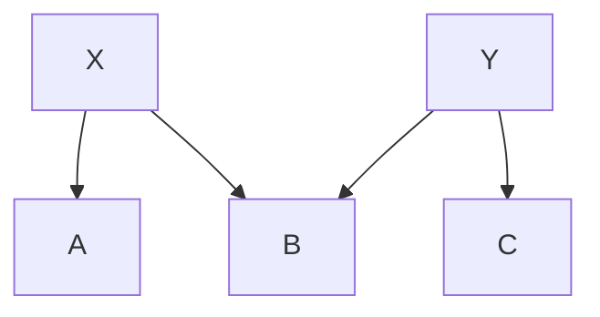
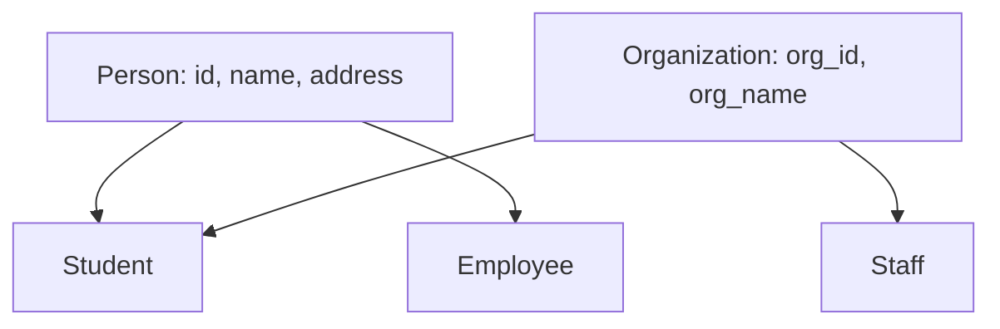
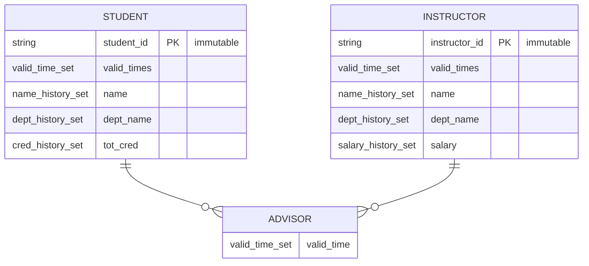

Part 1에 이어서 E-R 모델의 고급 주제인 일반화/특수화(Generalization/Specialization)와 시간 데이터(Temporal Data) 모델링을 다룹니다.

## 문제 6.12 - 일반화/특수화 격자 구조

**문제**: 다음과 같은 일반화/특수화 격자 구조에서 속성 상속을 설명하시오.



**격자 구조**:
```
    X       Y
   / \     / \
  A   B   B   C
```

**특징**:
- B가 X와 Y 모두로부터 상속받음 (다중 상속)
- A는 X만 상속
- C는 Y만 상속

### 속성 상속 규칙

**A의 속성**:
```
A의 속성 = X의 속성 + A 고유 속성
```

**C의 속성**:
```
C의 속성 = Y의 속성 + C 고유 속성
```

**B의 속성 (다중 상속)**:
```
B의 속성 = X의 속성 + Y의 속성 + B 고유 속성
```

### 속성 이름 충돌 처리

**문제 상황**: X와 Y에 같은 이름의 속성이 있는 경우

**예시**:
```sql
X {
    x_id,
    name,      -- 충돌!
    x_specific
}

Y {
    y_id,
    name,      -- 충돌!
    y_specific
}

B {
    b_id,
    -- X.name과 Y.name 중 어느 것?
}
```

**해결 방법**:

1. **정규화된 이름(Qualified Name) 사용**:
```sql
-- B에서 참조 시
X.name  -- X로부터 상속받은 name
Y.name  -- Y로부터 상속받은 name
B.name  -- B 자체의 name (재정의)
```

2. **별칭(Alias) 부여**:
```sql
B {
    b_id,
    x_name (from X.name),
    y_name (from Y.name),
    b_specific
}
```

3. **하나만 상속, 나머지 무시**:
```sql
-- 우선순위 규칙 정의
-- 예: 왼쪽 부모 우선
B inherits X.name
```

### 실무 예시

**대학교 시스템**:


```sql
-- Student: 다중 상속
Student {
    -- Person으로부터
    Person.id,
    Person.name,
    Person.address,

    -- Organization으로부터
    Organization.org_id,
    Organization.org_name,  -- name과 org_name 구분!

    -- Student 고유
    tot_cred,
    dept_name
}
```

### 관계형 스키마 변환

**방법 1: 단일 테이블**:
```sql
B(b_id, x_attr1, x_attr2, y_attr1, y_attr2, b_attr)
-- NULL 많이 발생 가능
```

**방법 2: 테이블 분리**:
```sql
X(x_id, x_attr1, x_attr2)
Y(y_id, y_attr1, y_attr2)
B(b_id, x_id, y_id, b_attr)
    -- FK: x_id → X, y_id → Y
```

**방법 3: 계층별 테이블**:
```sql
X(x_id, x_attr1, x_attr2)
Y(y_id, y_attr1, y_attr2)
B(b_id, x_attr1, x_attr2, y_attr1, y_attr2, b_attr)
-- 중복 저장, 조인 불필요
```

---

## 문제 6.13 - 시간 변화 추적 (Temporal Database)

**문제**: 데이터베이스의 시간적 변화를 추적하기 위한 E-R 모델 확장

### 배경 및 요구사항

**시간 변화 예시**:
- Zhang: 2015.09 ~ 2019.05 학생
- Shankar의 지도교수:
  - Einstein: 2018.05 ~ 2018.12
  - Einstein: 2019.06 ~ 2020.01
- 속성 변화:
  - instructor의 salary, name
  - course의 title, credits
  - student의 tot_cred

**모델링 접근**:
- 새로운 데이터 타입: `valid_time` (시간 구간 또는 구간 집합)
- 각 개체와 관계에 valid_time 속성 추가
- 시간에 따라 변하는 속성을 {값, valid_time} 집합으로 모델링

### 6.13.a - E-R 다이어그램 설계

**E-R 다이어그램 with Temporal Extensions**:



**속성 구조 상세**:

```sql
-- valid_times: 개체가 존재한 시간
{valid_times} = {
    (start_time_1, end_time_1),
    (start_time_2, end_time_2),
    ...
}

-- name: 이름의 시간별 값
{name} = {
    (value: "Alice", start_time: 2018-09, end_time: 2019-05),
    (value: "Alice Kim", start_time: 2019-06, end_time: ∞),
    ...
}

-- salary: 급여의 시간별 값
{salary} = {
    (value: 75000, start_time: 2018-01, end_time: 2019-12),
    (value: 80000, start_time: 2020-01, end_time: ∞),
    ...
}
```

**설계 원칙**:

1. **불변 속성(Immutable)**:
   - student_id, instructor_id는 변하지 않음
   - 기본키로 사용

2. **개체 존재 시간**:
   - valid_times: 개체가 데이터베이스에 존재한 기간
   - 여러 구간 가능 (재입학, 재고용)

3. **속성 값 변화**:
   - 각 속성을 {value, start_time, end_time} 집합으로
   - 시간 구간마다 다른 값 가능

4. **관계 시간**:
   - advisor 관계도 valid_time 가짐
   - 지도 관계의 시작과 종료 추적

### 6.13.b - 관계형 스키마 변환

**생성된 릴레이션**:

```sql
-- 학생 기본 정보 (불변)
student(student_id)

-- 학생 존재 시간
student_valid_times(student_id, start_time, end_time)
    -- PK: (student_id, start_time, end_time)
    -- FK: student_id → student

-- 학생 이름 이력
student_name(student_id, value, start_time, end_time)
    -- PK: (student_id, start_time, end_time)
    -- FK: student_id → student

-- 학생 학과 이력
student_dept_name(student_id, value, start_time, end_time)
    -- PK: (student_id, start_time, end_time)
    -- FK: student_id → student

-- 학생 학점 이력
student_tot_cred(student_id, value, start_time, end_time)
    -- PK: (student_id, start_time, end_time)
    -- FK: student_id → student

-- 교수 기본 정보
instructor(instructor_id)

-- 교수 존재 시간
instructor_valid_times(instructor_id, start_time, end_time)
    -- PK: (instructor_id, start_time, end_time)

-- 교수 이름 이력
instructor_name(instructor_id, value, start_time, end_time)
    -- PK: (instructor_id, start_time, end_time)

-- 교수 학과 이력
instructor_dept_name(instructor_id, value, start_time, end_time)
    -- PK: (instructor_id, start_time, end_time)

-- 교수 급여 이력
instructor_salary(instructor_id, value, start_time, end_time)
    -- PK: (instructor_id, start_time, end_time)

-- 지도 관계 이력
advisor(student_id, instructor_id, start_time, end_time)
    -- PK: (student_id, instructor_id, start_time, end_time)
    -- FK: student_id → student
    -- FK: instructor_id → instructor
```

**기본키 최적화**:

만약 시간 구간이 겹치지 않는다는 제약을 추가하면:
```sql
-- end_time을 기본키에서 제거 가능
student_name(student_id, value, start_time)
    -- PK: (student_id, start_time)
    -- 한 start_time에 하나의 end_time만 가능
```

### 복잡성 문제

**문제점**:
1. **너무 많은 테이블**: 각 속성마다 별도 테이블
2. **복잡한 쿼리**: 여러 테이블 조인 필요
3. **성능 저하**: 조회 시 많은 조인

**쿼리 예시**:
```sql
-- 2019년 1월의 Einstein 학생들
SELECT s.student_id, sn.value AS student_name
FROM student s
JOIN student_valid_times svt ON s.student_id = svt.student_id
JOIN student_name sn ON s.student_id = sn.student_id
JOIN advisor a ON s.student_id = a.student_id
JOIN instructor_name in ON a.instructor_id = in.instructor_id
WHERE in.value = 'Einstein'
  AND '2019-01-01' BETWEEN a.start_time AND a.end_time
  AND '2019-01-01' BETWEEN sn.start_time AND sn.end_time
  AND '2019-01-01' BETWEEN svt.start_time AND svt.end_time;
```

### 실용적 대안

**접근법**: E-R 설계 시 시간 변화 무시, 릴레이션 생성 후 수정

**간소화된 스키마**:
```sql
-- 기본 스키마 (시간 무시)
student(student_id, name, dept_name, tot_cred)
instructor(instructor_id, name, dept_name, salary)
advisor(student_id, instructor_id)

-- 시간 추적 추가
student_history(
    student_id,
    name,
    dept_name,
    tot_cred,
    valid_from,
    valid_to,
    PRIMARY KEY (student_id, valid_from)
)

instructor_history(
    instructor_id,
    name,
    dept_name,
    salary,
    valid_from,
    valid_to,
    PRIMARY KEY (instructor_id, valid_from)
)

advisor_history(
    student_id,
    instructor_id,
    valid_from,
    valid_to,
    PRIMARY KEY (student_id, instructor_id, valid_from)
)
```

**장점**:
1. **간단한 구조**: 속성별 테이블 불필요
2. **쉬운 쿼리**: 한 테이블에서 조회
3. **현재 상태**: 원래 테이블에 유지
4. **이력 추적**: _history 테이블에서

**현재 상태 조회**:
```sql
SELECT * FROM student WHERE student_id = 12345;
```

**이력 조회**:
```sql
SELECT * FROM student_history
WHERE student_id = 12345
ORDER BY valid_from DESC;
```

**특정 시점 조회**:
```sql
SELECT * FROM student_history
WHERE student_id = 12345
  AND '2019-01-01' BETWEEN valid_from AND valid_to;
```

### 실무 구현 패턴

**패턴 1: SCD Type 2 (Slowly Changing Dimension)**:
```sql
CREATE TABLE student_scd (
    scd_key INT PRIMARY KEY AUTO_INCREMENT,  -- 대리 키
    student_id VARCHAR(10),                  -- 실제 ID
    name VARCHAR(100),
    dept_name VARCHAR(50),
    tot_cred INT,
    valid_from DATE,
    valid_to DATE,
    is_current BOOLEAN,  -- 현재 레코드 표시
    INDEX (student_id, is_current)
);
```

**패턴 2: Temporal Tables (SQL:2011 표준)**:
```sql
CREATE TABLE student (
    student_id VARCHAR(10) PRIMARY KEY,
    name VARCHAR(100),
    dept_name VARCHAR(50),
    tot_cred INT,
    sys_start TIMESTAMP GENERATED ALWAYS AS ROW START,
    sys_end TIMESTAMP GENERATED ALWAYS AS ROW END,
    PERIOD FOR SYSTEM_TIME (sys_start, sys_end)
) WITH SYSTEM VERSIONING;

-- 현재 데이터 조회
SELECT * FROM student WHERE student_id = 12345;

-- 과거 시점 조회
SELECT * FROM student
FOR SYSTEM_TIME AS OF '2019-01-01'
WHERE student_id = 12345;

-- 변경 이력 조회
SELECT * FROM student
FOR SYSTEM_TIME BETWEEN '2018-01-01' AND '2019-12-31'
WHERE student_id = 12345;
```

**패턴 3: Audit Trail**:
```sql
CREATE TABLE student (
    student_id VARCHAR(10) PRIMARY KEY,
    name VARCHAR(100),
    dept_name VARCHAR(50),
    tot_cred INT
);

CREATE TABLE student_audit (
    audit_id INT PRIMARY KEY AUTO_INCREMENT,
    student_id VARCHAR(10),
    operation ENUM('INSERT', 'UPDATE', 'DELETE'),
    old_values JSON,
    new_values JSON,
    changed_at TIMESTAMP DEFAULT CURRENT_TIMESTAMP,
    changed_by VARCHAR(50)
);

-- 트리거로 자동 기록
CREATE TRIGGER student_audit_trigger
AFTER UPDATE ON student
FOR EACH ROW
INSERT INTO student_audit (student_id, operation, old_values, new_values)
VALUES (OLD.student_id, 'UPDATE',
        JSON_OBJECT('name', OLD.name, 'dept_name', OLD.dept_name),
        JSON_OBJECT('name', NEW.name, 'dept_name', NEW.dept_name));
```

---

## 💡 핵심 정리

### 일반화/특수화 (Generalization/Specialization)

**속성 상속 규칙**:
1. 단일 상속: 부모 속성 + 자식 속성
2. 다중 상속: 모든 부모 속성 + 자식 속성
3. 이름 충돌: 정규화된 이름 사용

**구현 방법**:
- 단일 테이블 (NULL 허용)
- 테이블 분리 (조인 필요)
- 계층별 테이블 (중복 허용)

### 시간 데이터 (Temporal Data)

**E-R 모델 확장**:
- valid_time 데이터 타입
- 개체/관계에 시간 구간 추가
- 속성을 {값, 시간} 집합으로

**실무 접근**:
- E-R 설계 시 시간 무시
- 릴레이션 레벨에서 이력 테이블 추가
- SCD, Temporal Tables, Audit Trail 패턴

### 설계 트레이드오프

**완전한 E-R 확장**:
- ✅ 개념적으로 명확
- ✅ 모든 시간 변화 추적
- ❌ 너무 많은 테이블
- ❌ 복잡한 쿼리

**실용적 접근**:
- ✅ 간단한 구조
- ✅ 쉬운 구현
- ✅ 좋은 성능
- ❌ E-R 모델과 불일치

### 실무 권장사항

1. **요구사항 분석**:
   - 어떤 시간 정보가 필요한가?
   - 조회 패턴은?
   - 성능 요구사항은?

2. **적절한 패턴 선택**:
   - 간단한 이력: _history 테이블
   - 복잡한 추적: SCD Type 2
   - DBMS 지원: Temporal Tables
   - 감사 목적: Audit Trail

3. **성능 고려**:
   - 인덱스 전략
   - 파티셔닝
   - 아카이빙 정책

4. **유지보수**:
   - 명확한 문서화
   - 일관된 패턴 사용
   - 자동화 (트리거, 프로시저)

---

E-R 모델의 고급 주제들은 복잡한 실무 요구사항을 다루는 데 필수적입니다. 개념적 명확성과 실용성 사이의 균형을 찾는 것이 중요합니다!
