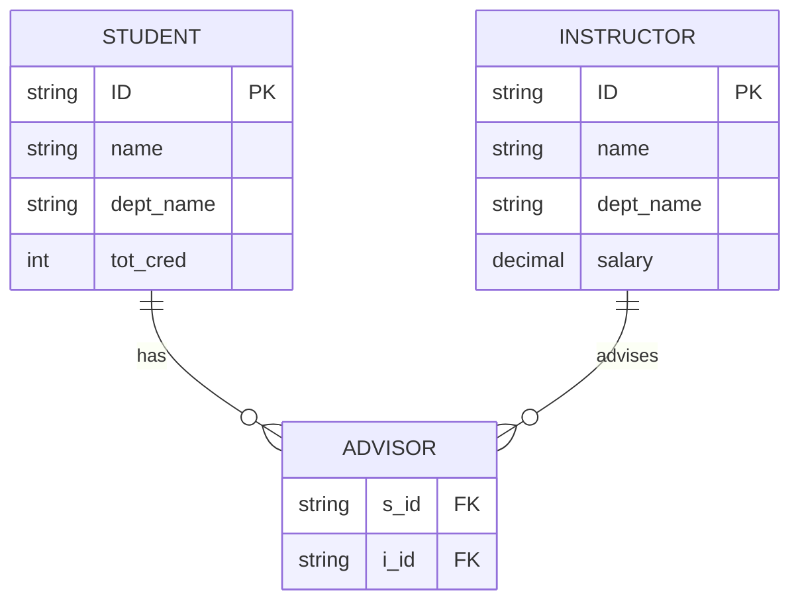
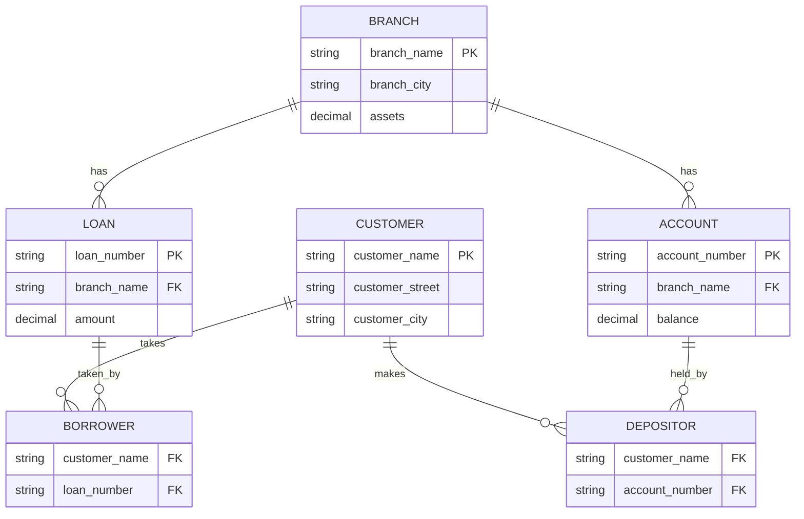

## 개요

이 포스트는 관계형 모델에 관한 연습 문제들(Exercises 2.10-2.18)의 상세한 해설을 제공합니다. 관계와 관계 스키마의 차이, 기본키와 외래키 식별, 스키마 다이어그램 작성, 관계 대수 표현 등 관계형 데이터베이스의 핵심 개념들을 다룹니다.

---

## Exercise 2.10: Relation vs Relation Schema

### 문제
> Describe the differences in meaning between the terms **relation** and **relation schema**.

### 해설

**Relation Schema (관계 스키마):**
- 관계의 **구조**를 정의하는 논리적 설계
- 관계의 **이름**, **속성 목록**, **속성의 도메인**을 명시
- 데이터베이스 설계 시점에 정의되며, 일반적으로 변경되지 않음
- **메타데이터** (데이터에 대한 데이터)

**표기법:**
```
instructor(ID, name, dept_name, salary)
```

**Relation (관계/관계 인스턴스):**
- 관계 스키마에 따라 **실제로 저장된 데이터**의 집합
- 튜플들의 집합으로, **시간에 따라 변경**됨 (INSERT, UPDATE, DELETE)
- 특정 시점의 데이터베이스 **상태**(state)를 나타냄

**예시:**
```
instructor 관계 (특정 시점):
┌──────┬───────────┬───────────┬────────┐
│  ID  │   name    │ dept_name │ salary │
├──────┼───────────┼───────────┼────────┤
│ 1001 │ Einstein  │ Physics   │ 95000  │
│ 1002 │ Mozart    │ Music     │ 40000  │
│ 1003 │ Brandt    │ Comp.Sci. │ 92000  │
└──────┴───────────┴───────────┴────────┘
```

**비유:**
- **관계 스키마** = 건물의 설계도 (구조, 방 배치)
- **관계** = 실제 건물과 그 안의 가구 (실제 데이터)

**핵심 차이점:**

| 구분 | Relation Schema | Relation |
|------|-----------------|----------|
| 정의 | 관계의 구조/형식 | 실제 데이터 |
| 시간성 | 정적 (거의 변경 안 됨) | 동적 (지속적 변경) |
| 내용 | 속성 이름, 타입, 제약조건 | 튜플들의 집합 |
| 개념 | 메타데이터 | 데이터 |

---

## Exercise 2.11: Primary Key with Multiple Advisors

### 문제
> Consider the advisor relation shown in the schema diagram in Figure 2.9, with s_id as the primary key of advisor. Suppose a student can have more than one advisor. Then, would s_id still be a primary key of the advisor relation? If not, what should the primary key of advisor be?

### 원래 advisor 관계

```
advisor(s_id, i_id)
- s_id: 학생 ID (원래 기본키)
- i_id: 지도교수 ID
```

**원래 가정:** 한 학생은 정확히 한 명의 지도교수를 가짐

```
advisor 관계:
┌───────┬───────┐
│ s_id  │ i_id  │
├───────┼───────┤
│ 12345 │ 10101 │
│ 44553 │ 22222 │
│ 45678 │ 22222 │
└───────┴───────┘
```

이 경우 `s_id`는 각 튜플을 **유일하게 식별**하므로 기본키가 될 수 있습니다.

### 변경된 시나리오: 한 학생이 여러 지도교수를 가질 수 있음

```
advisor 관계:
┌───────┬───────┐
│ s_id  │ i_id  │
├───────┼───────┤
│ 12345 │ 10101 │
│ 12345 │ 33456 │  ← 학생 12345가 두 명의 지도교수
│ 44553 │ 22222 │
│ 45678 │ 22222 │
│ 45678 │ 10101 │  ← 학생 45678도 두 명의 지도교수
└───────┴───────┘
```

### 해설

**질문 1: s_id가 여전히 기본키가 될 수 있는가?**

**답:** 아니오. `s_id`는 더 이상 기본키가 될 수 없습니다.

**이유:**
- 기본키는 각 튜플을 **유일하게 식별**해야 함
- 위 예시에서 `s_id = 12345`인 튜플이 **2개** 존재
- 이는 기본키의 **유일성(uniqueness)** 제약조건을 위반

**질문 2: 기본키는 무엇이어야 하는가?**

**답:** **복합 키(Composite Key)** `(s_id, i_id)`가 기본키가 되어야 합니다.

**이유:**
- `(s_id, i_id)` 조합은 각 튜플을 유일하게 식별
- 학생 12345와 지도교수 10101의 조합은 단 한 번만 나타남
- 학생 12345와 지도교수 33456의 조합도 유일함

**새로운 스키마:**
```
advisor(s_id, i_id)
Primary Key: (s_id, i_id)
```

**제약조건 표현:**
```sql
CREATE TABLE advisor (
    s_id VARCHAR(5),
    i_id VARCHAR(5),
    PRIMARY KEY (s_id, i_id),  -- 복합 기본키
    FOREIGN KEY (s_id) REFERENCES student(ID),
    FOREIGN KEY (i_id) REFERENCES instructor(ID)
);
```

**관계 유형 변화:**
- **원래**: Student와 Instructor 사이의 **다대일(N:1)** 관계
- **변경 후**: Student와 Instructor 사이의 **다대다(M:N)** 관계



**핵심 포인트:**
- 기본키는 관계의 **카디널리티**(cardinality)에 따라 달라짐
- 다대다 관계에서는 **복합 키**가 일반적으로 기본키가 됨

---

## Exercise 2.12: Bank Database Keys

### 문제
> Consider the bank database of Figure 2.18. Assume that branch names and customer names uniquely identify branches and customers, but loans and accounts can be associated with more than one customer.

**Figure 2.18 스키마:**
```
branch(branch_name, branch_city, assets)
customer(customer_name, customer_street, customer_city)
loan(loan_number, amount)
account(account_number, balance)
depositor(customer_name, account_number)
borrower(customer_name, loan_number)
```

**a. What are the appropriate primary keys?**

### Part A: Primary Keys 식별

**분석:**

1. **branch** 관계
   - 문제에서 "branch names uniquely identify branches"
   - **기본키**: `branch_name`

2. **customer** 관계
   - 문제에서 "customer names uniquely identify customers"
   - **기본키**: `customer_name`

3. **loan** 관계
   - 대출 번호는 일반적으로 각 대출을 유일하게 식별
   - **기본키**: `loan_number`

4. **account** 관계
   - 계좌 번호는 각 계좌를 유일하게 식별
   - **기본키**: `account_number`

5. **depositor** 관계
   - "accounts can be associated with more than one customer"
   - 한 계좌에 여러 고객 가능 (공동 계좌)
   - 한 고객이 여러 계좌 소유 가능
   - **다대다(M:N) 관계**
   - **기본키**: `(customer_name, account_number)`

6. **borrower** 관계
   - "loans can be associated with more than one customer"
   - 한 대출에 여러 고객 가능 (공동 대출)
   - 한 고객이 여러 대출 가능
   - **다대다(M:N) 관계**
   - **기본키**: `(customer_name, loan_number)`

**답:**

| 관계 | 기본키 |
|------|--------|
| branch | `branch_name` |
| customer | `customer_name` |
| loan | `loan_number` |
| account | `account_number` |
| depositor | `(customer_name, account_number)` |
| borrower | `(customer_name, loan_number)` |

### Part B: Foreign Keys 식별

**b. Given your choice of primary keys, identify appropriate foreign keys.**

**분석:**

외래키는 다른 관계의 기본키를 참조하여 **참조 무결성**을 보장합니다.

1. **depositor** 관계:
   - `customer_name` → `customer(customer_name)` 참조
   - `account_number` → `account(account_number)` 참조

2. **borrower** 관계:
   - `customer_name` → `customer(customer_name)` 참조
   - `loan_number` → `loan(loan_number)` 참조

**실제로는 loan과 account도 branch를 참조해야 합니다:**

개선된 스키마:
```
loan(loan_number, branch_name, amount)
account(account_number, branch_name, balance)
```

이 경우:
- `loan.branch_name` → `branch(branch_name)` 참조
- `account.branch_name` → `branch(branch_name)` 참조

**답:**

| 관계 | 외래키 | 참조 대상 |
|------|--------|-----------|
| depositor | customer_name | customer(customer_name) |
| depositor | account_number | account(account_number) |
| borrower | customer_name | customer(customer_name) |
| borrower | loan_number | loan(loan_number) |
| loan | branch_name | branch(branch_name) |
| account | branch_name | branch(branch_name) |

**SQL 정의:**

```sql
CREATE TABLE depositor (
    customer_name VARCHAR(50),
    account_number VARCHAR(20),
    PRIMARY KEY (customer_name, account_number),
    FOREIGN KEY (customer_name) REFERENCES customer(customer_name),
    FOREIGN KEY (account_number) REFERENCES account(account_number)
);

CREATE TABLE borrower (
    customer_name VARCHAR(50),
    loan_number VARCHAR(20),
    PRIMARY KEY (customer_name, loan_number),
    FOREIGN KEY (customer_name) REFERENCES customer(customer_name),
    FOREIGN KEY (loan_number) REFERENCES loan(loan_number)
);
```

**참조 무결성 예시:**

```
-- ✓ 유효: customer와 account가 존재
INSERT INTO depositor VALUES ('Smith', 'A-101');

-- ✗ 무효: 존재하지 않는 customer
INSERT INTO depositor VALUES ('NonExistent', 'A-101');
-- Error: Foreign key constraint violation

-- ✗ 무효: 존재하지 않는 account
INSERT INTO depositor VALUES ('Smith', 'A-999');
-- Error: Foreign key constraint violation
```

---

## Exercise 2.13: Schema Diagram for Bank Database

### 문제
> Construct a schema diagram for the bank database of Figure 2.18.

### 해설

스키마 다이어그램은 데이터베이스의 관계들과 그들 간의 **관계**를 시각적으로 표현합니다.

**개선된 Bank Database 스키마 다이어그램:**



**다이어그램 설명:**

1. **Branch (지점)**
   - 여러 대출(loan)과 계좌(account)를 관리
   - 1:N 관계

2. **Customer (고객)**
   - 여러 계좌 소유 가능 (depositor를 통해)
   - 여러 대출 가능 (borrower를 통해)

3. **Depositor (예금자)** - 연관 엔티티
   - Customer와 Account의 M:N 관계를 해소

4. **Borrower (대출자)** - 연관 엔티티
   - Customer와 Loan의 M:N 관계를 해소

**관계 카디널리티:**
- Branch → Loan: **1:N** (한 지점이 여러 대출 관리)
- Branch → Account: **1:N** (한 지점이 여러 계좌 관리)
- Customer ↔ Account: **M:N** (depositor를 통해)
- Customer ↔ Loan: **M:N** (borrower를 통해)

**텍스트 기반 표현:**

```
┌─────────────┐
│   BRANCH    │
│─────────────│
│ branch_name │ PK
│ branch_city │
│ assets      │
└─────────────┘
      │ 1
      │ has
      │ N
      ↓
┌─────────────────┐       N ┌─────────────┐ N
│     LOAN        │ ←─────── │  BORROWER   │ ←────┐
│─────────────────│          │─────────────│       │
│ loan_number     │ PK       │customer_name│ PK,FK │ N
│ branch_name     │ FK       │ loan_number │ PK,FK │
│ amount          │          └─────────────┘       │
└─────────────────┘                                 │
                                                    │
┌─────────────────┐       N ┌─────────────┐       │
│    ACCOUNT      │ ←─────── │  DEPOSITOR  │       │
│─────────────────│          │─────────────│       │
│ account_number  │ PK       │customer_name│ PK,FK │
│ branch_name     │ FK       │account_num  │ PK,FK │
│ balance         │          └─────────────┘       │
└─────────────────┘                 │              │
      ↑ N                           │ N            │
      │ has                         │              │
      │ 1                           ↓              │
┌─────────────┐              ┌──────────────┐     │
│   BRANCH    │              │   CUSTOMER   │ ────┘
│─────────────│              │──────────────│ N
│ branch_name │ PK           │customer_name │ PK
│ branch_city │              │customer_st   │
│ assets      │              │customer_city │
└─────────────┘              └──────────────┘
```

**핵심 포인트:**
- Depositor와 Borrower는 **연관 엔티티**(associative entities)
- M:N 관계를 두 개의 1:N 관계로 변환
- 모든 외래키는 참조 무결성 보장

---

## Exercise 2.14: Employee Database Relational Algebra

### 문제
> Consider the employee database of Figure 2.17. Give an expression in the relational algebra to express each of the following queries:

**Figure 2.17 스키마:**
```
employee(person_name, street, city)
works(person_name, company_name, salary)
company(company_name, city)
```

### Query A: Find the ID and name of each employee who works for "BigBank"

**문제:** Find the ID and name of each employee who works for "BigBank".

**분석:**
- works 관계에서 `company_name = 'BigBank'`인 튜플 선택
- person_name 속성만 투영

**관계 대수 표현식:**

$$
\Pi_{\text{person\_name}} (\sigma_{\text{company\_name} = \text{'BigBank'}} (\text{works}))
$$

**단계별 풀이:**

1. **선택 (Selection):** works에서 BigBank 직원 선택
   ```
   σ_company_name='BigBank'(works)
   ```
   결과:
   ```
   ┌─────────────┬──────────────┬────────┐
   │ person_name │ company_name │ salary │
   ├─────────────┼──────────────┼────────┤
   │ Smith       │ BigBank      │ 50000  │
   │ Jones       │ BigBank      │ 45000  │
   └─────────────┴──────────────┴────────┘
   ```

2. **투영 (Projection):** person_name만 추출
   ```
   Π_person_name(...)
   ```
   최종 결과:
   ```
   ┌─────────────┐
   │ person_name │
   ├─────────────┤
   │ Smith       │
   │ Jones       │
   └─────────────┘
   ```

**SQL 등가 표현:**
```sql
SELECT person_name
FROM works
WHERE company_name = 'BigBank';
```

### Query B: Find the ID, name, and city of residence

**문제:** Find the ID, name, and city of residence of each employee who works for "BigBank".

**분석:**
- works와 employee를 조인하여 거주 도시 정보 획득
- BigBank 직원만 선택
- person_name과 city 투영

**관계 대수 표현식:**

$$
\Pi_{\text{person\_name, city}} (\sigma_{\text{company\_name} = \text{'BigBank'}} (\text{works} \bowtie \text{employee}))
$$

**단계별 풀이:**

1. **자연 조인:** works와 employee를 person_name으로 조인
   ```
   works ⋈ employee
   ```
   중간 결과:
   ```
   ┌─────────────┬──────────────┬────────┬────────────┬────────────┐
   │ person_name │ company_name │ salary │   street   │    city    │
   ├─────────────┼──────────────┼────────┼────────────┼────────────┤
   │ Smith       │ BigBank      │ 50000  │ Main St    │ New York   │
   │ Jones       │ BigBank      │ 45000  │ Oak Ave    │ Boston     │
   │ Williams    │ SmallBank    │ 35000  │ Pine Rd    │ Chicago    │
   └─────────────┴──────────────┴────────┴────────────┴────────────┘
   ```

2. **선택:** BigBank 직원만
   ```
   σ_company_name='BigBank'(...)
   ```

3. **투영:** person_name과 city만
   ```
   Π_person_name,city(...)
   ```
   최종 결과:
   ```
   ┌─────────────┬──────────┐
   │ person_name │   city   │
   ├─────────────┼──────────┤
   │ Smith       │ New York │
   │ Jones       │ Boston   │
   └─────────────┴──────────┘
   ```

**SQL 등가 표현:**
```sql
SELECT e.person_name, e.city
FROM works w
NATURAL JOIN employee e
WHERE w.company_name = 'BigBank';
```

### Query C: ID, name, street, city with salary > $10000

**문제:** Find the ID, name, street address, and city of residence of each employee who works for "BigBank" and earns more than $10000.

**관계 대수 표현식:**

$$
\Pi_{\text{person\_name, street, city}} (\sigma_{\text{company\_name} = \text{'BigBank'} \land \text{salary} > 10000} (\text{works} \bowtie \text{employee}))
$$

**단계별 풀이:**

1. **자연 조인:** works ⋈ employee

2. **선택:** 복합 조건 적용
   ```
   σ_company_name='BigBank' ∧ salary>10000(...)
   ```

3. **투영:** 필요한 속성만
   ```
   Π_person_name,street,city(...)
   ```

**SQL 등가 표현:**
```sql
SELECT e.person_name, e.street, e.city
FROM works w
NATURAL JOIN employee e
WHERE w.company_name = 'BigBank'
  AND w.salary > 10000;
```

### Query D: Employees living in same city as their company

**문제:** Find the ID and name of each employee in this database who lives in the same city as the company for which she or he works.

**분석:**
- works, employee, company를 모두 조인
- employee.city = company.city 조건 추가

**관계 대수 표현식:**

$$
\Pi_{\text{person\_name}} (\sigma_{\text{employee.city} = \text{company.city}} (\text{works} \bowtie \text{employee} \bowtie \text{company}))
$$

**단계별 풀이:**

1. **3-way 자연 조인:**
   ```
   works ⋈ employee ⋈ company
   ```
   중간 결과:
   ```
   ┌─────────────┬──────────────┬────────┬─────────┬─────────────┬─────────────┐
   │ person_name │ company_name │ salary │ street  │ emp.city    │ comp.city   │
   ├─────────────┼──────────────┼────────┼─────────┼─────────────┼─────────────┤
   │ Smith       │ BigBank      │ 50000  │ Main St │ New York    │ New York    │
   │ Jones       │ BigBank      │ 45000  │ Oak Ave │ Boston      │ New York    │
   │ Williams    │ SmallBank    │ 35000  │ Pine Rd │ Chicago     │ Chicago     │
   └─────────────┴──────────────┴────────┴─────────┴─────────────┴─────────────┘
   ```

2. **선택:** employee.city = company.city
   ```
   σ_employee.city=company.city(...)
   ```
   결과:
   ```
   ┌─────────────┬──────────────┬────────┬─────────┬──────────┐
   │ person_name │ company_name │ salary │ street  │   city   │
   ├─────────────┼──────────────┼────────┼─────────┼──────────┤
   │ Smith       │ BigBank      │ 50000  │ Main St │ New York │
   │ Williams    │ SmallBank    │ 35000  │ Pine Rd │ Chicago  │
   └─────────────┴──────────────┴────────┴─────────┴──────────┘
   ```

3. **투영:** person_name만
   ```
   Π_person_name(...)
   ```
   최종 결과:
   ```
   ┌─────────────┐
   │ person_name │
   ├─────────────┤
   │ Smith       │
   │ Williams    │
   └─────────────┘
   ```

**SQL 등가 표현:**
```sql
SELECT w.person_name
FROM works w
NATURAL JOIN employee e
NATURAL JOIN company c
WHERE e.city = c.city;
```

---

## Exercise 2.15: Bank Database Relational Algebra

### 문제
> Consider the bank database of Figure 2.18. Give an expression in the relational algebra for each of the following queries:

**스키마 (개선된 버전):**
```
branch(branch_name, branch_city, assets)
customer(customer_name, customer_street, customer_city)
loan(loan_number, branch_name, amount)
account(account_number, branch_name, balance)
depositor(customer_name, account_number)
borrower(customer_name, loan_number)
```

### Query A: Loans with amount > $10000

**문제:** Find each loan number with a loan amount greater than $10000.

**관계 대수 표현식:**

$$
\Pi_{\text{loan\_number}} (\sigma_{\text{amount} > 10000} (\text{loan}))
$$

**SQL 등가 표현:**
```sql
SELECT loan_number
FROM loan
WHERE amount > 10000;
```

**예시 결과:**
```
loan 테이블:
┌─────────────┬─────────────┬────────┐
│ loan_number │ branch_name │ amount │
├─────────────┼─────────────┼────────┤
│ L-11        │ Round Hill  │ 900    │
│ L-14        │ Downtown    │ 1500   │
│ L-15        │ Perryridge  │ 1500   │
│ L-16        │ Perryridge  │ 1300   │
│ L-17        │ Downtown    │ 1000   │
│ L-23        │ Redwood     │ 2000   │
│ L-93        │ Mianus      │ 500    │
│ L-99        │ Downtown    │ 15000  │ ← 선택됨
└─────────────┴─────────────┴────────┘

결과:
┌─────────────┐
│ loan_number │
├─────────────┤
│ L-99        │
└─────────────┘
```

### Query B: Depositors with balance > $6000

**문제:** Find the ID of each depositor who has an account with a balance greater than $6000.

**분석:**
- depositor와 account를 조인
- balance > 6000 조건 적용
- customer_name 투영

**관계 대수 표현식:**

$$
\Pi_{\text{customer\_name}} (\sigma_{\text{balance} > 6000} (\text{depositor} \bowtie \text{account}))
$$

**단계별 풀이:**

1. **자연 조인:** depositor ⋈ account
   ```
   ┌───────────────┬────────────────┬─────────────┬─────────┐
   │ customer_name │ account_number │ branch_name │ balance │
   ├───────────────┼────────────────┼─────────────┼─────────┤
   │ Johnson       │ A-101          │ Downtown    │ 500     │
   │ Smith         │ A-215          │ Mianus      │ 700     │
   │ Hayes         │ A-102          │ Perryridge  │ 400     │
   │ Turner        │ A-305          │ Round Hill  │ 350     │
   │ Johnson       │ A-201          │ Brighton    │ 900     │
   │ Jones         │ A-217          │ Brighton    │ 750     │
   │ Lindsay       │ A-222          │ Redwood     │ 700     │
   │ Smith         │ A-444          │ Downtown    │ 8000    │ ← 선택
   └───────────────┴────────────────┴─────────────┴─────────┘
   ```

2. **선택:** balance > 6000
3. **투영:** customer_name

**SQL 등가 표현:**
```sql
SELECT DISTINCT d.customer_name
FROM depositor d
NATURAL JOIN account a
WHERE a.balance > 6000;
```

**결과:**
```
┌───────────────┐
│ customer_name │
├───────────────┤
│ Smith         │
└───────────────┘
```

### Query C: Depositors with balance > $6000 at "Uptown" branch

**문제:** Find the ID of each depositor who has an account with a balance greater than $6000 at the "Uptown" branch.

**관계 대수 표현식:**

$$
\Pi_{\text{customer\_name}} (\sigma_{\text{balance} > 6000 \land \text{branch\_name} = \text{'Uptown'}} (\text{depositor} \bowtie \text{account}))
$$

**단계별 풀이:**

1. **자연 조인:** depositor ⋈ account

2. **선택:** 복합 조건
   ```
   σ_balance>6000 ∧ branch_name='Uptown'(...)
   ```

3. **투영:** customer_name

**SQL 등가 표현:**
```sql
SELECT DISTINCT d.customer_name
FROM depositor d
NATURAL JOIN account a
WHERE a.balance > 6000
  AND a.branch_name = 'Uptown';
```

**결과 예시:**
```
┌───────────────┐
│ customer_name │
├───────────────┤
│ Brown         │
│ Garcia        │
└───────────────┘
```

---

## Exercise 2.16: Null Values

### 문제
> List two reasons why null values might be introduced into a database.

### 해설

**NULL 값이 데이터베이스에 도입되는 이유:**

#### 1. **값이 알려지지 않음 (Unknown)**

데이터가 존재하지만 **현재 알 수 없는** 경우:

**예시:**
```sql
employee(emp_id, name, phone_number, salary)

-- 신규 채용 직원의 전화번호가 아직 등록되지 않음
INSERT INTO employee VALUES (1001, 'John Doe', NULL, 50000);
```

**시나리오:**
- 고객의 이메일 주소를 수집하지 못함
- 제품의 제조일자가 기록되지 않음
- 환자의 혈액형이 아직 검사되지 않음

**특징:**
- 나중에 **실제 값으로 업데이트 가능**
- 일시적인 상태

#### 2. **값이 적용되지 않음 (Not Applicable / Inapplicable)**

해당 속성이 특정 튜플에 **의미가 없는** 경우:

**예시:**
```sql
person(person_id, name, spouse_name, maiden_name)

-- 미혼인 사람은 spouse_name이 적용되지 않음
INSERT INTO person VALUES (2001, 'Alice Smith', NULL, NULL);

-- 남성은 maiden_name이 적용되지 않음
INSERT INTO person VALUES (2002, 'Bob Johnson', 'Carol', NULL);

-- 기혼 여성
INSERT INTO person VALUES (2003, 'Diana Brown', 'Edward', 'Williams');
```

**시나리오:**
- 미혼자의 배우자 정보
- 남성의 결혼 전 성(maiden name)
- 신용카드가 없는 고객의 카드 번호
- 주택 소유자가 아닌 사람의 주택 평수

**특징:**
- 구조적으로 **항상 NULL**일 가능성
- 값이 존재할 수 없음

#### 3. **추가 이유: 값이 누락됨 (Missing)**

데이터 입력 오류나 **데이터 수집 실패**:

**예시:**
- 설문 조사에서 응답하지 않은 항목
- 센서 오류로 수집되지 않은 측정값
- 마이그레이션 과정에서 손실된 데이터

### NULL 처리의 어려움

**문제점:**

1. **비교 연산의 모호성**
   ```sql
   SELECT * FROM employee WHERE salary > 50000;
   -- salary가 NULL인 직원은 결과에 포함되지 않음
   ```

2. **집계 함수**
   ```sql
   SELECT AVG(salary) FROM employee;
   -- NULL 값은 계산에서 제외됨 (COUNT에서는 제외, SUM에서는 0이 아님)
   ```

3. **3-값 논리 (Three-Valued Logic)**
   - TRUE, FALSE, **UNKNOWN**
   ```sql
   WHERE age > 30  -- age가 NULL이면 UNKNOWN
   ```

**NULL 처리 방법:**

```sql
-- NULL 확인
SELECT * FROM employee WHERE phone_number IS NULL;

-- NULL 대체
SELECT COALESCE(phone_number, 'N/A') FROM employee;

-- NULL 방지
CREATE TABLE employee (
    emp_id INT PRIMARY KEY,
    name VARCHAR(50) NOT NULL,  -- NULL 허용 안 함
    phone_number VARCHAR(20)
);
```

**설계 고려사항:**
- **최소화**: 가능한 NOT NULL 제약조건 사용
- **명확한 의미**: NULL의 의미를 문서화
- **대안**: 별도의 "Unknown" 또는 "N/A" 값 사용 고려

---

## Exercise 2.17: Language Paradigms

### 문제
> Discuss the relative merits of imperative, declarative, and functional languages.

### 해설

프로그래밍 언어는 크게 세 가지 패러다임으로 분류됩니다.

#### 1. **명령형 언어 (Imperative Languages)**

**특징:**
- **"어떻게(How)"** 문제를 해결할지 명시
- 프로그램 상태를 명시적으로 변경
- 순차적 실행, 제어 흐름 (if, for, while)

**예시 언어:** C, Java, Python, JavaScript

**장점:**
- ✓ **직관적**: 컴퓨터가 실제로 작동하는 방식과 유사
- ✓ **세밀한 제어**: 메모리, 성능 최적화 가능
- ✓ **효율성**: 하드웨어에 가까운 저수준 제어
- ✓ **디버깅**: 단계별 실행 추적 용이

**단점:**
- ✗ **복잡성**: 상태 관리가 복잡해질 수 있음
- ✗ **버그 가능성**: Side effects, 변경 가능한 상태
- ✗ **병렬화 어려움**: 공유 상태로 인한 동시성 문제

**예시 코드:**
```python
# 명령형: 리스트에서 짝수만 필터링
def filter_even(numbers):
    result = []
    for num in numbers:
        if num % 2 == 0:
            result.append(num)
    return result

numbers = [1, 2, 3, 4, 5, 6]
even_numbers = filter_even(numbers)
```

#### 2. **선언형 언어 (Declarative Languages)**

**특징:**
- **"무엇을(What)"** 원하는지 명시
- **구현 방법은 시스템이 결정**
- 최종 결과에 집중

**예시 언어:** SQL, HTML, CSS, Prolog

**장점:**
- ✓ **간결성**: 코드가 짧고 읽기 쉬움
- ✓ **최적화**: 시스템이 자동으로 최적 실행 계획 선택
- ✓ **유지보수성**: 의도가 명확하게 표현됨
- ✓ **추상화**: 구현 세부사항 숨김

**단점:**
- ✗ **제어 부족**: 실행 방식을 세밀하게 제어하기 어려움
- ✗ **디버깅 어려움**: 내부 동작이 불투명
- ✗ **성능 예측 어려움**: 실제 실행 과정을 알기 어려움

**예시 코드:**
```sql
-- 선언형: 급여가 50000 이상인 직원 찾기
SELECT name, salary
FROM employee
WHERE salary >= 50000;
-- "어떻게" 찾을지는 DBMS가 결정
```

**SQL의 선언형 특성:**
- 쿼리 최적화기가 실행 계획 결정
- 인덱스 사용, 조인 순서 자동 선택
- 사용자는 결과만 명시

#### 3. **함수형 언어 (Functional Languages)**

**특징:**
- **불변성 (Immutability)**: 데이터 변경 불가
- **순수 함수 (Pure Functions)**: Side effects 없음
- **일급 함수 (First-Class Functions)**: 함수를 값처럼 사용
- **고차 함수 (Higher-Order Functions)**: 함수를 인자로 받거나 반환

**예시 언어:** Haskell, Lisp, Erlang, Scala, F#

**장점:**
- ✓ **예측 가능성**: 같은 입력 → 같은 출력 (참조 투명성)
- ✓ **병렬화 용이**: 불변 데이터로 동시성 문제 감소
- ✓ **모듈성**: 작은 함수들의 조합
- ✓ **테스트 용이**: 순수 함수는 테스트하기 쉬움
- ✓ **수학적 기반**: 형식적 검증 가능

**단점:**
- ✗ **학습 곡선**: 개념이 어려울 수 있음
- ✗ **성능 오버헤드**: 불변성 유지 비용
- ✗ **I/O 처리**: Side effects가 필요한 작업이 복잡
- ✗ **제한된 생태계**: 라이브러리가 상대적으로 적음

**예시 코드:**
```python
# 함수형 스타일: 리스트에서 짝수만 필터링
numbers = [1, 2, 3, 4, 5, 6]
even_numbers = list(filter(lambda x: x % 2 == 0, numbers))

# 또는
even_numbers = [x for x in numbers if x % 2 == 0]
```

```haskell
-- Haskell: 순수 함수형
filterEven :: [Int] -> [Int]
filterEven = filter even

-- 사용
filterEven [1,2,3,4,5,6]  -- [2,4,6]
```

### 비교 표

| 특성 | 명령형 | 선언형 | 함수형 |
|------|--------|--------|--------|
| 초점 | How (어떻게) | What (무엇을) | Transformation (변환) |
| 상태 | 변경 가능 | 시스템 관리 | 불변 |
| 제어 흐름 | 명시적 | 암시적 | 함수 조합 |
| Side Effects | 허용 | 시스템 처리 | 최소화/제거 |
| 병렬화 | 어려움 | 시스템 처리 | 용이 |
| 학습 곡선 | 낮음 | 중간 | 높음 |
| 디버깅 | 용이 | 어려움 | 중간 |
| 예시 | C, Java | SQL, HTML | Haskell, Lisp |

### 실무 적용

**현대 프로그래밍의 경향:**
- **멀티 패러다임**: 여러 패러다임을 혼합 (Python, JavaScript, Scala)
- **함수형 기법 도입**: 명령형 언어에 함수형 기능 추가
- **적재적소**: 상황에 맞는 패러다임 선택

**예시:**
```javascript
// JavaScript: 멀티 패러다임
// 명령형
let sum = 0;
for (let i = 0; i < numbers.length; i++) {
    sum += numbers[i];
}

// 함수형
const sum = numbers.reduce((acc, num) => acc + num, 0);
```

**데이터베이스 관점:**
- **쿼리**: 선언형 (SQL)
- **저장 프로시저**: 명령형 (PL/SQL, T-SQL)
- **쿼리 최적화**: 함수형 (관계 대수)

---

## Exercise 2.18: University Schema Queries

### 문제
> Write the following queries in relational algebra, using the university schema.

**University 스키마:**
```
student(ID, name, dept_name, tot_cred)
instructor(ID, name, dept_name, salary)
department(dept_name, building, budget)
course(course_id, title, dept_name, credits)
section(course_id, sec_id, semester, year, building, room_number, time_slot_id)
teaches(ID, course_id, sec_id, semester, year)
takes(ID, course_id, sec_id, semester, year, grade)
```

### Query A: Instructors in Physics department

**문제:** Find the ID and name of each instructor in the Physics department.

**관계 대수 표현식:**

$$
\Pi_{\text{ID, name}} (\sigma_{\text{dept\_name} = \text{'Physics'}} (\text{instructor}))
$$

**SQL 등가:**
```sql
SELECT ID, name
FROM instructor
WHERE dept_name = 'Physics';
```

**결과 예시:**
```
┌───────┬───────────┐
│  ID   │   name    │
├───────┼───────────┤
│ 10101 │ Einstein  │
│ 12121 │ Wu        │
└───────┴───────────┘
```

### Query B: Instructors in Watson building

**문제:** Find the ID and name of each instructor in a department located in the building "Watson".

**분석:**
- instructor와 department를 dept_name으로 조인
- building = 'Watson' 조건 적용

**관계 대수 표현식:**

$$
\Pi_{\text{ID, name}} (\sigma_{\text{building} = \text{'Watson'}} (\text{instructor} \bowtie \text{department}))
$$

**단계별:**
1. **자연 조인:** instructor ⋈ department (dept_name 기준)
2. **선택:** building = 'Watson'
3. **투영:** ID, name

**SQL 등가:**
```sql
SELECT i.ID, i.name
FROM instructor i
NATURAL JOIN department d
WHERE d.building = 'Watson';
```

**결과 예시:**
```
instructor:
┌───────┬───────────┬───────────┬────────┐
│  ID   │   name    │ dept_name │ salary │
├───────┼───────────┼───────────┼────────┤
│ 10101 │ Srinivasan│ Comp.Sci. │ 65000  │
│ 12121 │ Wu        │ Finance   │ 90000  │
│ 15151 │ Mozart    │ Music     │ 40000  │
└───────┴───────────┴───────────┴────────┘

department:
┌───────────┬──────────┬────────┐
│ dept_name │ building │ budget │
├───────────┼──────────┼────────┤
│ Comp.Sci. │ Taylor   │ 100000 │
│ Finance   │ Watson   │ 120000 │ ← 선택
│ Music     │ Packard  │ 80000  │
└───────────┴──────────┴────────┘

최종 결과:
┌───────┬──────┐
│  ID   │ name │
├───────┼──────┤
│ 12121 │ Wu   │
└───────┴──────┘
```

### Query C: Students who took at least one Comp. Sci. course

**문제:** Find the ID and name of each student who has taken at least one course in the "Comp. Sci." department.

**분석:**
- student, takes, course를 조인
- dept_name = 'Comp. Sci.' 조건

**관계 대수 표현식:**

$$
\Pi_{\text{student.ID, name}} (\sigma_{\text{dept\_name} = \text{'Comp. Sci.'}} (\text{student} \bowtie \text{takes} \bowtie \text{course}))
$$

**단계별:**
1. **조인:** student ⋈ takes (ID 기준)
2. **조인:** 결과 ⋈ course (course_id 기준)
3. **선택:** dept_name = 'Comp. Sci.'
4. **투영:** student.ID, name (중복 제거)

**SQL 등가:**
```sql
SELECT DISTINCT s.ID, s.name
FROM student s
NATURAL JOIN takes t
NATURAL JOIN course c
WHERE c.dept_name = 'Comp. Sci.';
```

**결과 예시:**
```
┌───────┬────────┐
│  ID   │  name  │
├───────┼────────┤
│ 12345 │ Shankar│
│ 19991 │ Brandt │
│ 23121 │ Chavez │
└───────┴────────┘
```

### Query D: Students who took at least one course in 2018

**문제:** Find the ID and name of each student who has taken at least one course section in the year 2018.

**관계 대수 표현식:**

$$
\Pi_{\text{ID, name}} (\sigma_{\text{year} = 2018} (\text{student} \bowtie \text{takes}))
$$

**SQL 등가:**
```sql
SELECT DISTINCT s.ID, s.name
FROM student s
NATURAL JOIN takes t
WHERE t.year = 2018;
```

**결과 예시:**
```
┌───────┬─────────┐
│  ID   │  name   │
├───────┼─────────┤
│ 12345 │ Shankar │
│ 19991 │ Brandt  │
│ 23121 │ Chavez  │
│ 44553 │ Peltier │
└───────┴─────────┘
```

### Query E: Students who did NOT take any course in 2018

**문제:** Find the ID and name of each student who has not taken any course section in the year 2018.

**분석:**
- 2018년에 수강한 학생들을 찾고
- 전체 학생에서 이들을 **제외** (차집합 사용)

**관계 대수 표현식:**

$$
\Pi_{\text{ID, name}} (\text{student}) - \Pi_{\text{ID, name}} (\sigma_{\text{year} = 2018} (\text{student} \bowtie \text{takes}))
$$

**단계별:**
1. **전체 학생:** Π_ID,name(student)
2. **2018년 수강 학생:** Π_ID,name(σ_year=2018(student ⋈ takes))
3. **차집합:** 전체 - 2018년 수강 학생

**대안 표현 (NOT EXISTS 스타일):**

이 방법은 관계 대수에서 직접 표현하기 어렵지만, SQL에서는:

```sql
SELECT s.ID, s.name
FROM student s
WHERE NOT EXISTS (
    SELECT *
    FROM takes t
    WHERE t.ID = s.ID
      AND t.year = 2018
);
```

**또 다른 방법 (LEFT JOIN):**
```sql
SELECT s.ID, s.name
FROM student s
LEFT JOIN takes t ON s.ID = t.ID AND t.year = 2018
WHERE t.ID IS NULL;
```

**결과 예시:**
```
전체 학생:
┌───────┬─────────┐
│  ID   │  name   │
├───────┼─────────┤
│ 00128 │ Zhang   │
│ 12345 │ Shankar │
│ 19991 │ Brandt  │
│ 23121 │ Chavez  │
│ 44553 │ Peltier │
│ 45678 │ Levy    │
│ 54321 │ Williams│
│ 55739 │ Sanchez │
│ 70557 │ Snow    │
│ 76543 │ Brown   │
│ 76653 │ Aoi     │
│ 98765 │ Bourikas│
│ 98988 │ Tanaka  │
└───────┴─────────┘

2018년 수강 학생:
┌───────┬─────────┐
│  ID   │  name   │
├───────┼─────────┤
│ 12345 │ Shankar │
│ 19991 │ Brandt  │
│ 23121 │ Chavez  │
│ 44553 │ Peltier │
└───────┴─────────┘

최종 결과 (차집합):
┌───────┬─────────┐
│  ID   │  name   │
├───────┼─────────┤
│ 00128 │ Zhang   │
│ 45678 │ Levy    │
│ 54321 │ Williams│
│ 55739 │ Sanchez │
│ 70557 │ Snow    │
│ 76543 │ Brown   │
│ 76653 │ Aoi     │
│ 98765 │ Bourikas│
│ 98988 │ Tanaka  │
└───────┴─────────┘
```

**핵심 포인트:**
- **차집합 연산** (Set Difference): A - B
- **부정 조건** (Negation): 관계 대수에서 표현하기 어려운 연산
- SQL의 NOT EXISTS, LEFT JOIN이 더 직관적

---

## 핵심 개념 정리

### 1. 기본키 선택 원칙
- **유일성**: 각 튜플을 고유하게 식별
- **최소성**: 필요한 최소한의 속성만 포함
- **불변성**: 값이 변하지 않아야 함
- **다대다 관계**: 복합 키 사용

### 2. 외래키와 참조 무결성
- 다른 관계의 기본키를 참조
- 존재하지 않는 값 참조 불가
- ON DELETE/UPDATE 옵션으로 동작 정의

### 3. 관계 대수 연산자
- **선택 (σ)**: 조건을 만족하는 튜플 선택
- **투영 (Π)**: 특정 속성만 추출
- **조인 (⋈)**: 관련된 튜플 결합
- **차집합 (-)**: 집합 차이
- **합집합 (∪)**: 집합 합
- **교집합 (∩)**: 집합 교

### 4. NULL 값 처리
- **의미 구분**: Unknown vs Not Applicable
- **3-값 논리**: TRUE, FALSE, UNKNOWN
- **집계 함수**: NULL 제외
- **설계 원칙**: 최소화, 명확한 의미

### 5. 언어 패러다임
- **명령형**: 제어 흐름 명시, 상태 변경
- **선언형**: 결과 명시, 구현은 시스템이 결정
- **함수형**: 불변성, 순수 함수, 참조 투명성

---

## 참고 자료

- Database System Concepts (7th Edition) - Silberschatz, Korth, Sudarshan
- 데이터베이스시스템및응용 강의 자료
- Relational Algebra Tutorial
- SQL Standards and Best Practices

---

## 다음 학습 주제

1. **고급 SQL**: 중첩 부질의, 윈도우 함수, CTE
2. **인덱싱**: B-트리, 해시 인덱스, 인덱스 선택 전략
3. **쿼리 최적화**: 실행 계획, 비용 기반 최적화
4. **정규화**: 함수적 종속성, BCNF, 3NF
5. **트랜잭션**: ACID 특성, 동시성 제어, 회복
