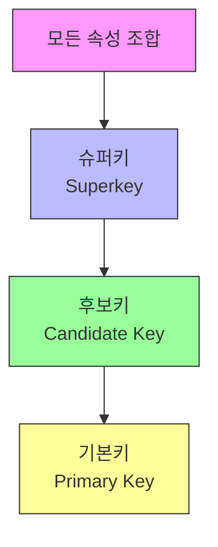
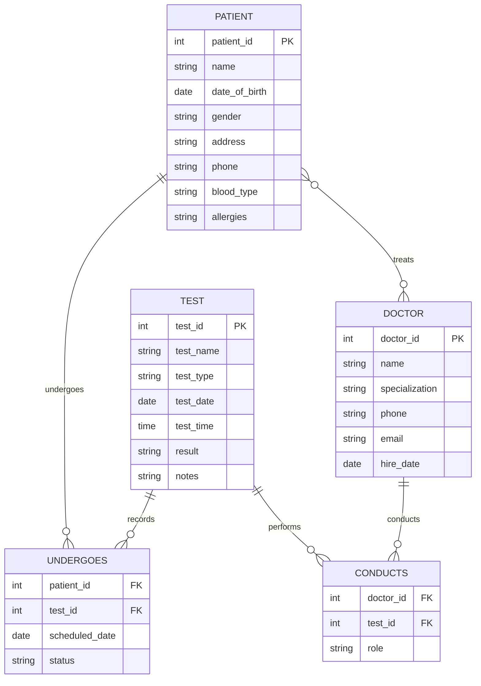
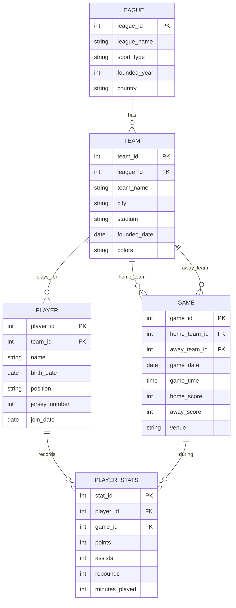
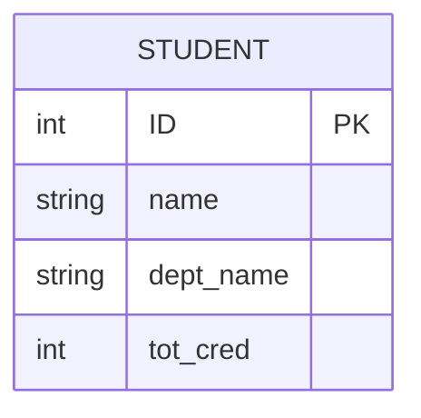
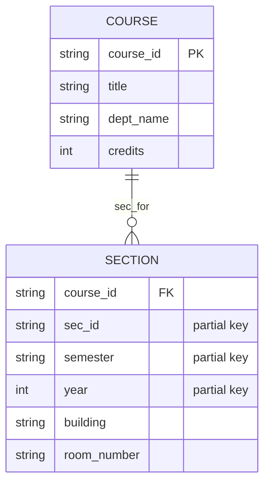

## 개요

이 포스트는 E-R(Entity-Relationship) 모델에 관한 연습 문제들(Exercises 6.14-6.19)의 상세한 해설을 제공합니다. 키의 종류, E-R 다이어그램 작성, 약한 개체 집합, 속성 배치 등 데이터베이스 설계의 핵심 개념들을 다룹니다.

---

## Exercise 6.14: Primary Key, Candidate Key, Superkey

### 문제
> Explain the distinctions among the terms primary key, candidate key, and superkey.

### 해설

#### 1. Superkey (슈퍼키)

**정의:** 개체를 **유일하게 식별**할 수 있는 속성들의 집합

**특징:**
- **유일성(Uniqueness)**: 두 개체가 같은 슈퍼키 값을 가질 수 없음
- **최소성 불요**: 불필요한 속성이 포함되어도 됨
- **여러 개 존재 가능**

**예시:**
```
student 개체:
- ID: 학번 (유일함)
- name: 이름
- email: 이메일 (유일함)
- phone: 전화번호

슈퍼키:
1. {ID}                           ✓ 유일하게 식별
2. {email}                        ✓ 유일하게 식별
3. {ID, name}                     ✓ 유일하게 식별 (불필요한 name 포함)
4. {ID, email}                    ✓ 유일하게 식별
5. {ID, name, email, phone}       ✓ 유일하게 식별 (모든 속성)
6. {name}                         ✗ 유일하지 않음 (동명이인 존재)
```

**수학적 표현:**
- 슈퍼키 K에 대해: ∀ e₁, e₂ ∈ E, e₁.K = e₂.K ⇒ e₁ = e₂

#### 2. Candidate Key (후보키)

**정의:** **최소성**을 만족하는 슈퍼키
- 유일성 ✓
- 최소성 ✓ (불필요한 속성 제거 불가)

**특징:**
- 모든 후보키는 슈퍼키
- 속성을 하나라도 제거하면 유일성을 잃음
- **여러 개 존재 가능**

**예시:**
```
student 개체:
- ID: 학번
- email: 이메일
- name: 이름
- phone: 전화번호

후보키:
1. {ID}       ✓ 최소 슈퍼키
2. {email}    ✓ 최소 슈퍼키

비후보키 (슈퍼키지만 최소가 아님):
- {ID, name}       ✗ name 제거 가능
- {ID, email}      ✗ 둘 중 하나 제거 가능
- {email, phone}   ✗ phone 제거 가능
```

**최소성 테스트:**
```
{ID, name}이 후보키인가?
→ name을 제거하면? {ID}만으로 유일성 보장
→ 최소가 아니므로 후보키 아님

{ID}가 후보키인가?
→ 제거할 속성 없음
→ 유일성 만족
→ 후보키 ✓
```

#### 3. Primary Key (기본키)

**정의:** 데이터베이스 설계자가 선택한 **하나의 후보키**

**특징:**
- 모든 후보키 중 **하나만 선택**
- **NOT NULL**: NULL 값 불허
- **불변성**: 값이 자주 변하지 않아야 함
- **간결성**: 가능한 한 적은 수의 속성

**선택 기준:**
1. **간결성**: 속성 수가 적은 것
2. **안정성**: 값이 거의 변하지 않는 것
3. **자연성**: 의미 있고 이해하기 쉬운 것
4. **NOT NULL**: 항상 값이 있는 것

**예시:**
```
student 개체:

후보키:
1. {ID}       → 학번 (숫자, 안정적, 간결)
2. {email}    → 이메일 (변경 가능, 길이 가변)

기본키 선택: {ID}
이유:
- 학번은 입학 시 부여되어 변하지 않음
- 짧고 고정 길이
- 이메일은 변경될 수 있음
```

### 관계 다이어그램



**포함 관계:**
- 기본키 ⊂ 후보키 ⊂ 슈퍼키 ⊂ 모든 속성 조합

### 비교 표

| 구분 | 슈퍼키 | 후보키 | 기본키 |
|------|--------|--------|--------|
| **유일성** | ✓ | ✓ | ✓ |
| **최소성** | ✗ | ✓ | ✓ |
| **개수** | 여러 개 | 여러 개 | **1개** |
| **NULL 허용** | 가능 | 가능 | **불가** |
| **선택** | 자동 | 자동 | **설계자가 선택** |

### 실제 예시

**instructor 테이블:**
```
instructor(ID, name, dept_name, salary)

슈퍼키 (예시):
- {ID}
- {ID, name}
- {ID, dept_name}
- {ID, name, dept_name, salary}

후보키:
- {ID}                    (유일하고 최소)

기본키:
- {ID}                    (후보키 중 선택)
```

**person 테이블:**
```
person(SSN, driver_license, passport_no, name, address)

슈퍼키:
- {SSN}
- {driver_license}
- {passport_no}
- {SSN, name}
- ...

후보키:
- {SSN}               (주민등록번호)
- {driver_license}    (운전면허 번호)
- {passport_no}       (여권 번호)

기본키:
- {SSN}               (선택)

이유:
- SSN은 모든 사람이 가짐 (NOT NULL)
- 운전면허/여권은 없을 수 있음
```

### 복합 키 예시

**takes 테이블:**
```
takes(student_ID, course_id, sec_id, semester, year, grade)

슈퍼키:
- {student_ID, course_id, sec_id, semester, year}
- {student_ID, course_id, sec_id, semester, year, grade}

후보키:
- {student_ID, course_id, sec_id, semester, year}

기본키:
- {student_ID, course_id, sec_id, semester, year}

설명:
- 한 학생이 같은 섹션을 여러 학기에 수강 가능
- 5개 속성이 모두 필요 (최소)
```

---

## Exercise 6.15: Hospital E-R Diagram

### 문제
> Construct an E-R diagram for a hospital with a set of patients and a set of medical doctors. Associate with each patient a log of the various tests and examinations conducted.

### 분석

**개체(Entity):**
1. **Patient**: 환자
2. **Doctor**: 의사
3. **Test**: 검사/시험

**관계(Relationship):**
1. **treats**: 의사가 환자를 진료
2. **undergoes**: 환자가 검사를 받음
3. **conducts**: 의사가 검사를 수행

### E-R 다이어그램



### 상세 설명

#### 개체 및 속성

**1. PATIENT (환자)**
```
patient(patient_id, name, date_of_birth, gender, address,
        phone, blood_type, allergies)

- patient_id: 환자 번호 (기본키)
- name: 이름
- date_of_birth: 생년월일
- gender: 성별
- address: 주소
- phone: 전화번호
- blood_type: 혈액형
- allergies: 알레르기 정보 (다중값 속성 가능)
```

**2. DOCTOR (의사)**
```
doctor(doctor_id, name, specialization, phone, email, hire_date)

- doctor_id: 의사 번호 (기본키)
- name: 이름
- specialization: 전문 분야 (내과, 외과 등)
- phone: 전화번호
- email: 이메일
- hire_date: 고용일
```

**3. TEST (검사)**
```
test(test_id, test_name, test_type, test_date, test_time,
     result, notes)

- test_id: 검사 번호 (기본키)
- test_name: 검사명 (혈액검사, X-ray 등)
- test_type: 검사 유형 (Lab, Imaging, Physical 등)
- test_date: 검사 날짜
- test_time: 검사 시간
- result: 검사 결과
- notes: 비고
```

#### 관계 및 카디널리티

**1. treats (의사 - 환자)**
- **카디널리티**: M:N (다대다)
- **이유**:
  - 한 의사는 여러 환자 진료
  - 한 환자는 여러 의사에게 진료 받을 수 있음
- **속성**: 진료 날짜, 진단, 처방

**2. undergoes (환자 - 검사)**
- **카디널리티**: M:N (다대다)
- **이유**:
  - 한 환자는 여러 검사 받음
  - 같은 검사를 여러 환자가 받음 (예: 혈액검사)
- **속성**: 예약 날짜, 상태 (예정/완료/취소)

**3. conducts (의사 - 검사)**
- **카디널리티**: M:N (다대다)
- **이유**:
  - 한 의사는 여러 검사 수행
  - 한 검사에 여러 의사 참여 가능 (복잡한 시술)
- **속성**: 역할 (주치의/보조)

### 관계 스키마 변환

```sql
-- 개체 테이블
CREATE TABLE patient (
    patient_id INT PRIMARY KEY,
    name VARCHAR(100) NOT NULL,
    date_of_birth DATE,
    gender CHAR(1),
    address VARCHAR(200),
    phone VARCHAR(20),
    blood_type VARCHAR(5),
    allergies TEXT
);

CREATE TABLE doctor (
    doctor_id INT PRIMARY KEY,
    name VARCHAR(100) NOT NULL,
    specialization VARCHAR(50),
    phone VARCHAR(20),
    email VARCHAR(100),
    hire_date DATE
);

CREATE TABLE test (
    test_id INT PRIMARY KEY,
    test_name VARCHAR(100) NOT NULL,
    test_type VARCHAR(50),
    test_date DATE,
    test_time TIME,
    result TEXT,
    notes TEXT
);

-- 관계 테이블
CREATE TABLE treats (
    doctor_id INT,
    patient_id INT,
    treatment_date DATE,
    diagnosis TEXT,
    prescription TEXT,
    PRIMARY KEY (doctor_id, patient_id, treatment_date),
    FOREIGN KEY (doctor_id) REFERENCES doctor(doctor_id),
    FOREIGN KEY (patient_id) REFERENCES patient(patient_id)
);

CREATE TABLE undergoes (
    patient_id INT,
    test_id INT,
    scheduled_date DATE,
    status VARCHAR(20),
    PRIMARY KEY (patient_id, test_id),
    FOREIGN KEY (patient_id) REFERENCES patient(patient_id),
    FOREIGN KEY (test_id) REFERENCES test(test_id)
);

CREATE TABLE conducts (
    doctor_id INT,
    test_id INT,
    role VARCHAR(50),
    PRIMARY KEY (doctor_id, test_id),
    FOREIGN KEY (doctor_id) REFERENCES doctor(doctor_id),
    FOREIGN KEY (test_id) REFERENCES test(test_id)
);
```

### 확장 가능성

**추가 개체:**
1. **Department**: 진료과 (내과, 외과 등)
2. **Appointment**: 예약
3. **Prescription**: 처방전
4. **Room**: 병실
5. **Equipment**: 의료 장비

**추가 관계:**
- Doctor **works_in** Department
- Patient **admitted_to** Room
- Test **uses** Equipment

---

## Exercise 6.16: League Team E-R Diagram Extension

### 문제
> Extend the E-R diagram of Exercise 6.3 to track the same information for all teams in a league.

**Exercise 6.3 가정:** 팀과 선수 관계 모델링

### 확장된 E-R 다이어그램



### 상세 설명

#### 1. LEAGUE (리그)
```
league(league_id, league_name, sport_type, founded_year, country)

예시:
- NBA (농구)
- Premier League (축구)
- KBO (야구)
```

#### 2. TEAM (팀)
```
team(team_id, league_id, team_name, city, stadium, founded_date, colors)

예시:
- Los Angeles Lakers (NBA)
- Manchester United (Premier League)
- 삼성 라이온즈 (KBO)
```

#### 3. PLAYER (선수)
```
player(player_id, team_id, name, birth_date, position,
       jersey_number, join_date)

예시:
- 선수: LeBron James
- 팀: Los Angeles Lakers
- 포지션: Forward
- 등번호: 23
```

#### 4. GAME (경기)
```
game(game_id, home_team_id, away_team_id, game_date, game_time,
     home_score, away_score, venue)

특징:
- home_team_id, away_team_id: 모두 team 참조
- 자기 참조(self-referencing) 관계
```

#### 5. PLAYER_STATS (선수 통계)
```
player_stats(stat_id, player_id, game_id, points, assists,
             rebounds, minutes_played)

특징:
- 각 경기에서 각 선수의 기록
- 시계열 데이터
```

### 제약 조건

```sql
-- 같은 팀끼리 경기 불가
ALTER TABLE game
ADD CONSTRAINT check_different_teams
CHECK (home_team_id != away_team_id);

-- 등번호는 팀 내 유일
ALTER TABLE player
ADD CONSTRAINT unique_jersey_per_team
UNIQUE (team_id, jersey_number);

-- 선수 통계는 해당 선수의 팀이 경기한 경우만
-- (복잡한 제약조건 - 애플리케이션 레벨에서 처리 권장)
```

### 쿼리 예시

**1. 리그별 팀 수:**
```sql
SELECT l.league_name, COUNT(t.team_id) AS team_count
FROM league l
LEFT JOIN team t ON l.league_id = t.league_id
GROUP BY l.league_id, l.league_name;
```

**2. 팀별 평균 득점:**
```sql
SELECT t.team_name,
       AVG(CASE WHEN g.home_team_id = t.team_id THEN g.home_score
                WHEN g.away_team_id = t.team_id THEN g.away_score
           END) AS avg_score
FROM team t
JOIN game g ON t.team_id = g.home_team_id OR t.team_id = g.away_team_id
GROUP BY t.team_id, t.team_name;
```

**3. 선수별 시즌 통계:**
```sql
SELECT p.name, p.position,
       SUM(ps.points) AS total_points,
       SUM(ps.assists) AS total_assists,
       COUNT(ps.game_id) AS games_played
FROM player p
JOIN player_stats ps ON p.player_id = ps.player_id
GROUP BY p.player_id, p.name, p.position;
```

---

## Exercise 6.17: Weak vs Strong Entity Set

### 문제
> Explain the difference between a weak and a strong entity set.

### Strong Entity Set (강한 개체 집합)

**정의:** 자신의 속성만으로 **독립적으로 식별 가능**한 개체 집합

**특징:**
1. **기본키 존재**: 자체 기본키를 가짐
2. **독립적 존재**: 다른 개체에 의존하지 않음
3. **사각형**으로 표현 (E-R 다이어그램)

**예시:**
```
student(ID, name, dept_name, tot_cred)
- ID가 기본키
- 다른 개체와 무관하게 학생 식별 가능

instructor(ID, name, dept_name, salary)
- ID가 기본키
- 독립적으로 교수 식별 가능
```

### Weak Entity Set (약한 개체 집합)

**정의:** 자신의 속성만으로는 식별 불가능하며, **소유 개체(owner entity)**에 의존하는 개체 집합

**특징:**
1. **부분 키(Partial Key)**: 소유 개체 내에서만 유일
2. **소유 개체 필요**: 다른 강한 개체에 의존
3. **이중 사각형**으로 표현
4. **식별 관계(Identifying Relationship)**: 이중 다이아몬드

**예시:**
```
section(course_id, sec_id, semester, year)
        ─────────  ──────
        외래키      부분키

- sec_id만으로는 섹션 식별 불가 (여러 과목에 sec_id=1 존재)
- course_id + sec_id + semester + year로 식별
- course가 소유 개체
```

### 비교 다이어그램

**Strong Entity:**


**Weak Entity:**


### 비교 표

| 특징 | Strong Entity | Weak Entity |
|------|---------------|-------------|
| **기본키** | 자체 속성으로 구성 | 소유 개체 키 + 부분 키 |
| **독립성** | 독립적으로 존재 | 소유 개체에 의존 |
| **표현** | 사각형 | 이중 사각형 |
| **관계** | 일반 관계 | 식별 관계 (이중 다이아몬드) |
| **존재 의존** | 없음 | 소유 개체 삭제 시 같이 삭제 |

### 실제 예시

#### 예시 1: Course와 Section

**Strong Entity: course**
```
course(course_id, title, dept_name, credits)
- course_id: 'CS-101', 'PHY-201' (유일)
```

**Weak Entity: section**
```
section(course_id, sec_id, semester, year, building, room_number)
- sec_id: '1', '2', '3' (과목 내에서만 유일)
- 식별자: {course_id, sec_id, semester, year}

예시:
- CS-101, 1, Fall, 2017 (유일함)
- PHY-201, 1, Fall, 2017 (유일함)
- sec_id='1'만으로는 어떤 섹션인지 알 수 없음
```

#### 예시 2: Employee와 Dependent

**Strong Entity: employee**
```
employee(emp_id, name, salary, dept_name)
- emp_id: 'E001', 'E002' (유일)
```

**Weak Entity: dependent**
```
dependent(emp_id, dependent_name, relationship)
- dependent_name: 부양가족 이름 (직원 내에서만 유일)
- 식별자: {emp_id, dependent_name}

예시:
- E001의 부양가족 'Alice'
- E002의 부양가족 'Alice' (다른 Alice)
- dependent_name='Alice'만으로는 누구의 부양가족인지 모름
```

### 왜 Weak Entity를 사용하는가?

#### 1. 자연스러운 모델링

```
예: 건물과 아파트
- 건물: 독립적으로 식별 (주소)
- 아파트: 건물 내 호수 (101호, 102호)
  → 다른 건물에도 101호 존재
  → 약한 개체가 자연스러움
```

#### 2. 부모-자식 관계

```
예: 주문과 주문 항목
- 주문: 주문 번호로 식별
- 주문 항목: 주문 내 순번
  → 항목 1, 항목 2, 항목 3
  → 주문 번호 없이는 의미 없음
```

#### 3. 중복 방지

```
Weak Entity 사용:
section(course_id, sec_id, semester, year)
- sec_id: 1, 2, 3 (짧고 간단)

Strong Entity로 변환 시:
section(section_id, course_id, semester, year)
- section_id: 'CS-101-1-Fall-2017'
  → 길고 복잡
  → course_id, semester, year 중복
```

### SQL 구현

```sql
-- Strong Entity
CREATE TABLE course (
    course_id VARCHAR(8) PRIMARY KEY,
    title VARCHAR(50),
    dept_name VARCHAR(20),
    credits NUMERIC(2,0)
);

-- Weak Entity
CREATE TABLE section (
    course_id VARCHAR(8),
    sec_id VARCHAR(8),
    semester VARCHAR(6),
    year NUMERIC(4,0),
    building VARCHAR(15),
    room_number VARCHAR(7),
    time_slot_id VARCHAR(4),
    PRIMARY KEY (course_id, sec_id, semester, year),
    FOREIGN KEY (course_id) REFERENCES course(course_id)
        ON DELETE CASCADE  -- 소유 개체 삭제 시 같이 삭제
);
```

**ON DELETE CASCADE:**
- course 삭제 시 해당 course의 모든 section 자동 삭제
- 약한 개체의 존재 의존성 구현

---

## Exercise 6.18: Shared Attribute X

### 문제
> Consider two entity sets A and B that both have the attribute X (among others whose names are not relevant to this question).

### Part A: Completely Unrelated X

**문제:** If the two X s are completely unrelated, how should the design be improved?

**해결책: 속성 이름 변경**

**문제 상황:**
```
A(A_id, X, ...)
B(B_id, X, ...)

X가 완전히 다른 의미:
- A.X: 나이 (age)
- B.X: 수량 (quantity)
```

**개선된 설계:**
```
A(A_id, age, ...)
B(B_id, quantity, ...)

또는 의미 있는 접두사:
A(A_id, A_attribute, ...)
B(B_id, B_attribute, ...)
```

**이유:**
1. **명확성**: 속성의 의미가 명확해짐
2. **혼란 방지**: 같은 이름으로 인한 오해 제거
3. **유지보수**: 코드 이해 용이

### Part B: Same Property X

**문제:** If the two Xs represent the same property and it is one that applies both to A and to B, how should the design be improved?

#### Case 1: X is the primary key for A but not B

**예시:**
```
employee(employee_id, name, department_id, ...)
department(department_id, name, budget, ...)

employee_id: employee의 기본키
department_id: employee의 외래키, department의 기본키
```

**설계:**
- **현재 상태 유지** 또는 **일관된 명명**
- 외래키라는 것을 명시:

```
employee(employee_id, name, dept_id, ...)
                            ────────
                            dept_id는 department_id를 참조
```

**권장 사항:**
```sql
-- 명확한 외래키 명명
CREATE TABLE employee (
    employee_id INT PRIMARY KEY,
    name VARCHAR(100),
    department_id INT,  -- 같은 이름 사용
    FOREIGN KEY (department_id) REFERENCES department(department_id)
);

-- 또는 접두사로 구분
CREATE TABLE employee (
    employee_id INT PRIMARY KEY,
    name VARCHAR(100),
    dept_id INT,  -- 짧게
    FOREIGN KEY (dept_id) REFERENCES department(department_id)
);
```

#### Case 2: X is the primary key for both A and B

**예시:**
```
person(person_id, name, ...)
employee(person_id, salary, hire_date, ...)

person_id: 두 테이블의 기본키
employee는 person의 특수화 (ISA 관계)
```

**설계: ISA (특수화/일반화) 관계**

```mermaid
erDiagram
    PERSON ||--o| EMPLOYEE : "is_a"

    PERSON {
        int person_id PK
        string name
        date birth_date
    }

    EMPLOYEE {
        int person_id PK_FK
        decimal salary
        date hire_date
    }
```

**SQL 구현:**
```sql
CREATE TABLE person (
    person_id INT PRIMARY KEY,
    name VARCHAR(100),
    birth_date DATE
);

CREATE TABLE employee (
    person_id INT PRIMARY KEY,
    salary NUMERIC(10,2),
    hire_date DATE,
    FOREIGN KEY (person_id) REFERENCES person(person_id)
        ON DELETE CASCADE
);

-- employee.person_id는 person.person_id의 부분집합
```

**특징:**
- 모든 employee는 person
- employee 테이블은 추가 속성만 포함
- person 삭제 시 employee도 삭제

#### Case 3: X is not the primary key for A nor for B

**예시:**
```
student(student_id, email, ...)
instructor(instructor_id, email, ...)

email: 두 테이블에 있지만 기본키 아님
```

**설계 옵션:**

**Option 1: 현재 상태 유지**
```sql
-- 각 테이블에 email 속성
CREATE TABLE student (
    student_id INT PRIMARY KEY,
    email VARCHAR(100),
    ...
);

CREATE TABLE instructor (
    instructor_id INT PRIMARY KEY,
    email VARCHAR(100),
    ...
);
```

**장점:** 간단하고 직관적
**단점:** email이 중복될 수 있음 (학생이 강사인 경우)

**Option 2: 공통 속성 분리 (Supertype)**
```sql
-- person 테이블로 일반화
CREATE TABLE person (
    person_id INT PRIMARY KEY,
    email VARCHAR(100) UNIQUE,
    person_type VARCHAR(20)  -- 'student' or 'instructor'
);

CREATE TABLE student (
    student_id INT PRIMARY KEY,
    person_id INT UNIQUE,
    dept_name VARCHAR(20),
    FOREIGN KEY (person_id) REFERENCES person(person_id)
);

CREATE TABLE instructor (
    instructor_id INT PRIMARY KEY,
    person_id INT UNIQUE,
    dept_name VARCHAR(20),
    salary NUMERIC(10,2),
    FOREIGN KEY (person_id) REFERENCES person(person_id)
);
```

**장점:**
- email 중복 없음
- 같은 사람이 학생이면서 강사일 수 있음

**단점:**
- 구조 복잡
- 조인 필요

**Option 3: 제약조건으로 관리**
```sql
-- 원래 구조 유지하되, 같은 email은 없도록
CREATE UNIQUE INDEX unique_email_student ON student(email);
CREATE UNIQUE INDEX unique_email_instructor ON instructor(email);

-- 또는 체크 제약조건 (애플리케이션 레벨)
```

**권장 사항:**
- **데이터 특성에 따라 선택**
- 중복 가능성 낮으면: Option 1
- 한 사람이 여러 역할: Option 2
- 중복 허용 안 함: Option 3

---

## Exercise 6.19: Why Use Weak Entity Sets?

### 문제
> We can convert any weak entity set to a strong entity set by simply adding appropriate attributes. Why, then, do we have weak entity sets?

### 변환 예시

**Weak Entity (원래):**
```
course(course_id, title, ...)
section(course_id, sec_id, semester, year, ...)
        ────────  ──────  ────────  ────
        외래키     부분키   부분키    부분키
```

**Strong Entity (변환):**
```
course(course_id, title, ...)
section(section_id, course_id, sec_id, semester, year, ...)
        ──────────  ────────
        기본키       외래키

section_id = course_id + "-" + sec_id + "-" + semester + "-" + year
예: "CS-101-1-Fall-2017"
```

### Weak Entity를 사용하는 이유

#### 1. 자연스러운 모델링

**예: 건물과 아파트**

**Weak Entity (자연스러움):**
```
building(building_id, address, ...)
apartment(building_id, apt_number, ...)
          ───────────  ──────────
          소유 개체    부분키

- apt_number: 101, 102, 103 (건물 내 호수)
- 자연스럽고 이해하기 쉬움
```

**Strong Entity (부자연스러움):**
```
building(building_id, address, ...)
apartment(apartment_id, building_id, apt_number, ...)
          ────────────
          복합 인공 키

- apartment_id: "BLD1-101", "BLD1-102"
- 불필요하게 복잡
- building_id와 apt_number의 중복
```

#### 2. 중복 제거

**Weak Entity:**
```
order(order_id, customer_id, order_date, ...)
order_item(order_id, item_number, product_id, quantity, ...)
           ────────  ───────────
           소유 개체   부분키

- item_number: 1, 2, 3, 4 (주문 내 순번)
- 간결하고 중복 없음
```

**Strong Entity:**
```
order(order_id, customer_id, order_date, ...)
order_item(item_id, order_id, item_number, product_id, quantity, ...)
           ───────  ────────  ───────────
           인공 키   중복       중복

- item_id: "ORD1-1", "ORD1-2", "ORD2-1"
- order_id와 item_number가 item_id에 중복 포함
```

#### 3. 의미론적 명확성

**Weak Entity:**
```
- section은 course 없이 존재 불가능
- 의존 관계가 명확히 표현됨
- ON DELETE CASCADE 자연스러움
```

**Strong Entity:**
```
- section이 독립적으로 보임
- 의존 관계가 숨겨짐
- 관계의 본질이 불명확
```

#### 4. 무결성 유지

**Weak Entity:**
```sql
CREATE TABLE section (
    course_id VARCHAR(8),
    sec_id VARCHAR(8),
    semester VARCHAR(6),
    year NUMERIC(4,0),
    PRIMARY KEY (course_id, sec_id, semester, year),
    FOREIGN KEY (course_id) REFERENCES course(course_id)
        ON DELETE CASCADE
);

-- course 삭제 시 section 자동 삭제
-- 고아 레코드(orphan) 방지
```

**Strong Entity:**
```sql
CREATE TABLE section (
    section_id VARCHAR(50) PRIMARY KEY,
    course_id VARCHAR(8),
    sec_id VARCHAR(8),
    semester VARCHAR(6),
    year NUMERIC(4,0),
    FOREIGN KEY (course_id) REFERENCES course(course_id)
        ON DELETE CASCADE
);

-- section_id를 관리해야 함
-- 중복 정보 유지 필요
```

#### 5. 성능

**Weak Entity:**
```
기본키: (course_id, sec_id, semester, year)
- 각각 짧은 값
- 인덱스 효율적
```

**Strong Entity:**
```
기본키: section_id
- 긴 문자열: "CS-101-1-Fall-2017"
- 인덱스 크기 증가
- 비교 연산 느림
```

### 비교 표

| 측면 | Weak Entity | Strong Entity |
|------|-------------|---------------|
| **자연스러움** | ✓ 의존 관계 명확 | ✗ 인공적 |
| **중복** | ✓ 최소화 | ✗ 정보 중복 |
| **무결성** | ✓ 자동 CASCADE | 수동 관리 필요 |
| **간결성** | ✓ 짧은 키 | ✗ 긴 복합 키 |
| **의미** | ✓ 명확한 의존성 | 불명확 |

### 결론

Weak Entity는 단순히 기술적 제약이 아니라 **의미론적 설계 선택**입니다:

1. **자연스러운 모델링**: 실세계 의존 관계 반영
2. **중복 제거**: 불필요한 정보 중복 방지
3. **무결성 보장**: 자동 CASCADE로 일관성 유지
4. **가독성 향상**: 설계 의도가 명확히 드러남
5. **성능 최적화**: 짧은 키로 효율적 인덱싱

**"추가 속성으로 변환 가능하다"는 것이 "변환해야 한다"를 의미하지 않습니다.**

---

## 핵심 개념 정리

### 1. 키의 종류
- **Superkey**: 유일성 ✓, 최소성 ✗
- **Candidate Key**: 유일성 ✓, 최소성 ✓
- **Primary Key**: 선택된 하나의 후보키

### 2. E-R 다이어그램 작성
- **개체 식별**: 명사 찾기
- **관계 식별**: 동사 찾기
- **카디널리티 결정**: 1:1, 1:N, M:N
- **속성 배치**: 적절한 위치 결정

### 3. Weak vs Strong Entity
- **Strong**: 독립적 식별 가능
- **Weak**: 소유 개체 의존
- **용도**: 자연스러운 의존 관계 모델링

### 4. 속성 공유
- **완전히 다른 의미**: 이름 변경
- **같은 의미**:
  - 기본키-외래키: 일관된 명명
  - 양쪽 기본키: ISA 관계
  - 비기본키: 상황에 따라 분리 또는 유지

---

## 참고 자료

- Database System Concepts (7th Edition) - Silberschatz, Korth, Sudarshan
- "Database Design and Relational Theory" - C.J. Date
- "The Entity-Relationship Model" - Peter Chen (1976)

---

## 다음 단계

**Part 2 (Exercises 6.20-6.23)에서 다룰 내용:**
- E-R 다이어그램의 관계 스키마 변환
- 실무 데이터베이스 설계 (자동차 회사, 택배 회사, 항공사)
- 복잡한 카디널리티와 제약조건 처리
