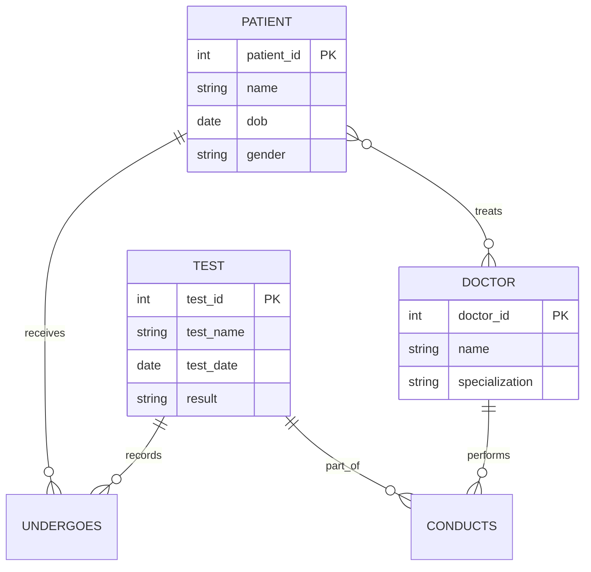
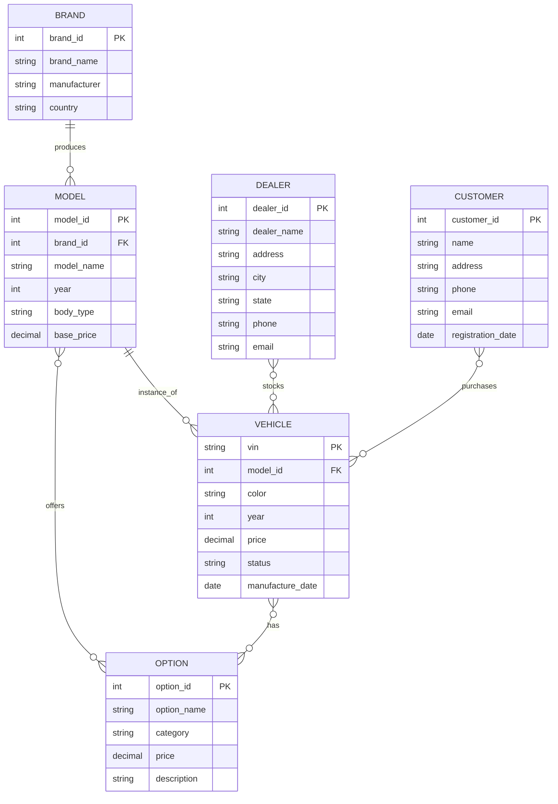
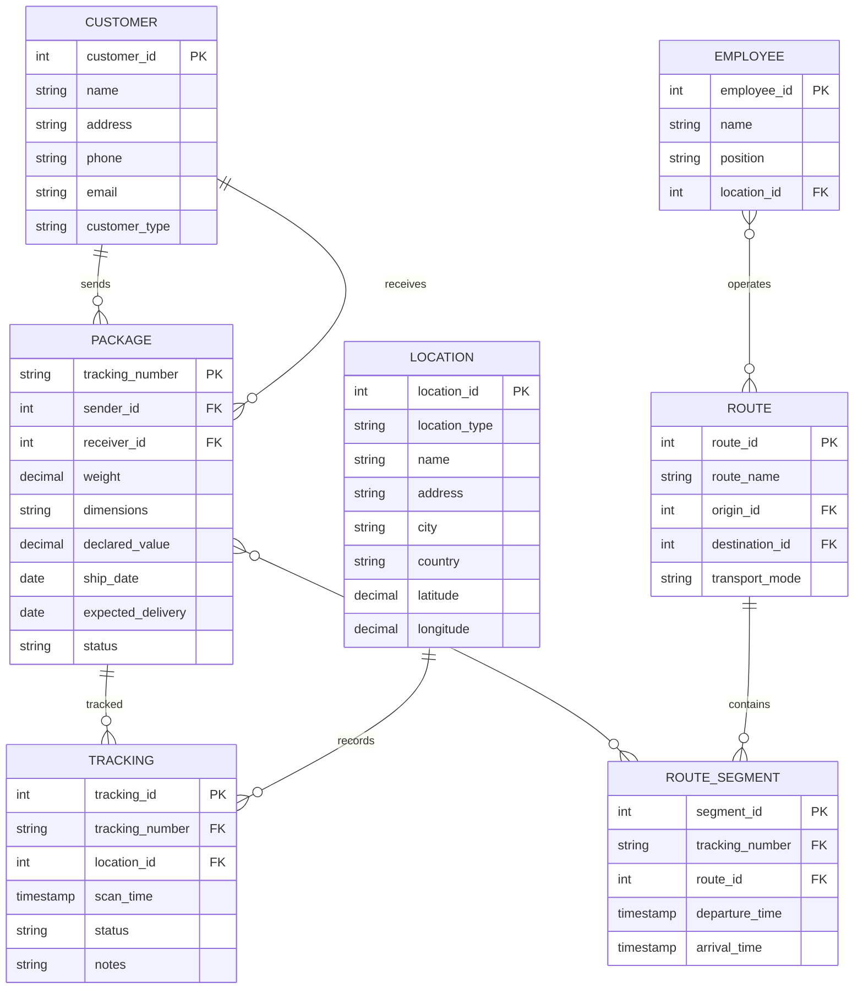

## 개요

이 포스트는 E-R 모델의 실무 적용에 관한 연습 문제들(Exercises 6.20-6.23)의 상세한 해설을 제공합니다. E-R 다이어그램을 관계 스키마로 변환하는 방법과 자동차 회사, 택배 회사, 항공사 등 실제 시스템의 데이터베이스 설계를 다룹니다.

---

## Exercise 6.20: E-R Diagram to Relational Schema Conversion

### 문제
> Construct appropriate relation schemas for each of the E-R diagrams in:
> a. Exercise 6.1
> b. Exercise 6.2
> c. Exercise 6.3
> d. Exercise 6.15

### 변환 규칙

#### 규칙 1: Strong Entity → 테이블

**E-R:**
```
[Student]
- student_id (PK)
- name
- dept_name
```

**Relational Schema:**
```sql
CREATE TABLE student (
    student_id INT PRIMARY KEY,
    name VARCHAR(100) NOT NULL,
    dept_name VARCHAR(50)
);
```

#### 규칙 2: Weak Entity → 테이블 (소유 개체 키 포함)

**E-R:**
```
[Course] ═══ [Section]
         owns
```

**Relational Schema:**
```sql
CREATE TABLE section (
    course_id VARCHAR(8),
    sec_id VARCHAR(8),
    semester VARCHAR(6),
    year NUMERIC(4,0),
    PRIMARY KEY (course_id, sec_id, semester, year),
    FOREIGN KEY (course_id) REFERENCES course(course_id)
        ON DELETE CASCADE
);
```

#### 규칙 3: 1:1 관계 → 한쪽에 외래키 추가

**E-R:**
```
[Department] ─── manages ─── [Instructor]
             1:1
```

**Relational Schema:**
```sql
CREATE TABLE department (
    dept_name VARCHAR(50) PRIMARY KEY,
    building VARCHAR(50),
    budget NUMERIC(12,2),
    dept_head INT,  -- instructor의 ID
    FOREIGN KEY (dept_head) REFERENCES instructor(ID)
);
```

#### 규칙 4: M:N 관계 → 별도 연관 테이블

**E-R:**
```
[Student] ─── takes ─── [Course]
          M:N
```

**Relational Schema:**
```sql
CREATE TABLE takes (
    student_id INT,
    course_id VARCHAR(8),
    semester VARCHAR(6),
    year NUMERIC(4,0),
    grade VARCHAR(2),
    PRIMARY KEY (student_id, course_id, semester, year),
    FOREIGN KEY (student_id) REFERENCES student(student_id),
    FOREIGN KEY (course_id) REFERENCES course(course_id)
);
```

#### 규칙 5: 1:N 관계 → N쪽에 외래키

**E-R:**
```
[Department] ─── has ─── [Student]
             1:N
```

**Relational Schema:**
```sql
CREATE TABLE student (
    student_id INT PRIMARY KEY,
    name VARCHAR(100),
    dept_name VARCHAR(50),
    FOREIGN KEY (dept_name) REFERENCES department(dept_name)
);
```

### Part D: Hospital Database (Exercise 6.15)

**E-R 다이어그램:**


**Relational Schemas:**

```sql
-- Strong Entities
CREATE TABLE patient (
    patient_id INT PRIMARY KEY,
    name VARCHAR(100) NOT NULL,
    date_of_birth DATE,
    gender CHAR(1),
    address VARCHAR(200),
    phone VARCHAR(20),
    blood_type VARCHAR(5)
);

CREATE TABLE doctor (
    doctor_id INT PRIMARY KEY,
    name VARCHAR(100) NOT NULL,
    specialization VARCHAR(50),
    phone VARCHAR(20),
    email VARCHAR(100)
);

CREATE TABLE test (
    test_id INT PRIMARY KEY,
    test_name VARCHAR(100) NOT NULL,
    test_type VARCHAR(50),
    test_date DATE NOT NULL,
    test_time TIME,
    result TEXT,
    notes TEXT
);

-- M:N Relationships
CREATE TABLE treats (
    doctor_id INT,
    patient_id INT,
    treatment_date DATE,
    diagnosis TEXT,
    prescription TEXT,
    PRIMARY KEY (doctor_id, patient_id, treatment_date),
    FOREIGN KEY (doctor_id) REFERENCES doctor(doctor_id),
    FOREIGN KEY (patient_id) REFERENCES patient(patient_id)
);

CREATE TABLE undergoes (
    patient_id INT,
    test_id INT,
    scheduled_date DATE,
    status VARCHAR(20),
    PRIMARY KEY (patient_id, test_id),
    FOREIGN KEY (patient_id) REFERENCES patient(patient_id),
    FOREIGN KEY (test_id) REFERENCES test(test_id)
);

CREATE TABLE conducts (
    doctor_id INT,
    test_id INT,
    role VARCHAR(50),  -- 'primary', 'assistant'
    PRIMARY KEY (doctor_id, test_id),
    FOREIGN KEY (doctor_id) REFERENCES doctor(doctor_id),
    FOREIGN KEY (test_id) REFERENCES test(test_id)
);
```

---

## Exercise 6.22: Automobile Company Database

### 문제
> Design a database for an automobile company to provide to its dealers to assist them in maintaining customer records and dealer inventory and to assist sales staff in ordering cars.

### 요구사항 분석

**핵심 개체:**
1. **Brand**: 브랜드 (예: Jaguar, BMW)
2. **Model**: 모델 (예: XF, 3 Series)
3. **Option**: 옵션 (예: 선루프, 가죽 시트)
4. **Vehicle**: 개별 차량 (VIN으로 식별)
5. **Dealer**: 딜러
6. **Customer**: 고객

**관계:**
- Brand **has** Model (1:N)
- Model **offers** Option (M:N)
- Vehicle **is_a** Model (N:1)
- Vehicle **has** Option (M:N)
- Dealer **stocks** Vehicle (M:N)
- Customer **purchases** Vehicle (M:N)

### E-R 다이어그램



### Relational Schemas

```sql
-- Brand (브랜드)
CREATE TABLE brand (
    brand_id INT PRIMARY KEY,
    brand_name VARCHAR(50) NOT NULL UNIQUE,
    manufacturer VARCHAR(100),
    country VARCHAR(50)
);

-- Model (모델)
CREATE TABLE model (
    model_id INT PRIMARY KEY,
    brand_id INT NOT NULL,
    model_name VARCHAR(50) NOT NULL,
    year INT NOT NULL,
    body_type VARCHAR(30),  -- Sedan, SUV, Coupe, etc.
    base_price NUMERIC(10,2) NOT NULL,
    engine_type VARCHAR(50),
    fuel_type VARCHAR(20),
    FOREIGN KEY (brand_id) REFERENCES brand(brand_id),
    UNIQUE (brand_id, model_name, year)
);

-- Option (옵션)
CREATE TABLE option (
    option_id INT PRIMARY KEY,
    option_name VARCHAR(100) NOT NULL,
    category VARCHAR(50),  -- Interior, Exterior, Safety, Technology
    price NUMERIC(8,2) NOT NULL,
    description TEXT
);

-- Model_Option (모델이 제공 가능한 옵션)
CREATE TABLE model_option (
    model_id INT,
    option_id INT,
    is_standard BOOLEAN DEFAULT FALSE,  -- 기본 포함 여부
    PRIMARY KEY (model_id, option_id),
    FOREIGN KEY (model_id) REFERENCES model(model_id),
    FOREIGN KEY (option_id) REFERENCES option(option_id)
);

-- Vehicle (개별 차량)
CREATE TABLE vehicle (
    vin VARCHAR(17) PRIMARY KEY,  -- Vehicle Identification Number
    model_id INT NOT NULL,
    color VARCHAR(30),
    year INT NOT NULL,
    price NUMERIC(10,2) NOT NULL,
    status VARCHAR(20) DEFAULT 'Available',  -- Available, Sold, On Order
    manufacture_date DATE,
    FOREIGN KEY (model_id) REFERENCES model(model_id),
    CHECK (status IN ('Available', 'Sold', 'On Order', 'In Transit'))
);

-- Vehicle_Option (개별 차량이 실제로 가진 옵션)
CREATE TABLE vehicle_option (
    vin VARCHAR(17),
    option_id INT,
    PRIMARY KEY (vin, option_id),
    FOREIGN KEY (vin) REFERENCES vehicle(vin) ON DELETE CASCADE,
    FOREIGN KEY (option_id) REFERENCES option(option_id)
);

-- Dealer (딜러)
CREATE TABLE dealer (
    dealer_id INT PRIMARY KEY,
    dealer_name VARCHAR(100) NOT NULL,
    address VARCHAR(200),
    city VARCHAR(50),
    state VARCHAR(50),
    zip_code VARCHAR(10),
    phone VARCHAR(20),
    email VARCHAR(100),
    license_number VARCHAR(50) UNIQUE
);

-- Dealer_Inventory (딜러 재고)
CREATE TABLE dealer_inventory (
    dealer_id INT,
    vin VARCHAR(17),
    acquisition_date DATE,
    listing_price NUMERIC(10,2),
    PRIMARY KEY (dealer_id, vin),
    FOREIGN KEY (dealer_id) REFERENCES dealer(dealer_id),
    FOREIGN KEY (vin) REFERENCES vehicle(vin)
);

-- Customer (고객)
CREATE TABLE customer (
    customer_id INT PRIMARY KEY,
    name VARCHAR(100) NOT NULL,
    address VARCHAR(200),
    city VARCHAR(50),
    state VARCHAR(50),
    zip_code VARCHAR(10),
    phone VARCHAR(20),
    email VARCHAR(100),
    registration_date DATE DEFAULT CURRENT_DATE
);

-- Purchase (구매 거래)
CREATE TABLE purchase (
    purchase_id INT PRIMARY KEY,
    customer_id INT NOT NULL,
    vin VARCHAR(17) NOT NULL,
    dealer_id INT NOT NULL,
    purchase_date DATE NOT NULL,
    purchase_price NUMERIC(10,2) NOT NULL,
    payment_method VARCHAR(50),
    trade_in_vin VARCHAR(17),  -- 교환 차량
    trade_in_value NUMERIC(10,2),
    FOREIGN KEY (customer_id) REFERENCES customer(customer_id),
    FOREIGN KEY (vin) REFERENCES vehicle(vin),
    FOREIGN KEY (dealer_id) REFERENCES dealer(dealer_id),
    FOREIGN KEY (trade_in_vin) REFERENCES vehicle(vin),
    UNIQUE (vin)  -- 한 차량은 한 번만 판매
);

-- Order (주문)
CREATE TABLE vehicle_order (
    order_id INT PRIMARY KEY,
    customer_id INT NOT NULL,
    dealer_id INT NOT NULL,
    model_id INT NOT NULL,
    color VARCHAR(30),
    order_date DATE NOT NULL,
    expected_delivery DATE,
    status VARCHAR(20) DEFAULT 'Pending',
    FOREIGN KEY (customer_id) REFERENCES customer(customer_id),
    FOREIGN KEY (dealer_id) REFERENCES dealer(dealer_id),
    FOREIGN KEY (model_id) REFERENCES model(model_id),
    CHECK (status IN ('Pending', 'Confirmed', 'In Production', 'Delivered', 'Cancelled'))
);

-- Order_Option (주문 차량의 옵션)
CREATE TABLE order_option (
    order_id INT,
    option_id INT,
    PRIMARY KEY (order_id, option_id),
    FOREIGN KEY (order_id) REFERENCES vehicle_order(order_id) ON DELETE CASCADE,
    FOREIGN KEY (option_id) REFERENCES option(option_id)
);
```

### 제약조건

```sql
-- 1. Vehicle의 옵션은 해당 Model이 제공하는 옵션이어야 함
-- (복잡한 제약조건 - 트리거 또는 애플리케이션 레벨에서 처리)

-- 2. 판매된 차량은 재고에서 제거
CREATE TRIGGER after_purchase
AFTER INSERT ON purchase
FOR EACH ROW
BEGIN
    UPDATE vehicle SET status = 'Sold' WHERE vin = NEW.vin;
    DELETE FROM dealer_inventory WHERE vin = NEW.vin;
END;

-- 3. 주문의 옵션은 해당 Model이 제공하는 옵션이어야 함
-- (애플리케이션 레벨에서 검증)
```

### 예시 데이터

```sql
-- Brand
INSERT INTO brand VALUES (1, 'Jaguar', 'Tata Motors', 'UK');
INSERT INTO brand VALUES (2, 'BMW', 'BMW Group', 'Germany');

-- Model
INSERT INTO model VALUES (1, 1, 'XF', 2024, 'Sedan', 55000, 'V6', 'Gasoline');
INSERT INTO model VALUES (2, 2, '3 Series', 2024, 'Sedan', 45000, 'I4', 'Gasoline');

-- Option
INSERT INTO option VALUES (1, 'Sunroof', 'Exterior', 1200, 'Panoramic sunroof');
INSERT INTO option VALUES (2, 'Leather Seats', 'Interior', 2000, 'Premium leather seats');
INSERT INTO option VALUES (3, 'Navigation', 'Technology', 1500, 'GPS navigation system');

-- Model_Option (XF는 모든 옵션 제공)
INSERT INTO model_option VALUES (1, 1, FALSE);
INSERT INTO model_option VALUES (1, 2, TRUE);  -- 기본 포함
INSERT INTO model_option VALUES (1, 3, FALSE);

-- Vehicle
INSERT INTO vehicle VALUES ('1HGBH41JXMN109186', 1, 'Black', 2024, 58000, 'Available', '2024-01-15');

-- Vehicle_Option (실제로 장착된 옵션)
INSERT INTO vehicle_option VALUES ('1HGBH41JXMN109186', 1);  -- Sunroof
INSERT INTO vehicle_option VALUES ('1HGBH41JXMN109186', 2);  -- Leather (기본)
```

### 유용한 쿼리

```sql
-- 1. 특정 모델의 사용 가능한 모든 옵션
SELECT o.option_name, o.price, mo.is_standard
FROM option o
JOIN model_option mo ON o.option_id = mo.option_id
WHERE mo.model_id = 1;

-- 2. 딜러별 재고 현황
SELECT d.dealer_name, m.model_name, COUNT(*) AS count
FROM dealer d
JOIN dealer_inventory di ON d.dealer_id = di.dealer_id
JOIN vehicle v ON di.vin = v.vin
JOIN model m ON v.model_id = m.model_id
WHERE v.status = 'Available'
GROUP BY d.dealer_id, m.model_id;

-- 3. 고객 구매 이력
SELECT c.name, m.brand_name, m.model_name, p.purchase_date, p.purchase_price
FROM customer c
JOIN purchase p ON c.customer_id = p.customer_id
JOIN vehicle v ON p.vin = v.vin
JOIN model m ON v.model_id = m.model_id
JOIN brand b ON m.brand_id = b.brand_id
WHERE c.customer_id = 1;
```

---

## Exercise 6.23: Package Delivery Database

### 문제
> Design a database for a worldwide package delivery company (e.g., DHL or FedEx).

### 요구사항 분석

**핵심 개체:**
1. **Customer**: 고객 (발송자/수령자)
2. **Package**: 소포
3. **Location**: 위치 (창고, 공항, 차량, 비행기)
4. **Shipment**: 배송
5. **Route**: 경로
6. **Employee**: 직원

**관계:**
- Customer **sends** Package (1:N)
- Customer **receives** Package (1:N)
- Package **tracked_at** Location (M:N, 시간 정보)
- Package **transported_by** Route (M:N)

### E-R 다이어그램



### Relational Schemas

```sql
-- Customer (고객)
CREATE TABLE customer (
    customer_id INT PRIMARY KEY,
    name VARCHAR(100) NOT NULL,
    address VARCHAR(200),
    city VARCHAR(50),
    state VARCHAR(50),
    country VARCHAR(50),
    zip_code VARCHAR(20),
    phone VARCHAR(20),
    email VARCHAR(100),
    customer_type VARCHAR(20),  -- 'Individual', 'Business'
    registration_date DATE DEFAULT CURRENT_DATE
);

-- Location (위치)
CREATE TABLE location (
    location_id INT PRIMARY KEY,
    location_type VARCHAR(20) NOT NULL,  -- 'Warehouse', 'Airport', 'Hub', 'Vehicle', 'Plane'
    name VARCHAR(100) NOT NULL,
    address VARCHAR(200),
    city VARCHAR(50),
    state VARCHAR(50),
    country VARCHAR(50) NOT NULL,
    zip_code VARCHAR(20),
    latitude DECIMAL(10, 8),
    longitude DECIMAL(11, 8),
    capacity INT,  -- 수용 가능 소포 수
    CHECK (location_type IN ('Warehouse', 'Airport', 'Hub', 'Truck', 'Plane', 'Delivery_Van'))
);

-- Package (소포)
CREATE TABLE package (
    tracking_number VARCHAR(50) PRIMARY KEY,
    sender_id INT NOT NULL,
    receiver_id INT NOT NULL,
    sender_address VARCHAR(200) NOT NULL,
    receiver_address VARCHAR(200) NOT NULL,
    weight DECIMAL(8, 2) NOT NULL,  -- kg
    length DECIMAL(6, 2),  -- cm
    width DECIMAL(6, 2),
    height DECIMAL(6, 2),
    declared_value DECIMAL(10, 2),
    ship_date DATE NOT NULL,
    expected_delivery DATE,
    actual_delivery DATE,
    status VARCHAR(30) DEFAULT 'Processing',
    service_type VARCHAR(30),  -- 'Standard', 'Express', 'Overnight'
    insurance BOOLEAN DEFAULT FALSE,
    signature_required BOOLEAN DEFAULT FALSE,
    FOREIGN KEY (sender_id) REFERENCES customer(customer_id),
    FOREIGN KEY (receiver_id) REFERENCES customer(customer_id),
    CHECK (sender_id != receiver_id),
    CHECK (status IN ('Processing', 'In Transit', 'Out for Delivery', 'Delivered', 'Exception', 'Returned')),
    CHECK (weight > 0)
);

-- Tracking (추적 이력)
CREATE TABLE tracking (
    tracking_id INT PRIMARY KEY,
    tracking_number VARCHAR(50) NOT NULL,
    location_id INT NOT NULL,
    scan_time TIMESTAMP NOT NULL DEFAULT CURRENT_TIMESTAMP,
    status VARCHAR(30) NOT NULL,
    notes TEXT,
    scanned_by INT,  -- employee_id
    FOREIGN KEY (tracking_number) REFERENCES package(tracking_number) ON DELETE CASCADE,
    FOREIGN KEY (location_id) REFERENCES location(location_id),
    INDEX idx_tracking_number (tracking_number),
    INDEX idx_scan_time (scan_time)
);

-- Route (경로)
CREATE TABLE route (
    route_id INT PRIMARY KEY,
    route_name VARCHAR(100),
    origin_id INT NOT NULL,
    destination_id INT NOT NULL,
    transport_mode VARCHAR(20) NOT NULL,  -- 'Ground', 'Air', 'Sea'
    estimated_duration INT,  -- hours
    distance DECIMAL(10, 2),  -- km
    FOREIGN KEY (origin_id) REFERENCES location(location_id),
    FOREIGN KEY (destination_id) REFERENCES location(location_id),
    CHECK (origin_id != destination_id),
    CHECK (transport_mode IN ('Ground', 'Air', 'Sea'))
);

-- Route_Segment (소포가 이동한 경로 구간)
CREATE TABLE route_segment (
    segment_id INT PRIMARY KEY,
    tracking_number VARCHAR(50) NOT NULL,
    route_id INT NOT NULL,
    sequence_number INT NOT NULL,  -- 경로 순서
    departure_time TIMESTAMP,
    arrival_time TIMESTAMP,
    status VARCHAR(20) DEFAULT 'Scheduled',
    FOREIGN KEY (tracking_number) REFERENCES package(tracking_number),
    FOREIGN KEY (route_id) REFERENCES route(route_id),
    UNIQUE (tracking_number, sequence_number),
    CHECK (status IN ('Scheduled', 'In Progress', 'Completed', 'Delayed'))
);

-- Employee (직원)
CREATE TABLE employee (
    employee_id INT PRIMARY KEY,
    name VARCHAR(100) NOT NULL,
    position VARCHAR(50),  -- 'Driver', 'Sorter', 'Manager', 'Pilot'
    hire_date DATE,
    location_id INT,
    phone VARCHAR(20),
    email VARCHAR(100),
    FOREIGN KEY (location_id) REFERENCES location(location_id)
);

-- Vehicle (차량/항공기)
CREATE TABLE vehicle (
    vehicle_id INT PRIMARY KEY,
    vehicle_type VARCHAR(20),  -- 'Truck', 'Van', 'Plane', 'Ship'
    license_plate VARCHAR(30),
    capacity_kg DECIMAL(10, 2),
    capacity_volume DECIMAL(10, 2),  -- cubic meters
    status VARCHAR(20) DEFAULT 'Available',
    current_location_id INT,
    FOREIGN KEY (current_location_id) REFERENCES location(location_id),
    CHECK (vehicle_type IN ('Truck', 'Van', 'Plane', 'Ship'))
);

-- Delivery_Attempt (배송 시도)
CREATE TABLE delivery_attempt (
    attempt_id INT PRIMARY KEY,
    tracking_number VARCHAR(50) NOT NULL,
    attempt_date TIMESTAMP NOT NULL,
    employee_id INT,
    status VARCHAR(30),  -- 'Successful', 'No One Home', 'Address Invalid', 'Refused'
    notes TEXT,
    signature TEXT,
    FOREIGN KEY (tracking_number) REFERENCES package(tracking_number),
    FOREIGN KEY (employee_id) REFERENCES employee(employee_id)
);
```

### 제약조건

```sql
-- 1. 추적 이력은 시간 순서대로
CREATE INDEX idx_tracking_order ON tracking(tracking_number, scan_time);

-- 2. 배송 완료 시 actual_delivery 자동 업데이트
CREATE TRIGGER update_delivery_date
AFTER INSERT ON tracking
FOR EACH ROW
WHEN (NEW.status = 'Delivered')
BEGIN
    UPDATE package
    SET actual_delivery = DATE(NEW.scan_time),
        status = 'Delivered'
    WHERE tracking_number = NEW.tracking_number;
END;

-- 3. 무게/크기 제한
ALTER TABLE package
ADD CONSTRAINT check_weight CHECK (weight <= 70);  -- 최대 70kg

ALTER TABLE package
ADD CONSTRAINT check_dimensions
CHECK (length * width * height <= 1000000);  -- 최대 1 cubic meter
```

### 예시 데이터

```sql
-- Customer
INSERT INTO customer VALUES
(1, 'John Doe', '123 Main St', 'New York', 'NY', 'USA', '10001', '555-1234', 'john@email.com', 'Individual', '2024-01-01');

INSERT INTO customer VALUES
(2, 'Jane Smith', '456 Oak Ave', 'Los Angeles', 'CA', 'USA', '90001', '555-5678', 'jane@email.com', 'Business', '2024-01-02');

-- Location
INSERT INTO location VALUES
(1, 'Hub', 'New York Hub', '100 Hub St', 'New York', 'NY', 'USA', '10001', 40.7128, -74.0060, 10000);

INSERT INTO location VALUES
(2, 'Hub', 'Los Angeles Hub', '200 Hub Ave', 'Los Angeles', 'CA', 'USA', '90001', 34.0522, -118.2437, 8000);

-- Package
INSERT INTO package VALUES
('PKG-2024-001', 1, 2, '123 Main St, NY', '456 Oak Ave, LA', 5.5, 30, 20, 15, 100.00, '2024-01-15', '2024-01-18', NULL, 'In Transit', 'Express', TRUE, TRUE);

-- Tracking
INSERT INTO tracking VALUES
(1, 'PKG-2024-001', 1, '2024-01-15 10:00:00', 'Picked Up', 'Package collected from sender', NULL);

INSERT INTO tracking VALUES
(2, 'PKG-2024-001', 1, '2024-01-15 14:00:00', 'Departed Facility', 'Left New York Hub', NULL);
```

### 유용한 쿼리

```sql
-- 1. 소포 추적 이력 (시간순)
SELECT t.scan_time, l.name AS location, t.status, t.notes
FROM tracking t
JOIN location l ON t.location_id = l.location_id
WHERE t.tracking_number = 'PKG-2024-001'
ORDER BY t.scan_time;

-- 2. 현재 각 위치의 소포 수
SELECT l.name, l.city, COUNT(DISTINCT t.tracking_number) AS package_count
FROM location l
JOIN tracking t ON l.location_id = t.location_id
WHERE t.scan_time = (
    SELECT MAX(scan_time)
    FROM tracking t2
    WHERE t2.tracking_number = t.tracking_number
)
AND t.status NOT IN ('Delivered', 'Returned')
GROUP BY l.location_id, l.name, l.city;

-- 3. 배송 지연 소포
SELECT p.tracking_number, c1.name AS sender, c2.name AS receiver,
       p.expected_delivery, CURRENT_DATE AS today,
       CURRENT_DATE - p.expected_delivery AS days_late
FROM package p
JOIN customer c1 ON p.sender_id = c1.customer_id
JOIN customer c2 ON p.receiver_id = c2.customer_id
WHERE p.status != 'Delivered'
  AND p.expected_delivery < CURRENT_DATE;

-- 4. 고객별 배송 통계
SELECT c.name,
       COUNT(p.tracking_number) AS total_packages,
       SUM(CASE WHEN p.status = 'Delivered' THEN 1 ELSE 0 END) AS delivered,
       AVG(p.actual_delivery - p.ship_date) AS avg_delivery_days
FROM customer c
JOIN package p ON c.customer_id = p.sender_id
GROUP BY c.customer_id, c.name;
```

---

## 핵심 개념 정리

### 1. E-R to Relational 변환 규칙

| E-R 요소 | 변환 방법 |
|----------|-----------|
| Strong Entity | 테이블 (속성 → 컬럼) |
| Weak Entity | 테이블 (소유 개체 키 포함) |
| 1:1 관계 | 한쪽에 외래키 |
| 1:N 관계 | N쪽에 외래키 |
| M:N 관계 | 별도 연관 테이블 |
| 다중값 속성 | 별도 테이블 |

### 2. 실무 데이터베이스 설계 원칙

1. **완전성**: 모든 요구사항 반영
2. **정규화**: 중복 최소화
3. **확장성**: 미래 변화 대응
4. **성능**: 인덱스, 파티셔닝
5. **무결성**: 제약조건 정의

### 3. 공통 설계 패턴

**고객 관리:**
- 발송자/수령자 구분
- 고객 유형 (개인/기업)
- 주소 이력 관리

**추적 시스템:**
- 시계열 데이터
- 위치 정보
- 상태 변화 이력

**재고/배송:**
- 실시간 위치 추적
- 경로 최적화
- 용량 관리

### 4. 성능 최적화

**인덱스:**
```sql
-- 자주 조회되는 컬럼
CREATE INDEX idx_tracking_number ON package(tracking_number);
CREATE INDEX idx_customer_email ON customer(email);
CREATE INDEX idx_scan_time ON tracking(scan_time);

-- 복합 인덱스
CREATE INDEX idx_package_status_date ON package(status, ship_date);
```

**파티셔닝:**
```sql
-- 날짜별 파티셔닝 (PostgreSQL)
CREATE TABLE tracking (
    ...
) PARTITION BY RANGE (scan_time);

CREATE TABLE tracking_2024_01 PARTITION OF tracking
    FOR VALUES FROM ('2024-01-01') TO ('2024-02-01');
```

---

## 참고 자료

- Database System Concepts (7th Edition) - Silberschatz, Korth, Sudarshan
- "Database Design for Mere Mortals" - Michael J. Hernandez
- "SQL Antipatterns" - Bill Karwin
- Real-world database design case studies

---

## 다음 단계

**Part 3 (Exercises 6.24-6.28)에서 다룰 내용:**
- 항공사 데이터베이스 설계
- 3진 관계의 2진 관계 변환
- 일반화/특수화 계층 구조
- Disjoint vs Overlapping 제약조건
- Total vs Partial 제약조건
