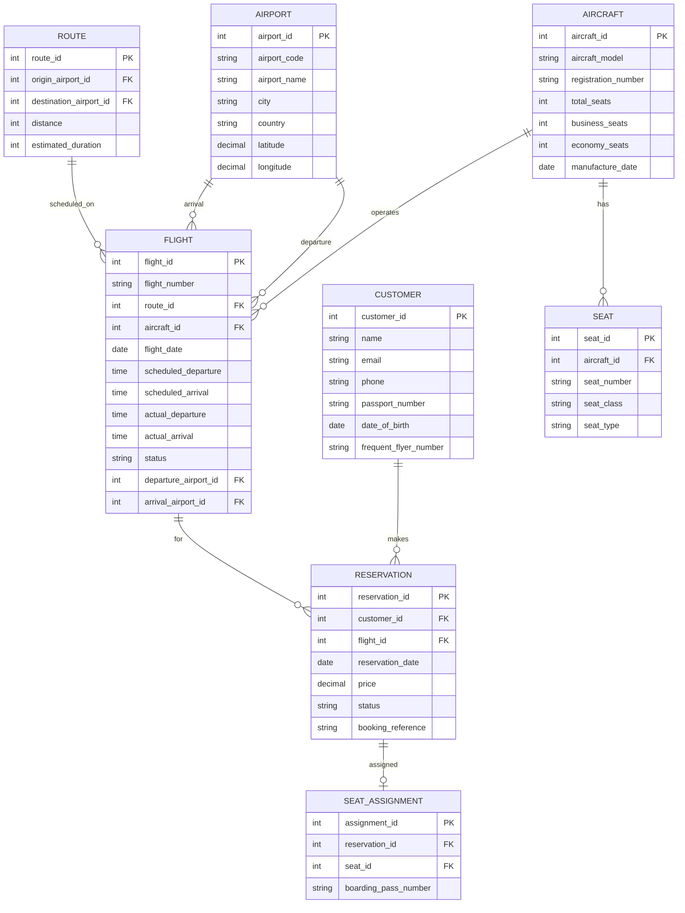

## 개요

이 포스트는 E-R 모델의 고급 개념에 관한 연습 문제들(Exercises 6.24-6.28)의 상세한 해설을 제공합니다. 항공사 데이터베이스 설계, 3진 관계의 2진 관계 변환, 일반화/특수화 계층 구조, 그리고 다양한 제약조건(Disjoint/Overlapping, Total/Partial)을 다룹니다.

---

## Exercise 6.24: Airline Database Design

### 문제
> Design a database for an airline. The database must keep track of customers and their reservations, flights and their status, seat assignments on individual flights, and the schedule and routing of future flights.

### 요구사항 분석

**핵심 개체:**
1. **Customer**: 고객
2. **Flight**: 항공편
3. **Reservation**: 예약
4. **Seat**: 좌석
5. **Aircraft**: 항공기
6. **Airport**: 공항
7. **Route**: 노선

**관계:**
- Customer **makes** Reservation (1:N)
- Reservation **for** Flight (N:1)
- Reservation **assigned** Seat (1:1)
- Flight **uses** Aircraft (N:1)
- Flight **departs_from** Airport (N:1)
- Flight **arrives_at** Airport (N:1)

### E-R 다이어그램



### Relational Schemas

```sql
-- Customer (고객)
CREATE TABLE customer (
    customer_id INT PRIMARY KEY,
    name VARCHAR(100) NOT NULL,
    email VARCHAR(100) UNIQUE,
    phone VARCHAR(20),
    passport_number VARCHAR(50) UNIQUE,
    date_of_birth DATE,
    frequent_flyer_number VARCHAR(50) UNIQUE,
    registration_date DATE DEFAULT CURRENT_DATE
);

-- Airport (공항)
CREATE TABLE airport (
    airport_id INT PRIMARY KEY,
    airport_code CHAR(3) UNIQUE NOT NULL,  -- IATA code (e.g., 'ICN', 'JFK')
    airport_name VARCHAR(100) NOT NULL,
    city VARCHAR(50) NOT NULL,
    country VARCHAR(50) NOT NULL,
    timezone VARCHAR(50),
    latitude DECIMAL(10, 8),
    longitude DECIMAL(11, 8)
);

-- Route (노선)
CREATE TABLE route (
    route_id INT PRIMARY KEY,
    origin_airport_id INT NOT NULL,
    destination_airport_id INT NOT NULL,
    distance INT,  -- km
    estimated_duration INT,  -- minutes
    FOREIGN KEY (origin_airport_id) REFERENCES airport(airport_id),
    FOREIGN KEY (destination_airport_id) REFERENCES airport(airport_id),
    CHECK (origin_airport_id != destination_airport_id),
    UNIQUE (origin_airport_id, destination_airport_id)
);

-- Aircraft (항공기)
CREATE TABLE aircraft (
    aircraft_id INT PRIMARY KEY,
    aircraft_model VARCHAR(50) NOT NULL,  -- 'Boeing 737', 'Airbus A320'
    registration_number VARCHAR(20) UNIQUE NOT NULL,
    total_seats INT NOT NULL,
    business_seats INT DEFAULT 0,
    economy_seats INT NOT NULL,
    manufacture_date DATE,
    status VARCHAR(20) DEFAULT 'Active',
    CHECK (total_seats = business_seats + economy_seats),
    CHECK (status IN ('Active', 'Maintenance', 'Retired'))
);

-- Seat (좌석 - 항공기별 좌석 구성)
CREATE TABLE seat (
    seat_id INT PRIMARY KEY,
    aircraft_id INT NOT NULL,
    seat_number VARCHAR(5) NOT NULL,  -- '1A', '12F'
    seat_class VARCHAR(20) NOT NULL,  -- 'Business', 'Economy'
    seat_type VARCHAR(20),  -- 'Window', 'Aisle', 'Middle'
    is_exit_row BOOLEAN DEFAULT FALSE,
    extra_legroom BOOLEAN DEFAULT FALSE,
    FOREIGN KEY (aircraft_id) REFERENCES aircraft(aircraft_id),
    UNIQUE (aircraft_id, seat_number),
    CHECK (seat_class IN ('First', 'Business', 'Premium Economy', 'Economy'))
);

-- Flight (항공편)
CREATE TABLE flight (
    flight_id INT PRIMARY KEY,
    flight_number VARCHAR(10) NOT NULL,  -- 'KE001', 'AA100'
    route_id INT NOT NULL,
    aircraft_id INT NOT NULL,
    flight_date DATE NOT NULL,
    scheduled_departure TIME NOT NULL,
    scheduled_arrival TIME NOT NULL,
    actual_departure TIME,
    actual_arrival TIME,
    status VARCHAR(20) DEFAULT 'Scheduled',
    gate VARCHAR(10),
    FOREIGN KEY (route_id) REFERENCES route(route_id),
    FOREIGN KEY (aircraft_id) REFERENCES aircraft(aircraft_id),
    UNIQUE (flight_number, flight_date),
    CHECK (status IN ('Scheduled', 'Boarding', 'Departed', 'In Air', 'Landed', 'Arrived', 'Cancelled', 'Delayed'))
);

-- Reservation (예약)
CREATE TABLE reservation (
    reservation_id INT PRIMARY KEY,
    customer_id INT NOT NULL,
    flight_id INT NOT NULL,
    reservation_date TIMESTAMP DEFAULT CURRENT_TIMESTAMP,
    price DECIMAL(10, 2) NOT NULL,
    status VARCHAR(20) DEFAULT 'Confirmed',
    booking_reference VARCHAR(10) UNIQUE NOT NULL,
    payment_method VARCHAR(30),
    FOREIGN KEY (customer_id) REFERENCES customer(customer_id),
    FOREIGN KEY (flight_id) REFERENCES flight(flight_id),
    CHECK (status IN ('Confirmed', 'Checked In', 'Boarded', 'Cancelled', 'No Show')),
    CHECK (price >= 0)
);

-- Seat_Assignment (좌석 배정)
CREATE TABLE seat_assignment (
    assignment_id INT PRIMARY KEY,
    reservation_id INT NOT NULL,
    seat_id INT NOT NULL,
    flight_id INT NOT NULL,
    boarding_pass_number VARCHAR(20) UNIQUE,
    check_in_time TIMESTAMP,
    FOREIGN KEY (reservation_id) REFERENCES reservation(reservation_id),
    FOREIGN KEY (seat_id) REFERENCES seat(seat_id),
    FOREIGN KEY (flight_id) REFERENCES flight(flight_id),
    UNIQUE (flight_id, seat_id)  -- 한 항공편의 한 좌석은 하나의 예약만
);

-- Flight_Schedule (정기 운항 스케줄)
CREATE TABLE flight_schedule (
    schedule_id INT PRIMARY KEY,
    flight_number VARCHAR(10) NOT NULL,
    route_id INT NOT NULL,
    aircraft_id INT NOT NULL,
    day_of_week INT NOT NULL,  -- 0=Sunday, 6=Saturday
    departure_time TIME NOT NULL,
    effective_from DATE NOT NULL,
    effective_to DATE,
    FOREIGN KEY (route_id) REFERENCES route(route_id),
    FOREIGN KEY (aircraft_id) REFERENCES aircraft(aircraft_id),
    CHECK (day_of_week BETWEEN 0 AND 6)
);

-- Crew (승무원)
CREATE TABLE crew (
    crew_id INT PRIMARY KEY,
    name VARCHAR(100) NOT NULL,
    position VARCHAR(30) NOT NULL,  -- 'Pilot', 'Co-Pilot', 'Flight Attendant'
    license_number VARCHAR(50),
    hire_date DATE,
    CHECK (position IN ('Captain', 'First Officer', 'Flight Attendant', 'Purser'))
);

-- Flight_Crew (항공편별 승무원 배정)
CREATE TABLE flight_crew (
    flight_id INT,
    crew_id INT,
    role VARCHAR(30),
    PRIMARY KEY (flight_id, crew_id),
    FOREIGN KEY (flight_id) REFERENCES flight(flight_id),
    FOREIGN KEY (crew_id) REFERENCES crew(crew_id)
);
```

### 제약조건

```sql
-- 1. 예약은 출발 전에만 가능
ALTER TABLE reservation
ADD CONSTRAINT check_reservation_before_departure
CHECK (
    reservation_date < (
        SELECT flight_date + scheduled_departure
        FROM flight
        WHERE flight.flight_id = reservation.flight_id
    )
);

-- 2. 좌석 배정은 항공기에 실제 존재하는 좌석만
-- (트리거 또는 애플리케이션 레벨에서 검증)

-- 3. 항공편의 좌석 배정 수는 항공기 총 좌석 수 이하
CREATE TRIGGER check_seat_capacity
BEFORE INSERT ON seat_assignment
FOR EACH ROW
BEGIN
    DECLARE total_seats INT;
    DECLARE assigned_seats INT;

    SELECT a.total_seats INTO total_seats
    FROM flight f
    JOIN aircraft a ON f.aircraft_id = a.aircraft_id
    WHERE f.flight_id = NEW.flight_id;

    SELECT COUNT(*) INTO assigned_seats
    FROM seat_assignment
    WHERE flight_id = NEW.flight_id;

    IF assigned_seats >= total_seats THEN
        SIGNAL SQLSTATE '45000'
        SET MESSAGE_TEXT = 'Flight is fully booked';
    END IF;
END;

-- 4. 항공편 상태 업데이트
CREATE TRIGGER update_flight_status
AFTER UPDATE OF actual_departure ON flight
FOR EACH ROW
WHEN (NEW.actual_departure IS NOT NULL AND OLD.actual_departure IS NULL)
BEGIN
    UPDATE flight
    SET status = 'Departed'
    WHERE flight_id = NEW.flight_id;
END;
```

### 인덱스 최적화

```sql
-- 자주 조회되는 컬럼에 인덱스
CREATE INDEX idx_flight_date ON flight(flight_date);
CREATE INDEX idx_flight_number_date ON flight(flight_number, flight_date);
CREATE INDEX idx_customer_email ON customer(email);
CREATE INDEX idx_reservation_customer ON reservation(customer_id);
CREATE INDEX idx_reservation_flight ON reservation(flight_id);
CREATE INDEX idx_booking_reference ON reservation(booking_reference);
CREATE INDEX idx_airport_code ON airport(airport_code);

-- 복합 인덱스
CREATE INDEX idx_flight_status_date ON flight(status, flight_date);
CREATE INDEX idx_route_airports ON route(origin_airport_id, destination_airport_id);
```

### 유용한 쿼리

**1. 특정 날짜의 특정 구간 항공편 검색:**
```sql
SELECT f.flight_number, f.flight_date,
       dep.airport_code AS from_airport,
       arr.airport_code AS to_airport,
       f.scheduled_departure, f.scheduled_arrival,
       a.aircraft_model,
       (a.total_seats - COALESCE(booked.count, 0)) AS available_seats
FROM flight f
JOIN route r ON f.route_id = r.route_id
JOIN airport dep ON r.origin_airport_id = dep.airport_id
JOIN airport arr ON r.destination_airport_id = arr.airport_id
JOIN aircraft a ON f.aircraft_id = a.aircraft_id
LEFT JOIN (
    SELECT flight_id, COUNT(*) AS count
    FROM reservation
    WHERE status = 'Confirmed'
    GROUP BY flight_id
) booked ON f.flight_id = booked.flight_id
WHERE dep.airport_code = 'ICN'
  AND arr.airport_code = 'JFK'
  AND f.flight_date = '2024-03-15'
  AND f.status = 'Scheduled';
```

**2. 고객의 예약 이력:**
```sql
SELECT r.booking_reference, f.flight_number, f.flight_date,
       dep.airport_code AS from_airport,
       arr.airport_code AS to_airport,
       s.seat_number, r.price, r.status
FROM reservation r
JOIN flight f ON r.flight_id = f.flight_id
JOIN route rt ON f.route_id = rt.route_id
JOIN airport dep ON rt.origin_airport_id = dep.airport_id
JOIN airport arr ON rt.destination_airport_id = arr.airport_id
LEFT JOIN seat_assignment sa ON r.reservation_id = sa.reservation_id
LEFT JOIN seat s ON sa.seat_id = s.seat_id
WHERE r.customer_id = 1
ORDER BY f.flight_date DESC;
```

**3. 항공편 탑승객 명단:**
```sql
SELECT c.name, c.passport_number,
       s.seat_number, s.seat_class,
       r.booking_reference,
       r.status
FROM reservation r
JOIN customer c ON r.customer_id = c.customer_id
LEFT JOIN seat_assignment sa ON r.reservation_id = sa.reservation_id
LEFT JOIN seat s ON sa.seat_id = s.seat_id
WHERE r.flight_id = 1001
  AND r.status IN ('Confirmed', 'Checked In', 'Boarded')
ORDER BY s.seat_number;
```

**4. 항공기 가동률:**
```sql
SELECT a.registration_number, a.aircraft_model,
       COUNT(f.flight_id) AS total_flights,
       SUM(CASE WHEN f.status = 'Arrived' THEN 1 ELSE 0 END) AS completed_flights,
       AVG(EXTRACT(EPOCH FROM (f.actual_arrival - f.actual_departure))/60) AS avg_flight_time_minutes
FROM aircraft a
LEFT JOIN flight f ON a.aircraft_id = f.aircraft_id
WHERE f.flight_date >= CURRENT_DATE - INTERVAL '30 days'
GROUP BY a.aircraft_id, a.registration_number, a.aircraft_model;
```

---

## Exercise 6.25: Ternary Relationship Representation

### 문제
> In Section 6.9.4, we represented a ternary relationship (repeated in Figure 6.29a) using binary relationships, as shown in Figure 6.29b. Consider the alternative shown in Figure 6.29c. Discuss the relative merits of these two alternative representations.

### 3진 관계 (Ternary Relationship)

**예시: 교수가 특정 학기에 특정 과목을 가르침**

```
teaches(instructor_id, course_id, semester)
```

### 방법 1: 직접 3진 관계

**E-R 다이어그램:**
```
[Instructor] ─┐
              │
[Course] ─────┼─── <teaches>
              │
[Semester] ───┘
```

**관계 스키마:**
```sql
CREATE TABLE teaches (
    instructor_id INT,
    course_id VARCHAR(8),
    semester VARCHAR(6),
    year INT,
    PRIMARY KEY (instructor_id, course_id, semester, year),
    FOREIGN KEY (instructor_id) REFERENCES instructor(ID),
    FOREIGN KEY (course_id) REFERENCES course(course_id)
);
```

**장점:**
- ✓ 간결하고 직관적
- ✓ 자연스러운 모델링
- ✓ 불필요한 조인 없음
- ✓ 공간 효율적

**단점:**
- ✗ 복합 기본키 (3-4개 속성)
- ✗ 부분 관계 표현 어려움

### 방법 2: 2진 관계로 분해 (Figure 6.29b)

**E-R 다이어그램:**
```
[Instructor] ──── <teaches_course> ──── [Course]
     │                                      │
     └──── <teaches_semester> ──── [Semester]
                    │
                    └──── <course_semester> ──── [Course]
```

**관계 스키마:**
```sql
-- 교수-과목 관계
CREATE TABLE instructor_course (
    instructor_id INT,
    course_id VARCHAR(8),
    PRIMARY KEY (instructor_id, course_id),
    FOREIGN KEY (instructor_id) REFERENCES instructor(ID),
    FOREIGN KEY (course_id) REFERENCES course(course_id)
);

-- 교수-학기 관계
CREATE TABLE instructor_semester (
    instructor_id INT,
    semester VARCHAR(6),
    year INT,
    PRIMARY KEY (instructor_id, semester, year),
    FOREIGN KEY (instructor_id) REFERENCES instructor(ID)
);

-- 과목-학기 관계
CREATE TABLE course_semester (
    course_id VARCHAR(8),
    semester VARCHAR(6),
    year INT,
    PRIMARY KEY (course_id, semester, year),
    FOREIGN KEY (course_id) REFERENCES course(course_id)
);
```

**장점:**
- ✓ 부분 관계 표현 가능
- ✓ 각 2진 관계 독립적으로 쿼리 가능
- ✓ 간단한 키 구조

**단점:**
- ✗ 정보 손실: 3진 관계의 의미 불명확
- ✗ 중복: 같은 정보가 여러 테이블에
- ✗ 무결성 유지 어려움
- ✗ 복잡한 조인 필요

**문제 예시:**
```
instructor_course: (I1, C1)
instructor_semester: (I1, Fall, 2024)
course_semester: (C1, Fall, 2024)

질문: I1이 2024 Fall에 C1을 가르치나?
답: 알 수 없음! 세 테이블 모두에 존재해야 하지만 보장되지 않음
```

### 방법 3: 인공 개체 사용 (Figure 6.29c)

**E-R 다이어그램:**
```
[Teaching_Assignment]
        │
        ├─── [Instructor]
        ├─── [Course]
        └─── [Semester]
```

**관계 스키마:**
```sql
-- 인공 개체
CREATE TABLE teaching_assignment (
    assignment_id INT PRIMARY KEY,
    instructor_id INT NOT NULL,
    course_id VARCHAR(8) NOT NULL,
    semester VARCHAR(6) NOT NULL,
    year INT NOT NULL,
    FOREIGN KEY (instructor_id) REFERENCES instructor(ID),
    FOREIGN KEY (course_id) REFERENCES course(course_id),
    UNIQUE (instructor_id, course_id, semester, year)
);
```

**장점:**
- ✓ 3진 관계의 의미 보존
- ✓ 추가 속성 쉽게 추가 (classroom, time_slot 등)
- ✓ 단순 기본키 (assignment_id)
- ✓ 참조 무결성 자동 보장

**단점:**
- ✗ 인공 키 추가 오버헤드
- ✗ 조인 시 추가 복잡성

### 비교 표

| 특징 | 직접 3진 관계 | 2진 관계 분해 | 인공 개체 |
|------|--------------|--------------|----------|
| **자연스러움** | ✓✓✓ | ✗ | ✓✓ |
| **의미 보존** | ✓✓✓ | ✗✗ | ✓✓✓ |
| **무결성** | ✓✓✓ | ✗ | ✓✓✓ |
| **쿼리 복잡도** | ✓✓✓ | ✗✗ | ✓✓ |
| **확장성** | ✓✓ | ✗ | ✓✓✓ |
| **공간 효율** | ✓✓✓ | ✗ | ✓✓ |

### 권장 사항

**3진 관계가 진정한 3진 관계라면:**
- **직접 3진 관계** 사용 (방법 1)
- 또는 **인공 개체** 사용 (방법 3)

**2진 관계들의 조합이라면:**
- **2진 관계 분해** 사용 (방법 2)

**실무에서:**
- 대부분 **방법 1** 또는 **방법 3**
- 방법 3은 추가 속성이 많을 때 유리

---

## Exercise 6.26: Motor Vehicle Sales Hierarchy

### 문제
> Design a generalization–specialization hierarchy for a motor vehicle sales company. The company sells motorcycles, passenger cars, vans, and buses. Justify your placement of attributes at each level.

### 일반화/특수화 계층 구조

```mermaid
erDiagram
    VEHICLE ||--o{ MOTORCYCLE : "is_a"
    VEHICLE ||--o{ PASSENGER_CAR : "is_a"
    VEHICLE ||--o{ VAN : "is_a"
    VEHICLE ||--o{ BUS : "is_a"

    VEHICLE {
        string vin PK
        string make
        string model
        int year
        string color
        decimal price
        date manufacture_date
        string fuel_type
        int engine_displacement
        string transmission_type
    }

    MOTORCYCLE {
        string vin PK_FK
        string motorcycle_type
        boolean has_sidecar
        int seat_count
        boolean abs
    }

    PASSENGER_CAR {
        string vin PK_FK
        string body_type
        int door_count
        int seat_count
        decimal trunk_capacity
        boolean sunroof
    }

    VAN {
        string vin PK_FK
        int passenger_capacity
        decimal cargo_volume
        boolean sliding_door
        int row_count
    }

    BUS {
        string vin PK_FK
        int passenger_capacity
        boolean tour_bus
        boolean wheelchair_accessible
        int standing_capacity
    }
```

### 속성 배치 정당화

#### Level 1: VEHICLE (최상위 - 모든 차량 공통)

**공통 속성:**
```sql
CREATE TABLE vehicle (
    vin VARCHAR(17) PRIMARY KEY,
    make VARCHAR(50) NOT NULL,              -- 제조사: 모든 차량 필수
    model VARCHAR(50) NOT NULL,             -- 모델명: 모든 차량 필수
    year INT NOT NULL,                      -- 연식: 모든 차량 필수
    color VARCHAR(30),                      -- 색상: 모든 차량 공통
    price DECIMAL(10,2) NOT NULL,           -- 가격: 모든 차량 필수
    manufacture_date DATE,                  -- 제조일: 모든 차량 공통
    fuel_type VARCHAR(20),                  -- 연료: 모든 차량 공통
    engine_displacement INT,                -- 배기량: 모든 차량 공통
    transmission_type VARCHAR(20),          -- 변속기: 모든 차량 공통
    vehicle_type VARCHAR(20) NOT NULL,      -- 차량 유형 구분
    CHECK (vehicle_type IN ('Motorcycle', 'Passenger_Car', 'Van', 'Bus'))
);
```

**정당화:**
- **vin**: 모든 차량의 유일 식별자
- **make, model, year**: 기본 정보, 모든 차량 필수
- **color, price**: 판매 필수 정보
- **fuel_type, engine_displacement**: 엔진 관련 공통 정보
- **transmission_type**: 모든 차량이 변속기를 가짐

#### Level 2: 특수화 (차량 유형별)

**1. MOTORCYCLE (오토바이)**
```sql
CREATE TABLE motorcycle (
    vin VARCHAR(17) PRIMARY KEY,
    motorcycle_type VARCHAR(30),        -- 'Sport', 'Cruiser', 'Touring'
    has_sidecar BOOLEAN DEFAULT FALSE,  -- 사이드카 유무
    seat_count INT DEFAULT 1,           -- 좌석 수 (1-2)
    abs BOOLEAN DEFAULT FALSE,          -- ABS 제동장치
    FOREIGN KEY (vin) REFERENCES vehicle(vin) ON DELETE CASCADE,
    CHECK (seat_count BETWEEN 1 AND 2)
);
```

**정당화:**
- **motorcycle_type**: 오토바이만의 분류
- **has_sidecar**: 오토바이 특유의 옵션
- **seat_count**: 오토바이는 1-2석으로 제한적
- **abs**: 오토바이의 중요한 안전 기능

**상위 레벨에 두지 않는 이유:**
- 사이드카는 오토바이에만 해당
- 오토바이의 좌석 수는 다른 차량과 의미가 다름

**2. PASSENGER_CAR (승용차)**
```sql
CREATE TABLE passenger_car (
    vin VARCHAR(17) PRIMARY KEY,
    body_type VARCHAR(20),              -- 'Sedan', 'Coupe', 'Hatchback'
    door_count INT DEFAULT 4,           -- 도어 수
    seat_count INT DEFAULT 5,           -- 좌석 수
    trunk_capacity DECIMAL(6,2),        -- 트렁크 용량 (리터)
    sunroof BOOLEAN DEFAULT FALSE,      -- 선루프 유무
    FOREIGN KEY (vin) REFERENCES vehicle(vin) ON DELETE CASCADE,
    CHECK (body_type IN ('Sedan', 'Coupe', 'Hatchback', 'Convertible', 'Wagon')),
    CHECK (door_count BETWEEN 2 AND 5),
    CHECK (seat_count BETWEEN 2 AND 7)
);
```

**정당화:**
- **body_type**: 승용차만의 분류
- **door_count**: 승용차의 중요한 특징 (2-5도어)
- **seat_count**: 승용차는 주로 2-7석
- **trunk_capacity**: 승용차의 적재 공간 측정 단위
- **sunroof**: 승용차의 일반적인 옵션

**상위 레벨에 두지 않는 이유:**
- body_type은 승용차에만 의미 있음
- 트렁크는 승용차 특유의 공간
- 버스/밴은 cargo_volume 사용

**3. VAN (밴)**
```sql
CREATE TABLE van (
    vin VARCHAR(17) PRIMARY KEY,
    passenger_capacity INT NOT NULL,    -- 승객 수용 인원
    cargo_volume DECIMAL(8,2),          -- 화물 용량 (cubic meters)
    sliding_door BOOLEAN DEFAULT TRUE,  -- 슬라이딩 도어
    row_count INT,                      -- 좌석 열 수
    FOREIGN KEY (vin) REFERENCES vehicle(vin) ON DELETE CASCADE,
    CHECK (passenger_capacity BETWEEN 5 AND 15),
    CHECK (row_count BETWEEN 2 AND 4)
);
```

**정당화:**
- **passenger_capacity**: 밴의 핵심 - 많은 승객 수용
- **cargo_volume**: 승용차보다 큰 화물 공간
- **sliding_door**: 밴의 특징적인 도어 방식
- **row_count**: 좌석 배치 정보

**상위 레벨에 두지 않는 이유:**
- cargo_volume은 밴/버스의 측정 단위 (승용차는 trunk_capacity)
- sliding_door는 밴의 특유 구조

**4. BUS (버스)**
```sql
CREATE TABLE bus (
    vin VARCHAR(17) PRIMARY KEY,
    passenger_capacity INT NOT NULL,            -- 승객 수용 인원
    tour_bus BOOLEAN DEFAULT FALSE,             -- 관광버스 여부
    wheelchair_accessible BOOLEAN DEFAULT TRUE, -- 휠체어 접근성
    standing_capacity INT DEFAULT 0,            -- 입석 수용 인원
    FOREIGN KEY (vin) REFERENCES vehicle(vin) ON DELETE CASCADE,
    CHECK (passenger_capacity BETWEEN 10 AND 80),
    CHECK (standing_capacity >= 0)
);
```

**정당화:**
- **passenger_capacity**: 버스의 핵심 - 대량 승객 수송
- **tour_bus**: 버스 유형 구분
- **wheelchair_accessible**: 대중교통 필수 요구사항
- **standing_capacity**: 버스 특유의 입석 개념

**상위 레벨에 두지 않는 이유:**
- wheelchair_accessible은 버스의 법적 요구사항
- standing_capacity는 버스에만 해당
- 승용차/밴은 입석 없음

### 속성 배치 원칙

**상위 레벨 (Vehicle):**
- ✓ **모든 차량에 공통**
- ✓ **동일한 의미**
- ✓ **동일한 범위/단위**

**하위 레벨 (특수화):**
- ✓ **특정 차량 유형에만 해당**
- ✓ **다른 의미/범위**
- ✓ **유형별 특화된 기능**

### SQL 구현 (단일 테이블 전략)

```sql
-- 대안: 단일 테이블로 모든 차량 통합
CREATE TABLE vehicle_all_in_one (
    vin VARCHAR(17) PRIMARY KEY,
    -- 공통 속성
    make VARCHAR(50) NOT NULL,
    model VARCHAR(50) NOT NULL,
    year INT NOT NULL,
    price DECIMAL(10,2) NOT NULL,
    vehicle_type VARCHAR(20) NOT NULL,

    -- Motorcycle 전용
    motorcycle_type VARCHAR(30),
    has_sidecar BOOLEAN,

    -- Passenger Car 전용
    body_type VARCHAR(20),
    trunk_capacity DECIMAL(6,2),
    sunroof BOOLEAN,

    -- Van 전용
    sliding_door BOOLEAN,
    cargo_volume DECIMAL(8,2),

    -- Bus 전용
    tour_bus BOOLEAN,
    wheelchair_accessible BOOLEAN,
    standing_capacity INT,

    -- 공통 (의미는 다름)
    seat_count INT,

    CHECK (
        (vehicle_type = 'Motorcycle' AND motorcycle_type IS NOT NULL) OR
        (vehicle_type = 'Passenger_Car' AND body_type IS NOT NULL) OR
        (vehicle_type = 'Van' AND cargo_volume IS NOT NULL) OR
        (vehicle_type = 'Bus' AND passenger_capacity IS NOT NULL)
    )
);
```

**장단점:**
- ✓ 단순한 쿼리
- ✗ 많은 NULL 값
- ✗ 복잡한 제약조건

---

## Exercise 6.27: Disjoint vs Overlapping Constraints

### 문제
> Explain the distinction between disjoint and overlapping constraints.

### Disjoint (분리) 제약조건

**정의:** 하위 클래스들이 **서로 배타적**
- 한 개체는 **정확히 하나**의 하위 클래스에만 속함

**표기:** E-R 다이어그램에서 **"d"** 또는 **"disjoint"**

**예시: Person → Student, Employee**

```mermaid
erDiagram
    PERSON ||--o| STUDENT : "is_a (disjoint)"
    PERSON ||--o| EMPLOYEE : "is_a (disjoint)"

    PERSON {
        int person_id PK
        string name
        date birth_date
    }

    STUDENT {
        int person_id PK_FK
        string major
        int credits
    }

    EMPLOYEE {
        int person_id PK_FK
        string position
        decimal salary
    }
```

**의미:**
- 한 사람은 학생 **또는** 직원
- 학생이면서 동시에 직원일 수 없음

**SQL 구현:**
```sql
CREATE TABLE person (
    person_id INT PRIMARY KEY,
    name VARCHAR(100),
    birth_date DATE,
    person_type VARCHAR(20),
    CHECK (person_type IN ('Student', 'Employee'))
);

CREATE TABLE student (
    person_id INT PRIMARY KEY,
    major VARCHAR(50),
    credits INT,
    FOREIGN KEY (person_id) REFERENCES person(person_id)
);

CREATE TABLE employee (
    person_id INT PRIMARY KEY,
    position VARCHAR(50),
    salary DECIMAL(10,2),
    FOREIGN KEY (person_id) REFERENCES person(person_id)
);

-- Disjoint 제약조건 (트리거로 구현)
CREATE TRIGGER enforce_disjoint_person
BEFORE INSERT ON student
FOR EACH ROW
BEGIN
    IF EXISTS (SELECT * FROM employee WHERE person_id = NEW.person_id) THEN
        SIGNAL SQLSTATE '45000'
        SET MESSAGE_TEXT = 'Person cannot be both student and employee (disjoint constraint)';
    END IF;
END;
```

### Overlapping (중복) 제약조건

**정의:** 하위 클래스들이 **중복 가능**
- 한 개체가 **여러** 하위 클래스에 동시에 속할 수 있음

**표기:** E-R 다이어그램에서 **"o"** 또는 **"overlapping"**

**예시: Person → Student, Employee (중복 허용)**

```mermaid
erDiagram
    PERSON ||--o| STUDENT : "is_a (overlapping)"
    PERSON ||--o| EMPLOYEE : "is_a (overlapping)"

    PERSON {
        int person_id PK
        string name
        date birth_date
    }

    STUDENT {
        int person_id PK_FK
        string major
        int credits
    }

    EMPLOYEE {
        int person_id PK_FK
        string position
        decimal salary
    }
```

**의미:**
- 한 사람은 학생, 직원, 또는 **둘 다** 가능
- 대학원생이 조교로 일하는 경우

**SQL 구현:**
```sql
-- Overlapping은 별도 제약조건 불필요
-- 두 테이블 모두에 존재 가능

-- 예시 데이터
INSERT INTO person VALUES (1, 'John Doe', '1995-01-01');
INSERT INTO student VALUES (1, 'Computer Science', 90);
INSERT INTO employee VALUES (1, 'Teaching Assistant', 2000);
-- ✓ 허용됨 (overlapping)
```

### 비교 예시

**Disjoint 예시:**
```
Vehicle → Car, Truck, Motorcycle

- 한 차량은 승용차, 트럭, 또는 오토바이 중 하나
- 승용차이면서 트럭일 수 없음
- Disjoint ✓
```

**Overlapping 예시:**
```
Student → UndergraduateStudent, GraduateStudent, WorkingStudent

- 한 학생은 학부생이면서 직장인 학생일 수 있음
- 대학원생이면서 직장인 학생일 수 있음
- Overlapping ✓
```

### 비교 표

| 특징 | Disjoint | Overlapping |
|------|----------|-------------|
| **중복 허용** | ✗ 불가 | ✓ 가능 |
| **하위 클래스 수** | 정확히 1개 | 1개 이상 |
| **표기** | "d" | "o" |
| **예시** | Vehicle 유형 | Person 역할 |
| **구현 복잡도** | 높음 (제약조건 필요) | 낮음 |

### 실무 적용

**Disjoint 사용 시:**
```sql
-- 명확한 분류가 필요한 경우
ALTER TABLE person
ADD COLUMN person_type VARCHAR(20),
ADD CONSTRAINT check_person_type
CHECK (person_type IN ('Student', 'Employee', 'Other'));
```

**Overlapping 사용 시:**
```sql
-- 역할이 중복될 수 있는 경우
-- 별도 제약조건 없이 자연스럽게 허용
```

---

## Exercise 6.28: Total vs Partial Constraints

### 문제
> Explain the distinction between total and partial constraints.

### Total (전체) 제약조건

**정의:** 상위 클래스의 **모든 개체**가 **최소 하나**의 하위 클래스에 속해야 함

**표기:** E-R 다이어그램에서 **이중 선** 또는 **"total"**

**예시: Employee → Manager, Worker**

```mermaid
erDiagram
    EMPLOYEE ||--|| MANAGER : "is_a (total)"
    EMPLOYEE ||--|| WORKER : "is_a (total)"

    EMPLOYEE {
        int emp_id PK
        string name
        date hire_date
    }

    MANAGER {
        int emp_id PK_FK
        string department
        int team_size
    }

    WORKER {
        int emp_id PK_FK
        string skill
        string shift
    }
```

**의미:**
- 모든 직원은 관리자 **또는** 작업자 (또는 둘 다, overlapping인 경우)
- 어느 쪽에도 속하지 않는 직원은 **없음**

**SQL 구현:**
```sql
-- 방법 1: CHECK 제약조건
CREATE TABLE employee (
    emp_id INT PRIMARY KEY,
    name VARCHAR(100),
    hire_date DATE
);

CREATE TABLE manager (
    emp_id INT PRIMARY KEY,
    department VARCHAR(50),
    team_size INT,
    FOREIGN KEY (emp_id) REFERENCES employee(emp_id)
);

CREATE TABLE worker (
    emp_id INT PRIMARY KEY,
    skill VARCHAR(50),
    shift VARCHAR(20),
    FOREIGN KEY (emp_id) REFERENCES employee(emp_id)
);

-- Total 제약조건 (트리거로 구현)
CREATE TRIGGER enforce_total_employee
AFTER INSERT ON employee
FOR EACH ROW
BEGIN
    -- 일정 시간 후 확인 (트랜잭션 끝)
    IF NOT EXISTS (
        SELECT * FROM manager WHERE emp_id = NEW.emp_id
        UNION
        SELECT * FROM worker WHERE emp_id = NEW.emp_id
    ) THEN
        SIGNAL SQLSTATE '45000'
        SET MESSAGE_TEXT = 'Employee must be either manager or worker (total constraint)';
    END IF;
END;

-- 방법 2: 단일 테이블 + NOT NULL
CREATE TABLE employee (
    emp_id INT PRIMARY KEY,
    name VARCHAR(100),
    emp_type VARCHAR(20) NOT NULL,  -- 'Manager' or 'Worker'
    -- Manager 속성
    department VARCHAR(50),
    team_size INT,
    -- Worker 속성
    skill VARCHAR(50),
    shift VARCHAR(20),
    CHECK (emp_type IN ('Manager', 'Worker')),
    CHECK (
        (emp_type = 'Manager' AND department IS NOT NULL) OR
        (emp_type = 'Worker' AND skill IS NOT NULL)
    )
);
```

### Partial (부분) 제약조건

**정의:** 상위 클래스의 개체가 하위 클래스에 **속할 수도, 속하지 않을 수도** 있음

**표기:** E-R 다이어그램에서 **단일 선** 또는 **"partial"**

**예시: Person → Student, Employee**

```mermaid
erDiagram
    PERSON ||--o| STUDENT : "is_a (partial)"
    PERSON ||--o| EMPLOYEE : "is_a (partial)"

    PERSON {
        int person_id PK
        string name
        date birth_date
    }

    STUDENT {
        int person_id PK_FK
        string major
        int credits
    }

    EMPLOYEE {
        int person_id PK_FK
        string position
        decimal salary
    }
```

**의미:**
- 사람은 학생일 수도, 직원일 수도, 둘 다일 수도, **둘 다 아닐 수도** 있음
- 은퇴한 사람, 어린이 등은 어느 쪽에도 속하지 않음

**SQL 구현:**
```sql
CREATE TABLE person (
    person_id INT PRIMARY KEY,
    name VARCHAR(100),
    birth_date DATE
    -- person_type 불필요 (Partial이므로)
);

CREATE TABLE student (
    person_id INT PRIMARY KEY,
    major VARCHAR(50),
    FOREIGN KEY (person_id) REFERENCES person(person_id)
);

CREATE TABLE employee (
    person_id INT PRIMARY KEY,
    position VARCHAR(50),
    FOREIGN KEY (person_id) REFERENCES person(person_id)
);

-- Partial은 별도 제약조건 불필요
-- 어느 쪽에도 속하지 않아도 됨

-- 예시 데이터
INSERT INTO person VALUES (1, 'John Doe', '1995-01-01');
-- student나 employee에 삽입하지 않아도 OK
```

### 조합: Disjoint/Overlapping + Total/Partial

**4가지 조합 가능:**

#### 1. Disjoint + Total
```
Employee → Manager | Worker (정확히 하나)

- 모든 직원은 관리자 또는 작업자
- 둘 다일 수 없음
- 어느 쪽에도 속하지 않을 수 없음
```

#### 2. Disjoint + Partial
```
Person → Student | Employee (최대 하나)

- 사람은 학생 또는 직원 또는 둘 다 아님
- 둘 다일 수 없음
```

#### 3. Overlapping + Total
```
Student → UndergraduateStudent, GraduateStudent (최소 하나)

- 모든 학생은 학부생 또는 대학원생 (또는 둘 다)
- 둘 다일 수 있음 (복수 전공)
- 어느 쪽에도 속하지 않을 수 없음
```

#### 4. Overlapping + Partial
```
Person → Student, Employee, Musician (0개 이상)

- 사람은 학생, 직원, 음악가 중 0개 이상 가능
- 여러 역할 동시 가능
- 어느 것도 아닐 수 있음
```

### 비교 표

| 특징 | Total | Partial |
|------|-------|---------|
| **하위 클래스 필수** | ✓ 예 | ✗ 아니오 |
| **최소 개수** | ≥ 1 | ≥ 0 |
| **표기** | 이중 선 | 단일 선 |
| **구현 복잡도** | 높음 (제약조건 필요) | 낮음 |

### 실무 예시

**Total 사용:**
```sql
-- 모든 계정은 개인 또는 기업 계정
CREATE TABLE account (
    account_id INT PRIMARY KEY,
    account_type VARCHAR(20) NOT NULL,  -- Total 강제
    CHECK (account_type IN ('Personal', 'Business'))
);
```

**Partial 사용:**
```sql
-- 사용자는 프리미엄 회원일 수도, 아닐 수도
CREATE TABLE user (
    user_id INT PRIMARY KEY,
    username VARCHAR(50)
);

CREATE TABLE premium_member (
    user_id INT PRIMARY KEY,
    subscription_end DATE,
    FOREIGN KEY (user_id) REFERENCES user(user_id)
);
-- user는 premium_member에 없어도 OK
```

---

## 핵심 개념 정리

### 1. 3진 관계 표현
- **직접 3진 관계**: 간결, 자연스러움
- **2진 관계 분해**: 정보 손실, 무결성 문제
- **인공 개체**: 균형잡힌 접근

### 2. 일반화/특수화 계층
- **상위 레벨**: 공통 속성
- **하위 레벨**: 특화 속성
- **배치 원칙**: 의미, 범위, 적용 대상

### 3. 제약조건
- **Disjoint vs Overlapping**: 중복 허용 여부
- **Total vs Partial**: 필수 여부
- **4가지 조합**: 상황에 맞게 선택

### 4. SQL 구현
- **제약조건**: CHECK, 트리거
- **전략**: 단일 테이블 vs 다중 테이블
- **트레이드오프**: 복잡도 vs 유연성

---

## 전체 시리즈 요약

### Part 1 (6.14-6.19)
- 키의 종류와 차이
- E-R 다이어그램 기초
- Weak Entity 개념

### Part 2 (6.20-6.23)
- E-R to Relational 변환
- 실무 데이터베이스 설계
- 복잡한 관계 모델링

### Part 3 (6.24-6.28)
- 항공사 데이터베이스
- 3진 관계 표현
- 일반화/특수화
- 제약조건

---

## 참고 자료

- Database System Concepts (7th Edition) - Silberschatz, Korth, Sudarshan
- "The Entity-Relationship Model" - Peter Chen (1976)
- "Database Modeling and Design" - Toby Teorey
- Real-world database design patterns

---

## 마무리

E-R 모델은 데이터베이스 설계의 핵심 도구입니다. 개념적 모델링에서 논리적 스키마까지, 체계적인 설계 프로세스를 통해 견고하고 확장 가능한 데이터베이스를 구축할 수 있습니다.

**설계 원칙:**
1. **완전성**: 모든 요구사항 반영
2. **일관성**: 명확한 의미와 제약조건
3. **확장성**: 미래 변화 대응
4. **효율성**: 성능과 저장 공간 최적화
5. **유지보수성**: 이해하기 쉽고 수정하기 쉬운 구조
