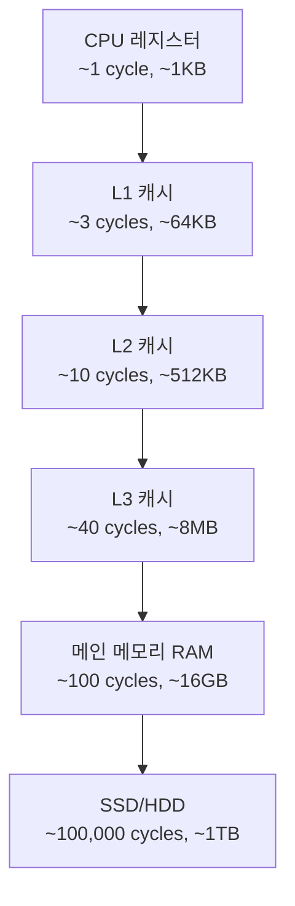

컴파일러 설계를 시작하기 전에 하드웨어와 소프트웨어의 경계인 **명령어 집합 구조(Instruction Set Architecture, ISA)**를 이해하는 것이 중요합니다. ISA는 컴파일러가 생성하는 최종 출력물인 기계어 코드의 기반이 됩니다.

## 📚 ISA란 무엇인가?

### Instruction Set Architecture 정의

**ISA (명령어 집합 구조)**는 하드웨어와 소프트웨어 사이의 인터페이스로, 프로세서가 실행할 수 있는 명령어의 집합과 그 의미를 정의합니다.

**주요 구성 요소**:
1. **명령어(Instructions)**: CPU가 수행할 수 있는 기본 연산
2. **레지스터(Registers)**: CPU 내부의 빠른 저장 공간
3. **메모리 주소 지정 방식**: 데이터 접근 방법
4. **데이터 타입**: 지원하는 데이터 형식
5. **인터럽트 메커니즘**: 예외 처리 방식

### ISA의 중요성

**컴파일러 관점**:
```
고수준 언어 (C, Java, Python)
        ↓ 컴파일러
중간 표현 (IR)
        ↓ 코드 생성기
어셈블리 언어 ← ISA 정의
        ↓ 어셈블러
기계어 코드
```

**역할**:
- 컴파일러가 생성해야 할 타겟 코드 결정
- 최적화 전략 수립
- 레지스터 할당 정책
- 메모리 관리 방식

---

## RISC vs CISC 아키텍처

### CISC (Complex Instruction Set Computer)

**특징**:
- 복잡하고 다양한 명령어
- 한 명령어로 여러 작업 수행 가능
- 가변 길이 명령어
- 메모리 접근이 많은 명령어

**대표 예**: x86, x86-64 (Intel, AMD)

**장점**:
- 코드 밀도가 높음 (짧은 프로그램)
- 고수준 언어 구조와 잘 맞음
- 호환성 유지 용이

**단점**:
- 명령어 해석이 복잡
- 파이프라이닝 어려움
- 칩 설계가 복잡

**CISC 명령어 예시**:
```assembly
; x86 어셈블리
MOVS    ; 문자열 복사 (메모리 → 메모리)
PUSH    ; 스택에 푸시 (메모리 쓰기 + 포인터 증가)
LOOP    ; 카운터 감소 + 조건 분기

; 한 명령어로 복잡한 연산
ADD [EBX], EAX    ; 메모리 읽기 + 덧셈 + 메모리 쓰기
```

### RISC (Reduced Instruction Set Computer)

**특징**:
- 단순하고 적은 수의 명령어
- 고정 길이 명령어
- 레지스터 중심 연산
- Load/Store 아키텍처

**대표 예**: ARM, MIPS, RISC-V

**장점**:
- 명령어 실행이 빠름
- 파이프라이닝 효율적
- 전력 소모가 적음
- 칩 설계가 간단

**단점**:
- 코드 크기가 큼
- 컴파일러가 복잡
- 메모리 접근 횟수 증가

**RISC 명령어 예시**:
```assembly
; ARM 어셈블리
LDR  R0, [R1]     ; 메모리 읽기
ADD  R2, R3, R4   ; 레지스터 덧셈
STR  R2, [R5]     ; 메모리 쓰기

; 모든 연산이 단순하고 명확
; 메모리 접근은 LDR/STR만 사용
```

### RISC vs CISC 비교

| 특성 | RISC | CISC |
|------|------|------|
| **명령어 수** | 적음 (50-100개) | 많음 (200-500개) |
| **명령어 길이** | 고정 (32비트) | 가변 (1-15바이트) |
| **명령어 복잡도** | 단순 | 복잡 |
| **실행 시간** | 대부분 1 사이클 | 여러 사이클 |
| **메모리 접근** | Load/Store만 | 모든 명령어 가능 |
| **레지스터 수** | 많음 (32개 이상) | 적음 (8-16개) |
| **파이프라이닝** | 쉬움 | 어려움 |
| **컴파일러** | 복잡 | 비교적 단순 |
| **전력 소모** | 낮음 | 높음 |
| **예시** | ARM, MIPS, RISC-V | x86, x86-64 |

---

## 레지스터와 메모리 구조

### 레지스터 (Registers)

**정의**: CPU 내부의 초고속 저장 공간

**종류**:

**1. 범용 레지스터 (General-Purpose Registers)**
```
RISC (ARM):
R0-R15   : 범용 레지스터
R13(SP)  : Stack Pointer
R14(LR)  : Link Register (함수 호출 복귀 주소)
R15(PC)  : Program Counter

CISC (x86-64):
RAX, RBX, RCX, RDX  : 범용 (64비트)
RSI, RDI            : 인덱스
RSP                 : Stack Pointer
RBP                 : Base Pointer
```

**2. 특수 목적 레지스터 (Special-Purpose Registers)**
```
PC (Program Counter)     : 다음 실행할 명령어 주소
SP (Stack Pointer)       : 스택 최상단 주소
LR (Link Register)       : 함수 복귀 주소 (ARM)
PSW (Program Status Word): 상태 플래그 (Zero, Carry, Overflow 등)
```

**3. 부동소수점 레지스터**
```
x86: XMM0-XMM15 (128비트, SSE)
ARM: S0-S31 (32비트 부동소수점)
     D0-D31 (64비트 부동소수점)
```

### 메모리 계층 구조



**접근 속도 비교**:
| 계층 | 접근 시간 | 크기 | 비용/바이트 |
|------|-----------|------|-------------|
| **레지스터** | 0.3 ns | 수백 바이트 | 매우 비쌈 |
| **L1 캐시** | 1 ns | 64 KB | 비쌈 |
| **L2 캐시** | 3 ns | 512 KB | 비쌈 |
| **L3 캐시** | 12 ns | 8 MB | 중간 |
| **RAM** | 100 ns | 16 GB | 저렴 |
| **SSD** | 100 μs | 1 TB | 매우 저렴 |

---

## 명령어 형식 (Instruction Format)

### 기본 구조

**명령어 구성 요소**:
```
| Opcode | Operand 1 | Operand 2 | Operand 3 |
   연산     피연산자1    피연산자2    피연산자3
```

**Opcode (연산 코드)**:
- 수행할 연산 종류 (ADD, SUB, LOAD 등)

**Operands (피연산자)**:
- 연산 대상 (레지스터, 메모리 주소, 즉시값)

### RISC 명령어 형식 (ARM 예시)

**1. R-Type (레지스터 연산)**
```
┌────────┬─────┬─────┬─────┬───────┬──────┐
│ Opcode │ Rd  │ Rn  │ Rm  │Shift │Shift │
│ 6 bits │5bit │5bit │5bit │5 bits│5 bits│
└────────┴─────┴─────┴─────┴───────┴──────┘

예: ADD R1, R2, R3  ; R1 = R2 + R3
```

**2. I-Type (즉시값 연산)**
```
┌────────┬─────┬─────┬────────────────┐
│ Opcode │ Rd  │ Rn  │   Immediate    │
│ 6 bits │5bit │5bit │    16 bits     │
└────────┴─────┴─────┴────────────────┘

예: ADD R1, R2, #100  ; R1 = R2 + 100
```

**3. Memory (메모리 접근)**
```
┌────────┬─────┬─────┬────────────────┐
│ Opcode │ Rd  │ Rn  │     Offset     │
│ 6 bits │5bit │5bit │    16 bits     │
└────────┴─────┴─────┴────────────────┘

예: LDR R1, [R2, #4]  ; R1 = Memory[R2+4]
```

### CISC 명령어 형식 (x86 예시)

**가변 길이 (1-15 바이트)**:
```
┌────────┬──────┬────┬───┬───┬───────────┐
│Prefixes│Opcode│ModR│SIB│Dis│ Immediate │
│ 0-4B   │ 1-3B │ /M │   │   │   0-4B    │
└────────┴──────┴────┴───┴───┴───────────┘

예시:
MOV  AL, 5           ; 2 바이트
ADD  EAX, [EBX+8]    ; 3 바이트
MOVAPS XMM0, [RDI]   ; 5 바이트
```

---

## 주소 지정 모드 (Addressing Modes)

### 1. 즉시 주소 지정 (Immediate)

**정의**: 피연산자가 명령어에 직접 포함

```assembly
; ARM
MOV R1, #10        ; R1 = 10

; x86
MOV EAX, 100       ; EAX = 100
```

**장점**: 빠름 (메모리 접근 불필요)
**단점**: 값의 크기 제한 (명령어 크기 내)

### 2. 레지스터 주소 지정 (Register)

**정의**: 피연산자가 레지스터에 저장

```assembly
; ARM
ADD R1, R2, R3     ; R1 = R2 + R3

; x86
ADD EAX, EBX       ; EAX = EAX + EBX
```

**장점**: 매우 빠름
**단점**: 레지스터 수 제한

### 3. 직접 주소 지정 (Direct/Absolute)

**정의**: 메모리 주소가 명령어에 포함

```assembly
; x86
MOV EAX, [1000]    ; EAX = Memory[1000]

; ARM (제한적)
LDR R1, =label     ; R1 = Memory[label]
```

**장점**: 단순
**단점**: 주소 크기 제한, 재배치 어려움

### 4. 간접 주소 지정 (Indirect)

**정의**: 레지스터가 메모리 주소를 가리킴

```assembly
; ARM
LDR R1, [R2]       ; R1 = Memory[R2]

; x86
MOV EAX, [EBX]     ; EAX = Memory[EBX]
```

**장점**: 동적 주소 접근 가능
**사용 예**: 포인터, 배열

### 5. 베이스 + 오프셋 (Base + Offset)

**정의**: 베이스 레지스터 + 상수 오프셋

```assembly
; ARM
LDR R1, [R2, #4]   ; R1 = Memory[R2 + 4]

; x86
MOV EAX, [EBX+8]   ; EAX = Memory[EBX + 8]
```

**사용 예**:
```c
struct Point {
    int x;    // offset 0
    int y;    // offset 4
};

Point p;
int y_value = p.y;  // [base + 4]
```

### 6. 인덱스 주소 지정 (Indexed)

**정의**: 베이스 + 인덱스 레지스터

```assembly
; x86
MOV EAX, [EBX + ECX*4]  ; EAX = Memory[EBX + ECX*4]

; ARM
LDR R1, [R2, R3]        ; R1 = Memory[R2 + R3]
```

**사용 예**:
```c
int arr[100];
int i = 5;
int value = arr[i];  ; [base + i*4]
```

### 7. 스택 주소 지정 (Stack)

**정의**: 스택 포인터 기반

```assembly
; x86
PUSH EAX           ; SP = SP - 4, Memory[SP] = EAX
POP  EBX           ; EBX = Memory[SP], SP = SP + 4

; ARM
STR  R1, [SP, #-4]!  ; SP = SP - 4, Memory[SP] = R1
LDR  R2, [SP], #4    ; R2 = Memory[SP], SP = SP + 4
```

**사용 예**: 함수 호출, 지역 변수

### 주소 지정 모드 요약

| 모드 | 예시 (ARM) | 예시 (x86) | 용도 |
|------|-----------|-----------|------|
| **즉시** | `MOV R1, #10` | `MOV EAX, 10` | 상수 |
| **레지스터** | `ADD R1, R2, R3` | `ADD EAX, EBX` | 임시 변수 |
| **직접** | `LDR R1, =addr` | `MOV EAX, [1000]` | 전역 변수 |
| **간접** | `LDR R1, [R2]` | `MOV EAX, [EBX]` | 포인터 |
| **베이스+오프셋** | `LDR R1, [R2, #4]` | `MOV EAX, [EBX+4]` | 구조체 |
| **인덱스** | `LDR R1, [R2, R3]` | `MOV EAX, [EBX+ECX*4]` | 배열 |

---

## 어셈블리 언어 기초

### 어셈블리 언어란?

**정의**: 기계어를 사람이 읽을 수 있는 형태로 표현한 저수준 언어

**관계**:
```
C 코드:      a = b + c;
            ↓ 컴파일
어셈블리:    ADD R1, R2, R3
            ↓ 어셈블
기계어:      0xE0821003
```

### ARM 어셈블리 기본 문법

**1. 데이터 이동**
```assembly
MOV  R1, #10         ; R1 = 10
MOV  R2, R1          ; R2 = R1
LDR  R3, [R4]        ; R3 = Memory[R4]
STR  R5, [R6]        ; Memory[R6] = R5
```

**2. 산술 연산**
```assembly
ADD  R1, R2, R3      ; R1 = R2 + R3
SUB  R1, R2, R3      ; R1 = R2 - R3
MUL  R1, R2, R3      ; R1 = R2 * R3
```

**3. 논리 연산**
```assembly
AND  R1, R2, R3      ; R1 = R2 & R3
ORR  R1, R2, R3      ; R1 = R2 | R3
EOR  R1, R2, R3      ; R1 = R2 ^ R3 (XOR)
MVN  R1, R2          ; R1 = ~R2 (NOT)
```

**4. 비교 및 분기**
```assembly
CMP  R1, R2          ; R1과 R2 비교 (플래그 설정)
BEQ  label           ; 같으면 분기
BNE  label           ; 다르면 분기
BGT  label           ; R1 > R2이면 분기
BLT  label           ; R1 < R2이면 분기
```

**5. 함수 호출**
```assembly
BL   function        ; 함수 호출 (LR = PC+4, PC = function)
MOV  PC, LR          ; 함수 복귀
```

### x86 어셈블리 기본 문법

**1. 데이터 이동**
```assembly
MOV  EAX, 10         ; EAX = 10
MOV  EBX, EAX        ; EBX = EAX
MOV  ECX, [EDX]      ; ECX = Memory[EDX]
MOV  [ESI], EDI      ; Memory[ESI] = EDI
```

**2. 산술 연산**
```assembly
ADD  EAX, EBX        ; EAX = EAX + EBX
SUB  EAX, EBX        ; EAX = EAX - EBX
IMUL EAX, EBX        ; EAX = EAX * EBX
IDIV EBX             ; EAX = EDX:EAX / EBX, EDX = 나머지
```

**3. 스택 연산**
```assembly
PUSH EAX             ; 스택에 EAX 푸시
POP  EBX             ; 스택에서 팝하여 EBX로
```

**4. 비교 및 점프**
```assembly
CMP  EAX, EBX        ; EAX와 EBX 비교
JE   label           ; 같으면 점프
JNE  label           ; 다르면 점프
JG   label           ; EAX > EBX이면 점프
JL   label           ; EAX < EBX이면 점프
```

**5. 함수 호출**
```assembly
CALL function        ; 함수 호출
RET                  ; 함수 복귀
```

### C 코드와 어셈블리 비교

**예제 1: 변수 할당**
```c
int a = 5;
int b = a + 10;
```

```assembly
; ARM
MOV  R0, #5          ; a = 5
ADD  R1, R0, #10     ; b = a + 10

; x86
MOV  EAX, 5          ; a = 5
ADD  EAX, 10         ; a += 10
MOV  EBX, EAX        ; b = a
```

**예제 2: if 문**
```c
if (a > b) {
    c = a;
} else {
    c = b;
}
```

```assembly
; ARM
CMP  R0, R1          ; a와 b 비교
BLE  else_label      ; a <= b이면 else로
MOV  R2, R0          ; c = a
B    endif
else_label:
    MOV  R2, R1      ; c = b
endif:

; x86
CMP  EAX, EBX        ; a와 b 비교
JLE  else_label      ; a <= b이면 else로
MOV  ECX, EAX        ; c = a
JMP  endif
else_label:
    MOV  ECX, EBX    ; c = b
endif:
```

**예제 3: for 루프**
```c
int sum = 0;
for (int i = 0; i < 10; i++) {
    sum += i;
}
```

```assembly
; ARM
MOV  R0, #0          ; sum = 0
MOV  R1, #0          ; i = 0
loop:
    CMP  R1, #10     ; i < 10?
    BGE  end_loop    ; i >= 10이면 종료
    ADD  R0, R0, R1  ; sum += i
    ADD  R1, R1, #1  ; i++
    B    loop
end_loop:

; x86
MOV  EAX, 0          ; sum = 0
MOV  ECX, 0          ; i = 0
loop:
    CMP  ECX, 10     ; i < 10?
    JGE  end_loop    ; i >= 10이면 종료
    ADD  EAX, ECX    ; sum += i
    INC  ECX         ; i++
    JMP  loop
end_loop:
```

**예제 4: 함수 호출**
```c
int add(int a, int b) {
    return a + b;
}

int main() {
    int result = add(3, 5);
}
```

```assembly
; ARM
add:
    ADD  R0, R0, R1  ; return a + b
    MOV  PC, LR      ; 함수 복귀

main:
    MOV  R0, #3      ; 첫 번째 인자
    MOV  R1, #5      ; 두 번째 인자
    BL   add         ; 함수 호출
    ; R0에 결과 저장됨

; x86
add:
    PUSH EBP
    MOV  EBP, ESP
    MOV  EAX, [EBP+8]   ; a
    ADD  EAX, [EBP+12]  ; a + b
    POP  EBP
    RET

main:
    PUSH 5           ; 두 번째 인자
    PUSH 3           ; 첫 번째 인자
    CALL add
    ADD  ESP, 8      ; 스택 정리
    ; EAX에 결과 저장됨
```

---

## 💡 컴파일러와 ISA의 관계

### 컴파일러의 역할


**ISA 의존 단계**:
1. **레지스터 할당**: ISA의 레지스터 개수와 용도에 따라
2. **명령어 선택**: ISA가 제공하는 명령어 활용
3. **주소 지정 모드**: ISA의 주소 지정 방식 선택
4. **최적화**: ISA의 특성을 고려한 최적화

### 예시: 배열 접근 코드 생성

**고수준 코드**:
```c
int arr[100];
int x = arr[i];
```

**RISC (ARM) 코드 생성**:
```assembly
; i는 R1, arr 베이스는 R2
LSL  R3, R1, #2      ; R3 = i * 4 (shift left)
ADD  R3, R2, R3      ; R3 = &arr + i*4
LDR  R0, [R3]        ; x = Memory[R3]
```

**CISC (x86) 코드 생성**:
```assembly
; i는 ECX, arr 베이스는 EBX
MOV  EAX, [EBX + ECX*4]  ; x = arr[i] (한 명령어!)
```

**관찰**:
- RISC는 3개 명령어 필요
- CISC는 1개 명령어로 가능 (인덱스 주소 지정 모드)
- 컴파일러는 ISA 특성에 맞게 코드 생성

### 최적화 예시: 루프 언롤링

**원본 코드**:
```c
for (int i = 0; i < 4; i++) {
    sum += arr[i];
}
```

**일반 번역**:
```assembly
; ARM
MOV  R0, #0          ; sum
MOV  R1, #0          ; i
loop:
    CMP  R1, #4
    BGE  end
    LSL  R3, R1, #2
    ADD  R3, R2, R3
    LDR  R4, [R3]
    ADD  R0, R0, R4
    ADD  R1, R1, #1
    B    loop
end:
```

**최적화 (루프 언롤링)**:
```assembly
; ARM - 루프 제거, 직접 전개
LDR  R3, [R2, #0]    ; arr[0]
ADD  R0, R0, R3
LDR  R3, [R2, #4]    ; arr[1]
ADD  R0, R0, R3
LDR  R3, [R2, #8]    ; arr[2]
ADD  R0, R0, R3
LDR  R3, [R2, #12]   ; arr[3]
ADD  R0, R0, R3
```

**장점**:
- 분기 명령어 제거
- 루프 오버헤드 감소
- 파이프라인 효율 증가

---

## 실습 예제

### 예제 1: 최댓값 찾기

**C 코드**:
```c
int max(int a, int b) {
    if (a > b)
        return a;
    else
        return b;
}
```

**ARM 어셈블리**:
```assembly
max:
    CMP  R0, R1          ; a와 b 비교
    MOVGT R0, R0         ; a > b이면 R0 유지
    MOVLE R0, R1         ; a <= b이면 R0 = R1
    MOV  PC, LR          ; 복귀
```

**x86 어셈블리**:
```assembly
max:
    PUSH EBP
    MOV  EBP, ESP
    MOV  EAX, [EBP+8]    ; a
    MOV  EBX, [EBP+12]   ; b
    CMP  EAX, EBX
    JG   return_a
    MOV  EAX, EBX        ; return b
return_a:
    POP  EBP
    RET
```

### 예제 2: 배열 합계

**C 코드**:
```c
int sum_array(int arr[], int n) {
    int sum = 0;
    for (int i = 0; i < n; i++) {
        sum += arr[i];
    }
    return sum;
}
```

**ARM 어셈블리**:
```assembly
sum_array:
    ; R0 = arr 베이스, R1 = n
    MOV  R2, #0          ; sum = 0
    MOV  R3, #0          ; i = 0
loop:
    CMP  R3, R1          ; i < n?
    BGE  end_loop
    LDR  R4, [R0, R3, LSL #2]  ; arr[i]
    ADD  R2, R2, R4      ; sum += arr[i]
    ADD  R3, R3, #1      ; i++
    B    loop
end_loop:
    MOV  R0, R2          ; return sum
    MOV  PC, LR
```

**x86 어셈블리**:
```assembly
sum_array:
    PUSH EBP
    MOV  EBP, ESP
    MOV  ESI, [EBP+8]    ; arr
    MOV  ECX, [EBP+12]   ; n
    XOR  EAX, EAX        ; sum = 0
    XOR  EDX, EDX        ; i = 0
loop:
    CMP  EDX, ECX        ; i < n?
    JGE  end_loop
    ADD  EAX, [ESI+EDX*4]  ; sum += arr[i]
    INC  EDX             ; i++
    JMP  loop
end_loop:
    POP  EBP
    RET
```

---

## 핵심 정리

### ISA의 중요성

1. **하드웨어-소프트웨어 인터페이스**
   - 컴파일러가 생성할 타겟 코드 정의
   - 프로그램의 최종 실행 형태

2. **성능 영향**
   - 명령어 선택과 조합
   - 레지스터 활용
   - 메모리 접근 패턴

3. **이식성**
   - 다른 ISA = 다른 컴파일러 필요
   - Cross-compilation 필요

### RISC vs CISC 선택

**RISC 선호**:
- 모바일/임베디드 (ARM)
- 전력 효율 중요
- 최신 설계

**CISC 선호**:
- 데스크톱/서버 (x86-64)
- 기존 소프트웨어 호환성
- 코드 밀도 중요

### 컴파일러 개발자가 알아야 할 것

1. **명령어 집합**: 사용 가능한 연산
2. **레지스터 구조**: 할당 전략 수립
3. **주소 지정 모드**: 효율적 메모리 접근
4. **호출 규약**: 함수 호출 구현
5. **파이프라인**: 최적화 기회

---

다음 포스트에서는 컴파일러의 첫 단계인 **어휘 분석(Lexical Analysis)**을 다룹니다. 소스 코드를 읽어 토큰(Token)으로 변환하는 과정과 정규 표현식, 유한 오토마타를 학습합니다!
