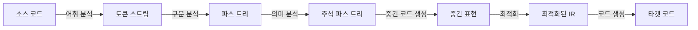
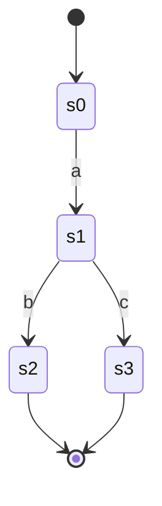
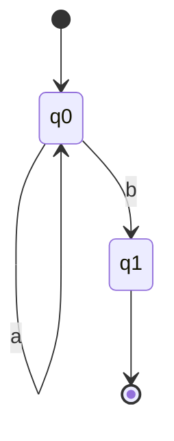
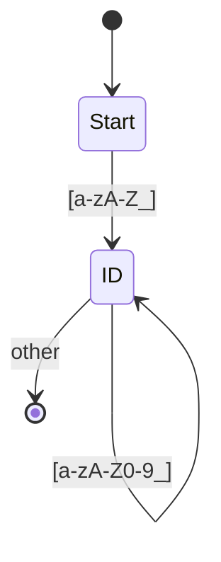
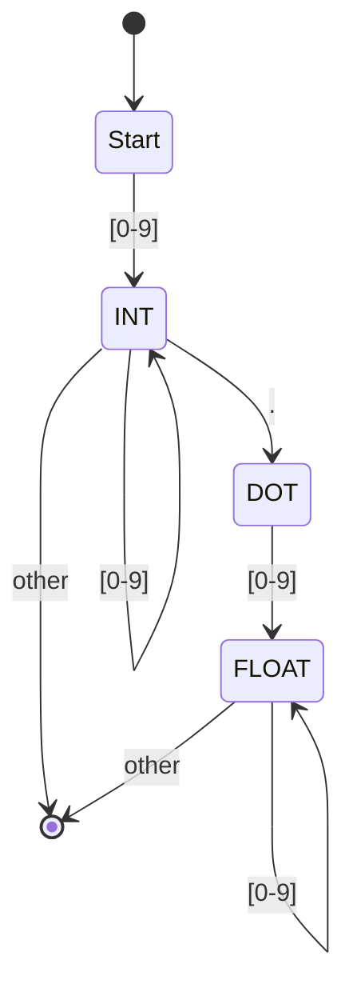

컴파일러의 첫 단계인 **어휘 분석(Lexical Analysis)**은 소스 코드를 읽어 의미 있는 단위인 토큰(Token)으로 분리하는 작업입니다. 이 과정은 컴파일러의 기초이자 프로그래밍 언어 처리의 출발점입니다.

## 📚 컴파일러 구조 개요

### 컴파일 과정



### 컴파일러 단계별 역할

| 단계 | 입력 | 출력 | 역할 |
|------|------|------|------|
| **어휘 분석** | 문자 스트림 | 토큰 스트림 | 토큰 인식 |
| **구문 분석** | 토큰 스트림 | 파스 트리 | 문법 검증 |
| **의미 분석** | 파스 트리 | 주석 트리 | 타입 검사 |
| **중간 코드 생성** | 주석 트리 | IR | 중간 표현 |
| **최적화** | IR | 최적화된 IR | 성능 향상 |
| **코드 생성** | IR | 타겟 코드 | 기계어 생성 |

### 프론트엔드 vs 백엔드

**프론트엔드** (소스 언어 의존):
- 어휘 분석
- 구문 분석
- 의미 분석
- 중간 코드 생성

**백엔드** (타겟 기계 의존):
- 코드 최적화
- 코드 생성
- 레지스터 할당

---

## 어휘 분석(Lexical Analysis)이란?

### 정의

**어휘 분석기(Lexical Analyzer, Scanner, Lexer)**:
- 소스 코드를 읽어 토큰(Token) 시퀀스로 변환
- 공백, 주석 제거
- 에러 처리 (잘못된 문자, 끝나지 않은 문자열 등)

### 입력과 출력

**입력**: 문자 스트림
```c
int main() {
    int x = 10 + 20;
    return x;
}
```

**출력**: 토큰 스트림
```
<KEYWORD, int>
<ID, main>
<LPAREN, (>
<RPAREN, )>
<LBRACE, {>
<KEYWORD, int>
<ID, x>
<ASSIGN, =>
<NUMBER, 10>
<PLUS, +>
<NUMBER, 20>
<SEMICOLON, ;>
<KEYWORD, return>
<ID, x>
<SEMICOLON, ;>
<RBRACE, }>
```

### 왜 분리하는가?

**1. 단순화**:
- 구문 분석기는 문자가 아닌 토큰만 처리
- 공백/주석 처리 분리

**2. 효율성**:
- 특화된 기법 사용 가능
- 버퍼링 최적화

**3. 이식성**:
- 입력 장치 독립적
- 문자 인코딩 추상화

---

## 토큰(Token)과 렉심(Lexeme)

### 용어 정의

**토큰(Token)**:
- 의미 있는 문자열의 범주
- 예: KEYWORD, IDENTIFIER, NUMBER, OPERATOR

**렉심(Lexeme)**:
- 토큰에 해당하는 실제 문자열
- 예: "int", "main", "123", "+"

**패턴(Pattern)**:
- 토큰을 인식하는 규칙
- 정규 표현식으로 표현

**예시**:
```c
int count = 42;
```

| 렉심 | 토큰 | 패턴 |
|------|------|------|
| `int` | KEYWORD | `int|float|char|...` |
| `count` | IDENTIFIER | `[a-zA-Z_][a-zA-Z0-9_]*` |
| `=` | ASSIGN | `=` |
| `42` | NUMBER | `[0-9]+` |
| `;` | SEMICOLON | `;` |

### 토큰의 종류

**1. 키워드(Keywords)**:
```
if, else, while, for, int, float, return, ...
```

**2. 식별자(Identifiers)**:
```
변수명, 함수명: x, count, calculateSum, ...
```

**3. 리터럴(Literals)**:
```
정수: 123, 0xFF, 0b1010
실수: 3.14, 1.5e-3
문자: 'a', '\n'
문자열: "Hello, World!"
```

**4. 연산자(Operators)**:
```
산술: +, -, *, /, %
관계: <, >, <=, >=, ==, !=
논리: &&, ||, !
비트: &, |, ^, ~, <<, >>
할당: =, +=, -=, *=, ...
```

**5. 구분자(Delimiters)**:
```
( ) { } [ ] ; , . : -> ...
```

**6. 주석(Comments)**:
```c
// 한 줄 주석
/* 여러 줄
   주석 */
```

---

## 정규 표현식 (Regular Expression)

### 정규 표현식이란?

**정의**: 문자열 패턴을 표현하는 형식 언어

**용도**:
- 토큰 패턴 정의
- 문자열 매칭
- 유한 오토마타로 변환 가능

### 기본 연산자

**1. 문자(Character)**:
```
a     : 문자 'a'
abc   : 문자열 "abc"
```

**2. 선택(Alternation) - `|`**:
```
a|b   : 'a' 또는 'b'
cat|dog : "cat" 또는 "dog"
```

**3. 연접(Concatenation)**:
```
ab    : 'a' 다음에 'b'
abc   : 'a' 다음에 'b' 다음에 'c'
```

**4. 반복(Repetition) - `*`**:
```
a*    : 'a'가 0번 이상 (ε, a, aa, aaa, ...)
(ab)* : "ab"가 0번 이상 (ε, ab, abab, ...)
```

**5. 하나 이상 - `+`**:
```
a+    : 'a'가 1번 이상 (a, aa, aaa, ...)
[0-9]+ : 숫자가 1개 이상
```

**6. 옵션 - `?`**:
```
a?    : 'a'가 0번 또는 1번 (ε, a)
-?[0-9]+ : 선택적 부호가 있는 정수
```

**7. 문자 클래스 - `[ ]`**:
```
[abc]    : a, b, c 중 하나
[a-z]    : 소문자 알파벳
[0-9]    : 숫자
[^0-9]   : 숫자가 아닌 것
```

**8. 앵커**:
```
^abc  : 줄 시작에서 abc
abc$  : 줄 끝에서 abc
```

### 정규 표현식 예시

**식별자**:
```regex
[a-zA-Z_][a-zA-Z0-9_]*

설명:
- 첫 문자: 알파벳 또는 밑줄
- 이후 문자: 알파벳, 숫자, 밑줄 (0개 이상)

매칭: x, count, _temp, my_var123
불매칭: 1abc, -name
```

**정수**:
```regex
-?[0-9]+

설명:
- 선택적 부호 -
- 숫자 1개 이상

매칭: 123, -456, 0
불매칭: 1.5, abc
```

**부동소수점**:
```regex
-?[0-9]+(\.[0-9]+)?([eE][+-]?[0-9]+)?

설명:
- 선택적 부호
- 정수 부분
- 선택적 소수점과 소수 부분
- 선택적 지수 표기

매칭: 3.14, -0.5, 1.5e-3, 2E+10
불매칭: .5, 1., e10
```

**C 키워드**:
```regex
if|else|while|for|int|float|return|...

매칭: if, while, return
불매칭: iff, whilee
```

**주석**:
```regex
//.*$           # 한 줄 주석
/\*([^*]|\*+[^*/])*\*+/  # 여러 줄 주석
```

### 정규 표현식 우선순위

**높음 → 낮음**:
1. `*`, `+`, `?` (반복)
2. 연접
3. `|` (선택)

**예시**:
```
ab|cd   = (ab)|(cd)   ✅
ab*     = a(b*)       ✅
a|b*    = a|(b*)      ✅
(a|b)*  = (a 또는 b)가 0번 이상
```

---

## 유한 오토마타 (Finite Automata)

### 정의

**유한 오토마타(FA, Finite Automaton)**:
- 상태의 유한 집합
- 입력에 따라 상태 전이
- 문자열 인식 기계

**용도**:
- 정규 표현식 구현
- 토큰 인식
- 효율적인 패턴 매칭

### NFA (Nondeterministic FA)

**정의**: 하나의 입력에 대해 여러 상태로 전이 가능

**특징**:
- ε-전이 허용 (입력 없이 전이)
- 선택적 경로 존재
- 구현이 단순

**예시**: 정규 표현식 `ab|ac`



**전이 표**:
| 상태 | a | b | c |
|------|---|---|---|
| s0 | {s1} | ∅ | ∅ |
| s1 | ∅ | {s2} | {s3} |
| s2 | ∅ | ∅ | ∅ |
| s3 | ∅ | ∅ | ∅ |

### DFA (Deterministic FA)

**정의**: 각 상태에서 각 입력에 대해 정확히 하나의 다음 상태

**특징**:
- ε-전이 없음
- 결정적 (deterministic)
- 구현이 효율적

**예시**: 위 NFA와 동일한 언어


**전이 표**:
| 상태 | a | b | c |
|------|---|---|---|
| s0 | s1 | ∅ | ∅ |
| s1 | ∅ | s2 | s3 |
| s2 | ∅ | ∅ | ∅ |
| s3 | ∅ | ∅ | ∅ |

### NFA → DFA 변환 (부분집합 구성)

**목적**: NFA를 효율적인 DFA로 변환

**방법**: NFA의 상태 집합을 DFA의 상태로

**예시**: 정규 표현식 `a*b`

**NFA**:


**DFA** (동일):


**복잡한 예시**: `(a|b)*abb`

**과정**:
1. ε-closure 계산
2. 전이 함수 계산
3. 새로운 상태 생성

---

## 실제 예시: 식별자와 키워드 인식

### 정규 표현식

**식별자**:
```
[a-zA-Z_][a-zA-Z0-9_]*
```

**키워드**:
```
if | else | while | for | ...
```

### DFA 설계

**식별자/키워드 인식 DFA**:



**처리 과정**:
```c
// 입력: "if"
1. 'i' → ID 상태
2. 'f' → ID 상태 유지
3. 공백 → 종료
4. 키워드 테이블 확인 → "if"는 키워드
5. 토큰: <KEYWORD, if>

// 입력: "count"
1. 'c' → ID 상태
2. 'o' → ID 상태
3. 'u' → ID 상태
4. 'n' → ID 상태
5. 't' → ID 상태
6. 공백 → 종료
7. 키워드 테이블 확인 → 없음
8. 토큰: <ID, count>
```

### 숫자 인식

**정규 표현식**:
```
정수: [0-9]+
실수: [0-9]+\.[0-9]+
```

**DFA**:



**처리 예시**:
```
입력: "123"    → <NUMBER, 123>
입력: "3.14"   → <NUMBER, 3.14>
입력: "12.34"  → <NUMBER, 12.34>
```

---

## Lex/Flex를 이용한 어휘 분석기 구현

### Lex/Flex란?

**Lex (Lexical Analyzer Generator)**:
- 정규 표현식을 DFA로 자동 변환
- C 코드 생성
- Flex는 Lex의 개선 버전

### Lex 프로그램 구조

```lex
%{
/* C 선언부 */
#include <stdio.h>
int line_num = 1;
%}

/* 정규 표현식 정의 */
%%

/* 패턴-동작 규칙 */
"if"        { return IF; }
"else"      { return ELSE; }
"while"     { return WHILE; }
[a-zA-Z_][a-zA-Z0-9_]*  { return ID; }
[0-9]+      { return NUMBER; }
[ \t]+      { /* 공백 무시 */ }
\n          { line_num++; }
.           { printf("Unknown character: %s\n", yytext); }

%%

/* C 함수 정의 */
int yywrap() {
    return 1;
}
```

### 간단한 예제

**simple.l**:
```lex
%{
#include <stdio.h>
%}

%%

"if"        { printf("KEYWORD: if\n"); }
"else"      { printf("KEYWORD: else\n"); }
"while"     { printf("KEYWORD: while\n"); }
[a-zA-Z_][a-zA-Z0-9_]*  { printf("ID: %s\n", yytext); }
[0-9]+      { printf("NUMBER: %s\n", yytext); }
"+"         { printf("PLUS\n"); }
"-"         { printf("MINUS\n"); }
"*"         { printf("MULT\n"); }
"/"         { printf("DIV\n"); }
"="         { printf("ASSIGN\n"); }
"("         { printf("LPAREN\n"); }
")"         { printf("RPAREN\n"); }
"{"         { printf("LBRACE\n"); }
"}"         { printf("RBRACE\n"); }
";"         { printf("SEMICOLON\n"); }
[ \t\n]+    { /* 공백 무시 */ }
.           { printf("Unknown: %s\n", yytext); }

%%

int main() {
    yylex();
    return 0;
}

int yywrap() {
    return 1;
}
```

**컴파일 및 실행**:
```bash
flex simple.l
gcc lex.yy.c -lfl -o lexer
echo "int x = 10 + 20;" | ./lexer
```

**출력**:
```
KEYWORD: int
ID: x
ASSIGN
NUMBER: 10
PLUS
NUMBER: 20
SEMICOLON
```

### 좀 더 복잡한 예제: C 언어 부분집합

**c_lexer.l**:
```lex
%{
#include <stdio.h>
#include <string.h>
%}

DIGIT       [0-9]
LETTER      [a-zA-Z_]
ID          {LETTER}({LETTER}|{DIGIT})*
NUMBER      {DIGIT}+
FLOAT       {DIGIT}+\.{DIGIT}+

%%

"int"       { printf("<KEYWORD, int>\n"); }
"float"     { printf("<KEYWORD, float>\n"); }
"char"      { printf("<KEYWORD, char>\n"); }
"if"        { printf("<KEYWORD, if>\n"); }
"else"      { printf("<KEYWORD, else>\n"); }
"while"     { printf("<KEYWORD, while>\n"); }
"for"       { printf("<KEYWORD, for>\n"); }
"return"    { printf("<KEYWORD, return>\n"); }

{ID}        { printf("<ID, %s>\n", yytext); }
{NUMBER}    { printf("<NUMBER, %s>\n", yytext); }
{FLOAT}     { printf("<FLOAT, %s>\n", yytext); }

"+"         { printf("<OP, +>\n"); }
"-"         { printf("<OP, ->\n"); }
"*"         { printf("<OP, *>\n"); }
"/"         { printf("<OP, />\n"); }
"="         { printf("<ASSIGN, =>\n"); }
"=="        { printf("<EQ, ==>\n"); }
"!="        { printf("<NEQ, !=>\n"); }
"<"         { printf("<LT, <>\n"); }
">"         { printf("<GT, >>\n"); }
"<="        { printf("<LE, <=>\n"); }
">="        { printf("<GE, >=>\n"); }

"("         { printf("<LPAREN, (>\n"); }
")"         { printf("<RPAREN, )>\n"); }
"{"         { printf("<LBRACE, {>\n"); }
"}"         { printf("<RBRACE, }>\n"); }
";"         { printf("<SEMICOLON, ;>\n"); }
","         { printf("<COMMA, ,>\n"); }

"//".*      { /* 한 줄 주석 무시 */ }
"/*"([^*]|\*+[^*/])*\*+"/"  { /* 여러 줄 주석 무시 */ }

[ \t\n]+    { /* 공백 무시 */ }

.           { printf("Unknown character: %s\n", yytext); }

%%

int main(int argc, char **argv) {
    if (argc > 1) {
        FILE *f = fopen(argv[1], "r");
        if (f) {
            yyin = f;
            yylex();
            fclose(f);
        }
    } else {
        yylex();
    }
    return 0;
}

int yywrap() {
    return 1;
}
```

**테스트 입력** (`test.c`):
```c
int main() {
    int x = 10;
    int y = 20;
    return x + y;
}
```

**실행**:
```bash
flex c_lexer.l
gcc lex.yy.c -lfl -o c_lexer
./c_lexer test.c
```

**출력**:
```
<KEYWORD, int>
<ID, main>
<LPAREN, (>
<RPAREN, )>
<LBRACE, {>
<KEYWORD, int>
<ID, x>
<ASSIGN, =>
<NUMBER, 10>
<SEMICOLON, ;>
<KEYWORD, int>
<ID, y>
<ASSIGN, =>
<NUMBER, 20>
<SEMICOLON, ;>
<KEYWORD, return>
<ID, x>
<OP, +>
<ID, y>
<SEMICOLON, ;>
<RBRACE, }>
```

---

## 어휘 분석기 설계 고려사항

### 1. 키워드 vs 식별자

**문제**: 키워드와 식별자는 같은 패턴

**해결 방법**:

**방법 1: 우선순위**
```lex
"if"        { return IF; }
"while"     { return WHILE; }
[a-zA-Z_]+ { return ID; }
```
- Lex는 먼저 매칭되는 규칙 선택
- 키워드를 식별자보다 먼저 정의

**방법 2: 예약어 테이블**
```c
int check_keyword(char *str) {
    if (strcmp(str, "if") == 0) return IF;
    if (strcmp(str, "while") == 0) return WHILE;
    // ...
    return ID;
}
```

### 2. 최장 매칭 (Longest Match)

**원칙**: 가능한 가장 긴 렉심 선택

**예시**:
```c
int count = 123;
```

- `count`를 `c`, `co`, `cou`, `coun`, `count` 중 선택?
- → `count` (최장)

- `123`을 `1`, `12`, `123` 중 선택?
- → `123` (최장)

### 3. 선행 매칭 (First Match)

**원칙**: 여러 패턴이 매칭되면 먼저 정의된 것 선택

**예시**:
```lex
"<="    { return LE; }
"<"     { return LT; }
```

- 입력 `<=`: 첫 번째 규칙 매칭
- 입력 `<`: 두 번째 규칙 매칭

### 4. 에러 처리

**전략**:

**무시 (Ignore)**:
```lex
.   { /* 무시 */ }
```

**에러 메시지**:
```lex
.   { fprintf(stderr, "Illegal character: %c\n", yytext[0]); }
```

**복구 (Recovery)**:
```lex
.   {
    fprintf(stderr, "Error at line %d\n", line_num);
    /* 다음 토큰까지 건너뛰기 */
}
```

### 5. 줄 번호 추적

```lex
%{
int line_num = 1;
%}

%%

\n      { line_num++; }
[a-zA-Z_]+ { printf("Line %d: ID %s\n", line_num, yytext); }

%%
```

### 6. 문자열과 주석 처리

**문자열**:
```lex
\"([^"\\]|\\.)*\"  { return STRING; }
```

**주석**:
```lex
"//".*             { /* 한 줄 주석 */ }
"/*"([^*]|\*+[^*/])*\*+"/"  { /* 여러 줄 주석 */ }
```

---

## 실습: 간단한 계산기 어휘 분석기

### 목표

수식을 입력받아 토큰으로 분해

**입력 예시**:
```
3 + 5 * (10 - 2)
```

**출력**:
```
<NUMBER, 3>
<PLUS, +>
<NUMBER, 5>
<MULT, *>
<LPAREN, (>
<NUMBER, 10>
<MINUS, ->
<NUMBER, 2>
<RPAREN, )>
```

### Lex 코드

**calc_lexer.l**:
```lex
%{
#include <stdio.h>
%}

%%

[0-9]+      { printf("<NUMBER, %s>\n", yytext); }
"+"         { printf("<PLUS, +>\n"); }
"-"         { printf("<MINUS, ->\n"); }
"*"         { printf("<MULT, *>\n"); }
"/"         { printf("<DIV, />\n"); }
"("         { printf("<LPAREN, (>\n"); }
")"         { printf("<RPAREN, )>\n"); }
[ \t\n]+    { /* 공백 무시 */ }
.           { printf("Unknown: %s\n", yytext); }

%%

int main() {
    printf("Enter expression:\n");
    yylex();
    return 0;
}

int yywrap() {
    return 1;
}
```

**컴파일 및 실행**:
```bash
flex calc_lexer.l
gcc lex.yy.c -lfl -o calc_lexer
./calc_lexer
```

---

## 성능 최적화

### 1. DFA 최소화

**목적**: 상태 수 최소화하여 메모리와 속도 향상

**방법**: 동등한 상태 병합

### 2. 직접 코딩 DFA

**Lex 대신 손으로 작성**:

```c
enum State { START, IN_ID, IN_NUM };

Token getNextToken() {
    State state = START;
    char buffer[256];
    int i = 0;

    while (1) {
        char c = getchar();

        switch (state) {
        case START:
            if (isalpha(c) || c == '_') {
                buffer[i++] = c;
                state = IN_ID;
            } else if (isdigit(c)) {
                buffer[i++] = c;
                state = IN_NUM;
            } else if (c == '+') {
                return makeToken(PLUS, "+");
            }
            // ...
            break;

        case IN_ID:
            if (isalnum(c) || c == '_') {
                buffer[i++] = c;
            } else {
                ungetc(c, stdin);
                buffer[i] = '\0';
                return makeToken(ID, buffer);
            }
            break;

        case IN_NUM:
            if (isdigit(c)) {
                buffer[i++] = c;
            } else {
                ungetc(c, stdin);
                buffer[i] = '\0';
                return makeToken(NUMBER, buffer);
            }
            break;
        }
    }
}
```

**장점**:
- 완전한 제어
- 특수 최적화 가능

**단점**:
- 유지보수 어려움
- 오류 가능성

### 3. 버퍼링

**이중 버퍼 (Two-Buffer Scheme)**:
```
┌───────────┬───────────┐
│ Buffer 1  │ Buffer 2  │
└───────────┴───────────┘
     ↑
 forward ptr

- forward가 버퍼 끝에 도달하면 다음 버퍼로 전환
- I/O 횟수 감소
```

---

## 핵심 정리

### 어휘 분석의 역할

1. **토큰화**: 문자 스트림 → 토큰 스트림
2. **전처리**: 공백, 주석 제거
3. **에러 검출**: 잘못된 문자 발견

### 주요 개념

| 개념 | 설명 |
|------|------|
| **토큰** | 의미 있는 단위의 범주 |
| **렉심** | 토큰의 실제 문자열 |
| **패턴** | 토큰을 인식하는 규칙 (정규식) |
| **정규 표현식** | 패턴 표현 언어 |
| **NFA** | 비결정적 유한 오토마타 |
| **DFA** | 결정적 유한 오토마타 |
| **Lex/Flex** | 어휘 분석기 생성기 |

### 설계 원칙

1. **최장 매칭**: 가능한 긴 렉심
2. **선행 매칭**: 먼저 정의된 규칙 우선
3. **키워드 우선**: 키워드를 식별자보다 먼저

### Lex/Flex 사용

**장점**:
- 자동 DFA 생성
- 선언적 명세
- 오류 가능성 감소

**단점**:
- 생성 코드 크기
- 디버깅 어려움
- 특수 최적화 제한

---

다음 포스트에서는 **구문 분석(Syntax Analysis) Part 1**을 다룹니다. 토큰 스트림을 받아 문법을 검증하고 파스 트리를 생성하는 과정을 학습합니다!
