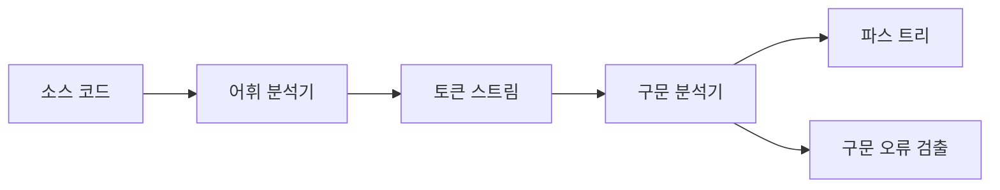
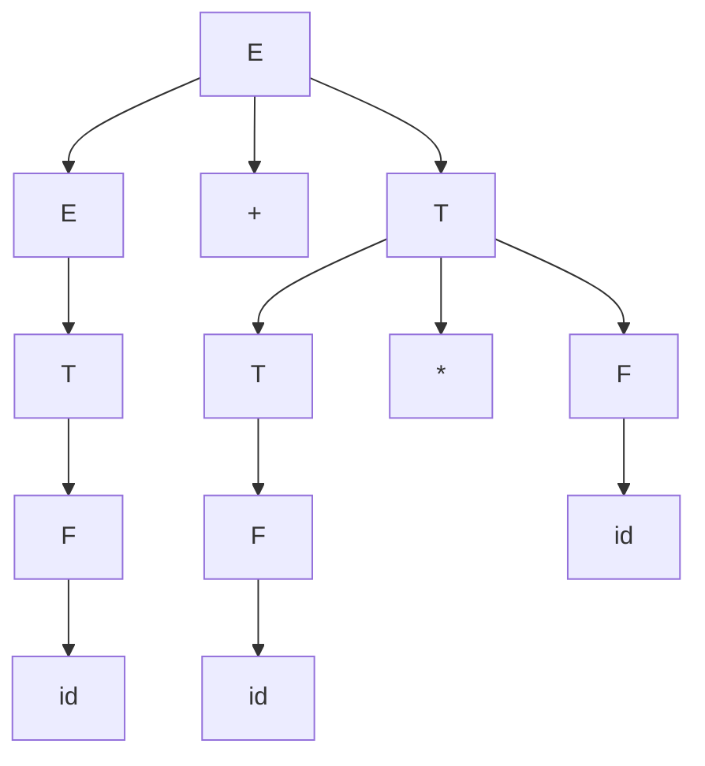
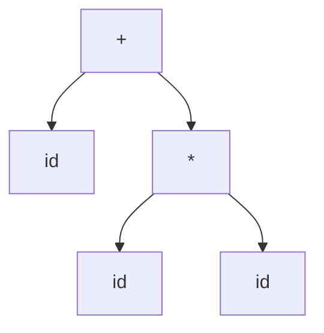
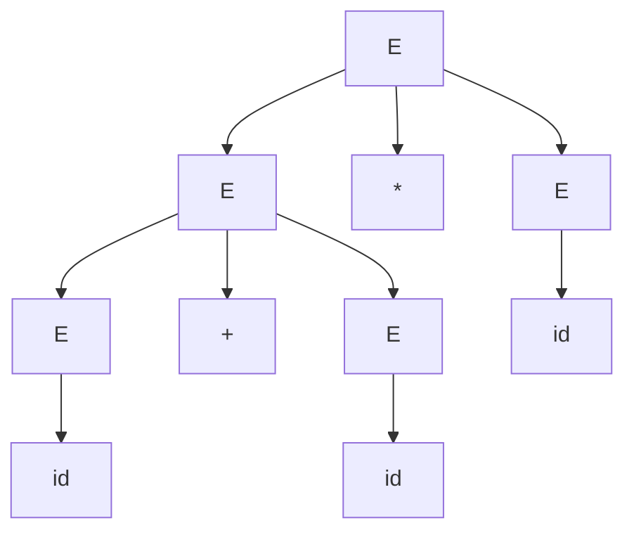
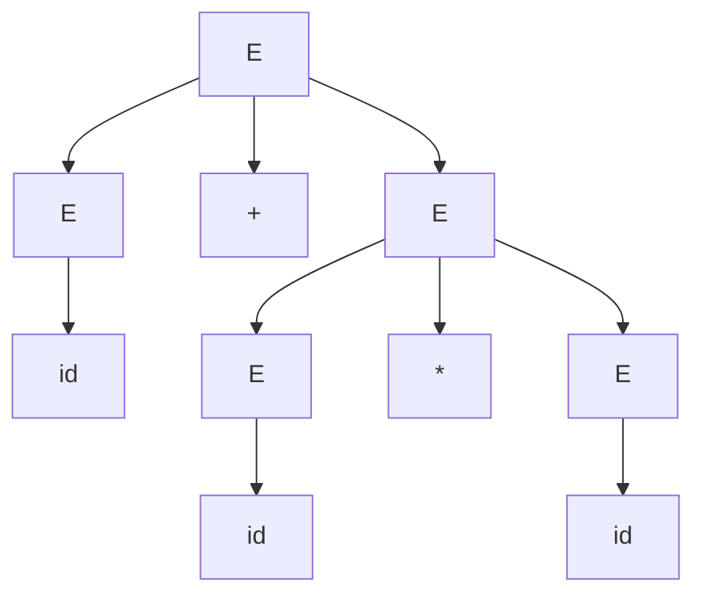

## 1. 구문 분석 개요

### 1.1 구문 분석이란?

**구문 분석(Syntax Analysis)** 또는 **파싱(Parsing)**은 컴파일러의 두 번째 단계로, 어휘 분석기가 생성한 토큰 스트림을 입력받아 프로그래밍 언어의 문법 규칙에 맞는지 검증하고, 프로그램의 구조를 표현하는 **파스 트리(Parse Tree)** 또는 **구문 트리(Syntax Tree)**를 생성합니다.



### 1.2 구문 분석의 역할

1. **문법 검증**: 토큰 시퀀스가 언어의 문법 규칙을 따르는지 확인
2. **구조 파악**: 프로그램의 계층적 구조를 파악
3. **파스 트리 생성**: 프로그램의 구문 구조를 트리 형태로 표현
4. **오류 보고**: 문법 오류를 발견하고 의미있는 오류 메시지 생성

### 1.3 컴파일러에서의 위치

```
소스 코드
    ↓
어휘 분석 (Lexical Analysis)
    ↓
토큰 스트림: id, +, num, *, id, ...
    ↓
구문 분석 (Syntax Analysis) ← 현재 단계
    ↓
파스 트리 / AST
    ↓
의미 분석 (Semantic Analysis)
    ↓
중간 코드 생성
```

---

## 2. 문맥 자유 문법 (Context-Free Grammar)

### 2.1 CFG란?

**문맥 자유 문법(Context-Free Grammar, CFG)**은 프로그래밍 언어의 구문 구조를 정의하는 형식 문법입니다. 정규 표현식보다 표현력이 강력하여 중첩 구조를 표현할 수 있습니다.

### 2.2 CFG의 구성 요소

CFG는 다음 4가지 요소로 구성됩니다:

1. **단말 기호(Terminals)**: 토큰, 실제 프로그램에 나타나는 기호
   - 예: `id`, `+`, `-`, `*`, `/`, `num`, `(`, `)`

2. **비단말 기호(Non-terminals)**: 문법 규칙의 좌변에 나타나는 변수
   - 예: `E` (expression), `T` (term), `F` (factor)

3. **시작 기호(Start Symbol)**: 문법의 시작점이 되는 비단말 기호
   - 보통 `S` 또는 특정 비단말 기호

4. **생성 규칙(Production Rules)**: 비단말 기호를 다른 기호들로 치환하는 규칙
   - 형식: `A → α` (A는 비단말 기호, α는 기호들의 열)

### 2.3 CFG 예제

간단한 산술 표현식 문법:

```
E → E + T
E → T
T → T * F
T → F
F → ( E )
F → id
F → num
```

**표기법 설명**:
- `E`: Expression (식)
- `T`: Term (항)
- `F`: Factor (인자)
- `→`: "다음으로 생성될 수 있다"
- `|`: "또는" (여러 규칙을 한 줄로 표현)

**간소화된 표기**:
```
E → E + T | T
T → T * F | F
F → ( E ) | id | num
```

### 2.4 유도(Derivation)

**유도(Derivation)**는 시작 기호에서 시작하여 생성 규칙을 반복 적용해 목표 문자열을 생성하는 과정입니다.

**예제: `id + id * id` 유도하기**

**최좌 유도(Leftmost Derivation)**:
```
E ⇒ E + T         (규칙 E → E + T 적용)
  ⇒ T + T         (규칙 E → T 적용)
  ⇒ F + T         (규칙 T → F 적용)
  ⇒ id + T        (규칙 F → id 적용)
  ⇒ id + T * F    (규칙 T → T * F 적용)
  ⇒ id + F * F    (규칙 T → F 적용)
  ⇒ id + id * F   (규칙 F → id 적용)
  ⇒ id + id * id  (규칙 F → id 적용)
```

**최우 유도(Rightmost Derivation)**:
```
E ⇒ E + T         (규칙 E → E + T 적용)
  ⇒ E + T * F     (규칙 T → T * F 적용)
  ⇒ E + T * id    (규칙 F → id 적용)
  ⇒ E + F * id    (규칙 T → F 적용)
  ⇒ E + id * id   (규칙 F → id 적용)
  ⇒ T + id * id   (규칙 E → T 적용)
  ⇒ F + id * id   (규칙 T → F 적용)
  ⇒ id + id * id  (규칙 F → id 적용)
```

---

## 3. 파스 트리 (Parse Tree)

### 3.1 파스 트리란?

**파스 트리(Parse Tree)**는 유도 과정을 트리 구조로 표현한 것입니다.

- **루트(Root)**: 시작 기호
- **내부 노드(Internal Nodes)**: 비단말 기호
- **리프(Leaves)**: 단말 기호 (왼쪽에서 오른쪽으로 읽으면 입력 문자열)

### 3.2 파스 트리 예제

표현식 `id + id * id`의 파스 트리:



**파스 트리 특징**:
- 연산자 우선순위 반영: `*`가 `+`보다 먼저 계산되도록 트리가 구성됨
- 결합성(Associativity) 표현: 좌결합성 연산자는 왼쪽으로 치우쳐진 트리

### 3.3 추상 구문 트리 (AST)

**추상 구문 트리(Abstract Syntax Tree, AST)**는 파스 트리에서 불필요한 정보를 제거한 간소화된 트리입니다.

**파스 트리 vs AST**:
- 파스 트리: 모든 문법 규칙을 포함, 크기가 큼
- AST: 의미 있는 정보만 포함, 컴팩트

**AST 예제 (`id + id * id`)**:


---

## 4. 문법의 모호성 (Ambiguity)

### 4.1 모호한 문법이란?

**모호한 문법(Ambiguous Grammar)**은 하나의 문자열에 대해 두 개 이상의 서로 다른 파스 트리를 생성할 수 있는 문법입니다.

### 4.2 모호성 예제

**모호한 문법**:
```
E → E + E | E * E | id
```

**문자열 `id + id * id`에 대한 두 가지 파스 트리**:

**해석 1: (id + id) * id**


**해석 2: id + (id * id)**


### 4.3 모호성 제거 방법

**방법 1: 문법 재작성**

연산자 우선순위와 결합성을 명시적으로 표현:

```
E → E + T | T          (낮은 우선순위: 덧셈)
T → T * F | F          (높은 우선순위: 곱셈)
F → ( E ) | id
```

**방법 2: 우선순위 및 결합성 규칙 사용**

파서에 연산자 우선순위와 결합성 정보를 제공하여 모호성 해결.

---

## 5. 하향식 구문 분석 (Top-Down Parsing)

### 5.1 하향식 파싱 개요

**하향식 파싱(Top-Down Parsing)**은 시작 기호에서 시작하여 입력 문자열을 생성하려고 시도하는 파싱 방법입니다.

**특징**:
- 최좌 유도(Leftmost Derivation)를 수행
- 파스 트리를 루트에서 리프 방향으로 구성
- 예측적 파싱(Predictive Parsing)과 백트래킹(Backtracking) 방식이 있음

### 5.2 하향식 파싱의 종류

1. **재귀 하강 파서(Recursive Descent Parser)**
   - 각 비단말 기호에 대해 재귀 함수를 작성
   - 구현이 간단하지만 백트래킹 필요 시 비효율적

2. **예측적 파서(Predictive Parser)**
   - 백트래킹 없이 다음에 적용할 규칙을 예측
   - LL(1) 파서가 대표적

---

## 6. 재귀 하강 파서 (Recursive Descent Parser)

### 6.1 재귀 하강 파서란?

**재귀 하강 파서**는 각 비단말 기호에 대해 하나의 재귀 함수를 작성하는 파싱 방법입니다.

**장점**:
- 구현이 직관적이고 이해하기 쉬움
- 수작업으로 작성 가능
- 디버깅이 용이

**단점**:
- 좌재귀 문법(Left-Recursive Grammar)에서 무한 루프 발생
- 백트래킹이 필요한 경우 비효율적

### 6.2 재귀 하강 파서 구현

**문법**:
```
E → T E'
E' → + T E' | ε
T → F T'
T' → * F T' | ε
F → ( E ) | id | num
```

**참고**: 이 문법은 좌재귀를 제거하고 우결합성으로 변환한 버전입니다.

**C 코드 예제**:

```c
#include <stdio.h>
#include <stdlib.h>
#include <ctype.h>

char lookahead; // 현재 보고 있는 토큰

void error() {
    printf("Syntax error\n");
    exit(1);
}

void match(char t) {
    if (lookahead == t)
        lookahead = getchar();
    else
        error();
}

// F → ( E ) | id | num
void F() {
    if (lookahead == '(') {
        match('(');
        E();
        match(')');
    } else if (isalpha(lookahead)) {
        // id
        match(lookahead);
    } else if (isdigit(lookahead)) {
        // num
        match(lookahead);
    } else {
        error();
    }
}

// T' → * F T' | ε
void T_prime() {
    if (lookahead == '*') {
        match('*');
        F();
        T_prime();
    }
    // ε (epsilon): 아무것도 하지 않음
}

// T → F T'
void T() {
    F();
    T_prime();
}

// E' → + T E' | ε
void E_prime() {
    if (lookahead == '+') {
        match('+');
        T();
        E_prime();
    }
    // ε (epsilon): 아무것도 하지 않음
}

// E → T E'
void E() {
    T();
    E_prime();
}

int main() {
    printf("Enter an expression: ");
    lookahead = getchar();
    E();
    if (lookahead == '\n')
        printf("Parsing successful\n");
    else
        error();
    return 0;
}
```

**실행 예제**:
```
입력: a+b*c
출력: Parsing successful

입력: (a+b)*c
출력: Parsing successful

입력: a+*b
출력: Syntax error
```

### 6.3 재귀 하강 파서 동작 원리

**입력: `a+b*c`**

```
E() 호출
  └─ T() 호출
      └─ F() 호출: 'a' 매치
      └─ T_prime() 호출: '*' 없음, 리턴
  └─ E_prime() 호출
      └─ '+' 매치
      └─ T() 호출
          └─ F() 호출: 'b' 매치
          └─ T_prime() 호출
              └─ '*' 매치
              └─ F() 호출: 'c' 매치
              └─ T_prime() 호출: '*' 없음, 리턴
      └─ E_prime() 호출: '+' 없음, 리턴
```

---

## 7. 좌재귀 제거 (Left Recursion Elimination)

### 7.1 좌재귀란?

**좌재귀(Left Recursion)**는 생성 규칙의 우변이 자기 자신(좌변의 비단말 기호)으로 시작하는 경우입니다.

```
A → A α | β
```

**문제점**: 재귀 하강 파서에서 무한 루프 발생

**예제**:
```
E → E + T | T
```

### 7.2 좌재귀 제거 방법

**직접 좌재귀(Immediate Left Recursion) 제거**:

**원래 문법**:
```
A → A α | β
```

**변환 후**:
```
A → β A'
A' → α A' | ε
```

**예제**:
```
원래: E → E + T | T

변환 후:
E → T E'
E' → + T E' | ε
```

### 7.3 좌재귀 제거 예제

**원래 문법**:
```
E → E + T | T
T → T * F | F
F → ( E ) | id
```

**좌재귀 제거 후**:
```
E → T E'
E' → + T E' | ε
T → F T'
T' → * F T' | ε
F → ( E ) | id
```

---

## 8. 백트래킹과 예측적 파싱

### 8.1 백트래킹 문제

**백트래킹(Backtracking)**은 잘못된 선택을 했을 때 되돌아가서 다른 규칙을 시도하는 방법입니다.

**문제점**:
- 비효율적: 시간 복잡도가 지수적으로 증가할 수 있음
- 구현 복잡도 증가

**예제**:
```
S → cAd
A → ab | a
입력: cad
```

백트래킹 과정:
```
1. S → cAd 선택
2. A → ab 시도: c, a, b 매치 시도 → 실패 (입력은 'a'만 있음)
3. 백트랙: A → a 시도: c, a, d 매치 → 성공
```

### 8.2 예측적 파싱

**예측적 파싱(Predictive Parsing)**은 백트래킹 없이 현재 입력 심볼을 보고 다음에 적용할 규칙을 결정하는 방법입니다.

**조건**:
- 각 비단말 기호와 현재 입력 심볼에 대해 적용할 규칙이 최대 1개여야 함
- **LL(1) 문법**이 이 조건을 만족

**장점**:
- 효율적: 선형 시간 복잡도 O(n)
- 백트래킹 불필요

---

## 9. FIRST와 FOLLOW 집합

### 9.1 FIRST 집합

**FIRST(α)**는 비단말 기호 또는 기호 열 α로부터 유도될 수 있는 첫 번째 단말 기호들의 집합입니다.

**정의**:
- α가 단말 기호면: FIRST(α) = {α}
- α가 비단말 기호 A이고, A → X₁X₂...Xₙ인 경우:
  - FIRST(A)에 FIRST(X₁) 추가
  - X₁이 ε을 유도할 수 있으면 FIRST(X₂)도 추가, 반복

**예제**:
```
E → T E'
E' → + T E' | ε
T → F T'
T' → * F T' | ε
F → ( E ) | id | num
```

**FIRST 집합 계산**:
```
FIRST(F) = { (, id, num }
FIRST(T') = { *, ε }
FIRST(T) = FIRST(F) = { (, id, num }
FIRST(E') = { +, ε }
FIRST(E) = FIRST(T) = { (, id, num }
```

### 9.2 FOLLOW 집합

**FOLLOW(A)**는 비단말 기호 A 다음에 올 수 있는 단말 기호들의 집합입니다.

**정의**:
1. 시작 기호 S에 대해: FOLLOW(S)에 $ (입력 끝 표시) 추가
2. A → αBβ인 규칙에 대해:
   - FIRST(β) - {ε}를 FOLLOW(B)에 추가
   - β가 ε을 유도하거나 β가 없으면: FOLLOW(A)를 FOLLOW(B)에 추가

**예제**:
```
E → T E'
E' → + T E' | ε
T → F T'
T' → * F T' | ε
F → ( E ) | id | num
```

**FOLLOW 집합 계산**:
```
FOLLOW(E) = { ), $ }
FOLLOW(E') = FOLLOW(E) = { ), $ }
FOLLOW(T) = FIRST(E') ∪ FOLLOW(E) ∪ FOLLOW(E') = { +, ), $ }
FOLLOW(T') = FOLLOW(T) = { +, ), $ }
FOLLOW(F) = FIRST(T') ∪ FOLLOW(T) ∪ FOLLOW(T') = { *, +, ), $ }
```

---

## 10. 실습 예제

### 예제 1: 간단한 문법 파싱

**문법**:
```
S → ( S ) S | ε
```

**질문**: 다음 문자열이 이 문법으로 생성될 수 있는가?
1. `(())`
2. `()()`
3. `(()`

**풀이**:

1. **`(())`**:
```
S ⇒ ( S ) S
  ⇒ ( ( S ) S ) S
  ⇒ ( ( ε ) S ) S
  ⇒ ( ( ) S ) S
  ⇒ ( ( ) ε ) S
  ⇒ ( ( ) ) S
  ⇒ ( ( ) ) ε
  ⇒ ( ( ) )
```
✅ 생성 가능

2. **`()()`**:
```
S ⇒ ( S ) S
  ⇒ ( ε ) S
  ⇒ ( ) S
  ⇒ ( ) ( S ) S
  ⇒ ( ) ( ε ) S
  ⇒ ( ) ( ) S
  ⇒ ( ) ( ) ε
  ⇒ ( ) ( )
```
✅ 생성 가능

3. **`(()`**:
좌우 괄호 개수가 맞지 않으므로 생성 불가능
❌ 생성 불가능

### 예제 2: 재귀 하강 파서 작성

**문법**:
```
S → a S b | c
```

**재귀 하강 파서 (C 코드)**:

```c
#include <stdio.h>
#include <stdlib.h>

char lookahead;

void error() {
    printf("Syntax error\n");
    exit(1);
}

void match(char t) {
    if (lookahead == t)
        lookahead = getchar();
    else
        error();
}

// S → a S b | c
void S() {
    if (lookahead == 'a') {
        match('a');
        S();
        match('b');
    } else if (lookahead == 'c') {
        match('c');
    } else {
        error();
    }
}

int main() {
    printf("Enter a string: ");
    lookahead = getchar();
    S();
    if (lookahead == '\n')
        printf("Parsing successful\n");
    else
        error();
    return 0;
}
```

**테스트**:
```
입력: c
출력: Parsing successful

입력: acb
출력: Parsing successful

입력: aacbb
출력: Parsing successful

입력: aacb
출력: Syntax error
```

### 예제 3: FIRST/FOLLOW 계산

**문법**:
```
S → A B
A → a A | ε
B → b B | ε
```

**FIRST 계산**:
```
FIRST(A) = { a, ε }
FIRST(B) = { b, ε }
FIRST(S) = FIRST(A) - {ε} ∪ FIRST(B) = { a, b, ε }
```

**FOLLOW 계산**:
```
FOLLOW(S) = { $ }
FOLLOW(A) = FIRST(B) - {ε} ∪ FOLLOW(S) = { b, $ }
FOLLOW(B) = FOLLOW(S) = { $ }
```

---

## 11. 요약

### 핵심 개념

1. **구문 분석**: 토큰 시퀀스가 문법 규칙을 만족하는지 검증하고 파스 트리 생성

2. **문맥 자유 문법(CFG)**: 프로그래밍 언어의 구문 구조를 정의하는 형식 문법
   - 단말 기호, 비단말 기호, 시작 기호, 생성 규칙

3. **유도**: 시작 기호에서 목표 문자열을 생성하는 과정
   - 최좌 유도, 최우 유도

4. **파스 트리**: 유도 과정을 트리로 표현
   - AST: 불필요한 정보를 제거한 간소화된 트리

5. **모호성**: 하나의 문자열에 대해 여러 파스 트리가 존재
   - 문법 재작성 또는 우선순위/결합성 규칙으로 해결

6. **하향식 파싱**: 시작 기호에서 입력 문자열을 생성하려 시도
   - 재귀 하강 파서: 각 비단말 기호에 대한 재귀 함수

7. **좌재귀 제거**: 재귀 하강 파서의 무한 루프 방지

8. **FIRST/FOLLOW**: 예측적 파싱을 위한 집합
   - FIRST: 첫 번째 단말 기호
   - FOLLOW: 다음에 올 수 있는 단말 기호

### 다음 단계

다음 포스트에서는 **구문 분석 Part 2**로 다음 내용을 다룰 예정입니다:
- LL(1) 파서와 파싱 테이블
- 상향식 파싱 (Bottom-Up Parsing)
- LR 파서 (LR(0), SLR, LR(1), LALR)
- Yacc/Bison 도구 사용법

---

## 참고 자료

- Aho, A. V., Lam, M. S., Sethi, R., & Ullman, J. D. (2006). *Compilers: Principles, Techniques, and Tools* (2nd ed.). Addison-Wesley.
- [Stanford CS143: Compilers](https://web.stanford.edu/class/cs143/)
- [Context-Free Grammars - Wikipedia](https://en.wikipedia.org/wiki/Context-free_grammar)
