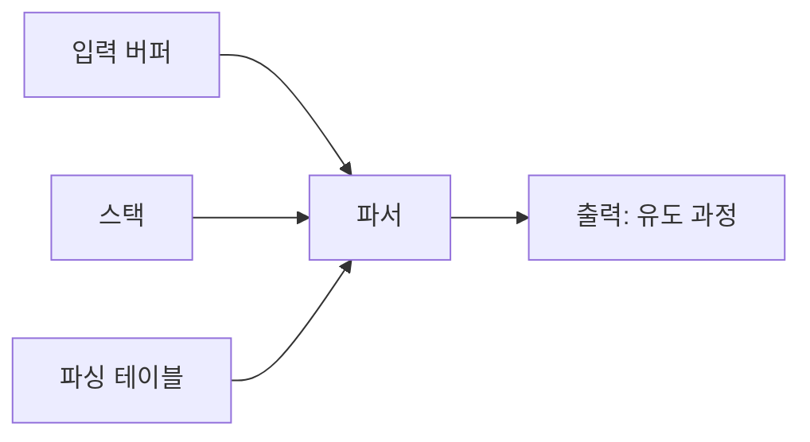
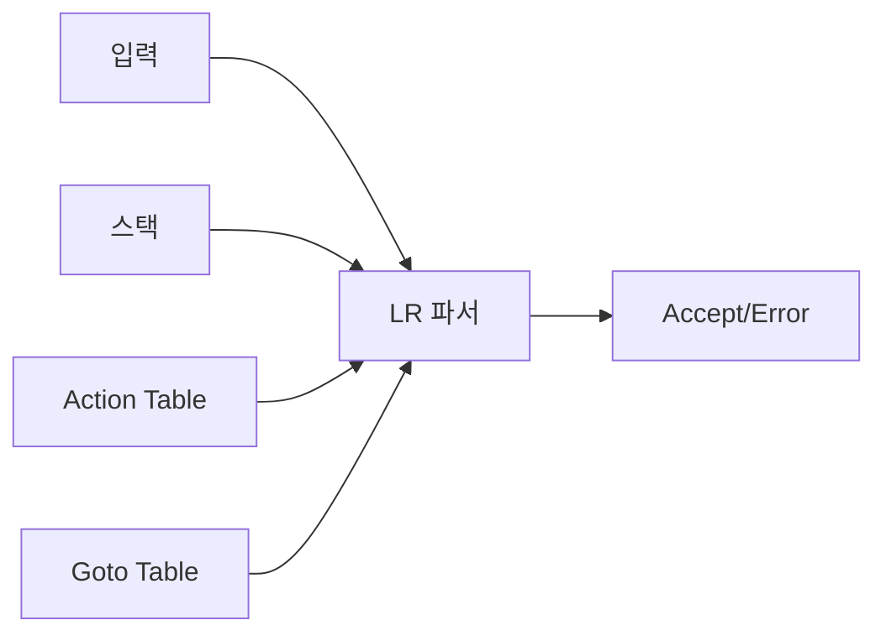
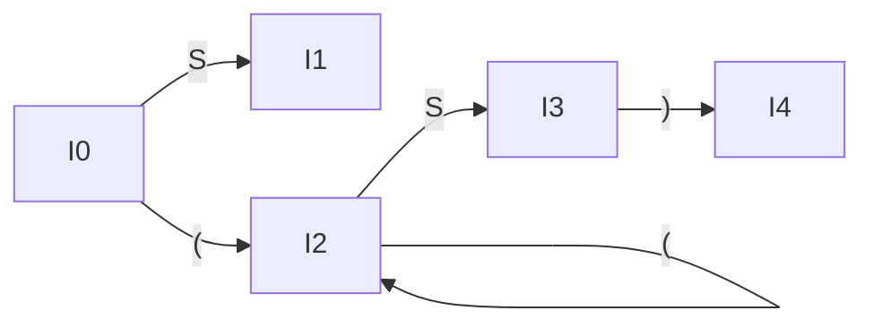

## 1. LL(1) 파서 개요

### 1.1 LL(1) 파서란?

**LL(1) 파서**는 예측적 하향식 파서의 일종으로, 백트래킹 없이 효율적으로 구문 분석을 수행합니다.

**LL(1) 의미**:
- **첫 번째 L**: Left-to-right scanning (왼쪽에서 오른쪽으로 입력 읽기)
- **두 번째 L**: Leftmost derivation (최좌 유도 생성)
- **(1)**: 1개의 lookahead 심볼만 사용

### 1.2 LL(1) 파서의 특징

**장점**:
- 선형 시간 복잡도 O(n)
- 파싱 테이블 기반으로 자동 생성 가능
- 백트래킹 불필요

**단점**:
- 모든 문법이 LL(1)이 아님
- 좌재귀 문법 불가
- 모호한 문법 처리 불가

### 1.3 LL(1) 문법 조건

문법 G가 LL(1)이 되려면:
1. 좌재귀가 없어야 함
2. 각 비단말 기호 A와 lookahead 심볼 a에 대해, 적용 가능한 생성 규칙이 최대 1개

**형식적 정의**:
비단말 기호 A에 대해 A → α | β 규칙이 있을 때:
- FIRST(α) ∩ FIRST(β) = ∅
- α가 ε을 유도하면: FIRST(β) ∩ FOLLOW(A) = ∅

---

## 2. LL(1) 파싱 테이블 구성

### 2.1 파싱 테이블이란?

**파싱 테이블(Parsing Table)**은 (비단말 기호, 입력 심볼) 쌍에 대해 어떤 생성 규칙을 적용할지 결정하는 2차원 테이블입니다.

**구조**:
- 행(Row): 비단말 기호
- 열(Column): 단말 기호 (+ $)
- 셀(Cell): 적용할 생성 규칙

### 2.2 파싱 테이블 구성 알고리즘

**입력**: 문법 G
**출력**: 파싱 테이블 M

**알고리즘**:
```
For 각 생성 규칙 A → α:
  For 각 단말 기호 a ∈ FIRST(α):
    M[A, a]에 "A → α" 추가

  If ε ∈ FIRST(α):
    For 각 b ∈ FOLLOW(A):
      M[A, b]에 "A → α" 추가
```

### 2.3 예제: 파싱 테이블 구성

**문법**:
```
E → T E'
E' → + T E' | ε
T → F T'
T' → * F T' | ε
F → ( E ) | id | num
```

**FIRST/FOLLOW 집합** (Part 1에서 계산):
```
FIRST(E) = { (, id, num }
FIRST(E') = { +, ε }
FIRST(T) = { (, id, num }
FIRST(T') = { *, ε }
FIRST(F) = { (, id, num }

FOLLOW(E) = { ), $ }
FOLLOW(E') = { ), $ }
FOLLOW(T) = { +, ), $ }
FOLLOW(T') = { +, ), $ }
FOLLOW(F) = { *, +, ), $ }
```

**LL(1) 파싱 테이블**:

| 비단말 | id | num | + | * | ( | ) | $ |
|--------|----|----|---|---|---|---|---|
| **E**  | E→TE' | E→TE' | | | E→TE' | | |
| **E'** | | | E'→+TE' | | | E'→ε | E'→ε |
| **T**  | T→FT' | T→FT' | | | T→FT' | | |
| **T'** | | | T'→ε | T'→*FT' | | T'→ε | T'→ε |
| **F**  | F→id | F→num | | | F→(E) | | |

---

## 3. LL(1) 파서 동작

### 3.1 파서 구조

LL(1) 파서는 다음 요소로 구성됩니다:
- **입력 버퍼**: 소스 코드 토큰 스트림
- **스택**: 파싱 과정을 추적
- **파싱 테이블**: 다음 동작 결정
- **출력**: 생성 규칙 시퀀스 (유도 과정)



### 3.2 파싱 알고리즘

**초기 상태**:
- 스택: `$ S` (S는 시작 기호)
- 입력: `토큰1 토큰2 ... $`

**동작**:
```
While (스택 ≠ $):
  X = 스택 top
  a = 현재 입력 심볼

  If X == a == $:
    Accept (파싱 성공)
  Else If X == a:
    Pop 스택
    Advance 입력
  Else If X는 단말 기호:
    Error
  Else If M[X, a] == 비어있음:
    Error
  Else If M[X, a] == X → Y1 Y2 ... Yk:
    Pop 스택
    Push Yk, Yk-1, ..., Y1 (역순)
    출력: X → Y1 Y2 ... Yk
```

### 3.3 파싱 예제

**입력**: `id + id * id $`

**파싱 과정**:

| 단계 | 스택 | 입력 | 동작 |
|------|------|------|------|
| 1 | $ E | id + id * id $ | M[E, id] = E → T E' |
| 2 | $ E' T | id + id * id $ | M[T, id] = T → F T' |
| 3 | $ E' T' F | id + id * id $ | M[F, id] = F → id |
| 4 | $ E' T' id | id + id * id $ | Match id |
| 5 | $ E' T' | + id * id $ | M[T', +] = T' → ε |
| 6 | $ E' | + id * id $ | M[E', +] = E' → + T E' |
| 7 | $ E' T + | + id * id $ | Match + |
| 8 | $ E' T | id * id $ | M[T, id] = T → F T' |
| 9 | $ E' T' F | id * id $ | M[F, id] = F → id |
| 10 | $ E' T' id | id * id $ | Match id |
| 11 | $ E' T' | * id $ | M[T', *] = T' → * F T' |
| 12 | $ E' T' F * | * id $ | Match * |
| 13 | $ E' T' F | id $ | M[F, id] = F → id |
| 14 | $ E' T' id | id $ | Match id |
| 15 | $ E' T' | $ | M[T', $] = T' → ε |
| 16 | $ E' | $ | M[E', $] = E' → ε |
| 17 | $ | $ | Accept |

---

## 4. 상향식 구문 분석 (Bottom-Up Parsing)

### 4.1 상향식 파싱 개요

**상향식 파싱(Bottom-Up Parsing)**은 입력 문자열에서 시작하여 시작 기호로 축약(reduce)해 나가는 파싱 방법입니다.

**특징**:
- 최우 유도(Rightmost Derivation)의 역순
- 파스 트리를 리프에서 루트 방향으로 구성
- LR 파서가 대표적

**하향식 vs 상향식**:
```
하향식: S ⇒ ... ⇒ 입력 문자열
상향식: 입력 문자열 ⇒ ... ⇒ S
```

### 4.2 Shift-Reduce 파싱

**Shift-Reduce 파싱**은 상향식 파싱의 기본 기법입니다.

**두 가지 동작**:
1. **Shift**: 입력 심볼을 스택에 이동(push)
2. **Reduce**: 스택 top의 기호들을 생성 규칙의 좌변으로 축약

**예제**:
```
문법:
E → E + T | T
T → T * F | F
F → ( E ) | id

입력: id + id * id
```

**파싱 과정**:

| 단계 | 스택 | 입력 | 동작 |
|------|------|------|------|
| 1 | $ | id + id * id $ | Shift |
| 2 | $ id | + id * id $ | Reduce F → id |
| 3 | $ F | + id * id $ | Reduce T → F |
| 4 | $ T | + id * id $ | Reduce E → T |
| 5 | $ E | + id * id $ | Shift |
| 6 | $ E + | id * id $ | Shift |
| 7 | $ E + id | * id $ | Reduce F → id |
| 8 | $ E + F | * id $ | Reduce T → F |
| 9 | $ E + T | * id $ | Shift |
| 10 | $ E + T * | id $ | Shift |
| 11 | $ E + T * id | $ | Reduce F → id |
| 12 | $ E + T * F | $ | Reduce T → T * F |
| 13 | $ E + T | $ | Reduce E → E + T |
| 14 | $ E | $ | Accept |

### 4.3 핸들(Handle)

**핸들(Handle)**은 다음 reduce 동작에서 축약할 스택 내의 부분 문자열입니다.

**형식적 정의**:
최우 파생 S ⇒* αAw ⇒ αβw에서, β가 핸들입니다.

**핸들 찾기**:
- 스택에서 어떤 생성 규칙의 우변과 일치하는 부분을 찾음
- 여러 후보가 있을 수 있음 → LR 파서가 정확히 결정

---

## 5. LR 파서 개요

### 5.1 LR 파서란?

**LR 파서**는 강력한 상향식 파서로, 대부분의 프로그래밍 언어 문법을 처리할 수 있습니다.

**LR 의미**:
- **L**: Left-to-right scanning
- **R**: Rightmost derivation (역순)

**LR 파서 종류**:
1. **LR(0)**: 가장 단순, 제한적
2. **SLR (Simple LR)**: LR(0) 개선
3. **LR(1)**: 가장 강력, 테이블이 큼
4. **LALR (Look-Ahead LR)**: LR(1)과 SLR의 절충

### 5.2 LR 파서 구조

LR 파서는 다음 요소로 구성됩니다:
- **입력 버퍼**: 토큰 스트림
- **스택**: 상태와 심볼 쌍 저장
- **동작 테이블(Action Table)**: Shift/Reduce 결정
- **이동 테이블(Goto Table)**: 상태 전이



### 5.3 LR 파싱 테이블

**Action Table**: (상태, 단말 기호) → 동작
- **Shift s**: 상태 s로 shift
- **Reduce r**: 규칙 r로 reduce
- **Accept**: 파싱 성공
- **Error**: 오류

**Goto Table**: (상태, 비단말 기호) → 다음 상태

---

## 6. LR(0) 항목과 오토마타

### 6.1 LR(0) 항목

**LR(0) 항목(Item)**은 생성 규칙에 점(•)을 추가한 것으로, 파싱 진행 상태를 나타냅니다.

**예제**:
```
규칙: E → E + T

항목:
E → • E + T   (아직 E를 보지 않음)
E → E • + T   (E를 봤고, +를 기다림)
E → E + • T   (+를 봤고, T를 기다림)
E → E + T •   (모두 봤음, reduce 준비)
```

### 6.2 항목 집합 구성

**Closure 연산**:
```
Closure(I):
  Repeat:
    For 각 항목 A → α • B β in I:
      For 각 생성 규칙 B → γ:
        I에 B → • γ 추가
  Until I가 변하지 않음
```

**Goto 연산**:
```
Goto(I, X):
  J = ∅
  For 각 항목 A → α • X β in I:
    J에 A → α X • β 추가
  Return Closure(J)
```

### 6.3 LR(0) 오토마타 예제

**문법**:
```
(0) S' → S
(1) S → ( S )
(2) S → ε
```

**LR(0) 항목 집합**:

**I0** (초기 상태):
```
S' → • S
S → • ( S )
S → •
```

**I1** = Goto(I0, S):
```
S' → S •
```

**I2** = Goto(I0, '('):
```
S → ( • S )
S → • ( S )
S → •
```

**I3** = Goto(I2, S):
```
S → ( S • )
```

**I4** = Goto(I3, ')'):
```
S → ( S ) •
```

**I5** = Goto(I2, '('):
```
(I2와 동일)
```

**오토마타**:


---

## 7. SLR 파싱

### 7.1 SLR 파서란?

**SLR (Simple LR) 파서**는 LR(0)에 FOLLOW 집합을 활용하여 reduce 충돌을 해결합니다.

**동작 테이블 구성**:
```
For 각 상태 I:
  For 각 항목 A → α • a β in I (a는 단말):
    Action[I, a] = Shift Goto(I, a)

  For 각 항목 A → α • in I:
    For 각 a ∈ FOLLOW(A):
      Action[I, a] = Reduce A → α

  If S' → S • in I:
    Action[I, $] = Accept
```

### 7.2 SLR 파싱 테이블 예제

**문법**:
```
(0) S' → E
(1) E → E + T
(2) E → T
(3) T → T * F
(4) T → F
(5) F → ( E )
(6) F → id
```

**SLR Action/Goto 테이블** (간략):

| 상태 | id | + | * | ( | ) | $ | E | T | F |
|------|----|----|---|---|---|---|---|---|---|
| 0 | s5 | | | s4 | | | 1 | 2 | 3 |
| 1 | | s6 | | | | acc | | | |
| 2 | | r2 | s7 | | r2 | r2 | | | |
| 3 | | r4 | r4 | | r4 | r4 | | | |
| 4 | s5 | | | s4 | | | 8 | 2 | 3 |
| 5 | | r6 | r6 | | r6 | r6 | | | |
| 6 | s5 | | | s4 | | | | 9 | 3 |
| 7 | s5 | | | s4 | | | | | 10 |
| 8 | | s6 | | | s11 | | | | |
| 9 | | r1 | s7 | | r1 | r1 | | | |
| 10 | | r3 | r3 | | r3 | r3 | | | |
| 11 | | r5 | r5 | | r5 | r5 | | | |

**표기법**:
- **s5**: Shift and go to state 5
- **r2**: Reduce by rule 2
- **acc**: Accept

---

## 8. LR(1)과 LALR 파서

### 8.1 LR(1) 파서

**LR(1) 항목**은 lookahead 심볼을 포함합니다:
```
[A → α • β, a]
```
- A → α • β: LR(0) 항목
- a: lookahead 심볼

**장점**: 가장 강력한 파서 클래스
**단점**: 상태 수가 매우 많아 테이블이 큼

### 8.2 LALR 파서

**LALR (Look-Ahead LR) 파서**는 LR(1) 상태를 병합하여 테이블 크기를 줄입니다.

**장점**:
- LR(1)의 강력함 유지 (대부분 경우)
- SLR 수준의 테이블 크기
- Yacc/Bison이 LALR 사용

**단점**:
- 일부 LR(1) 문법을 처리 못함 (드묾)

---

## 9. Yacc/Bison 사용법

### 9.1 Yacc/Bison이란?

**Yacc (Yet Another Compiler Compiler)**와 **Bison**은 LALR 파서 생성기입니다.

**기능**:
- 문법 파일(.y)을 입력받아 C 코드 파서 생성
- Lex/Flex와 연동하여 완전한 파서 구축

### 9.2 Bison 파일 구조

**기본 구조**:
```yacc
%{
/* C 코드: 헤더, 선언 등 */
%}

/* Bison 선언부 */
%token TOKEN1 TOKEN2
%type <type> non_terminal

%%
/* 문법 규칙 */
start: rules { action }
     | more_rules { action }
     ;

%%
/* C 코드: 보조 함수 등 */
```

### 9.3 간단한 계산기 예제

**calculator.y**:
```yacc
%{
#include <stdio.h>
#include <stdlib.h>

void yyerror(const char *s);
int yylex(void);
%}

%token NUMBER
%left '+' '-'
%left '*' '/'

%%

input:
    /* 빈 규칙 */
    | input line
    ;

line:
    '\n'
    | exp '\n'      { printf("Result: %d\n", $1); }
    ;

exp:
    NUMBER          { $$ = $1; }
    | exp '+' exp   { $$ = $1 + $3; }
    | exp '-' exp   { $$ = $1 - $3; }
    | exp '*' exp   { $$ = $1 * $3; }
    | exp '/' exp   { $$ = $1 / $3; }
    | '(' exp ')'   { $$ = $2; }
    ;

%%

void yyerror(const char *s) {
    fprintf(stderr, "Error: %s\n", s);
}

int main(void) {
    yyparse();
    return 0;
}
```

**calculator.l** (Flex):
```lex
%{
#include "y.tab.h"
%}

%%

[0-9]+      { yylval = atoi(yytext); return NUMBER; }
[ \t]+      { /* 공백 무시 */ }
\n          { return '\n'; }
.           { return yytext[0]; }

%%

int yywrap(void) {
    return 1;
}
```

**컴파일 및 실행**:
```bash
$ bison -d calculator.y
$ flex calculator.l
$ gcc y.tab.c lex.yy.c -o calculator -lfl
$ ./calculator
3 + 4 * 5
Result: 23
```

### 9.4 Bison 고급 기능

**우선순위와 결합성**:
```yacc
%left '+' '-'       /* 좌결합 */
%left '*' '/'       /* 좌결합, 높은 우선순위 */
%right '^'          /* 우결합 */
%nonassoc UMINUS    /* 비결합 */
```

**타입 지정**:
```yacc
%union {
    int intval;
    float floatval;
    char *strval;
}

%token <intval> NUMBER
%token <strval> IDENTIFIER
%type <floatval> expression
```

**액션 코드**:
```yacc
exp: exp '+' exp    { $$ = $1 + $3; printf("Adding\n"); }
```

---

## 10. 실습 예제

### 예제 1: LL(1) 파싱 테이블 구성

**문법**:
```
S → A B
A → a A | ε
B → b B | ε
```

**FIRST/FOLLOW**:
```
FIRST(S) = { a, b, ε }
FIRST(A) = { a, ε }
FIRST(B) = { b, ε }

FOLLOW(S) = { $ }
FOLLOW(A) = { b, $ }
FOLLOW(B) = { $ }
```

**LL(1) 파싱 테이블**:

| 비단말 | a | b | $ |
|--------|---|---|---|
| **S**  | S→AB | S→AB | S→AB |
| **A**  | A→aA | A→ε | A→ε |
| **B**  | | B→bB | B→ε |

### 예제 2: LR(0) 항목 집합 구성

**문법**:
```
(0) S' → S
(1) S → a S b
(2) S → c
```

**I0**:
```
S' → • S
S → • a S b
S → • c
```

**I1** = Goto(I0, S):
```
S' → S •
```

**I2** = Goto(I0, a):
```
S → a • S b
S → • a S b
S → • c
```

**I3** = Goto(I0, c):
```
S → c •
```

**I4** = Goto(I2, S):
```
S → a S • b
```

**I5** = Goto(I4, b):
```
S → a S b •
```

### 예제 3: Bison으로 간단한 파서 작성

**boolean.y** (불린 표현식 파서):
```yacc
%{
#include <stdio.h>
#include <stdlib.h>
void yyerror(const char *s);
int yylex(void);
%}

%token TRUE FALSE AND OR NOT LPAREN RPAREN

%%

expr:
    TRUE                { $$ = 1; }
    | FALSE             { $$ = 0; }
    | expr AND expr     { $$ = $1 && $3; }
    | expr OR expr      { $$ = $1 || $3; }
    | NOT expr          { $$ = !$2; }
    | LPAREN expr RPAREN { $$ = $2; }
    ;

%%

void yyerror(const char *s) {
    fprintf(stderr, "Error: %s\n", s);
}

int main(void) {
    printf("Boolean expression parser\n");
    yyparse();
    return 0;
}
```

---

## 11. 파서 선택 가이드

### 11.1 LL vs LR 비교

| 특징 | LL(1) | LR(1)/LALR |
|------|-------|------------|
| **방향** | 하향식 | 상향식 |
| **유도** | 최좌 유도 | 최우 유도 역순 |
| **구현** | 간단 (재귀 하강) | 복잡 (테이블 기반) |
| **문법 범위** | 제한적 | 넓음 |
| **오류 처리** | 좋음 | 어려움 |
| **도구** | 수작업, ANTLR | Yacc, Bison |

### 11.2 파서 선택 기준

**LL(1) 선택**:
- 간단한 언어
- 수작업 구현
- 좋은 오류 메시지 필요
- 예: 간단한 표현식, 설정 파일

**LR/LALR 선택**:
- 복잡한 언어
- 자동 생성기 사용
- 강력한 문법 지원 필요
- 예: 프로그래밍 언어 (C, Java 등)

---

## 12. 요약

### 핵심 개념

1. **LL(1) 파서**:
   - 예측적 하향식 파서
   - 파싱 테이블 기반
   - FIRST/FOLLOW 집합 활용
   - 1개 lookahead로 결정

2. **상향식 파싱**:
   - 입력에서 시작 기호로 축약
   - Shift-Reduce 동작
   - 핸들 찾기가 핵심

3. **LR 파서**:
   - LR(0): 기본, 제한적
   - SLR: FOLLOW로 개선
   - LR(1): 가장 강력
   - LALR: 실용적 절충안

4. **Yacc/Bison**:
   - LALR 파서 생성기
   - 문법 파일로 파서 자동 생성
   - Lex/Flex와 연동

5. **파서 선택**:
   - LL(1): 간단, 수작업
   - LR/LALR: 복잡, 자동 생성

### 다음 단계

다음 포스트에서는 **의미 분석(Semantic Analysis)**을 다룰 예정입니다:
- 심볼 테이블 설계
- 타입 체킹
- 스코프 규칙
- 추상 구문 트리 (AST)
- 중간 코드 생성

---

## 참고 자료

- Aho, A. V., Lam, M. S., Sethi, R., & Ullman, J. D. (2006). *Compilers: Principles, Techniques, and Tools* (2nd ed.). Addison-Wesley.
- [GNU Bison Manual](https://www.gnu.org/software/bison/manual/)
- [Yacc Tutorial](https://www.ibm.com/docs/en/aix/7.2?topic=y-yacc-command)
- [LL and LR Parsing Demystified](https://blog.reverberate.org/2013/07/ll-and-lr-parsing-demystified.html)
