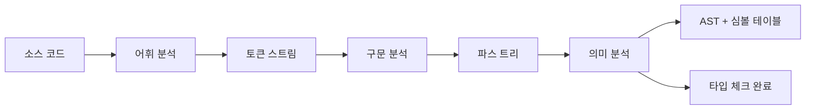
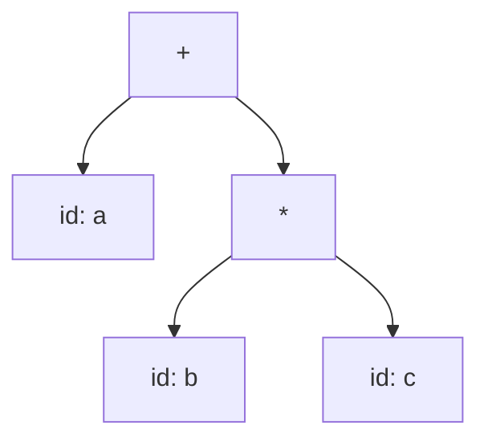
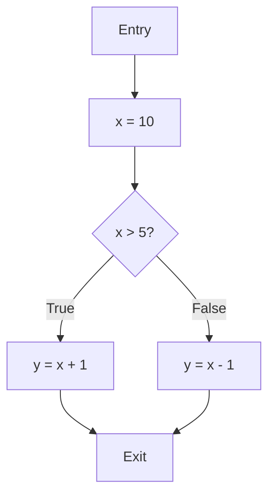
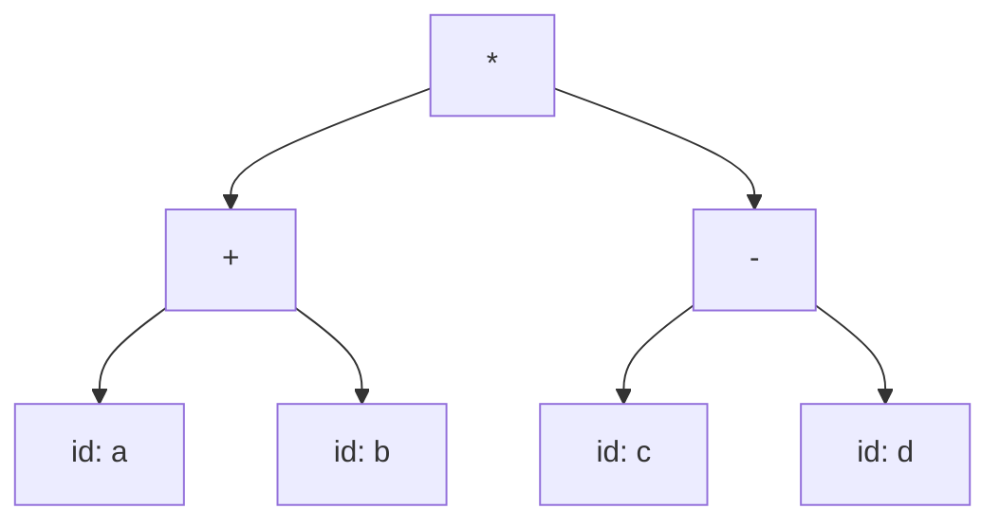

## 1. 의미 분석 개요

### 1.1 의미 분석이란?

**의미 분석(Semantic Analysis)**은 컴파일러의 세 번째 주요 단계로, 구문 분석으로 생성된 파스 트리를 분석하여 프로그램이 **의미적으로 올바른지** 검증합니다.



### 1.2 의미 분석의 역할

1. **타입 검사(Type Checking)**: 연산의 타입 호환성 검증
2. **스코프 분석(Scope Analysis)**: 변수 선언과 사용의 일치성 확인
3. **심볼 테이블 구축(Symbol Table)**: 식별자 정보 관리
4. **중간 코드 생성**: 추상 구문 트리(AST) 및 중간 표현 생성
5. **오류 검출**: 의미적 오류(선언되지 않은 변수, 타입 불일치 등) 발견

### 1.3 구문 분석 vs 의미 분석

**구문 분석**:
- 문법 규칙 확인 (형식적 정확성)
- 예: `int x = "hello";` → 문법적으로 올바름

**의미 분석**:
- 의미적 올바름 검증
- 예: `int x = "hello";` → 타입 불일치 오류!

---

## 2. 심볼 테이블 (Symbol Table)

### 2.1 심볼 테이블이란?

**심볼 테이블(Symbol Table)**은 프로그램의 모든 식별자(변수, 함수, 타입 등)에 대한 정보를 저장하는 자료구조입니다.

### 2.2 심볼 테이블에 저장되는 정보

각 식별자에 대해:
- **이름(Name)**: 식별자 이름
- **타입(Type)**: 데이터 타입 (int, float, struct 등)
- **스코프(Scope)**: 유효 범위
- **메모리 위치(Location)**: 메모리 주소 또는 오프셋
- **기타**: 함수의 경우 매개변수 개수, 반환 타입 등

**예제**:

| 이름 | 타입 | 스코프 | 위치 | 기타 |
|------|------|--------|------|------|
| x | int | global | 0x1000 | - |
| foo | function | global | 0x2000 | params: (int, int), return: int |
| y | float | foo | 0x2010 | local variable |

### 2.3 심볼 테이블 구현

**해시 테이블 구현**:

```c
#define HASH_SIZE 211

typedef struct Symbol {
    char *name;
    char *type;
    int scope_level;
    int offset;
    struct Symbol *next;  // 체이닝
} Symbol;

Symbol *symbol_table[HASH_SIZE];

unsigned int hash(char *str) {
    unsigned int hash = 0;
    while (*str) {
        hash = (hash * 31 + *str++) % HASH_SIZE;
    }
    return hash;
}

void insert_symbol(char *name, char *type, int scope_level, int offset) {
    unsigned int index = hash(name);
    Symbol *sym = (Symbol *)malloc(sizeof(Symbol));
    sym->name = strdup(name);
    sym->type = strdup(type);
    sym->scope_level = scope_level;
    sym->offset = offset;
    sym->next = symbol_table[index];
    symbol_table[index] = sym;
}

Symbol *lookup_symbol(char *name) {
    unsigned int index = hash(name);
    Symbol *sym = symbol_table[index];
    while (sym != NULL) {
        if (strcmp(sym->name, name) == 0)
            return sym;
        sym = sym->next;
    }
    return NULL;  // 찾지 못함
}
```

### 2.4 스코프 관리

**스코프 종류**:
1. **전역 스코프(Global Scope)**: 프로그램 전체에서 유효
2. **지역 스코프(Local Scope)**: 함수 또는 블록 내에서만 유효
3. **블록 스코프(Block Scope)**: 중괄호 `{}` 내에서만 유효

**스코프 스택 구현**:

```c
#define MAX_SCOPE_DEPTH 100

typedef struct ScopeStack {
    Symbol *table[HASH_SIZE];
    int level;
} ScopeStack;

ScopeStack scope_stack[MAX_SCOPE_DEPTH];
int current_scope = 0;

void enter_scope() {
    current_scope++;
    memset(scope_stack[current_scope].table, 0, sizeof(scope_stack[current_scope].table));
    scope_stack[current_scope].level = current_scope;
}

void exit_scope() {
    // 현재 스코프의 심볼 제거
    current_scope--;
}

Symbol *lookup_in_all_scopes(char *name) {
    // 현재 스코프부터 전역 스코프까지 검색
    for (int i = current_scope; i >= 0; i--) {
        Symbol *sym = lookup_in_scope(name, i);
        if (sym != NULL)
            return sym;
    }
    return NULL;
}
```

**스코프 예제**:

```c
int x = 10;  // 전역 스코프

void foo() {
    int y = 20;  // foo 스코프
    {
        int z = 30;  // 블록 스코프
        printf("%d %d %d\n", x, y, z);  // 모두 접근 가능
    }
    // z는 여기서 접근 불가
}
```

---

## 3. 타입 체킹 (Type Checking)

### 3.1 타입 체킹이란?

**타입 체킹(Type Checking)**은 프로그램의 모든 연산이 올바른 타입의 피연산자를 사용하는지 검증하는 과정입니다.

### 3.2 타입 시스템

**정적 타입 체킹(Static Type Checking)**:
- 컴파일 타임에 타입 검사
- 예: C, C++, Java
- 장점: 빠른 실행, 조기 오류 발견
- 단점: 유연성 부족

**동적 타입 체킹(Dynamic Type Checking)**:
- 런타임에 타입 검사
- 예: Python, JavaScript
- 장점: 유연성
- 단점: 느린 실행, 런타임 오류

### 3.3 타입 체킹 규칙

**기본 규칙**:

1. **변수 선언**: 변수는 사용 전에 선언되어야 함
   ```c
   int x;
   x = 10;  // OK
   y = 20;  // 오류: y가 선언되지 않음
   ```

2. **대입 연산**: 좌변과 우변의 타입이 호환되어야 함
   ```c
   int x = 10;     // OK
   int y = 3.14;   // 경고: float → int 변환
   int z = "hello"; // 오류: string → int 불가
   ```

3. **산술 연산**: 피연산자가 숫자 타입이어야 함
   ```c
   int x = 10 + 20;      // OK
   float y = 1.5 + 2.5;  // OK
   int z = 10 + "abc";   // 오류: int + string 불가
   ```

4. **함수 호출**: 인자의 개수와 타입이 일치해야 함
   ```c
   int add(int a, int b) { return a + b; }

   int x = add(10, 20);        // OK
   int y = add(10);            // 오류: 인자 부족
   int z = add(10, "hello");   // 오류: 타입 불일치
   ```

### 3.4 타입 변환 (Type Coercion)

**암묵적 변환(Implicit Conversion)**:
```c
int x = 10;
float y = x;  // int → float (안전)
int z = 3.14; // float → int (정보 손실)
```

**명시적 변환(Explicit Conversion, Casting)**:
```c
float x = 3.14;
int y = (int)x;  // 명시적 캐스팅
```

**타입 승격(Type Promotion)**:
```c
int x = 10;
float y = 3.14;
float z = x + y;  // int → float로 승격 후 연산
```

### 3.5 타입 체킹 구현

**타입 체킹 함수 예제**:

```c
typedef enum { TYPE_INT, TYPE_FLOAT, TYPE_STRING, TYPE_BOOL, TYPE_VOID } TypeKind;

typedef struct Type {
    TypeKind kind;
    // 함수 타입의 경우 추가 정보
    struct Type *return_type;
    struct Type **param_types;
    int num_params;
} Type;

Type *check_binary_op(ASTNode *left, ASTNode *right, char *op) {
    Type *left_type = check_expr(left);
    Type *right_type = check_expr(right);

    if (strcmp(op, "+") == 0 || strcmp(op, "-") == 0 ||
        strcmp(op, "*") == 0 || strcmp(op, "/") == 0) {
        // 산술 연산: 숫자 타입만 가능
        if ((left_type->kind != TYPE_INT && left_type->kind != TYPE_FLOAT) ||
            (right_type->kind != TYPE_INT && right_type->kind != TYPE_FLOAT)) {
            semantic_error("Arithmetic operation requires numeric types");
        }

        // 타입 승격: float가 있으면 float 반환
        if (left_type->kind == TYPE_FLOAT || right_type->kind == TYPE_FLOAT) {
            return create_type(TYPE_FLOAT);
        } else {
            return create_type(TYPE_INT);
        }
    }

    // 다른 연산자들...
}

Type *check_assignment(ASTNode *lvalue, ASTNode *rvalue) {
    Type *ltype = check_expr(lvalue);
    Type *rtype = check_expr(rvalue);

    if (!type_compatible(ltype, rtype)) {
        semantic_error("Type mismatch in assignment");
    }

    return ltype;
}
```

---

## 4. 추상 구문 트리 (AST)

### 4.1 AST란?

**추상 구문 트리(Abstract Syntax Tree, AST)**는 파스 트리에서 구문 정보만을 추출한 간소화된 트리 구조입니다.

**파스 트리 vs AST**:

**파스 트리** (상세):
```
       E
      / | \
     E  +  T
     |     |
     T     F
     |     |
     F     id
     |
    id
```

**AST** (간소):
```
    +
   / \
  id  id
```

### 4.2 AST 노드 구조

**C 코드 예제**:

```c
typedef enum {
    NODE_BINOP,     // 이항 연산
    NODE_UNOP,      // 단항 연산
    NODE_NUM,       // 숫자 리터럴
    NODE_ID,        // 식별자
    NODE_ASSIGN,    // 대입
    NODE_IF,        // if 문
    NODE_WHILE,     // while 문
    NODE_CALL,      // 함수 호출
    NODE_DECL,      // 선언
} NodeType;

typedef struct ASTNode {
    NodeType type;
    union {
        // 이항 연산자
        struct {
            char *op;
            struct ASTNode *left;
            struct ASTNode *right;
        } binop;

        // 식별자
        struct {
            char *name;
        } id;

        // 숫자
        struct {
            int value;
        } num;

        // 대입
        struct {
            struct ASTNode *lvalue;
            struct ASTNode *rvalue;
        } assign;

        // if 문
        struct {
            struct ASTNode *condition;
            struct ASTNode *then_branch;
            struct ASTNode *else_branch;
        } if_stmt;

        // 함수 호출
        struct {
            char *func_name;
            struct ASTNode **args;
            int num_args;
        } call;
    } data;
} ASTNode;
```

### 4.3 AST 생성 예제

**표현식 `a + b * c`의 AST 생성**:

```c
ASTNode *create_binop(char *op, ASTNode *left, ASTNode *right) {
    ASTNode *node = (ASTNode *)malloc(sizeof(ASTNode));
    node->type = NODE_BINOP;
    node->data.binop.op = strdup(op);
    node->data.binop.left = left;
    node->data.binop.right = right;
    return node;
}

ASTNode *create_id(char *name) {
    ASTNode *node = (ASTNode *)malloc(sizeof(ASTNode));
    node->type = NODE_ID;
    node->data.id.name = strdup(name);
    return node;
}

// a + b * c
ASTNode *a = create_id("a");
ASTNode *b = create_id("b");
ASTNode *c = create_id("c");
ASTNode *mult = create_binop("*", b, c);
ASTNode *add = create_binop("+", a, mult);
```

**생성된 AST**:


### 4.4 AST 순회 (Traversal)

**전위 순회(Pre-order)**:
```c
void traverse_preorder(ASTNode *node) {
    if (node == NULL) return;

    // 현재 노드 처리
    process_node(node);

    // 자식 노드 방문
    if (node->type == NODE_BINOP) {
        traverse_preorder(node->data.binop.left);
        traverse_preorder(node->data.binop.right);
    }
    // 다른 노드 타입들...
}
```

**후위 순회(Post-order)**: 코드 생성에 유용
```c
void traverse_postorder(ASTNode *node) {
    if (node == NULL) return;

    // 자식 노드 먼저 방문
    if (node->type == NODE_BINOP) {
        traverse_postorder(node->data.binop.left);
        traverse_postorder(node->data.binop.right);
    }

    // 현재 노드 처리
    process_node(node);
}
```

---

## 5. 스코프 규칙

### 5.1 정적 스코프 (Static Scope)

**정적 스코프(Lexical Scope)**는 변수의 유효 범위가 소스 코드의 구조에 의해 결정됩니다.

**예제**:
```c
int x = 10;  // 전역

void foo() {
    int x = 20;  // foo의 지역 변수
    printf("%d\n", x);  // 20 출력 (가장 가까운 선언)
}

void bar() {
    printf("%d\n", x);  // 10 출력 (전역 변수)
}
```

### 5.2 동적 스코프 (Dynamic Scope)

**동적 스코프**는 변수의 유효 범위가 프로그램 실행 흐름에 의해 결정됩니다. (대부분 언어는 사용 안 함)

**예제** (가상의 동적 스코프 언어):
```
int x = 10;

void foo() {
    printf("%d\n", x);  // 호출자에 따라 다름
}

void bar() {
    int x = 20;
    foo();  // 20 출력 (bar의 x 사용)
}

void main() {
    foo();  // 10 출력 (전역 x 사용)
    bar();  // 20 출력
}
```

### 5.3 블록 스코프 vs 함수 스코프

**블록 스코프** (C, C++, Java):
```c
void foo() {
    {
        int x = 10;
        printf("%d\n", x);  // OK
    }
    printf("%d\n", x);  // 오류: x는 블록을 벗어남
}
```

**함수 스코프** (JavaScript `var`):
```javascript
function foo() {
    {
        var x = 10;
        console.log(x);  // OK
    }
    console.log(x);  // OK (함수 전체에서 유효)
}
```

### 5.4 섀도잉 (Shadowing)

**섀도잉**은 내부 스코프의 변수가 외부 스코프의 동일한 이름 변수를 가리는 현상입니다.

```c
int x = 10;  // 전역

void foo() {
    int x = 20;  // 전역 x를 섀도잉
    {
        int x = 30;  // foo의 x를 섀도잉
        printf("%d\n", x);  // 30
    }
    printf("%d\n", x);  // 20
}

int main() {
    printf("%d\n", x);  // 10
    foo();
}
```

---

## 6. 의미 분석 예제

### 예제 1: 간단한 의미 분석기

**입력 프로그램**:
```c
int x;
x = 10 + 20;
```

**의미 분석 과정**:

1. **변수 선언 `int x;`**:
   - 심볼 테이블에 x 추가
   - 타입: int, 스코프: global

2. **대입 `x = 10 + 20;`**:
   - `10 + 20` 타입 체크: int + int → int
   - `x` 타입 확인: int
   - 타입 호환성: int = int → OK

**의사 코드**:
```python
def analyze_declaration(node):
    if node.name in symbol_table:
        error("Redeclaration of variable")
    symbol_table[node.name] = {'type': node.type, 'scope': current_scope}

def analyze_assignment(node):
    if node.lvalue.name not in symbol_table:
        error("Undeclared variable")

    ltype = symbol_table[node.lvalue.name]['type']
    rtype = check_expr(node.rvalue)

    if not compatible(ltype, rtype):
        error("Type mismatch")
```

### 예제 2: 함수 호출 검사

**입력 프로그램**:
```c
int add(int a, int b) {
    return a + b;
}

int main() {
    int x = add(10, 20);     // OK
    int y = add(10);         // 오류: 인자 부족
    int z = add(10, "hi");   // 오류: 타입 불일치
}
```

**의미 분석**:

```c
typedef struct FuncInfo {
    Type *return_type;
    Type **param_types;
    int num_params;
} FuncInfo;

void check_function_call(ASTNode *call) {
    FuncInfo *func = lookup_function(call->data.call.func_name);

    if (func == NULL) {
        semantic_error("Undeclared function");
    }

    // 인자 개수 확인
    if (call->data.call.num_args != func->num_params) {
        semantic_error("Argument count mismatch");
    }

    // 각 인자의 타입 확인
    for (int i = 0; i < func->num_params; i++) {
        Type *arg_type = check_expr(call->data.call.args[i]);
        if (!type_compatible(arg_type, func->param_types[i])) {
            semantic_error("Argument type mismatch");
        }
    }
}
```

### 예제 3: 제어 흐름 검사

**입력 프로그램**:
```c
if (x > 10) {
    printf("x is greater than 10\n");
}

while ("hello") {  // 오류: 조건은 bool이어야 함
    printf("loop\n");
}
```

**의미 분석**:

```c
void check_if_statement(ASTNode *if_stmt) {
    Type *cond_type = check_expr(if_stmt->data.if_stmt.condition);

    if (cond_type->kind != TYPE_BOOL && cond_type->kind != TYPE_INT) {
        semantic_error("If condition must be boolean or int");
    }

    check_statement(if_stmt->data.if_stmt.then_branch);
    if (if_stmt->data.if_stmt.else_branch) {
        check_statement(if_stmt->data.if_stmt.else_branch);
    }
}

void check_while_statement(ASTNode *while_stmt) {
    Type *cond_type = check_expr(while_stmt->data.while_stmt.condition);

    if (cond_type->kind != TYPE_BOOL && cond_type->kind != TYPE_INT) {
        semantic_error("While condition must be boolean or int");
    }

    check_statement(while_stmt->data.while_stmt.body);
}
```

---

## 7. 중간 코드 생성

### 7.1 중간 표현 (Intermediate Representation)

**중간 표현(IR)**은 소스 코드와 목적 코드 사이의 표현으로, 플랫폼 독립적입니다.

**IR의 장점**:
- 최적화 용이
- 다중 플랫폼 지원
- 컴파일러 구조 단순화

### 7.2 3주소 코드 (Three-Address Code)

**3주소 코드**는 가장 일반적인 IR 형식으로, 각 명령이 최대 3개의 주소를 갖습니다.

**형식**:
```
x = y op z
```

**예제**:

**소스 코드**:
```c
a = b + c * d;
```

**3주소 코드**:
```
t1 = c * d
t2 = b + t1
a = t2
```

### 7.3 3주소 코드 생성 예제

**AST에서 3주소 코드 생성**:

```c
int temp_counter = 0;

char *new_temp() {
    char *temp = (char *)malloc(10);
    sprintf(temp, "t%d", temp_counter++);
    return temp;
}

void gen_code(ASTNode *node) {
    if (node->type == NODE_BINOP) {
        gen_code(node->data.binop.left);
        gen_code(node->data.binop.right);

        char *temp = new_temp();
        printf("%s = %s %s %s\n",
               temp,
               get_operand(node->data.binop.left),
               node->data.binop.op,
               get_operand(node->data.binop.right));

        node->result = temp;
    } else if (node->type == NODE_ID) {
        node->result = node->data.id.name;
    } else if (node->type == NODE_NUM) {
        node->result = (char *)malloc(10);
        sprintf(node->result, "%d", node->data.num.value);
    }
}
```

**예제 실행**:

```
입력: a + b * c

생성된 3주소 코드:
t0 = b * c
t1 = a + t0
```

### 7.4 다른 IR 형식들

**SSA (Static Single Assignment)**:
```
// 원래 코드
x = 1;
x = x + 2;

// SSA 형식
x1 = 1;
x2 = x1 + 2;
```

**컨트롤 플로우 그래프 (CFG)**:


---

## 8. 실습 예제

### 예제 1: 심볼 테이블 구현

**문제**: 다음 프로그램의 심볼 테이블을 구성하라.

```c
int x = 10;
float y;

void foo(int a, float b) {
    int z = a + 1;
}

int main() {
    int w = x + 5;
}
```

**심볼 테이블**:

**전역 스코프**:

| 이름 | 타입 | 스코프 | 추가 정보 |
|------|------|--------|-----------|
| x | int | global | initialized |
| y | float | global | - |
| foo | function | global | params: (int, float), return: void |
| main | function | global | params: (), return: int |

**foo 스코프**:

| 이름 | 타입 | 스코프 | 추가 정보 |
|------|------|--------|-----------|
| a | int | foo | parameter |
| b | float | foo | parameter |
| z | int | foo | local |

**main 스코프**:

| 이름 | 타입 | 스코프 | 추가 정보 |
|------|------|--------|-----------|
| w | int | main | local |

### 예제 2: 타입 체킹

**문제**: 다음 프로그램에서 타입 오류를 찾아라.

```c
int x = 10;
float y = 3.14;
char z = 'a';

x = y;           // (1)
y = x;           // (2)
z = x + y;       // (3)
x = "hello";     // (4)
int w = x + z;   // (5)
```

**해답**:
- (1) 경고: float → int 변환, 정보 손실
- (2) OK: int → float 승격
- (3) 경고: float → char 변환
- (4) **오류**: string → int 불가
- (5) OK: char → int 승격 후 연산

### 예제 3: AST 생성 및 3주소 코드

**문제**: 표현식 `(a + b) * (c - d)`의 AST를 그리고 3주소 코드를 생성하라.

**AST**:


**3주소 코드**:
```
t1 = a + b
t2 = c - d
t3 = t1 * t2
```

---

## 9. 고급 주제

### 9.1 타입 추론 (Type Inference)

**타입 추론**은 명시적 타입 선언 없이 컴파일러가 자동으로 타입을 결정합니다.

**예제 (Haskell)**:
```haskell
-- 타입 선언 없이도 타입 추론
add x y = x + y
-- 추론된 타입: add :: Num a => a -> a -> a
```

**예제 (C++ auto)**:
```cpp
auto x = 10;        // int
auto y = 3.14;      // double
auto z = "hello";   // const char*
```

### 9.2 제네릭/템플릿

**제네릭**은 타입을 매개변수화하여 코드 재사용성을 높입니다.

**예제 (Java)**:
```java
class Box<T> {
    private T value;

    public void set(T value) {
        this.value = value;
    }

    public T get() {
        return value;
    }
}

Box<Integer> intBox = new Box<>();
Box<String> strBox = new Box<>();
```

### 9.3 서브타이핑 (Subtyping)

**서브타이핑**은 객체 지향 언어에서 상속 관계를 통한 타입 관계입니다.

```java
class Animal { }
class Dog extends Animal { }

Animal a = new Dog();  // OK: Dog는 Animal의 서브타입
Dog d = new Animal();  // 오류: Animal은 Dog의 서브타입 아님
```

---

## 10. 요약

### 핵심 개념

1. **의미 분석**: 프로그램의 의미적 올바름 검증
   - 타입 체킹
   - 스코프 분석
   - 심볼 테이블 구축

2. **심볼 테이블**: 식별자 정보 관리
   - 이름, 타입, 스코프, 메모리 위치
   - 해시 테이블 또는 트리 구조
   - 스코프 스택으로 중첩 스코프 관리

3. **타입 체킹**: 연산의 타입 호환성 검증
   - 정적 vs 동적 타입 체킹
   - 타입 변환 및 승격
   - 함수 호출 검사

4. **추상 구문 트리 (AST)**: 간소화된 구문 표현
   - 파스 트리에서 불필요한 정보 제거
   - 중간 코드 생성의 기반

5. **스코프 규칙**: 변수 유효 범위
   - 정적 스코프 (대부분 언어)
   - 블록 스코프 vs 함수 스코프
   - 섀도잉

6. **중간 코드 생성**: 플랫폼 독립적 표현
   - 3주소 코드
   - SSA, CFG 등

### 컴파일러 전반부 완성

의미 분석까지 완료하면 컴파일러 **전반부(Frontend)** 가 완성됩니다:

```
소스 코드
    ↓
어휘 분석 (Lexical Analysis) ← 포스트 #2
    ↓
구문 분석 (Syntax Analysis) ← 포스트 #3, #4
    ↓
의미 분석 (Semantic Analysis) ← 포스트 #5 (현재)
    ↓
중간 표현 (IR)
    ↓
[컴파일러 후반부로 계속...]
코드 생성 (Code Generation)
코드 최적화 (Optimization)
목적 코드 (Object Code)
```

### 다음 단계

이후 포스트에서는 **컴파일러 후반부(Backend)**를 다룰 예정입니다:
- 중간 코드 최적화
- 코드 생성 (Code Generation)
- 레지스터 할당
- 명령어 선택 및 스케줄링
- 실제 컴파일러 구현 프로젝트

---

## 참고 자료

- Aho, A. V., Lam, M. S., Sethi, R., & Ullman, J. D. (2006). *Compilers: Principles, Techniques, and Tools* (2nd ed.). Addison-Wesley.
- [LLVM IR Tutorial](https://llvm.org/docs/tutorial/)
- [Type Systems - Wikipedia](https://en.wikipedia.org/wiki/Type_system)
- [Symbol Table - GeeksforGeeks](https://www.geeksforgeeks.org/symbol-table-compiler/)
