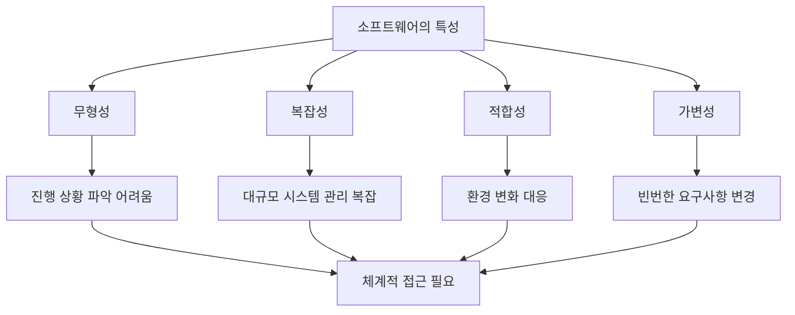
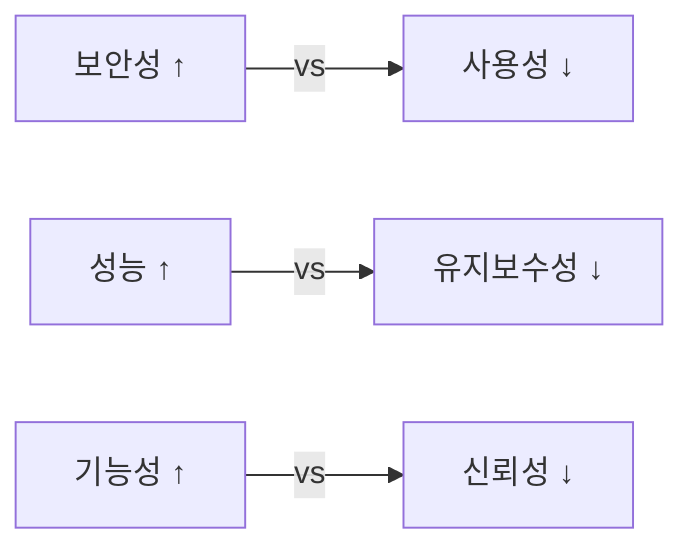
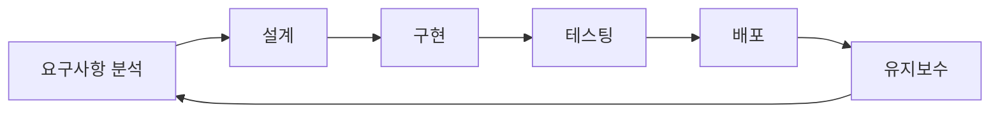

## 1. 소프트웨어공학이란?

### 1.1 소프트웨어공학의 정의

**소프트웨어공학(Software Engineering)**은 소프트웨어의 개발, 운용, 유지보수 및 폐기에 대한 체계적이고 규율된 정량화 가능한 접근 방법을 연구하는 학문입니다.

**IEEE의 정의**:
> "The application of a systematic, disciplined, quantifiable approach to the development, operation, and maintenance of software."

**핵심 키워드**:
- **체계적(Systematic)**: 잘 정의된 프로세스와 방법론 사용
- **규율된(Disciplined)**: 표준과 원칙 준수
- **정량화 가능한(Quantifiable)**: 측정 가능한 목표와 결과

### 1.2 소프트웨어공학의 필요성

**소프트웨어의 특수성**:

1. **무형성(Intangibility)**
   - 물리적 형태가 없어 진행 상황 파악이 어려움
   - 품질 평가가 주관적일 수 있음

2. **복잡성(Complexity)**
   - 대규모 소프트웨어는 수백만 줄의 코드로 구성
   - 모듈 간 상호작용이 복잡

3. **적합성(Conformity)**
   - 하드웨어, 다른 소프트웨어, 사용자 요구에 적합해야 함
   - 환경 변화에 따라 지속적으로 수정 필요

4. **가변성(Changeability)**
   - 하드웨어와 달리 쉽게 변경 가능
   - 요구사항 변경이 빈번함

---

## 2. 소프트웨어 위기 (Software Crisis)

### 2.1 소프트웨어 위기란?

**1960년대 후반**, 소프트웨어 프로젝트의 실패율이 급증하면서 **소프트웨어 위기**라는 용어가 등장했습니다.

**주요 문제점**:
- 프로젝트 일정 지연
- 예산 초과
- 낮은 품질
- 요구사항 불일치
- 유지보수 어려움

### 2.2 소프트웨어 위기의 원인

1. **급격한 수요 증가**
   - 소프트웨어에 대한 수요가 공급을 초과
   - 숙련된 개발자 부족

2. **프로젝트 관리 부재**
   - 체계적인 계획과 관리 없이 개발
   - 진행 상황 추적 미흡

3. **요구사항 관리 실패**
   - 불명확하거나 변경되는 요구사항
   - 고객과 개발자 간 의사소통 부족

4. **품질 관리 부족**
   - 테스팅과 검증 소홀
   - 체계적인 품질 보증 프로세스 부재

### 2.3 소프트웨어 위기 사례

**예시 1: NASA의 Mars Climate Orbiter (1999)**
- **문제**: 단위 변환 오류 (미터법 vs 야드파운드법)
- **결과**: 1억 2,500만 달러 손실
- **교훈**: 명확한 인터페이스 명세와 통합 테스트 중요성

**예시 2: Therac-25 방사선 치료기 (1985-1987)**
- **문제**: 소프트웨어 버그로 과다 방사선 조사
- **결과**: 6명 사망, 여러 명 부상
- **교훈**: 안전 중요 시스템의 엄격한 검증 필요

**예시 3: Windows Vista (2006)**
- **문제**: 과도한 기능 추가, 일정 지연, 성능 문제
- **결과**: 시장 실패, 평판 손상
- **교훤**: 범위 관리와 품질 우선순위 중요성

---

## 3. 소프트웨어 품질 속성

### 3.1 제품 품질 속성

**1. 기능성(Functionality)**
- 요구사항을 얼마나 충족하는가?
- 정확성, 적합성, 상호운용성

**2. 신뢰성(Reliability)**
- 주어진 조건에서 정상 작동하는가?
- 성숙성, 결함 허용성, 복구 가능성

**3. 사용성(Usability)**
- 사용자가 쉽게 사용할 수 있는가?
- 이해성, 학습성, 운용성

**4. 효율성(Efficiency)**
- 자원을 효율적으로 사용하는가?
- 시간 효율성, 자원 효율성

**5. 유지보수성(Maintainability)**
- 수정과 개선이 쉬운가?
- 분석성, 변경성, 안정성, 시험성

**6. 이식성(Portability)**
- 다른 환경으로 이전이 쉬운가?
- 적응성, 설치성, 대체성

### 3.2 품질 속성의 트레이드오프

품질 속성들은 서로 상충될 수 있습니다:

**예시**:
- **보안성 vs 사용성**: 복잡한 인증 절차는 보안을 높이지만 사용성을 저하
- **성능 vs 유지보수성**: 최적화된 코드는 빠르지만 이해하기 어려움
- **기능성 vs 신뢰성**: 많은 기능은 버그 가능성 증가

**품질 속성 우선순위 결정**:
- 프로젝트의 목적과 특성에 따라 우선순위 결정
- 안전 중요 시스템: 신뢰성 > 성능
- 게임: 성능 > 유지보수성
- 은행 시스템: 보안성 > 사용성

---

## 4. 소프트웨어 개발의 본질적 어려움

### 4.1 Brooks의 "No Silver Bullet"

**Frederick Brooks**는 1986년 논문에서 소프트웨어 개발의 **본질적 어려움(Essential Difficulties)**과 **우발적 어려움(Accidental Difficulties)**을 구분했습니다.

**본질적 어려움** (근본적이고 피할 수 없음):
1. **복잡성(Complexity)**: 소프트웨어의 내재적 복잡성
2. **적합성(Conformity)**: 다양한 환경과의 호환성
3. **가변성(Changeability)**: 지속적인 변경 요구
4. **비가시성(Invisibility)**: 구조 시각화의 어려움

**우발적 어려움** (도구와 기술로 해결 가능):
- 낮은 수준의 프로그래밍 언어
- 느린 컴파일 시간
- 비효율적인 디버깅 도구

**결론**: "은탄환(Silver Bullet)"은 없다. 생산성을 10배 향상시킬 단일 기술은 존재하지 않으며, 점진적 개선만 가능하다.

### 4.2 소프트웨어 개발의 어려움 극복

**체계적 접근**:
- 검증된 방법론 사용
- 재사용 가능한 컴포넌트 개발
- 지속적인 프로세스 개선

**기술적 접근**:
- 모듈화와 추상화
- 자동화 도구 활용
- 코드 리뷰와 테스팅

**관리적 접근**:
- 명확한 요구사항 정의
- 효과적인 프로젝트 관리
- 팀 간 협업 강화

---

## 5. 소프트웨어공학의 핵심 활동

### 5.1 소프트웨어 개발 프로세스

**1. 요구사항 분석(Requirements Analysis)**
- 고객의 요구를 파악하고 명세화
- 기능적/비기능적 요구사항 정의

**2. 설계(Design)**
- 아키텍처 설계
- 상세 설계 (모듈, 인터페이스, 데이터 구조)

**3. 구현(Implementation)**
- 설계를 코드로 변환
- 코딩 표준 준수

**4. 테스팅(Testing)**
- 단위 테스트, 통합 테스트, 시스템 테스트
- 결함 발견 및 수정

**5. 배포(Deployment)**
- 운영 환경에 설치
- 사용자 교육

**6. 유지보수(Maintenance)**
- 버그 수정
- 기능 추가 및 개선
- 성능 최적화

### 5.2 소프트웨어공학의 지원 활동

**프로젝트 관리**:
- 일정, 예산, 인력 계획
- 위험 관리

**형상 관리**:
- 버전 관리
- 변경 관리

**품질 보증**:
- 검토(Review)와 감사(Audit)
- 프로세스 개선

---

## 6. 소프트웨어 유형

### 6.1 응용 분야에 따른 분류

**1. 시스템 소프트웨어**
- 운영체제, 컴파일러, 드라이버
- 특징: 높은 성능, 저수준 프로그래밍

**2. 응용 소프트웨어**
- 워드프로세서, 웹 브라우저, 게임
- 특징: 사용자 친화적 인터페이스

**3. 임베디드 소프트웨어**
- 자동차, 가전제품, IoT 기기
- 특징: 제한된 자원, 실시간 요구사항

**4. 웹 애플리케이션**
- 전자상거래, 소셜 네트워크
- 특징: 분산 환경, 확장성

**5. 인공지능 소프트웨어**
- 머신러닝, 자연어 처리
- 특징: 데이터 중심, 확률적 동작

**6. 과학/공학 소프트웨어**
- 시뮬레이션, 데이터 분석
- 특징: 계산 집약적, 정확성 중요

### 6.2 소프트웨어 유형별 특성

| 유형 | 주요 품질 속성 | 개발 방법론 |
|------|----------------|-------------|
| 시스템 | 성능, 신뢰성 | 전통적 |
| 응용 | 사용성, 기능성 | 애자일 |
| 임베디드 | 신뢰성, 효율성 | 모델 기반 |
| 웹 | 확장성, 보안성 | 애자일, DevOps |
| AI | 정확성, 성능 | 실험적 |
| 과학 | 정확성, 재현성 | 협업 |

---

## 7. 전문적 책임과 윤리

### 7.1 소프트웨어 엔지니어의 책임

**이해관계자**:
- 고객과 사용자
- 고용주
- 동료
- 사회

**책임 영역**:

1. **품질 보증**
   - 최선을 다해 높은 품질의 소프트웨어 개발
   - 테스팅과 검증 충실히 수행

2. **정직성**
   - 능력과 한계를 솔직히 인정
   - 과장된 약속 금지

3. **공정성**
   - 차별 없는 대우
   - 객관적 평가

4. **비밀 유지**
   - 고용주와 고객의 기밀 정보 보호
   - 개인정보 보호

### 7.2 윤리적 딜레마

**사례 1: 보안 취약점 발견**
- **상황**: 출시 직전 심각한 보안 취약점 발견
- **딜레마**: 일정 vs 보안
- **올바른 선택**: 출시 연기하고 취약점 수정

**사례 2: 부적절한 데이터 수집**
- **상황**: 관리자가 사용자 동의 없이 데이터 수집 요구
- **딜레마**: 상사 명령 vs 개인정보 보호
- **올바른 선택**: 거부하고 적절한 절차 제안

**사례 3: 불가능한 일정**
- **상황**: 실현 불가능한 일정 약속 압력
- **딜레마**: 회사 이익 vs 현실적 평가
- **올바른 선택**: 정직하게 현실적 일정 제시

### 7.3 ACM/IEEE 윤리 강령

**ACM/IEEE-CS Software Engineering Code of Ethics의 8가지 원칙**:

1. **PUBLIC**: 공공의 이익 우선
2. **CLIENT AND EMPLOYER**: 고객과 고용주의 최선의 이익 추구
3. **PRODUCT**: 최고 품질의 제품 보장
4. **JUDGMENT**: 전문가적 판단의 무결성과 독립성 유지
5. **MANAGEMENT**: 소프트웨어 개발과 유지보수에 윤리적 접근
6. **PROFESSION**: 전문직의 명예와 평판 증진
7. **COLLEAGUES**: 동료에 대한 공정하고 지원적인 태도
8. **SELF**: 평생 학습과 윤리적 실천 촉진

---

## 8. 소프트웨어공학의 현재와 미래

### 8.1 현재 트렌드

**1. 클라우드 컴퓨팅**
- IaaS, PaaS, SaaS
- 확장성과 유연성

**2. 마이크로서비스 아키텍처**
- 모놀리식에서 분산 시스템으로
- 독립적 배포와 확장

**3. DevOps와 CI/CD**
- 개발과 운영의 통합
- 자동화된 파이프라인

**4. 인공지능/머신러닝 통합**
- AI 기반 개발 도구
- 지능형 시스템 개발

**5. 로우코드/노코드 플랫폼**
- 비개발자도 애플리케이션 개발
- 빠른 프로토타이핑

### 8.2 미래 도전 과제

**1. 복잡도 증가**
- 분산 시스템, 빅데이터
- 더 정교한 개발 방법론 필요

**2. 보안과 프라이버시**
- 사이버 위협 증가
- 개인정보 보호 규제 강화

**3. 윤리적 AI**
- 편향 방지
- 설명 가능한 AI

**4. 지속 가능성**
- 에너지 효율적인 소프트웨어
- 친환경 컴퓨팅

**5. 인력 부족**
- 숙련된 개발자 수요 증가
- 교육과 훈련 강화 필요

---

## 9. 요약

### 핵심 개념

1. **소프트웨어공학**: 소프트웨어 개발, 운용, 유지보수에 대한 체계적 접근
   - 체계적, 규율된, 정량화 가능한 방법

2. **소프트웨어 위기**: 1960년대 후반 프로젝트 실패율 급증
   - 원인: 수요 증가, 관리 부재, 품질 부족
   - 해결: 체계적 방법론, 프로세스 개선

3. **품질 속성**: 기능성, 신뢰성, 사용성, 효율성, 유지보수성, 이식성
   - 트레이드오프 존재
   - 프로젝트 특성에 따라 우선순위 결정

4. **본질적 어려움**: 복잡성, 적합성, 가변성, 비가시성
   - 은탄환 없음
   - 점진적 개선만 가능

5. **핵심 활동**: 요구사항 분석 → 설계 → 구현 → 테스팅 → 배포 → 유지보수
   - 지원 활동: 프로젝트 관리, 형상 관리, 품질 보증

6. **전문적 책임**: 품질 보증, 정직성, 공정성, 비밀 유지
   - ACM/IEEE 윤리 강령 준수

### 다음 단계

다음 포스트에서는 **Software Processes**를 다룰 예정입니다:
- 소프트웨어 프로세스 모델 (폭포수, 나선형, 증분)
- 프로세스 활동과 단계
- 애자일 vs 전통적 프로세스
- 프로세스 개선 방법

---

## 참고 자료

- Sommerville, I. (2015). *Software Engineering* (10th ed.). Pearson.
- Pressman, R. S., & Maxim, B. R. (2014). *Software Engineering: A Practitioner's Approach* (8th ed.). McGraw-Hill.
- Brooks, F. P. (1987). "No Silver Bullet: Essence and Accidents of Software Engineering." *Computer*, 20(4), 10-19.
- [ACM/IEEE Code of Ethics](https://www.acm.org/code-of-ethics)
- [ISO/IEC 25010 - Software Quality Model](https://iso25000.com/index.php/en/iso-25000-standards/iso-25010)
