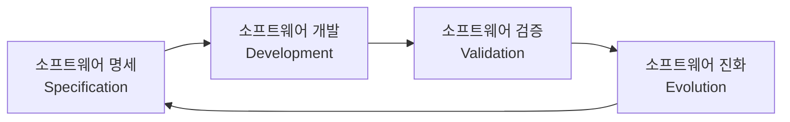
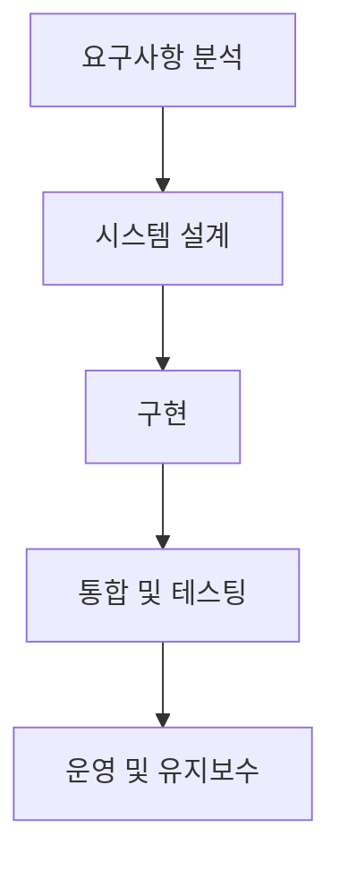
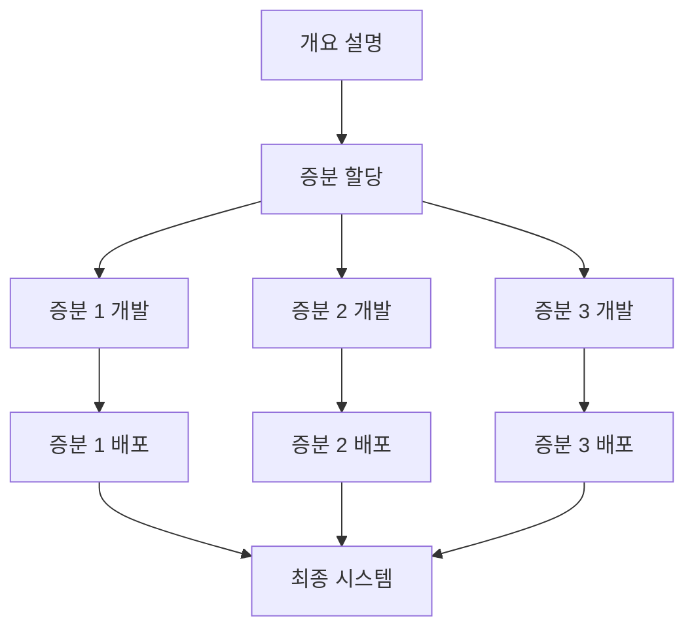
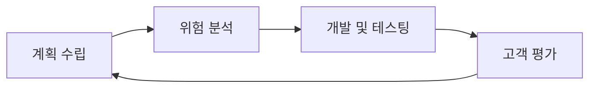
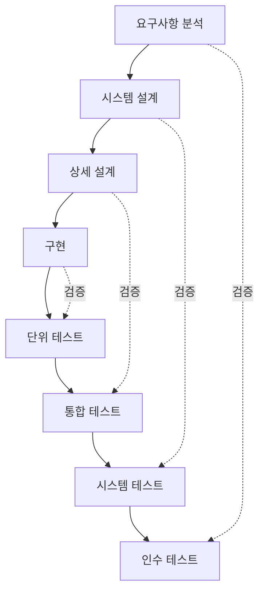
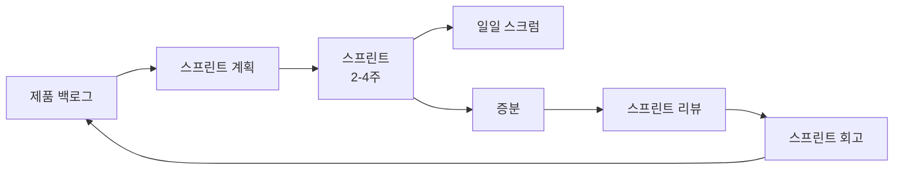
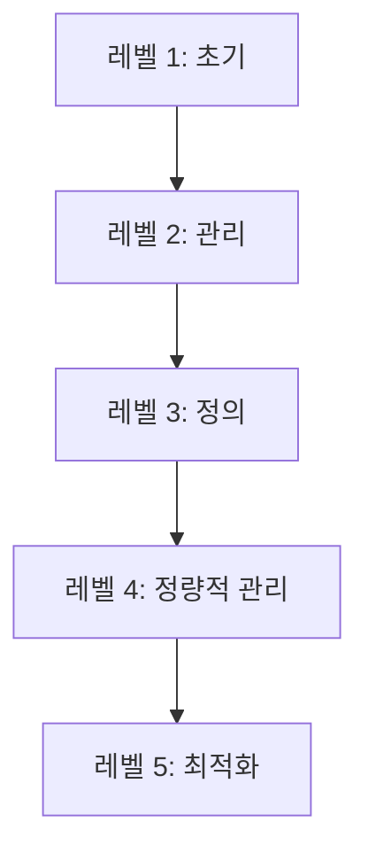
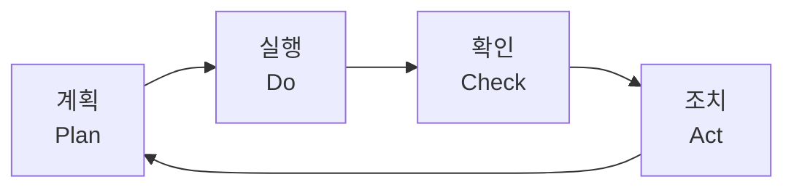

## 1. 소프트웨어 프로세스 개요

### 1.1 소프트웨어 프로세스란?

**소프트웨어 프로세스(Software Process)**는 소프트웨어 제품을 개발하고 진화시키기 위한 활동들의 집합입니다.

**정의**:
> "A set of related activities that leads to the production of a software product."

**프로세스의 구성 요소**:
- **활동(Activities)**: 수행해야 할 작업
- **산출물(Artifacts)**: 활동의 결과물
- **역할(Roles)**: 활동을 수행하는 사람
- **절차(Procedures)**: 활동 수행 방법

### 1.2 소프트웨어 프로세스의 중요성

**체계적 개발**:
- 일관성 있는 품질 유지
- 예측 가능한 일정과 비용
- 팀 간 협업 촉진

**프로세스 vs 임기응변**:

| 프로세스 기반 | 임기응변 |
|---------------|----------|
| 체계적, 반복 가능 | 비체계적, 일회성 |
| 예측 가능 | 예측 불가능 |
| 품질 보장 | 품질 변동 |
| 확장 가능 | 확장 어려움 |

---

## 2. 소프트웨어 프로세스 활동

### 2.1 핵심 프로세스 활동



**1. 소프트웨어 명세(Software Specification)**
- **목적**: 무엇을 개발할지 정의
- **활동**:
  - 요구사항 도출(Requirements Elicitation)
  - 요구사항 분석(Requirements Analysis)
  - 요구사항 명세(Requirements Specification)
  - 요구사항 검증(Requirements Validation)
- **산출물**: 요구사항 명세서(SRS)

**2. 소프트웨어 개발(Software Development)**
- **목적**: 명세를 실행 가능한 시스템으로 변환
- **활동**:
  - 아키텍처 설계
  - 상세 설계
  - 구현(코딩)
- **산출물**: 설계 문서, 소스 코드

**3. 소프트웨어 검증(Software Validation)**
- **목적**: 시스템이 명세를 만족하는지 확인
- **활동**:
  - 컴포넌트 테스팅
  - 시스템 테스팅
  - 인수 테스팅
- **산출물**: 테스트 계획서, 테스트 결과

**4. 소프트웨어 진화(Software Evolution)**
- **목적**: 변경 요구에 대응
- **활동**:
  - 변경 요청 관리
  - 변경 구현
  - 시스템 릴리스
- **산출물**: 새 버전 시스템

### 2.2 지원 프로세스 활동

**프로젝트 관리(Project Management)**:
- 계획 수립
- 모니터링 및 제어
- 위험 관리

**형상 관리(Configuration Management)**:
- 버전 관리
- 변경 관리
- 릴리스 관리

**품질 보증(Quality Assurance)**:
- 프로세스 표준 정의
- 리뷰 및 검사
- 측정 및 분석

---

## 3. 소프트웨어 프로세스 모델

### 3.1 폭포수 모델 (Waterfall Model)

**특징**: 순차적, 단계별 진행



**각 단계**:
1. **요구사항 분석**: 시스템 요구사항 정의
2. **시스템 설계**: 아키텍처 및 모듈 설계
3. **구현**: 코드 작성
4. **통합 및 테스팅**: 시스템 통합, 테스트
5. **운영 및 유지보수**: 배포, 유지보수

**장점**:
- ✅ 이해하기 쉽고 관리하기 용이
- ✅ 단계별 산출물이 명확
- ✅ 문서화가 잘됨
- ✅ 안정적이고 예측 가능

**단점**:
- ❌ 요구사항이 초기에 확정되어야 함
- ❌ 변경에 유연하지 못함
- ❌ 고객 피드백이 늦음 (개발 후반)
- ❌ 위험 발견이 늦음

**적용 분야**:
- 요구사항이 명확하고 변경이 적은 프로젝트
- 안전 중요 시스템 (항공, 의료)
- 규제가 엄격한 환경

### 3.2 증분 개발 모델 (Incremental Development)

**특징**: 시스템을 여러 증분(increment)으로 나누어 개발



**개발 방식**:
- 각 증분은 완전한 기능을 포함
- 점진적으로 시스템 확장
- 조기에 일부 기능 제공

**장점**:
- ✅ 빠른 초기 배포
- ✅ 고객 피드백 반영 용이
- ✅ 변경에 유연
- ✅ 위험 분산

**단점**:
- ❌ 전체 아키텍처 설계 어려움
- ❌ 관리 복잡도 증가
- ❌ 문서화 부족 가능성

**적용 분야**:
- 시장 출시가 중요한 제품
- 요구사항이 변할 가능성이 높은 프로젝트

### 3.3 나선형 모델 (Spiral Model)

**특징**: 반복적 개발 + 위험 분석



**4가지 단계 (반복)**:
1. **목표 설정(Objective Setting)**
   - 단계 목표와 제약 식별
   - 대안 전략 수립

2. **위험 평가 및 감소(Risk Assessment and Reduction)**
   - 위험 식별 및 분석
   - 프로토타입 개발로 위험 감소

3. **개발 및 검증(Development and Validation)**
   - 적절한 프로세스 모델 선택
   - 개발 및 테스팅

4. **계획(Planning)**
   - 프로젝트 검토
   - 다음 반복 계획

**장점**:
- ✅ 위험 관리 강조
- ✅ 대규모 프로젝트에 적합
- ✅ 유연하고 적응적
- ✅ 고객 참여

**단점**:
- ❌ 복잡하고 관리 어려움
- ❌ 위험 분석 전문성 필요
- ❌ 비용이 높음

**적용 분야**:
- 대규모, 고위험 프로젝트
- 신기술 적용 프로젝트

### 3.4 V 모델 (V-Model)

**특징**: 폭포수 모델의 확장, 테스팅 강조



**V자 구조**:
- **왼쪽 (개발)**: 요구사항 → 설계 → 구현
- **오른쪽 (검증)**: 단위 테스트 → 통합 테스트 → 시스템 테스트

**장점**:
- ✅ 테스팅 계획이 명확
- ✅ 결함 조기 발견
- ✅ 추적성 향상

**단점**:
- ❌ 폭포수 모델의 단점 상속
- ❌ 변경에 유연하지 못함

**적용 분야**:
- 품질과 안정성이 중요한 프로젝트
- 의료, 항공 시스템

---

## 4. 애자일 프로세스

### 4.1 애자일 선언문 (Agile Manifesto)

**2001년, 17명의 소프트웨어 개발자가 선언**:

**4가지 가치**:
1. **개인과 상호작용** > 프로세스와 도구
2. **작동하는 소프트웨어** > 포괄적인 문서
3. **고객과의 협력** > 계약 협상
4. **변화에 대응** > 계획 준수

**12가지 원칙** (일부):
- 고객 만족을 위한 빠르고 지속적인 가치 전달
- 변경 요구를 환영
- 작동하는 소프트웨어를 자주 전달 (2주~2개월)
- 개발자와 비즈니스 담당자의 일상적 협력
- 단순성 추구

### 4.2 스크럼 (Scrum)

**특징**: 반복적 증분 프로세스 프레임워크



**역할**:
- **제품 책임자(Product Owner)**: 제품 비전, 백로그 관리
- **스크럼 마스터(Scrum Master)**: 프로세스 촉진, 장애물 제거
- **개발팀(Development Team)**: 자기 조직화, 교차 기능

**이벤트**:
- **스프린트(Sprint)**: 2~4주 개발 주기
- **스프린트 계획(Sprint Planning)**: 할 일 선택
- **일일 스크럼(Daily Scrum)**: 15분 동기화 회의
- **스프린트 리뷰(Sprint Review)**: 결과 시연
- **스프린트 회고(Sprint Retrospective)**: 프로세스 개선

**산출물**:
- **제품 백로그(Product Backlog)**: 요구사항 목록
- **스프린트 백로그(Sprint Backlog)**: 스프린트 작업 목록
- **증분(Increment)**: 작동하는 소프트웨어

### 4.3 익스트림 프로그래밍 (XP)

**특징**: 소프트웨어 품질과 고객 만족 강조

**핵심 실천 방법**:

1. **계획 게임(Planning Game)**
   - 짧은 릴리스 주기
   - 사용자 스토리 기반 계획

2. **짝 프로그래밍(Pair Programming)**
   - 두 명이 한 컴퓨터에서 코딩
   - 코드 품질 향상, 지식 공유

3. **테스트 주도 개발(TDD)**
   - 테스트 먼저 작성
   - 코드 작성 → 테스트 통과 → 리팩토링

4. **지속적 통합(Continuous Integration)**
   - 코드를 자주 통합 (하루 여러 번)
   - 자동화된 빌드 및 테스트

5. **리팩토링(Refactoring)**
   - 기능 변경 없이 구조 개선
   - 코드 품질 유지

6. **작은 릴리스(Small Releases)**
   - 자주, 빠르게 배포

7. **코드 공동 소유(Collective Code Ownership)**
   - 누구나 어떤 코드든 수정 가능

8. **코딩 표준(Coding Standards)**
   - 일관된 코드 스타일

9. **단순한 설계(Simple Design)**
   - YAGNI (You Aren't Gonna Need It)

10. **지속 가능한 속도(Sustainable Pace)**
    - 초과 근무 최소화

### 4.4 칸반 (Kanban)

**특징**: 시각적 워크플로우 관리

**칸반 보드**:
```
┌─────────────┬─────────────┬─────────────┬─────────────┐
│   To Do     │ In Progress │   Testing   │    Done     │
├─────────────┼─────────────┼─────────────┼─────────────┤
│ [Task 1]    │ [Task 4]    │ [Task 7]    │ [Task 10]   │
│ [Task 2]    │ [Task 5]    │             │ [Task 11]   │
│ [Task 3]    │ [Task 6]    │             │             │
└─────────────┴─────────────┴─────────────┴─────────────┘
```

**핵심 원칙**:
1. **시각화**: 워크플로우를 보드로 시각화
2. **WIP 제한**: 진행 중 작업 수 제한
3. **흐름 관리**: 작업 흐름 최적화
4. **명시적 정책**: 규칙을 명확히
5. **피드백 루프**: 정기적 검토
6. **협력적 개선**: 팀이 함께 개선

**장점**:
- ✅ 병목 지점 가시화
- ✅ 유연한 우선순위 변경
- ✅ 지속적 흐름

---

## 5. 전통적 vs 애자일 프로세스

### 5.1 비교표

| 특성 | 전통적 (폭포수) | 애자일 |
|------|----------------|--------|
| **요구사항** | 초기 확정 | 진화적 |
| **변경** | 제한적 | 환영 |
| **문서화** | 포괄적 | 최소한 |
| **고객 참여** | 제한적 | 지속적 |
| **팀 구조** | 역할 분리 | 교차 기능 |
| **계획** | 장기 계획 | 단기 반복 |
| **테스팅** | 후반부 집중 | 지속적 |
| **배포** | 큰 릴리스 | 작은 릴리스 |
| **적합한 프로젝트** | 안정적, 큰 규모 | 변화 많음, 혁신적 |

### 5.2 선택 기준

**전통적 프로세스가 적합한 경우**:
- 요구사항이 명확하고 안정적
- 안전이 중요한 시스템 (의료, 항공)
- 계약 기반 개발
- 대규모 분산 팀
- 규제가 엄격한 환경

**애자일 프로세스가 적합한 경우**:
- 요구사항이 불명확하거나 변할 가능성 높음
- 빠른 시장 출시 필요
- 혁신적 제품 개발
- 소규모 공동 위치 팀
- 고객 참여 가능

### 5.3 하이브리드 접근

많은 조직이 **하이브리드(Hybrid) 접근**을 사용합니다:

**예시**:
- 전반적인 계획은 전통적 방식
- 개발은 애자일 스프린트
- 문서화는 필요한 정도만

**DevOps**:
- 개발(Dev)과 운영(Ops) 통합
- 지속적 통합/배포(CI/CD)
- 자동화 강조

---

## 6. 프로세스 개선

### 6.1 프로세스 성숙도 모델

**CMMI (Capability Maturity Model Integration)**

**5가지 성숙도 레벨**:

1. **초기(Initial)**
   - 임기응변적
   - 성공은 개인 능력에 의존
   - 프로세스 없음

2. **관리(Managed)**
   - 프로젝트 관리 프로세스 수립
   - 계획 수립, 모니터링
   - 반복 가능

3. **정의(Defined)**
   - 표준 프로세스 정의
   - 조직 전체에 프로세스 적용
   - 일관성

4. **정량적 관리(Quantitatively Managed)**
   - 프로세스 측정 및 제어
   - 통계적 관리
   - 예측 가능

5. **최적화(Optimizing)**
   - 지속적 프로세스 개선
   - 혁신 추구
   - 결함 예방



### 6.2 프로세스 개선 방법

**PDCA 사이클 (Plan-Do-Check-Act)**:



1. **Plan (계획)**: 개선 목표 설정, 계획 수립
2. **Do (실행)**: 계획 실행, 데이터 수집
3. **Check (확인)**: 결과 측정, 분석
4. **Act (조치)**: 개선 조치, 표준화

**지속적 개선 활동**:
- 측정 및 분석
- 베스트 프랙티스 공유
- 정기적 회고
- 교육 및 훈련

---

## 7. 실무 사례

### 7.1 사례 1: 대규모 은행 시스템

**프로젝트**: 온라인 뱅킹 시스템 개발

**선택한 프로세스**: 폭포수 모델

**이유**:
- 금융 규제 요구사항 명확
- 높은 보안 및 안정성 필요
- 포괄적 문서화 필수
- 대규모 분산 팀

**결과**:
- 예정된 일정과 예산 내 완료
- 높은 품질과 안정성 달성
- 규제 감사 통과

### 7.2 사례 2: 스타트업 모바일 앱

**프로젝트**: 소셜 네트워킹 앱

**선택한 프로세스**: 스크럼

**이유**:
- 시장 반응에 따라 기능 조정 필요
- 빠른 출시 중요
- 소규모 팀
- 사용자 피드백 중요

**결과**:
- 3개월 내 MVP 출시
- 사용자 피드백 반영한 빠른 개선
- 시장 적응력 향상

### 7.3 사례 3: 게임 개발

**프로젝트**: AAA급 게임

**선택한 프로세스**: 나선형 모델

**이유**:
- 기술적 위험 높음 (신기술 사용)
- 창의적 요소 많음
- 프로토타입 필요

**결과**:
- 반복적 프로토타이핑으로 위험 감소
- 고품질 게임 완성
- 예산 초과 최소화

---

## 8. 요약

### 핵심 개념

1. **소프트웨어 프로세스**: 소프트웨어 제품을 개발하고 진화시키기 위한 활동 집합
   - 명세 → 개발 → 검증 → 진화

2. **프로세스 모델**:
   - **폭포수**: 순차적, 문서 중심, 안정적
   - **증분**: 점진적 배포, 유연
   - **나선형**: 위험 중심, 반복적
   - **V 모델**: 테스팅 강조

3. **애자일 프로세스**:
   - 개인과 상호작용, 작동하는 소프트웨어, 고객 협력, 변화 대응
   - 스크럼, XP, 칸반

4. **전통적 vs 애자일**:
   - 전통적: 계획 중심, 문서 중심, 예측 가능
   - 애자일: 변화 중심, 고객 중심, 유연

5. **프로세스 개선**:
   - CMMI 성숙도 모델 (5단계)
   - PDCA 사이클
   - 지속적 측정 및 개선

### 다음 단계

다음 포스트에서는 **Feasibility Study (타당성 조사)**를 다룰 예정입니다:
- 타당성 조사의 목적과 중요성
- 기술적/경제적/운영적 타당성 평가
- 비용-편익 분석
- 타당성 조사 보고서 작성

---

## 참고 자료

- Sommerville, I. (2015). *Software Engineering* (10th ed.). Pearson.
- Pressman, R. S., & Maxim, B. R. (2014). *Software Engineering: A Practitioner's Approach* (8th ed.). McGraw-Hill.
- Beck, K., et al. (2001). *Manifesto for Agile Software Development*. http://agilemanifesto.org/
- Schwaber, K., & Sutherland, J. (2020). *The Scrum Guide*. https://scrumguides.org/
- [CMMI Institute](https://cmmiinstitute.com/)
