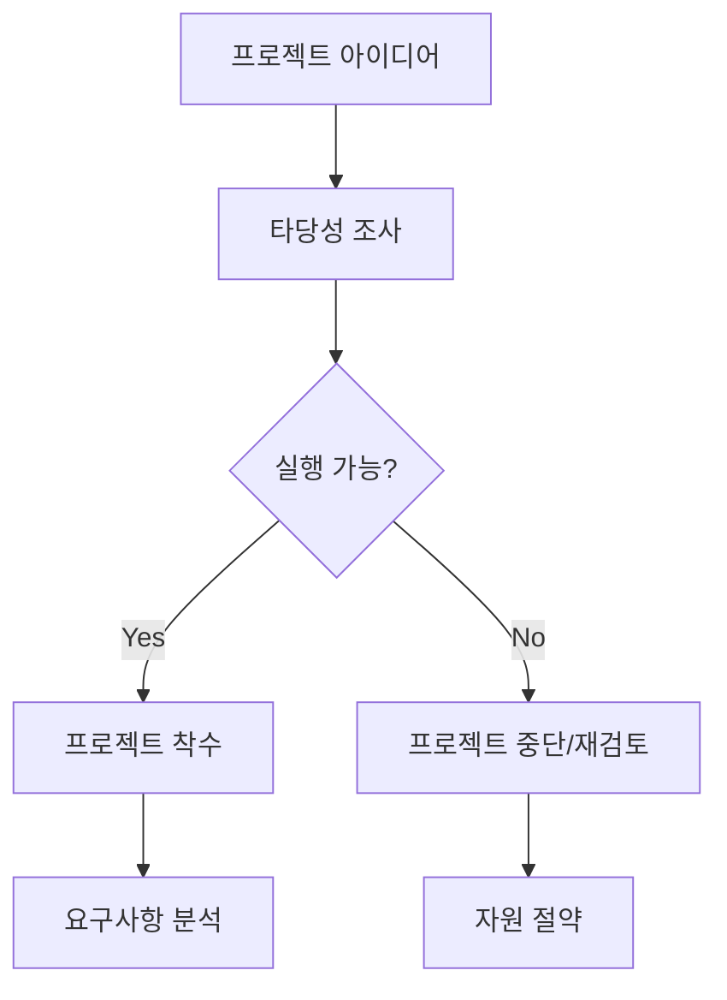
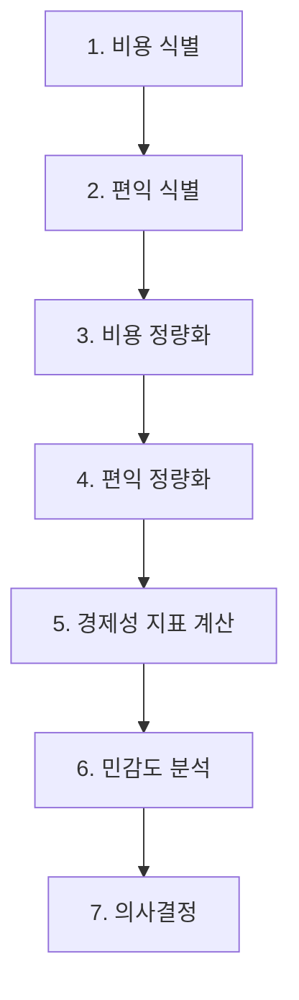
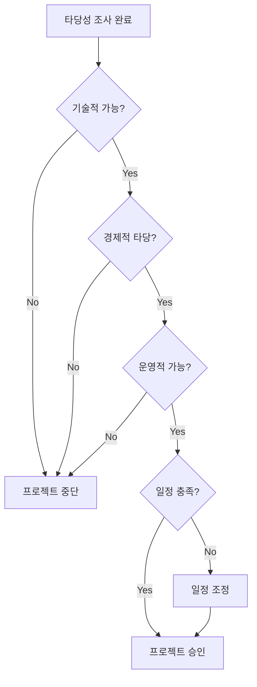

## 1. 타당성 조사 개요

### 1.1 타당성 조사란?

**타당성 조사(Feasibility Study)**는 프로젝트를 시작하기 전에 프로젝트의 실행 가능성과 효용성을 평가하는 과정입니다.

**정의**:
> "A preliminary study to determine whether a proposed system is technically, economically, and operationally feasible."

**목적**:
- 프로젝트 착수 여부 결정
- 위험 요소 식별
- 대안 평가
- 자원 요구사항 추정

### 1.2 타당성 조사의 중요성

**프로젝트 실패 방지**:
- 실현 불가능한 프로젝트 조기 포기
- 자원 낭비 최소화
- 전략적 의사결정 지원

**통계**:
- IT 프로젝트의 약 70%가 일정 지연 또는 예산 초과
- 조기 타당성 조사로 실패율 30% 감소



---

## 2. 타당성 조사의 유형

### 2.1 기술적 타당성 (Technical Feasibility)

**평가 항목**: 기술적으로 실현 가능한가?

**주요 질문**:
- 필요한 기술이 존재하는가?
- 조직이 해당 기술을 보유하고 있는가?
- 기술적 위험은 무엇인가?
- 기술 제약사항은 무엇인가?

**평가 요소**:

1. **하드웨어 요구사항**
   - 필요한 하드웨어 사양
   - 기존 인프라 활용 가능성
   - 추가 하드웨어 비용

2. **소프트웨어 요구사항**
   - 개발 플랫폼 및 도구
   - 운영체제 및 미들웨어
   - 라이선스 비용

3. **기술 역량**
   - 팀의 기술 수준
   - 교육 훈련 필요성
   - 외부 전문가 필요성

4. **기술 위험**
   - 신기술 사용 위험
   - 기술 성숙도
   - 대안 기술

**예시**:

```
프로젝트: 실시간 AI 얼굴 인식 시스템

기술적 타당성 평가:
✅ 기술 존재: OpenCV, TensorFlow 등 활용 가능
✅ 하드웨어: GPU 서버 필요 (보유 중)
⚠️  기술 역량: 딥러닝 전문가 부족 → 교육 필요
⚠️  성능: 실시간 처리 요구 → 최적화 필요
✅ 결론: 기술적으로 실현 가능하나, 교육 및 최적화 필요
```

### 2.2 경제적 타당성 (Economic Feasibility)

**평가 항목**: 경제적으로 타당한가?

**주요 질문**:
- 투자 대비 효과는?
- 총 소유 비용(TCO)은?
- 예상 수익은?
- 투자 회수 기간은?

**비용 분석**:

**1. 개발 비용**
- 인건비
- 하드웨어/소프트웨어 비용
- 개발 도구 비용
- 교육 훈련 비용

**2. 운영 비용**
- 유지보수 비용
- 라이선스 갱신 비용
- 인프라 운영 비용
- 지원 인력 비용

**3. 간접 비용**
- 시스템 전환 비용
- 데이터 마이그레이션 비용
- 사용자 교육 비용
- 프로세스 변경 비용

**편익 분석**:

**1. 직접 편익**
- 비용 절감 (인력, 시간)
- 매출 증가
- 생산성 향상

**2. 간접 편익**
- 고객 만족도 향상
- 의사결정 품질 개선
- 경쟁력 강화

**경제성 지표**:

**1. ROI (Return on Investment)**
```
ROI = (총 편익 - 총 비용) / 총 비용 × 100%
```

**예시**:
```
총 비용: 5억 원
총 편익: 8억 원
ROI = (8억 - 5억) / 5억 × 100% = 60%
```

**2. 순현재가치 (NPV, Net Present Value)**
```
NPV = Σ (편익_t - 비용_t) / (1 + r)^t
```
- t: 연도
- r: 할인율

**예시**:
```
연도  비용    편익    순편익   현재가치(r=10%)
0년   5억    0       -5억     -5.00억
1년   0      2억     2억      1.82억
2년   0      2.5억   2.5억    2.07억
3년   0      3억     3억      2.25억

NPV = -5.00 + 1.82 + 2.07 + 2.25 = 1.14억 (긍정적)
```

**3. 회수 기간 (Payback Period)**
```
투자 비용을 회수하는 데 걸리는 시간
```

**예시**:
```
초기 투자: 5억 원
연간 순편익: 2억 원
회수 기간 = 5억 / 2억 = 2.5년
```

### 2.3 운영적 타당성 (Operational Feasibility)

**평가 항목**: 조직에서 효과적으로 운영 가능한가?

**주요 질문**:
- 사용자가 시스템을 받아들일 것인가?
- 조직 문화와 부합하는가?
- 업무 프로세스와 호환되는가?
- 필요한 인력이 있는가?

**평가 요소**:

1. **사용자 수용성**
   - 변화에 대한 저항
   - 사용자 인터페이스 친화성
   - 교육 훈련 필요성

2. **조직 적합성**
   - 조직 문화와의 조화
   - 기존 시스템과의 통합
   - 비즈니스 프로세스 적합성

3. **관리 지원**
   - 경영진의 지원
   - 예산 및 자원 할당
   - 프로젝트 우선순위

4. **법적/규제 준수**
   - 관련 법규 준수
   - 개인정보 보호
   - 산업 표준 준수

**예시**:

```
프로젝트: 전사적 ERP 시스템 도입

운영적 타당성 평가:
⚠️  사용자 수용성: 기존 시스템 사용자 저항 예상
✅ 조직 적합성: 표준화된 프로세스 필요 → ERP 적합
✅ 관리 지원: CEO의 강력한 지원
⚠️  변화 관리: 대규모 조직 변화 관리 필요
✅ 결론: 운영 가능하나, 변화 관리 계획 필수
```

### 2.4 일정 타당성 (Schedule Feasibility)

**평가 항목**: 요구 일정 내에 완료 가능한가?

**주요 질문**:
- 프로젝트 완료 기한은?
- 필요한 개발 기간은?
- 일정 위험은?

**평가 요소**:
- 프로젝트 규모 및 복잡도
- 가용 인력 및 자원
- 중요 마일스톤
- 의존성 및 제약사항

---

## 3. 비용-편익 분석

### 3.1 비용-편익 분석 프로세스



### 3.2 비용 항목

**초기 비용 (One-time Costs)**:
- 하드웨어 구매
- 소프트웨어 라이선스
- 개발 인건비
- 시스템 구축 비용
- 데이터 마이그레이션
- 초기 교육 훈련

**반복 비용 (Recurring Costs)**:
- 유지보수 비용 (연간 15-20%)
- 운영 인력 급여
- 라이선스 갱신
- 인프라 운영 (전기, 냉각)
- 지속적 교육

**예시 비용 구조**:

```
온라인 쇼핑몰 시스템

초기 비용:
- 서버 및 네트워크 장비: 1억 원
- 소프트웨어 라이선스: 5천만 원
- 개발 인건비 (6명 × 12개월): 3억 원
- 데이터베이스 구축: 5천만 원
- 초기 교육: 2천만 원
소계: 5.2억 원

연간 반복 비용:
- 유지보수: 1억 원
- 운영 인력 (3명): 1.5억 원
- 라이선스 갱신: 1천만 원
- 인프라 운영: 5천만 원
소계: 3.1억 원/년

3년 총 비용 = 5.2억 + (3.1억 × 3) = 14.5억 원
```

### 3.3 편익 항목

**유형적 편익 (Tangible Benefits)**:
- 비용 절감 (인력, 재고, 운영)
- 매출 증가
- 생산성 향상
- 오류 감소

**무형적 편익 (Intangible Benefits)**:
- 고객 만족도 향상
- 브랜드 이미지 개선
- 의사결정 품질 향상
- 직원 사기 향상

**예시 편익 추정**:

```
온라인 쇼핑몰 시스템

유형적 편익 (연간):
- 매출 증가 (온라인 채널): 10억 원
- 재고 관리 개선: 5천만 원
- 주문 처리 자동화 (인력 3명 절감): 1.5억 원
- 마케팅 효율화: 5천만 원
소계: 12.5억 원/년

무형적 편익:
- 고객 만족도 향상 (추정): 3억 원/년
- 브랜드 인지도 향상 (추정): 2억 원/년
소계: 5억 원/년

3년 총 편익 = (12.5억 + 5억) × 3 = 52.5억 원
```

### 3.4 경제성 분석 예시

**프로젝트**: 온라인 쇼핑몰 시스템

**ROI 계산**:
```
총 비용 (3년): 14.5억 원
총 편익 (3년): 52.5억 원
순편익: 52.5억 - 14.5억 = 38억 원

ROI = 38억 / 14.5억 × 100% = 262%
```

**NPV 계산** (할인율 10%):
```
연도  비용    편익     순편익   현재가치
0년   5.2억   0        -5.2억   -5.20억
1년   3.1억   17.5억   14.4억   13.09억
2년   3.1억   17.5억   14.4억   11.90억
3년   3.1억   17.5억   14.4억   10.82억

NPV = -5.20 + 13.09 + 11.90 + 10.82 = 30.61억 (긍정적)
```

**회수 기간**:
```
초기 투자: 5.2억 원
연간 순편익: 14.4억 원
회수 기간 ≈ 5.2 / 14.4 ≈ 0.4년 (약 5개월)
```

**결론**: 경제적으로 매우 타당함 (ROI 262%, NPV 30.61억, 회수 기간 5개월)

---

## 4. 위험 분석

### 4.1 위험 식별

**기술적 위험**:
- 신기술 사용
- 시스템 통합 복잡도
- 성능 요구사항
- 보안 취약점

**일정 위험**:
- 요구사항 변경
- 자원 부족
- 의존성 문제
- 경험 부족

**비용 위험**:
- 예산 초과
- 숨겨진 비용
- 환율 변동
- 인플레이션

**조직 위험**:
- 사용자 저항
- 관리 지원 부족
- 조직 변화
- 정치적 요인

### 4.2 위험 평가

**위험 매트릭스**:

```
영향도
↑
│ 중간      높음       높음
│ (2)       (3)        (4)
│
│ 낮음      중간       높음
│ (1)       (2)        (3)
│
│ 낮음      낮음       중간
│ (1)       (1)        (2)
└─────────────────────────→
  낮음      중간       높음
              발생 확률
```

**위험 분류**:
- **낮음 (1)**: 모니터링
- **중간 (2)**: 대응 계획 수립
- **높음 (3)**: 즉각적 조치
- **매우 높음 (4)**: 프로젝트 재검토

**예시**:

```
위험                          발생확률  영향도  점수  조치
1. 신기술 적응 실패            중       높     3     교육 계획
2. 요구사항 변경               높       중     3     애자일 적용
3. 예산 초과                   중       중     2     예비 예산
4. 사용자 저항                 중       높     3     변화 관리
5. 보안 취약점                 낮       높     3     보안 검토
```

### 4.3 위험 완화 전략

**회피(Avoid)**: 위험 원인 제거
- 검증된 기술 사용
- 경험 있는 팀 구성

**전가(Transfer)**: 위험 이전
- 보험 가입
- 외주 개발

**완화(Mitigate)**: 영향 감소
- 프로토타입 개발
- 단계적 도입

**수용(Accept)**: 위험 감수
- 예비 예산 확보
- 비상 계획 수립

---

## 5. 대안 평가

### 5.1 대안 식별

**개발 방식 대안**:
1. **자체 개발**: 완전 맞춤 개발
2. **패키지 도입**: 상용 소프트웨어 구매
3. **하이브리드**: 패키지 + 커스터마이징
4. **아웃소싱**: 외부 업체 위탁
5. **클라우드 SaaS**: 클라우드 서비스 이용

### 5.2 대안 비교

**비교표 예시**:

| 기준 | 자체 개발 | 패키지 | SaaS |
|------|----------|--------|------|
| **초기 비용** | 높음 | 중간 | 낮음 |
| **맞춤화** | 높음 | 중간 | 낮음 |
| **개발 기간** | 길음 | 짧음 | 즉시 |
| **유지보수** | 자체 | 벤더 | 벤더 |
| **확장성** | 높음 | 중간 | 높음 |
| **위험** | 높음 | 중간 | 낮음 |
| **TCO (3년)** | 15억 | 10억 | 7억 |

**가중치 평가 방법**:

```
기준          가중치  자체개발  패키지  SaaS
비용          30%     5        7       9
맞춤화        25%     10       7       4
개발기간      20%     4        7       10
유지보수      15%     5        6       8
확장성        10%     9        6       8

총점 (10점 만점):
자체개발: 6.65
패키지:   6.85
SaaS:     7.55 ← 선택
```

---

## 6. 타당성 조사 보고서

### 6.1 보고서 구조

**1. 요약(Executive Summary)**
- 프로젝트 개요
- 주요 발견사항
- 권고사항

**2. 프로젝트 배경**
- 현황 및 문제점
- 프로젝트 목적
- 범위 및 제약사항

**3. 기술적 타당성**
- 기술 요구사항
- 기술 역량 평가
- 기술 위험

**4. 경제적 타당성**
- 비용 분석
- 편익 분석
- 경제성 지표

**5. 운영적 타당성**
- 조직 준비도
- 사용자 수용성
- 변화 관리 계획

**6. 일정 타당성**
- 프로젝트 일정
- 주요 마일스톤
- 일정 위험

**7. 위험 분석**
- 위험 식별
- 위험 평가
- 완화 전략

**8. 대안 평가**
- 대안 비교
- 추천 대안

**9. 결론 및 권고사항**
- 타당성 종합 평가
- 최종 권고사항
- 다음 단계

### 6.2 보고서 예시 (요약)

```
===== 타당성 조사 보고서 =====

프로젝트: 온라인 쇼핑몰 시스템 구축

요약:
- 목적: 온라인 판매 채널 확대, 매출 증대
- 총 투자: 5.2억 원
- 예상 ROI: 262% (3년)
- 회수 기간: 5개월

타당성 평가:
✅ 기술적 타당성: 높음 (검증된 기술, 충분한 역량)
✅ 경제적 타당성: 매우 높음 (ROI 262%, NPV 30.61억)
✅ 운영적 타당성: 높음 (경영진 지원, 변화 관리 계획 수립)
✅ 일정 타당성: 가능 (12개월 개발 기간)

주요 위험:
⚠️  기술 위험: 중간 (신기술 적응) → 교육 계획 수립
⚠️  조직 위험: 중간 (사용자 저항) → 변화 관리 강화

권고사항:
✅ 프로젝트 승인 및 즉시 착수
✅ 애자일 방법론 적용 (요구사항 변경 대응)
✅ 변화 관리 프로그램 병행
✅ 단계적 배포 (리스크 완화)

다음 단계:
1. 프로젝트 착수 승인
2. 프로젝트 팀 구성
3. 상세 요구사항 분석
```

---

## 7. 의사결정

### 7.1 의사결정 기준

**Go/No-Go 결정**:



**의사결정 체크리스트**:

- [ ] 기술적으로 실현 가능한가?
- [ ] 경제적으로 타당한가? (ROI > 15%, NPV > 0)
- [ ] 조직이 운영 가능한가?
- [ ] 일정 내 완료 가능한가?
- [ ] 위험이 수용 가능한 수준인가?
- [ ] 대안보다 우수한가?
- [ ] 전략적으로 적합한가?

### 7.2 의사결정 시나리오

**시나리오 1: 즉시 승인**
- 모든 타당성 긍정적
- 위험 낮음
- 강력한 비즈니스 케이스

**시나리오 2: 조건부 승인**
- 일부 타당성 우려
- 조건 충족 시 진행 (예: 예산 증액, 일정 연장)

**시나리오 3: 추가 조사**
- 불확실성 높음
- 추가 정보 필요
- 파일럿 프로젝트 고려

**시나리오 4: 프로젝트 거부**
- 타당성 낮음
- 대안이 더 우수
- 전략적으로 부적합

---

## 8. 요약

### 핵심 개념

1. **타당성 조사**: 프로젝트 실행 가능성 및 효용성 평가
   - 프로젝트 실패 방지
   - 자원 낭비 최소화
   - 전략적 의사결정 지원

2. **타당성 유형**:
   - **기술적**: 기술적으로 실현 가능한가?
   - **경제적**: 투자 대비 효과가 있는가?
   - **운영적**: 조직에서 운영 가능한가?
   - **일정**: 요구 일정 내 완료 가능한가?

3. **경제성 분석**:
   - ROI (Return on Investment)
   - NPV (Net Present Value)
   - 회수 기간 (Payback Period)

4. **비용-편익 분석**:
   - 비용: 개발 비용 + 운영 비용
   - 편익: 유형적 편익 + 무형적 편익
   - 경제성 지표로 타당성 평가

5. **위험 분석**:
   - 위험 식별 및 평가
   - 위험 완화 전략 (회피, 전가, 완화, 수용)

6. **대안 평가**:
   - 여러 대안 비교
   - 가중치 평가 방법
   - 최적 대안 선택

### 다음 단계

다음 포스트에서는 **Software Requirements (소프트웨어 요구사항)**를 다룰 예정입니다:
- 요구사항의 정의와 중요성
- 기능적 vs 비기능적 요구사항
- 사용자 요구사항 vs 시스템 요구사항
- 요구사항 명세서 작성

---

## 참고 자료

- Sommerville, I. (2015). *Software Engineering* (10th ed.). Pearson.
- Pressman, R. S., & Maxim, B. R. (2014). *Software Engineering: A Practitioner's Approach* (8th ed.). McGraw-Hill.
- [Project Management Institute (PMI) - Business Case Development](https://www.pmi.org/)
- [Cost-Benefit Analysis Guide](https://www.investopedia.com/terms/c/cost-benefitanalysis.asp)
