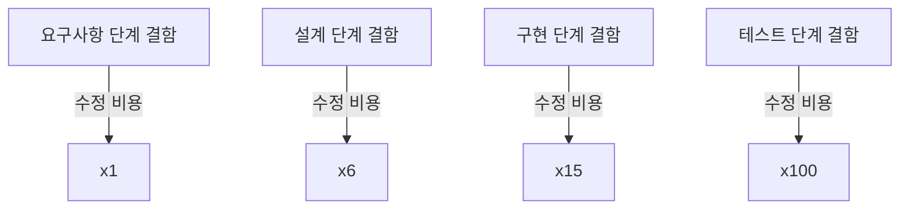
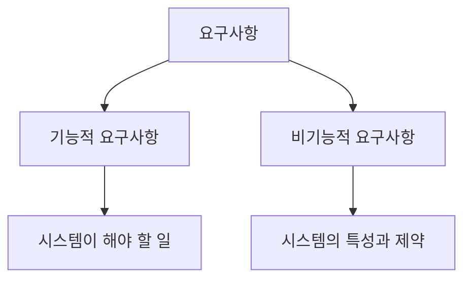
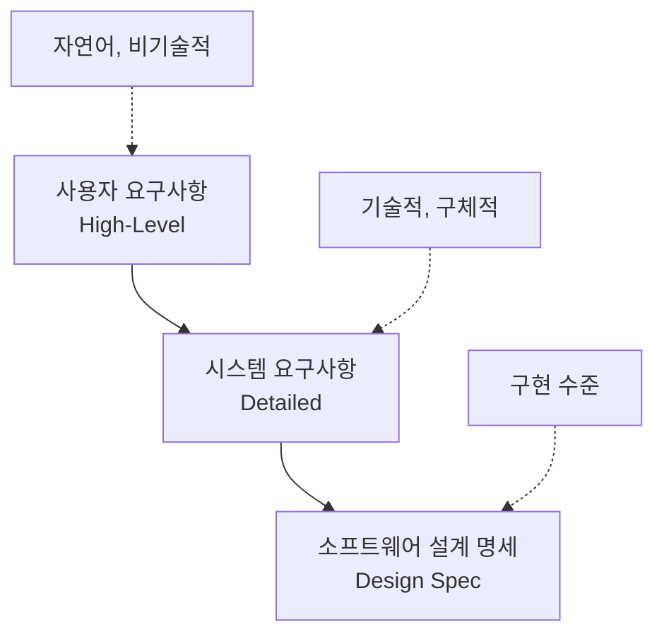
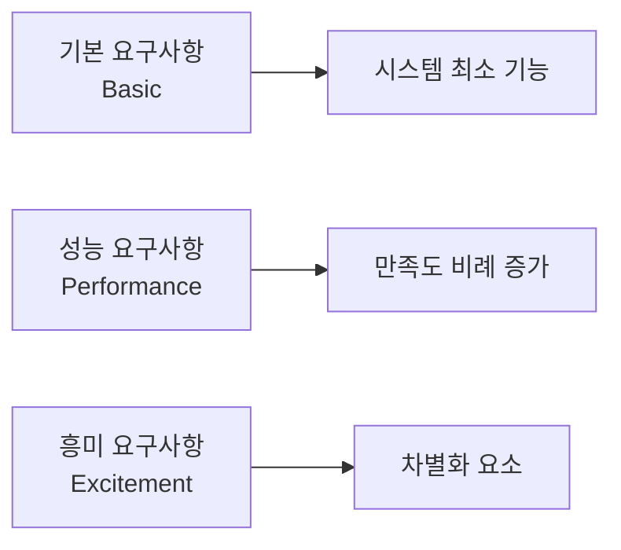

## 1. 요구사항 개요

### 1.1 요구사항이란?

**요구사항(Requirements)**은 시스템이 제공해야 하는 서비스와 시스템이 동작해야 하는 제약사항을 기술한 것입니다.

**정의**:
> "A requirement is a statement that identifies a necessary attribute, capability, characteristic, or quality of a system in order for it to have value and utility to a user."

**요구사항의 역할**:
- 개발자와 고객 간 계약의 기초
- 시스템 설계의 출발점
- 테스팅과 검증의 기준
- 프로젝트 범위 정의

### 1.2 요구사항의 중요성

**프로젝트 실패의 주요 원인**:
- 불명확한 요구사항: 37%
- 요구사항 변경: 28%
- 요구사항 누락: 21%

**올바른 요구사항의 효과**:
- ✅ 개발 비용 절감 (결함 조기 발견)
- ✅ 일정 준수
- ✅ 고객 만족도 향상
- ✅ 품질 개선



---

## 2. 요구사항의 분류

### 2.1 기능적 요구사항 vs 비기능적 요구사항



**기능적 요구사항 (Functional Requirements)**:
- 시스템이 **무엇을** 해야 하는가
- 입력과 출력
- 기능과 동작

**비기능적 요구사항 (Non-Functional Requirements)**:
- 시스템이 **어떻게** 동작해야 하는가
- 성능, 보안, 사용성 등
- 제약사항과 품질 속성

### 2.2 기능적 요구사항 (Functional Requirements)

**정의**: 시스템이 제공해야 하는 기능과 서비스

**특징**:
- 명확하고 구체적
- 테스트 가능
- 우선순위 지정 가능

**예시 - 온라인 쇼핑몰**:

```
FR-1: 시스템은 사용자가 상품을 검색할 수 있어야 한다.
  - FR-1.1: 키워드로 검색
  - FR-1.2: 카테고리별 검색
  - FR-1.3: 가격 범위로 필터링

FR-2: 시스템은 사용자가 장바구니에 상품을 추가할 수 있어야 한다.
  - FR-2.1: 수량 선택
  - FR-2.2: 옵션 선택 (색상, 크기)

FR-3: 시스템은 결제 처리를 지원해야 한다.
  - FR-3.1: 신용카드 결제
  - FR-3.2: 계좌이체
  - FR-3.3: 간편결제 (카카오페이, 네이버페이)

FR-4: 시스템은 주문 내역을 조회할 수 있어야 한다.
  - FR-4.1: 날짜별 조회
  - FR-4.2: 주문 상태별 조회
```

**작성 가이드라인**:
- 명확하고 간결하게
- 모호한 표현 피하기 ("빠른", "쉬운" 등)
- 측정 가능한 기준 제시
- 우선순위 명시

### 2.3 비기능적 요구사항 (Non-Functional Requirements)

**정의**: 시스템의 품질 속성과 제약사항

**분류**:

**1. 성능 요구사항 (Performance)**
```
NFR-1: 시스템 응답 시간은 평균 2초 이내여야 한다.
NFR-2: 동시 사용자 10,000명을 지원해야 한다.
NFR-3: 데이터베이스 쿼리는 1초 이내에 완료되어야 한다.
```

**2. 보안 요구사항 (Security)**
```
NFR-4: 모든 사용자 비밀번호는 암호화되어 저장되어야 한다.
NFR-5: 로그인 실패 5회 시 계정을 30분간 잠금해야 한다.
NFR-6: HTTPS 프로토콜을 사용해야 한다.
NFR-7: 개인정보는 개인정보 보호법을 준수해야 한다.
```

**3. 사용성 요구사항 (Usability)**
```
NFR-8: 신규 사용자는 30분 이내에 기본 기능을 학습할 수 있어야 한다.
NFR-9: 모든 화면은 WCAG 2.1 AA 수준의 접근성을 만족해야 한다.
NFR-10: 오류 메시지는 사용자가 이해할 수 있는 언어로 제공되어야 한다.
```

**4. 신뢰성 요구사항 (Reliability)**
```
NFR-11: 시스템 가용성은 99.9% 이상이어야 한다 (월 43분 이하 다운타임).
NFR-12: 데이터 손실 없이 장애 복구가 가능해야 한다.
NFR-13: 평균 고장 간격(MTBF)은 720시간 이상이어야 한다.
```

**5. 유지보수성 요구사항 (Maintainability)**
```
NFR-14: 코드 커버리지는 80% 이상이어야 한다.
NFR-15: 모든 코드는 팀의 코딩 표준을 준수해야 한다.
NFR-16: API 문서는 Swagger로 자동 생성되어야 한다.
```

**6. 이식성 요구사항 (Portability)**
```
NFR-17: 시스템은 Windows, macOS, Linux에서 동작해야 한다.
NFR-18: 모바일 웹은 iOS, Android 최신 2개 버전을 지원해야 한다.
NFR-19: 데이터베이스는 MySQL, PostgreSQL 모두 지원해야 한다.
```

**7. 법적/규제 요구사항 (Legal/Regulatory)**
```
NFR-20: 전자상거래법을 준수해야 한다.
NFR-21: PCI-DSS 표준을 만족해야 한다 (신용카드 정보 처리).
NFR-22: GDPR을 준수해야 한다 (EU 사용자 대상).
```

### 2.4 비기능적 요구사항의 SMART 원칙

비기능적 요구사항은 **SMART** 해야 합니다:

- **Specific (구체적)**: 명확하고 구체적
- **Measurable (측정 가능)**: 정량적 기준
- **Achievable (달성 가능)**: 현실적
- **Relevant (관련성)**: 프로젝트와 관련
- **Time-bound (시간 제한)**: 기한 명시

**좋은 예**:
```
✅ 시스템 응답 시간은 평균 2초, 95% 케이스에서 3초 이내여야 한다.
```

**나쁜 예**:
```
❌ 시스템은 빨라야 한다.
❌ 사용자 친화적이어야 한다.
❌ 안전해야 한다.
```

---

## 3. 사용자 요구사항 vs 시스템 요구사항

### 3.1 사용자 요구사항 (User Requirements)

**정의**: 사용자 관점에서 시스템이 제공해야 하는 서비스와 제약사항을 **자연어**로 기술

**특징**:
- 비기술적 언어
- 고객과 최종 사용자가 이해 가능
- 고수준 기술

**예시**:
```
사용자 요구사항:

UR-1: 사용자는 상품을 검색하고 장바구니에 담을 수 있어야 한다.

UR-2: 사용자는 다양한 결제 수단으로 결제할 수 있어야 한다.

UR-3: 시스템은 사용하기 쉬워야 하며, 신규 사용자도 30분 이내에
      주문을 완료할 수 있어야 한다.

UR-4: 개인정보는 안전하게 보호되어야 한다.
```

### 3.2 시스템 요구사항 (System Requirements)

**정의**: 시스템이 제공해야 하는 기능과 제약사항을 **상세하고 기술적**으로 기술

**특징**:
- 기술적 언어
- 개발자와 설계자 대상
- 저수준 기술

**예시**:
```
시스템 요구사항:

SR-1: 상품 검색
  SR-1.1: 사용자가 검색어를 입력하면, 시스템은 상품 이름, 설명,
          카테고리에서 검색한다.
  SR-1.2: 검색 결과는 관련도 순으로 정렬되어 페이지당 20개씩 표시된다.
  SR-1.3: 검색 응답 시간은 2초 이내여야 한다.

SR-2: 장바구니
  SR-2.1: 사용자가 상품을 장바구니에 추가하면, 세션 데이터베이스에 저장된다.
  SR-2.2: 장바구니는 로그인하지 않은 사용자의 경우 브라우저 쿠키에 저장된다.
  SR-2.3: 로그인한 사용자의 장바구니는 데이터베이스에 영구 저장된다.

SR-3: 결제 처리
  SR-3.1: 시스템은 PG사 API를 호출하여 결제를 처리한다.
  SR-3.2: 결제 정보는 AES-256으로 암호화되어 전송된다.
  SR-3.3: 결제 실패 시 3회까지 재시도한다.

SR-4: 개인정보 보호
  SR-4.1: 비밀번호는 bcrypt 알고리즘으로 해싱하여 저장한다.
  SR-4.2: 모든 통신은 TLS 1.3 이상을 사용한다.
  SR-4.3: 개인정보 접근은 로그에 기록된다.
```

### 3.3 요구사항 계층 구조



---

## 4. 요구사항 명세서 (SRS)

### 4.1 SRS란?

**SRS (Software Requirements Specification)**는 소프트웨어 요구사항을 문서화한 공식 문서입니다.

**목적**:
- 고객과 개발자 간 합의
- 설계와 구현의 기초
- 테스트 기준
- 계약서 역할

### 4.2 SRS 구조 (IEEE 830 표준)

**1. 서론 (Introduction)**
- 1.1 목적 (Purpose)
- 1.2 범위 (Scope)
- 1.3 정의, 약어, 약칭 (Definitions, Acronyms, Abbreviations)
- 1.4 참조 (References)
- 1.5 개요 (Overview)

**2. 전반적 기술 (Overall Description)**
- 2.1 제품 관점 (Product Perspective)
- 2.2 제품 기능 (Product Functions)
- 2.3 사용자 특성 (User Characteristics)
- 2.4 제약사항 (Constraints)
- 2.5 가정과 의존성 (Assumptions and Dependencies)

**3. 구체적 요구사항 (Specific Requirements)**
- 3.1 기능적 요구사항 (Functional Requirements)
- 3.2 비기능적 요구사항 (Non-Functional Requirements)
- 3.3 인터페이스 요구사항 (Interface Requirements)
- 3.4 성능 요구사항 (Performance Requirements)
- 3.5 설계 제약사항 (Design Constraints)

**4. 부록 (Appendices)**
- 용어집 (Glossary)
- 분석 모델 (Analysis Models)
- 이슈 목록 (Issues List)

### 4.3 SRS 예시 (간략)

```markdown
===== 소프트웨어 요구사항 명세서 =====
온라인 도서 대여 시스템

1. 서론
1.1 목적
본 문서는 온라인 도서 대여 시스템의 요구사항을 명세한다.
대상 독자: 개발팀, 프로젝트 관리자, QA 팀

1.2 범위
시스템 이름: LibraryHub
기능: 도서 검색, 대여, 반납, 연장, 예약
범위 제외: 전자책 대여, 오프라인 키오스크

1.3 정의
- 회원: 시스템에 등록된 사용자
- 도서: 대여 가능한 실물 책
- 대여 기간: 기본 14일

2. 전반적 기술
2.1 제품 관점
기존 수동 시스템을 자동화하는 웹 기반 시스템

2.2 제품 기능
- 회원 관리 (가입, 로그인, 정보 수정)
- 도서 관리 (검색, 상세 정보)
- 대여 관리 (대여, 반납, 연장, 예약)
- 알림 (반납 기한, 예약 도서 도착)

2.3 사용자 특성
- 일반 회원: 20-60대, 기본적인 웹 사용 능력
- 사서: 도서관 직원, 관리 기능 사용

2.4 제약사항
- 웹 브라우저 기반 (IE 11 이상, Chrome, Firefox)
- 기존 도서 DB와 연동
- 예산: 5천만 원
- 개발 기간: 6개월

3. 구체적 요구사항
3.1 기능적 요구사항

FR-1: 회원 가입
  FR-1.1: 이메일, 비밀번호, 이름, 전화번호 입력
  FR-1.2: 이메일 중복 확인
  FR-1.3: 이메일 인증

FR-2: 도서 검색
  FR-2.1: 제목, 저자, ISBN으로 검색
  FR-2.2: 검색 결과 정렬 (관련도, 출판일, 제목순)
  FR-2.3: 검색 결과 필터링 (대여 가능 여부, 카테고리)

FR-3: 도서 대여
  FR-3.1: 대여 가능한 도서 선택
  FR-3.2: 대여 신청 (최대 5권)
  FR-3.3: 대여 확인 이메일 발송

3.2 비기능적 요구사항

NFR-1: 성능
  - 검색 응답 시간: 3초 이내
  - 동시 접속자: 500명
  - 데이터베이스 쿼리: 1초 이내

NFR-2: 보안
  - 비밀번호 암호화 (bcrypt)
  - HTTPS 통신
  - SQL Injection 방지

NFR-3: 사용성
  - 신규 사용자 30분 내 대여 완료
  - WCAG 2.1 AA 준수

NFR-4: 신뢰성
  - 가용성: 99% 이상
  - 일일 백업

3.3 인터페이스 요구사항
  - 반응형 웹 디자인 (PC, 태블릿, 모바일)
  - 기존 도서 DB와 REST API 연동
```

### 4.4 SRS 작성 가이드라인

**좋은 SRS의 특징**:

1. **정확성 (Correctness)**
   - 모든 요구사항이 올바름

2. **완전성 (Completeness)**
   - 모든 중요 요구사항 포함
   - 누락 없음

3. **일관성 (Consistency)**
   - 요구사항 간 모순 없음

4. **명확성 (Clarity)**
   - 모호하지 않고 명확

5. **추적 가능성 (Traceability)**
   - 요구사항 출처 추적 가능
   - 요구사항 ID 부여

6. **우선순위화 (Prioritization)**
   - 필수 (Must), 선택 (Should), 희망 (Could)

7. **검증 가능성 (Verifiability)**
   - 테스트 가능

**작성 팁**:
- **구체적으로**: "빨리"가 아닌 "2초 이내"
- **능동태 사용**: "시스템은 ~해야 한다"
- **정량화**: 측정 가능한 기준
- **우선순위**: MoSCoW (Must, Should, Could, Won't)

---

## 5. 요구사항 우선순위

### 5.1 MoSCoW 기법

**Must have (필수)**:
- 시스템의 핵심 기능
- 없으면 시스템이 쓸모없음
- 예: 로그인, 결제 처리

**Should have (중요)**:
- 중요하지만 필수는 아님
- 회피 방법 존재
- 예: 비밀번호 찾기, 위시리스트

**Could have (선택)**:
- 있으면 좋지만 없어도 됨
- 예: 소셜 로그인, 상품 추천

**Won't have (제외)**:
- 이번 릴리스에서는 제외
- 향후 버전에서 고려
- 예: 모바일 앱, 다국어 지원

### 5.2 Kano 모델



**1. 기본 요구사항 (Basic/Must-be)**
- 당연히 있어야 함
- 없으면 불만, 있어도 만족도 증가 미미
- 예: 상품 검색, 결제

**2. 성능 요구사항 (Performance/One-dimensional)**
- 많을수록 만족도 증가
- 예: 빠른 배송, 할인율

**3. 흥미 요구사항 (Excitement/Attractive)**
- 없어도 불만 없음
- 있으면 큰 만족
- 예: AR 상품 미리보기, AI 추천

---

## 6. 요구사항 검증

### 6.1 요구사항 품질 체크리스트

**각 요구사항에 대해**:
- [ ] 명확한가? (모호하지 않은가?)
- [ ] 완전한가? (모든 정보가 있는가?)
- [ ] 일관성 있는가? (다른 요구사항과 모순 없는가?)
- [ ] 테스트 가능한가? (검증 방법이 있는가?)
- [ ] 추적 가능한가? (출처와 영향 파악 가능한가?)
- [ ] 우선순위가 있는가?
- [ ] 실현 가능한가?

### 6.2 요구사항 리뷰

**리뷰 유형**:

1. **비공식 리뷰 (Informal Review)**
   - 개발자 간 간단한 검토

2. **워크스루 (Walkthrough)**
   - 작성자가 요구사항 설명
   - 참석자가 질문 및 피드백

3. **인스펙션 (Inspection)**
   - 공식적인 검토 회의
   - 체크리스트 사용
   - 결함 기록 및 추적

**리뷰 참가자**:
- 고객/사용자 대표
- 비즈니스 분석가
- 개발자
- 테스터
- 프로젝트 관리자

---

## 7. 요약

### 핵심 개념

1. **요구사항**: 시스템이 제공해야 하는 서비스와 제약사항
   - 개발의 기초, 테스팅 기준, 계약서

2. **요구사항 분류**:
   - **기능적 요구사항**: 시스템이 무엇을 해야 하는가
   - **비기능적 요구사항**: 시스템이 어떻게 동작해야 하는가

3. **사용자 vs 시스템 요구사항**:
   - **사용자 요구사항**: 자연어, 고수준, 비기술적
   - **시스템 요구사항**: 기술적, 상세, 구체적

4. **SRS (요구사항 명세서)**:
   - IEEE 830 표준
   - 서론, 전반적 기술, 구체적 요구사항, 부록

5. **요구사항 우선순위**:
   - MoSCoW: Must, Should, Could, Won't
   - Kano: Basic, Performance, Excitement

6. **요구사항 품질**:
   - 명확성, 완전성, 일관성, 검증 가능성
   - 리뷰와 검증

### 다음 단계

다음 포스트에서는 **Requirements Engineering (요구공학)**을 다룰 예정입니다:
- 요구사항 도출 (Elicitation) 기법
- 요구사항 분석 및 협상
- 요구사항 검증 방법
- 요구사항 관리

---

## 참고 자료

- Sommerville, I. (2015). *Software Engineering* (10th ed.). Pearson.
- [IEEE 830-1998 - Recommended Practice for Software Requirements Specifications](https://standards.ieee.org/)
- Wiegers, K., & Beatty, J. (2013). *Software Requirements* (3rd ed.). Microsoft Press.
- [ISO/IEC/IEEE 29148:2018 - Systems and software engineering — Life cycle processes — Requirements engineering](https://www.iso.org/)
