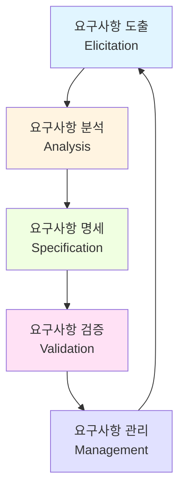
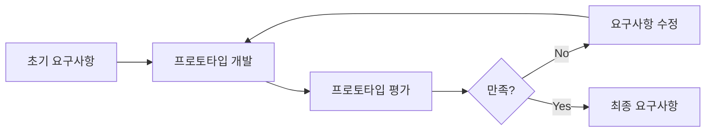
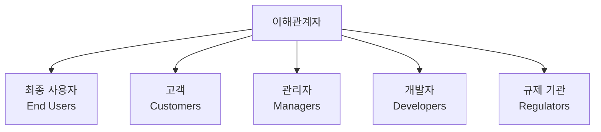
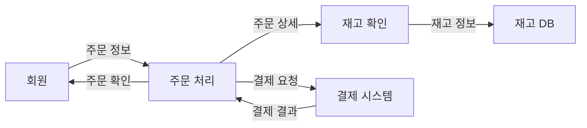
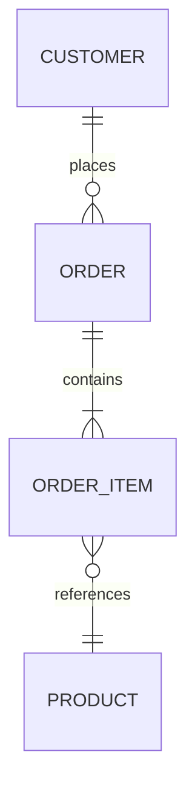
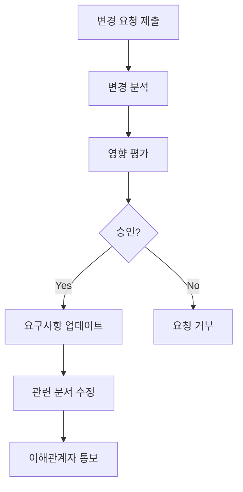

## 1. 요구공학 개요

### 1.1 요구공학이란?

**요구공학(Requirements Engineering)**은 시스템 요구사항을 발견, 분석, 문서화, 검증하고 관리하는 체계적인 프로세스입니다.

**정의**:
> "The process of establishing the services that a customer requires from a system and the constraints under which it operates and is developed."

### 1.2 요구공학 프로세스



**주요 활동**:
1. **도출(Elicitation)**: 이해관계자로부터 요구사항 수집
2. **분석(Analysis)**: 요구사항 이해, 충돌 해결
3. **명세(Specification)**: 요구사항 문서화
4. **검증(Validation)**: 요구사항 정확성 확인
5. **관리(Management)**: 요구사항 변경 추적

---

## 2. 요구사항 도출 (Requirements Elicitation)

### 2.1 요구사항 도출이란?

**요구사항 도출**은 이해관계자로부터 필요한 정보를 수집하여 요구사항을 발견하는 과정입니다.

**도전 과제**:
- 이해관계자가 자신이 원하는 것을 모름
- 암묵적 요구사항 (당연하게 여겨 말하지 않음)
- 이해관계자 간 요구사항 충돌
- 정치적, 조직적 요인

### 2.2 요구사항 도출 기법

**1. 인터뷰 (Interviews)**

**특징**:
- 가장 일반적인 기법
- 1:1 또는 그룹 인터뷰

**종류**:
- **구조화된 인터뷰**: 미리 준비된 질문
- **비구조화된 인터뷰**: 자유로운 대화
- **반구조화된 인터뷰**: 기본 질문 + 유연한 추가 질문

**예시 질문**:
```
- 현재 업무 프로세스는 어떻게 되나요?
- 가장 큰 불편한 점은 무엇인가요?
- 시스템이 해결해야 할 문제는 무엇인가요?
- 성공의 기준은 무엇인가요?
- 사용 빈도가 높은 기능은 무엇인가요?
```

**장점**:
- ✅ 깊이 있는 정보 획득
- ✅ 즉각적인 명확화 가능

**단점**:
- ❌ 시간 소요
- ❌ 인터뷰어 기술 필요
- ❌ 확장성 낮음

**2. 설문조사 (Questionnaires)**

**특징**:
- 많은 이해관계자로부터 정보 수집
- 표준화된 질문

**질문 유형**:
- **폐쇄형**: 예/아니오, 선택형
- **개방형**: 자유 응답
- **척도형**: 1-5점 만족도

**예시**:
```
1. 현재 시스템의 응답 속도에 만족하십니까?
   매우 불만족 1 - 2 - 3 - 4 - 5 매우 만족

2. 가장 자주 사용하는 기능은 무엇입니까? (복수 선택)
   [ ] 검색
   [ ] 보고서 생성
   [ ] 데이터 입력
   [ ] 분석

3. 새 시스템에 추가되었으면 하는 기능은?
   (자유 기술)
```

**장점**:
- ✅ 많은 응답자
- ✅ 정량적 데이터
- ✅ 비용 효율적

**단점**:
- ❌ 응답률 낮을 수 있음
- ❌ 깊이 부족
- ❌ 명확화 어려움

**3. 워크샵 (Requirements Workshops)**

**특징**:
- 다양한 이해관계자가 모여 요구사항 도출
- 촉진자(Facilitator)가 진행

**프로세스**:
1. 참석자 선정 (고객, 사용자, 개발자, 전문가)
2. 목표 설정
3. 아이디어 도출 (브레인스토밍)
4. 우선순위 결정
5. 합의 도달

**기법**:
- **브레인스토밍**: 자유로운 아이디어 제시
- **JAD (Joint Application Design)**: 구조화된 워크샵
- **QFD (Quality Function Deployment)**: 고객 요구를 기술 명세로 변환

**장점**:
- ✅ 빠른 합의
- ✅ 창의적 아이디어
- ✅ 충돌 즉시 해결

**단점**:
- ❌ 조율 어려움
- ❌ 시간/비용 소요
- ❌ 일부 참석자 의견 지배 가능

**4. 관찰 (Observation)**

**특징**:
- 사용자가 실제 업무를 수행하는 것을 관찰
- 암묵적 요구사항 발견

**종류**:
- **수동적 관찰**: 단순 관찰
- **능동적 관찰**: 질문하며 관찰
- **Ethnography**: 사용자 환경에 몰입

**예시**:
```
관찰 대상: 병원 접수 업무

관찰 내용:
- 환자 접수 시 평균 3분 소요
- 보험 확인 시 외부 시스템 조회 (응답 느림)
- 종이 서류 작성 후 수기 입력 (이중 작업)
- 전화 문의 시 업무 중단

발견된 요구사항:
- 보험 조회 자동화 필요
- OCR을 통한 자동 입력
- 전화 응대 중 화면 잠금 방지
```

**장점**:
- ✅ 실제 요구사항 발견
- ✅ 암묵적 지식 획득

**단점**:
- ❌ 시간 소요
- ❌ 호손 효과 (관찰받는다는 인식으로 행동 변화)

**5. 프로토타이핑 (Prototyping)**

**특징**:
- 초기 버전 시스템을 만들어 사용자 피드백 수집
- "보여주기" 를 통한 요구사항 명확화

**유형**:
- **Throwaway 프로토타입**: 폐기형
- **Evolutionary 프로토타입**: 진화형

**프로세스**:


**장점**:
- ✅ 시각적 피드백
- ✅ 요구사항 명확화
- ✅ 사용성 조기 평가

**단점**:
- ❌ 개발 시간/비용
- ❌ 프로토타입을 최종 제품으로 오해

**6. 유스케이스 분석 (Use Case Analysis)**

**유스케이스(Use Case)**:
- 시스템과 사용자(액터) 간 상호작용을 시나리오로 기술

**유스케이스 예시**:
```
유스케이스: 도서 대여

주 액터: 회원
목표: 도서를 대여한다

전제조건:
- 회원이 로그인되어 있다
- 대여 가능한 도서가 있다

주요 성공 시나리오:
1. 회원이 도서를 검색한다
2. 시스템은 검색 결과를 표시한다
3. 회원이 도서를 선택한다
4. 시스템은 도서 상세 정보를 표시한다
5. 회원이 "대여" 버튼을 클릭한다
6. 시스템은 대여 처리하고 확인 메시지를 표시한다

대안 흐름:
3a. 도서가 대여 중인 경우
    3a1. 시스템은 "예약" 버튼을 표시한다
    3a2. 회원이 예약할 수 있다

후조건:
- 도서가 회원에게 대여됨
- 반납 기한이 설정됨
- 대여 내역에 기록됨
```

**7. 문서 분석 (Document Analysis)**

**분석 대상**:
- 기존 시스템 문서
- 업무 매뉴얼
- 규정 및 표준
- 경쟁사 제품 문서

**예시**:
```
분석 문서: 전자상거래법

발견된 요구사항:
- 청약철회 기능 (7일 이내)
- 결제 전 거래 조건 명시
- 개인정보 처리 방침 공개
- 사업자 정보 표시
```

### 2.3 이해관계자 식별

**이해관계자(Stakeholder) 유형**:



**예시 - 병원 정보 시스템**:
- **최종 사용자**: 의사, 간호사, 약사
- **고객**: 병원 경영진
- **관리자**: IT 부서장
- **개발자**: 개발팀
- **규제 기관**: 보건복지부, 개인정보보호위원회

---

## 3. 요구사항 분석 (Requirements Analysis)

### 3.1 요구사항 분석이란?

**요구사항 분석**은 수집된 요구사항을 이해하고, 우선순위를 정하며, 충돌을 해결하는 과정입니다.

### 3.2 요구사항 분석 활동

**1. 요구사항 분류**

```
기능적 요구사항
├── 핵심 기능
├── 부가 기능
└── 관리 기능

비기능적 요구사항
├── 성능
├── 보안
├── 사용성
└── 신뢰성
```

**2. 요구사항 우선순위 결정**

**MoSCoW 기법**:
- **Must have**: 없으면 시스템 무용
- **Should have**: 중요하지만 필수 아님
- **Could have**: 있으면 좋음
- **Won't have**: 이번 릴리스 제외

**Kano 모델** (이전 포스트 참조)

**3. 요구사항 협상 (Negotiation)**

**충돌 유형**:
- 이해관계자 간 요구사항 충돌
- 기술적 제약과 요구사항 충돌
- 예산/일정과 요구사항 충돌

**해결 방법**:
- 이해관계자 회의
- 트레이드오프 분석
- 대안 제시
- 우선순위 재조정

**예시**:
```
충돌:
- 사용자: "모든 거래 내역 무제한 조회"
- IT: "성능 문제, 최근 1년만 조회"

협상 결과:
- 기본: 최근 1년 조회 (빠른 응답)
- 옵션: 전체 기간 조회 (별도 요청)
```

**4. 요구사항 모델링**

**데이터 흐름 다이어그램 (DFD)**:


**엔티티-관계 다이어그램 (ERD)**:


---

## 4. 요구사항 명세 (Requirements Specification)

### 4.1 요구사항 명세란?

**요구사항 명세**는 분석된 요구사항을 공식 문서로 작성하는 과정입니다.

**산출물**: SRS (Software Requirements Specification)

### 4.2 요구사항 작성 기법

**1. 자연어 (Natural Language)**

**장점**: 이해하기 쉬움
**단점**: 모호할 수 있음

**작성 가이드**:
- 표준 형식 사용
- 능동태 사용
- 모호한 표현 피하기

**예시**:
```
좋은 예:
✅ "시스템은 사용자 입력을 받은 후 2초 이내에 검색 결과를 표시해야 한다."

나쁜 예:
❌ "시스템은 빠르게 응답해야 한다."
❌ "가능한 한 빨리 처리한다."
```

**2. 구조화된 자연어 (Structured Natural Language)**

**템플릿 사용**:
```
요구사항 ID: FR-001
제목: 사용자 로그인
우선순위: Must have
설명: 사용자는 이메일과 비밀번호로 로그인할 수 있어야 한다.
입력: 이메일, 비밀번호
출력: 로그인 성공/실패 메시지
전제조건: 사용자가 가입되어 있음
후조건: 세션이 생성됨
```

**3. 유스케이스 (Use Cases)**

이전 섹션 참조

**4. 형식 명세 (Formal Specification)**

**수학적 표기법 사용**:
```
예: Z Notation

login(email: String, password: String): Boolean
pre: email ∈ registered_emails
post: result = (hash(password) = stored_hash(email))
```

**장점**: 정확, 명확
**단점**: 이해 어려움, 작성 비용 높음

---

## 5. 요구사항 검증 (Requirements Validation)

### 5.1 요구사항 검증이란?

**요구사항 검증**은 요구사항이 올바르게 작성되었는지 확인하는 과정입니다.

**검증 vs 확인(Validation vs Verification)**:
- **Validation**: "올바른 제품을 만들고 있는가?" (고객 요구 충족)
- **Verification**: "제품을 올바르게 만들고 있는가?" (명세 준수)

### 5.2 검증 기법

**1. 요구사항 리뷰 (Requirements Review)**

**참가자**:
- 고객/사용자
- 개발자
- 테스터
- 프로젝트 관리자

**체크리스트**:
- [ ] 요구사항이 명확한가?
- [ ] 요구사항이 완전한가?
- [ ] 요구사항 간 일관성이 있는가?
- [ ] 요구사항이 실현 가능한가?
- [ ] 요구사항을 테스트할 수 있는가?

**2. 프로토타이핑 (Prototyping)**

사용자가 프로토타입을 사용하며 요구사항 검증

**3. 테스트 케이스 생성 (Test Case Generation)**

각 요구사항에 대한 테스트 케이스 작성
- 테스트 가능성 검증
- 조기 테스트 계획 수립

**예시**:
```
요구사항: "시스템은 잘못된 비밀번호 입력 시 오류 메시지를 표시해야 한다."

테스트 케이스:
TC-001: 잘못된 비밀번호 입력
입력: 이메일 = "test@example.com", 비밀번호 = "wrong"
예상 결과: "비밀번호가 올바르지 않습니다" 메시지 표시
```

**4. 자동화된 일관성 검사**

도구를 사용하여 요구사항 간 충돌 검출
- 중복 검사
- 모순 검사
- 추적성 검사

### 5.3 요구사항 품질 속성

**완전성 (Completeness)**:
- 모든 필요한 요구사항 포함
- 누락 없음

**일관성 (Consistency)**:
- 요구사항 간 모순 없음

**명확성 (Clarity)**:
- 모호하지 않음
- 단일 해석만 가능

**정확성 (Correctness)**:
- 사실과 부합
- 고객 요구 반영

**검증 가능성 (Verifiability)**:
- 테스트 가능
- 명확한 기준

**추적 가능성 (Traceability)**:
- 출처와 구현 추적 가능

---

## 6. 요구사항 관리 (Requirements Management)

### 6.1 요구사항 관리란?

**요구사항 관리**는 프로젝트 전 생명주기 동안 요구사항 변경을 추적하고 통제하는 과정입니다.

### 6.2 요구사항 변경 관리

**변경 요청 프로세스**:



**영향 평가 항목**:
- 관련 요구사항
- 설계/구현 영향
- 테스트 케이스 영향
- 비용/일정 영향

**예시**:
```
변경 요청: "결제 방식에 암호화폐 추가"

영향 평가:
- 관련 요구사항: FR-3 (결제 처리)
- 설계 영향: 결제 모듈 재설계
- 구현 영향: 암호화폐 API 통합 (4주)
- 테스트 영향: 새 테스트 케이스 20개
- 비용: 추가 개발 비용 5천만 원
- 일정: 1개월 지연

결정: 다음 버전으로 연기
```

### 6.3 요구사항 추적성 (Traceability)

**추적성 매트릭스**:

| 요구사항 ID | 유스케이스 | 설계 문서 | 코드 모듈 | 테스트 케이스 |
|-------------|-----------|----------|----------|--------------|
| FR-001      | UC-01     | DD-01    | Login.java| TC-001, TC-002 |
| FR-002      | UC-02     | DD-02    | Search.java| TC-003, TC-004 |
| NFR-001     | -         | DD-03    | Cache.java| TC-005 |

**추적성 유형**:
- **Backward Traceability**: 요구사항 → 출처
- **Forward Traceability**: 요구사항 → 설계/구현/테스트

**이점**:
- 변경 영향 분석 용이
- 커버리지 확인
- 규제 준수 증명

### 6.4 요구사항 관리 도구

**도구 예시**:
- **Jira**: 이슈 추적, 애자일 지원
- **IBM DOORS**: 엔터프라이즈 요구사항 관리
- **Confluence**: 협업 문서화
- **Trello**: 칸반 보드
- **Azure DevOps**: 통합 ALM

**기능**:
- 요구사항 저장소
- 버전 관리
- 추적성 매트릭스
- 변경 추적
- 리포트 생성

---

## 7. 애자일 환경에서의 요구공학

### 7.1 전통적 vs 애자일 요구공학

| 전통적 | 애자일 |
|--------|--------|
| 포괄적 SRS | 사용자 스토리 |
| 초기 전체 수집 | 점진적 발견 |
| 엄격한 변경 통제 | 변화 환영 |
| 문서 중심 | 대화 중심 |

### 7.2 사용자 스토리 (User Stories)

**형식**:
```
As a [역할],
I want [기능],
So that [목적/가치].
```

**예시**:
```
As a 온라인 쇼핑몰 고객,
I want 장바구니에 상품을 저장,
So that 나중에 구매할 수 있다.
```

**INVEST 기준**:
- **Independent**: 독립적
- **Negotiable**: 협상 가능
- **Valuable**: 가치 제공
- **Estimable**: 추정 가능
- **Small**: 작은 크기
- **Testable**: 테스트 가능

**인수 기준 (Acceptance Criteria)**:
```
사용자 스토리: 상품 검색

인수 기준:
- Given 사용자가 검색창에 "노트북"을 입력하면
- When 검색 버튼을 클릭하면
- Then 노트북 관련 상품 목록이 표시된다

- Given 검색 결과가 없으면
- Then "검색 결과가 없습니다" 메시지가 표시된다
```

### 7.3 제품 백로그 (Product Backlog)

**우선순위화된 사용자 스토리 목록**:

| ID | 사용자 스토리 | 우선순위 | 추정 (Story Points) |
|----|--------------|---------|---------------------|
| US-001 | 사용자 로그인 | Must | 3 |
| US-002 | 상품 검색 | Must | 5 |
| US-003 | 장바구니 추가 | Must | 3 |
| US-004 | 결제 처리 | Must | 8 |
| US-005 | 위시리스트 | Should | 3 |
| US-006 | 상품 추천 | Could | 5 |

---

## 8. 요약

### 핵심 개념

1. **요구공학 프로세스**:
   - 도출 → 분석 → 명세 → 검증 → 관리

2. **요구사항 도출 기법**:
   - 인터뷰, 설문조사, 워크샵, 관찰, 프로토타이핑
   - 유스케이스 분석, 문서 분석

3. **요구사항 분석**:
   - 분류, 우선순위, 협상, 모델링
   - MoSCoW, Kano 모델

4. **요구사항 명세**:
   - SRS 작성
   - 자연어, 구조화된 자연어, 유스케이스, 형식 명세

5. **요구사항 검증**:
   - 리뷰, 프로토타이핑, 테스트 케이스 생성
   - 품질 속성: 완전성, 일관성, 명확성

6. **요구사항 관리**:
   - 변경 관리
   - 추적성 매트릭스
   - 관리 도구

7. **애자일 요구공학**:
   - 사용자 스토리 (INVEST)
   - 제품 백로그
   - 점진적 발견

### 다음 단계

다음 포스트에서는 **System Models (시스템 모델링)**을 다룰 예정입니다:
- 시스템 모델링의 목적과 유형
- 컨텍스트 모델 (Context Model)
- 상호작용 모델 (Interaction Model)
- 구조 모델 (Structural Model)
- 행위 모델 (Behavioral Model)

---

## 참고 자료

- Sommerville, I. (2015). *Software Engineering* (10th ed.). Pearson.
- Wiegers, K., & Beatty, J. (2013). *Software Requirements* (3rd ed.). Microsoft Press.
- Pohl, K., & Rupp, C. (2015). *Requirements Engineering Fundamentals* (2nd ed.). Rocky Nook.
- Cohn, M. (2004). *User Stories Applied*. Addison-Wesley.
- [IIBA - Business Analysis Body of Knowledge (BABOK)](https://www.iiba.org/)
