## 📋 목차
1. [시스템 모델링 개요](#시스템-모델링-개요)
2. [컨텍스트 모델](#컨텍스트-모델)
3. [상호작용 모델](#상호작용-모델)
4. [구조 모델](#구조-모델)
5. [행위 모델](#행위-모델)
6. [모델 기반 공학](#모델-기반-공학)

---

## 🎯 학습 목표

이 포스트를 통해 다음을 이해할 수 있습니다:
- **시스템 모델링의 목적과 중요성**
- **다양한 시스템 모델 유형과 활용**
- **UML을 이용한 시스템 모델링**
- **모델 기반 공학 (MDE)의 개념**

---

## 🔍 시스템 모델링 개요

### 시스템 모델이란?

**시스템 모델 (System Model)**은 시스템의 추상적 표현으로, 시스템의 특정 관점이나 측면을 나타냅니다.

#### 모델링의 목적

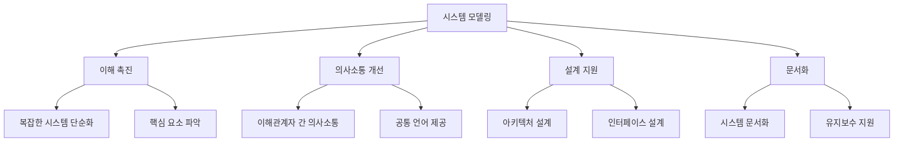
```mermaid
graph TD
    A[시스템 모델링] --> B[이해 촉진]
    A --> C[의사소통 개선]
    A --> D[설계 지원]
    A --> E[문서화]

    B --> B1[복잡한 시스템 단순화]
    B --> B2[핵심 요소 파악]

    C --> C1[이해관계자 간 의사소통]
    C --> C2[공통 언어 제공]

    D --> D1[아키텍처 설계]
    D --> D2[인터페이스 설계]

    E --> E1[시스템 문서화]
    E --> E2[유지보수 지원]
```

#### 모델링의 이점

| 이점 | 설명 | 예시 |
|------|------|------|
| **추상화** | 불필요한 세부사항 제거, 핵심에 집중 | 클래스 다이어그램에서 내부 구현 숨김 |
| **가시화** | 시스템 구조와 동작을 시각적으로 표현 | UML 다이어그램으로 시스템 구조 표현 |
| **분석** | 시스템 특성 분석 및 검증 | 시퀀스 다이어그램으로 성능 분석 |
| **명세** | 시스템 요구사항과 설계 명세 | 유스케이스로 기능 요구사항 명세 |

### 모델의 관점

시스템은 다양한 관점에서 모델링할 수 있습니다:

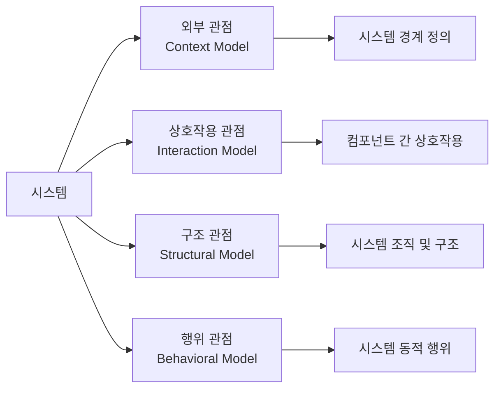
```mermaid
graph LR
    A[시스템] --> B[외부 관점<br/>Context Model]
    A --> C[상호작용 관점<br/>Interaction Model]
    A --> D[구조 관점<br/>Structural Model]
    A --> E[행위 관점<br/>Behavioral Model]

    B --> B1[시스템 경계 정의]
    C --> C1[컴포넌트 간 상호작용]
    D --> D1[시스템 조직 및 구조]
    E --> E1[시스템 동적 행위]
```

### UML (Unified Modeling Language)

**UML**은 시스템 모델링을 위한 표준 표기법입니다.

#### UML 다이어그램 분류

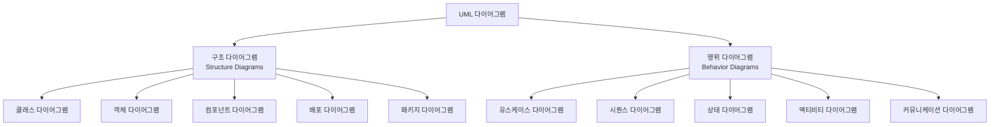
```mermaid
graph TD
    A[UML 다이어그램] --> B[구조 다이어그램<br/>Structure Diagrams]
    A --> C[행위 다이어그램<br/>Behavior Diagrams]

    B --> B1[클래스 다이어그램]
    B --> B2[객체 다이어그램]
    B --> B3[컴포넌트 다이어그램]
    B --> B4[배포 다이어그램]
    B --> B5[패키지 다이어그램]

    C --> C1[유스케이스 다이어그램]
    C --> C2[시퀀스 다이어그램]
    C --> C3[상태 다이어그램]
    C --> C4[액티비티 다이어그램]
    C --> C5[커뮤니케이션 다이어그램]
```

---

## 🌐 컨텍스트 모델

### 컨텍스트 모델이란?

**컨텍스트 모델 (Context Model)**은 시스템의 운영 환경을 나타내며, 시스템과 외부 엔티티 간의 관계를 보여줍니다.

#### 시스템 경계 정의

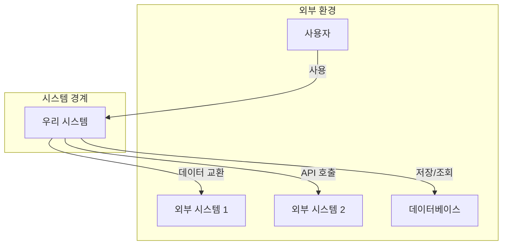
```mermaid
graph TB
    subgraph "외부 환경"
        A[사용자]
        B[외부 시스템 1]
        C[외부 시스템 2]
        D[데이터베이스]
    end

    subgraph "시스템 경계"
        E[우리 시스템]
    end

    A -->|사용| E
    E -->|데이터 교환| B
    E -->|API 호출| C
    E -->|저장/조회| D
```

### 프로세스 관점

**프로세스 관점**은 시스템이 포함된 비즈니스 프로세스를 보여줍니다.

#### 예시: 온라인 쇼핑몰 컨텍스트

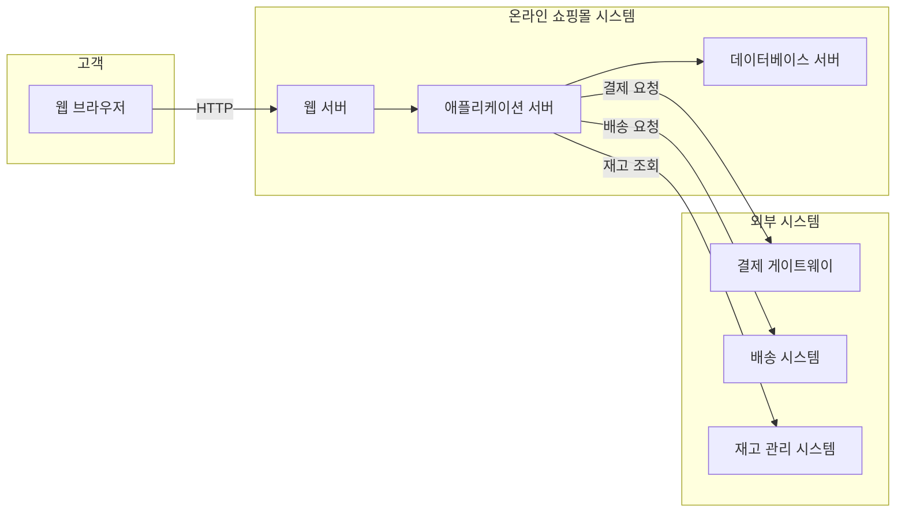
```mermaid
graph LR
    subgraph "고객"
        A[웹 브라우저]
    end

    subgraph "온라인 쇼핑몰 시스템"
        B[웹 서버]
        C[애플리케이션 서버]
        D[데이터베이스 서버]
    end

    subgraph "외부 시스템"
        E[결제 게이트웨이]
        F[배송 시스템]
        G[재고 관리 시스템]
    end

    A -->|HTTP| B
    B --> C
    C --> D
    C -->|결제 요청| E
    C -->|배송 요청| F
    C -->|재고 조회| G
```

### 시스템 경계 결정

시스템 경계를 정의할 때 고려사항:

1. **범위 결정**: 어디까지를 시스템으로 볼 것인가?
2. **인터페이스 식별**: 외부와의 상호작용 지점
3. **책임 분리**: 시스템의 책임과 외부의 책임
4. **의존성 파악**: 외부 시스템에 대한 의존성

---

## 🔄 상호작용 모델

### 상호작용 모델이란?

**상호작용 모델 (Interaction Model)**은 시스템 컴포넌트, 시스템과 환경, 사용자와 시스템 간의 상호작용을 모델링합니다.

### 유스케이스 다이어그램

**유스케이스 다이어그램**은 시스템이 제공하는 기능과 사용자의 상호작용을 나타냅니다.

#### 구성 요소

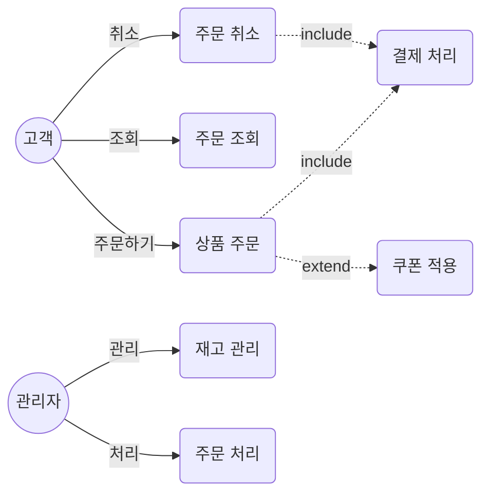
```mermaid
graph LR
    A((고객)) -->|주문하기| B(상품 주문)
    A -->|조회| C(주문 조회)
    A -->|취소| D(주문 취소)

    E((관리자)) -->|관리| F(재고 관리)
    E -->|처리| G(주문 처리)

    B -.->|include| H(결제 처리)
    D -.->|include| H

    B -.->|extend| I(쿠폰 적용)
```

**표기법**:
- **액터 (Actor)**: 막대 인형 `((액터 이름))`
- **유스케이스**: 타원 `(유스케이스 이름)`
- **관계**:
  - 실선: 연관 (Association)
  - 점선 + `<<include>>`: 포함 관계
  - 점선 + `<<extend>>`: 확장 관계

#### 예시: 도서관 시스템

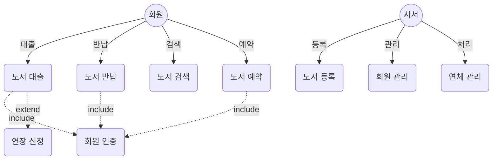
```mermaid
graph TB
    A((회원)) -->|대출| B(도서 대출)
    A -->|반납| C(도서 반납)
    A -->|검색| D(도서 검색)
    A -->|예약| E(도서 예약)

    F((사서)) -->|등록| G(도서 등록)
    F -->|관리| H(회원 관리)
    F -->|처리| I(연체 관리)

    B -.->|include| J(회원 인증)
    C -.->|include| J
    E -.->|include| J

    B -.->|extend| K(연장 신청)
```

### 시퀀스 다이어그램

**시퀀스 다이어그램**은 객체 간의 상호작용을 시간 순서대로 나타냅니다.

#### 기본 구조

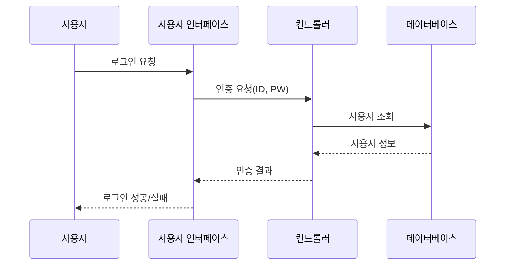
```mermaid
sequenceDiagram
    participant User as 사용자
    participant UI as 사용자 인터페이스
    participant Controller as 컨트롤러
    participant DB as 데이터베이스

    User->>UI: 로그인 요청
    UI->>Controller: 인증 요청(ID, PW)
    Controller->>DB: 사용자 조회
    DB-->>Controller: 사용자 정보
    Controller-->>UI: 인증 결과
    UI-->>User: 로그인 성공/실패
```

#### 예시: 온라인 주문 프로세스

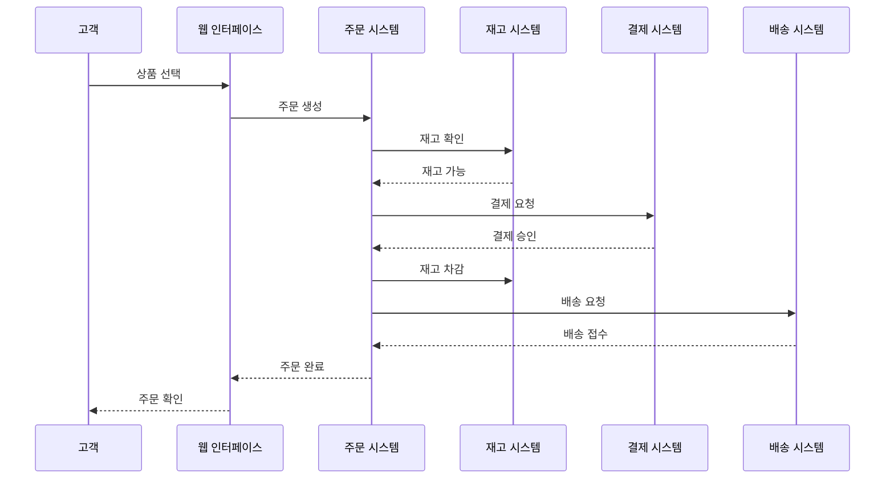
```mermaid
sequenceDiagram
    participant C as 고객
    participant W as 웹 인터페이스
    participant O as 주문 시스템
    participant I as 재고 시스템
    participant P as 결제 시스템
    participant D as 배송 시스템

    C->>W: 상품 선택
    W->>O: 주문 생성
    O->>I: 재고 확인
    I-->>O: 재고 가능
    O->>P: 결제 요청
    P-->>O: 결제 승인
    O->>I: 재고 차감
    O->>D: 배송 요청
    D-->>O: 배송 접수
    O-->>W: 주문 완료
    W-->>C: 주문 확인
```

#### 고급 표기법

**조건 처리**:
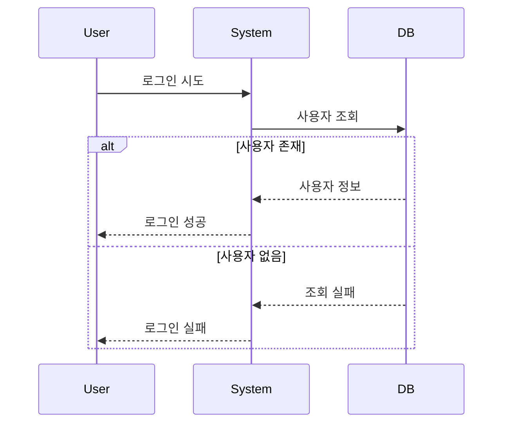
```mermaid
sequenceDiagram
    participant User
    participant System
    participant DB

    User->>System: 로그인 시도
    System->>DB: 사용자 조회

    alt 사용자 존재
        DB-->>System: 사용자 정보
        System-->>User: 로그인 성공
    else 사용자 없음
        DB-->>System: 조회 실패
        System-->>User: 로그인 실패
    end
```

**반복 처리**:
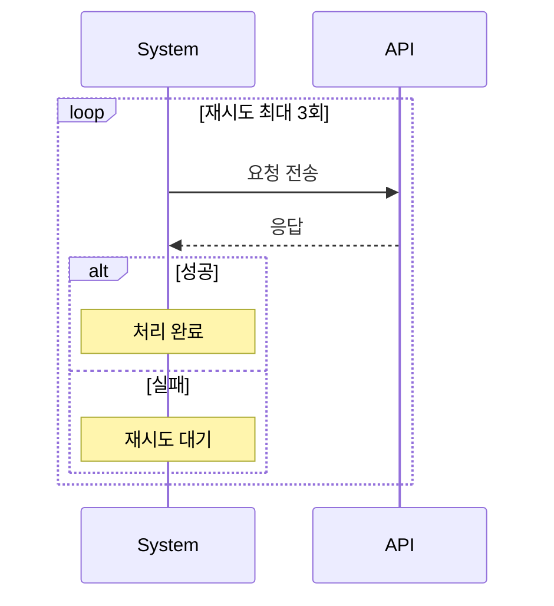
```mermaid
sequenceDiagram
    participant System
    participant API

    loop 재시도 최대 3회
        System->>API: 요청 전송
        API-->>System: 응답

        alt 성공
            Note over System: 처리 완료
        else 실패
            Note over System: 재시도 대기
        end
    end
```

---

## 🏗️ 구조 모델

### 구조 모델이란?

**구조 모델 (Structural Model)**은 시스템의 조직과 아키텍처를 나타내며, 시스템을 구성하는 컴포넌트와 그들 간의 관계를 보여줍니다.

### 클래스 다이어그램

**클래스 다이어그램**은 시스템의 정적 구조를 나타내며, 클래스와 그들 간의 관계를 보여줍니다.

#### 기본 표기법

```
┌─────────────────┐
│   클래스 이름    │
├─────────────────┤
│ - 속성1: 타입   │
│ - 속성2: 타입   │
├─────────────────┤
│ + 메서드1()     │
│ + 메서드2()     │
└─────────────────┘
```

**접근 제어자**:
- `+` : public
- `-` : private
- `#` : protected
- `~` : package

#### 클래스 관계

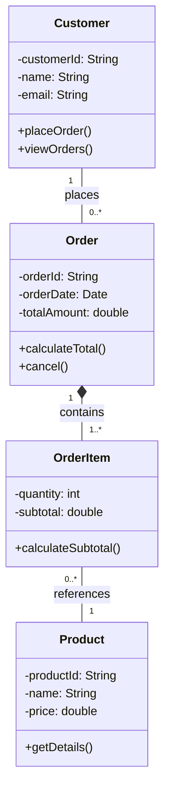
```mermaid
classDiagram
    class Customer {
        -customerId: String
        -name: String
        -email: String
        +placeOrder()
        +viewOrders()
    }

    class Order {
        -orderId: String
        -orderDate: Date
        -totalAmount: double
        +calculateTotal()
        +cancel()
    }

    class Product {
        -productId: String
        -name: String
        -price: double
        +getDetails()
    }

    class OrderItem {
        -quantity: int
        -subtotal: double
        +calculateSubtotal()
    }

    Customer "1" -- "0..*" Order : places
    Order "1" *-- "1..*" OrderItem : contains
    OrderItem "0..*" -- "1" Product : references
```

#### 관계 유형

| 관계 | 표기 | 의미 | 예시 |
|------|------|------|------|
| **연관** | `--` | 일반적인 관계 | Customer -- Order |
| **집약** | `o--` | 부분-전체 (약한 소유) | Department o-- Employee |
| **컴포지션** | `*--` | 부분-전체 (강한 소유) | Order *-- OrderItem |
| **상속** | `<\|--` | 일반화/특수화 | Animal <\|-- Dog |
| **실체화** | `<\|..` | 인터페이스 구현 | Drawable <\|.. Circle |
| **의존** | `..>` | 사용 관계 | Controller ..> Service |

#### 예시: 도서관 시스템 클래스 다이어그램

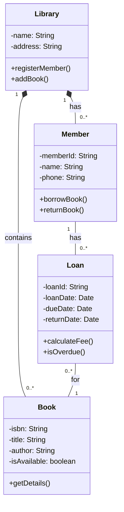
```mermaid
classDiagram
    class Library {
        -name: String
        -address: String
        +registerMember()
        +addBook()
    }

    class Member {
        -memberId: String
        -name: String
        -phone: String
        +borrowBook()
        +returnBook()
    }

    class Book {
        -isbn: String
        -title: String
        -author: String
        -isAvailable: boolean
        +getDetails()
    }

    class Loan {
        -loanId: String
        -loanDate: Date
        -dueDate: Date
        -returnDate: Date
        +calculateFee()
        +isOverdue()
    }

    Library "1" *-- "0..*" Member : has
    Library "1" *-- "0..*" Book : contains
    Member "1" -- "0..*" Loan : has
    Loan "0..*" -- "1" Book : for
```

### 컴포넌트 다이어그램

**컴포넌트 다이어그램**은 시스템의 물리적 구조를 나타내며, 컴포넌트 간의 의존성을 보여줍니다.

#### 예시: 웹 애플리케이션 아키텍처

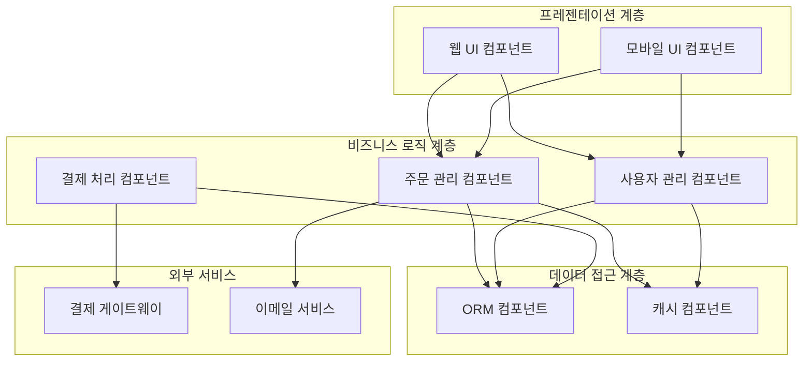
```mermaid
graph TB
    subgraph "프레젠테이션 계층"
        A[웹 UI 컴포넌트]
        B[모바일 UI 컴포넌트]
    end

    subgraph "비즈니스 로직 계층"
        C[주문 관리 컴포넌트]
        D[사용자 관리 컴포넌트]
        E[결제 처리 컴포넌트]
    end

    subgraph "데이터 접근 계층"
        F[ORM 컴포넌트]
        G[캐시 컴포넌트]
    end

    subgraph "외부 서비스"
        H[결제 게이트웨이]
        I[이메일 서비스]
    end

    A --> C
    A --> D
    B --> C
    B --> D

    C --> F
    D --> F
    E --> F

    C --> G
    D --> G

    E --> H
    C --> I
```

### 배포 다이어그램

**배포 다이어그램**은 시스템의 하드웨어 토폴로지와 소프트웨어 컴포넌트의 배치를 보여줍니다.

#### 예시: 3-Tier 아키텍처 배포

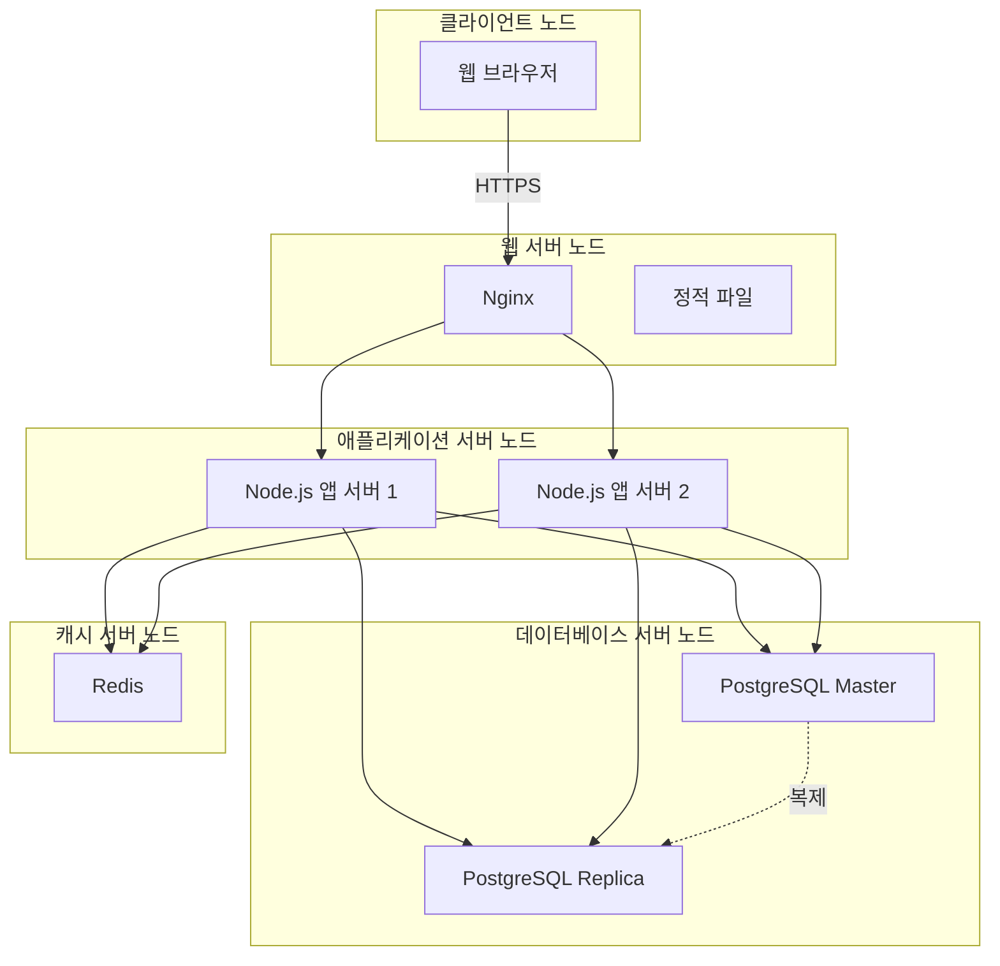
```mermaid
graph TB
    subgraph "클라이언트 노드"
        A[웹 브라우저]
    end

    subgraph "웹 서버 노드"
        B[Nginx]
        C[정적 파일]
    end

    subgraph "애플리케이션 서버 노드"
        D[Node.js 앱 서버 1]
        E[Node.js 앱 서버 2]
    end

    subgraph "데이터베이스 서버 노드"
        F[PostgreSQL Master]
        G[PostgreSQL Replica]
    end

    subgraph "캐시 서버 노드"
        H[Redis]
    end

    A -->|HTTPS| B
    B --> D
    B --> E
    D --> F
    E --> F
    D --> G
    E --> G
    D --> H
    E --> H
    F -.->|복제| G
```

---

## 📊 행위 모델

### 행위 모델이란?

**행위 모델 (Behavioral Model)**은 시스템의 동적인 행위를 나타내며, 시스템이 이벤트에 어떻게 반응하는지 보여줍니다.

### 상태 다이어그램

**상태 다이어그램 (State Diagram)**은 객체의 생명주기 동안 상태 변화를 나타냅니다.

#### 기본 구성 요소

- **상태 (State)**: 둥근 사각형
- **전이 (Transition)**: 화살표
- **이벤트 (Event)**: 전이를 유발하는 사건
- **초기 상태**: 검은 원
- **최종 상태**: 이중 테두리 원

#### 예시: 주문 상태 다이어그램

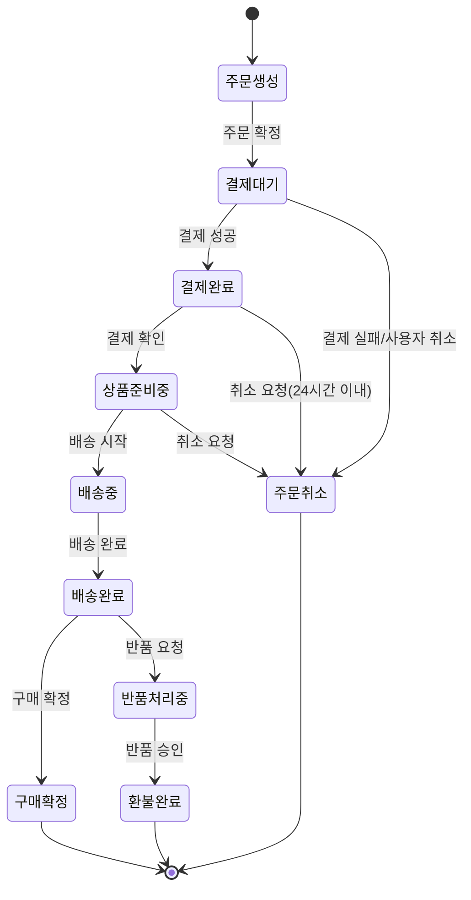
```mermaid
stateDiagram-v2
    [*] --> 주문생성
    주문생성 --> 결제대기 : 주문 확정
    결제대기 --> 결제완료 : 결제 성공
    결제대기 --> 주문취소 : 결제 실패/사용자 취소
    결제완료 --> 상품준비중 : 결제 확인
    상품준비중 --> 배송중 : 배송 시작
    배송중 --> 배송완료 : 배송 완료
    배송완료 --> 구매확정 : 구매 확정
    구매확정 --> [*]

    결제완료 --> 주문취소 : 취소 요청(24시간 이내)
    상품준비중 --> 주문취소 : 취소 요청
    배송완료 --> 반품처리중 : 반품 요청
    반품처리중 --> 환불완료 : 반품 승인
    환불완료 --> [*]
    주문취소 --> [*]
```

#### 복합 상태 (Composite State)

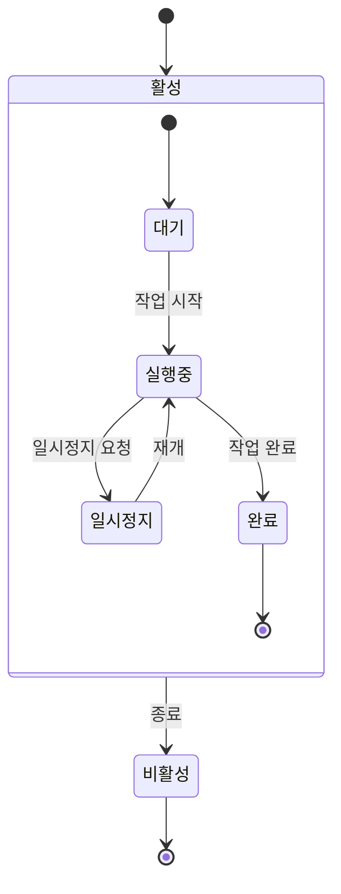
```mermaid
stateDiagram-v2
    [*] --> 활성

    state 활성 {
        [*] --> 대기
        대기 --> 실행중 : 작업 시작
        실행중 --> 일시정지 : 일시정지 요청
        일시정지 --> 실행중 : 재개
        실행중 --> 완료 : 작업 완료
        완료 --> [*]
    }

    활성 --> 비활성 : 종료
    비활성 --> [*]
```

### 액티비티 다이어그램

**액티비티 다이어그램 (Activity Diagram)**은 워크플로우나 비즈니스 프로세스를 나타냅니다.

#### 예시: 주문 처리 프로세스

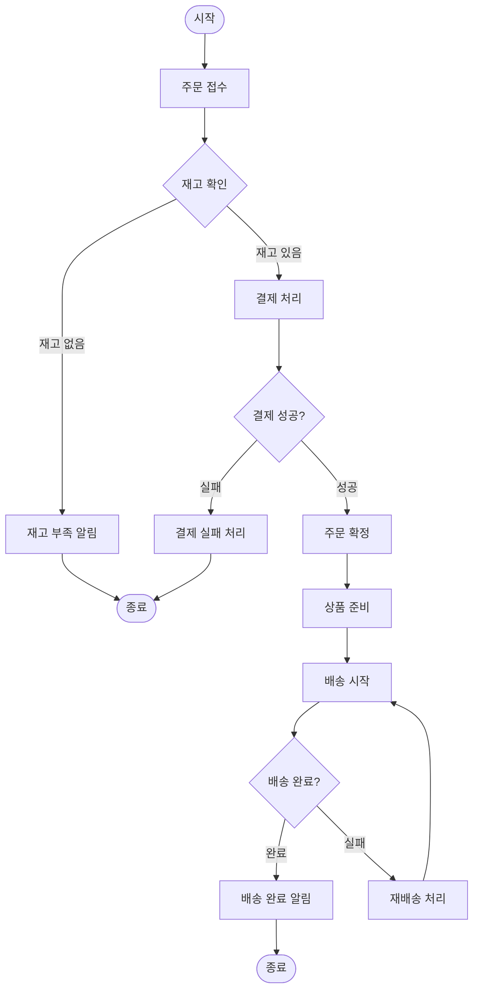
```mermaid
graph TD
    A([시작]) --> B[주문 접수]
    B --> C{재고 확인}
    C -->|재고 있음| D[결제 처리]
    C -->|재고 없음| E[재고 부족 알림]
    E --> F([종료])

    D --> G{결제 성공?}
    G -->|성공| H[주문 확정]
    G -->|실패| I[결제 실패 처리]
    I --> F

    H --> J[상품 준비]
    J --> K[배송 시작]
    K --> L{배송 완료?}
    L -->|완료| M[배송 완료 알림]
    L -->|실패| N[재배송 처리]
    N --> K

    M --> O([종료])
```

#### 병렬 처리 (Fork/Join)

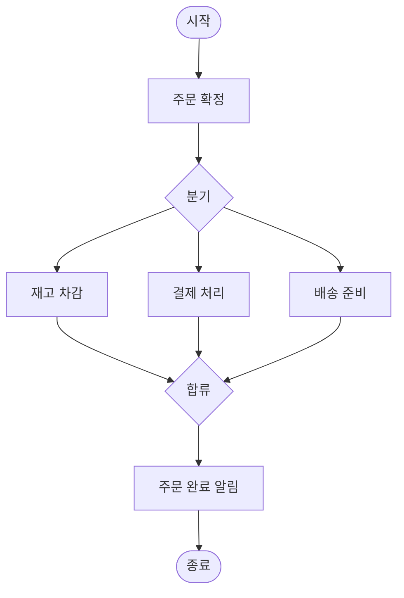
```mermaid
graph TD
    A([시작]) --> B[주문 확정]
    B --> C{분기}

    C --> D[재고 차감]
    C --> E[결제 처리]
    C --> F[배송 준비]

    D --> G{합류}
    E --> G
    F --> G

    G --> H[주문 완료 알림]
    H --> I([종료])
```

#### 스윔레인 (Swimlane)

액티비티를 담당자별로 구분하여 표현:

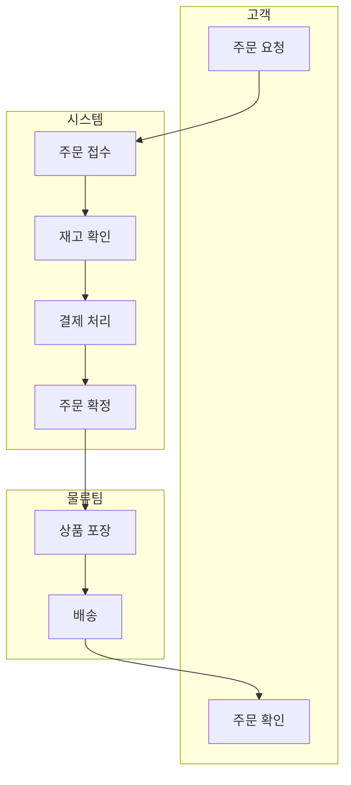
```mermaid
graph TB
    subgraph "고객"
        A[주문 요청]
        H[주문 확인]
    end

    subgraph "시스템"
        B[주문 접수]
        C[재고 확인]
        D[결제 처리]
        E[주문 확정]
    end

    subgraph "물류팀"
        F[상품 포장]
        G[배송]
    end

    A --> B
    B --> C
    C --> D
    D --> E
    E --> F
    F --> G
    G --> H
```

---

## 🚀 모델 기반 공학

### 모델 주도 개발 (MDD)

**모델 주도 개발 (Model-Driven Development)**은 모델을 소프트웨어 개발의 중심에 두는 접근 방식입니다.

#### MDD 프로세스

```mermaid
graph LR
    A[요구사항] --> B[플랫폼 독립 모델<br/>PIM]
    B --> C[플랫폼 특정 모델<br/>PSM]
    C --> D[코드 생성]
    D --> E[실행 가능한<br/>시스템]

    B -.->|변환 규칙| C
    C -.->|코드 생성 규칙| D
```

#### MDA (Model-Driven Architecture)

**MDA**는 OMG의 MDD 표준 접근 방식입니다:

| 모델 레벨 | 설명 | 예시 |
|-----------|------|------|
| **CIM** (Computation Independent Model) | 비즈니스 모델, 도메인 모델 | 비즈니스 프로세스 다이어그램 |
| **PIM** (Platform Independent Model) | 플랫폼 독립적 설계 모델 | UML 클래스 다이어그램 |
| **PSM** (Platform Specific Model) | 특정 플랫폼에 맞춘 모델 | Java 클래스 모델, SQL 스키마 |
| **코드** | 실제 구현 코드 | Java 소스 코드, SQL DDL |

### 모델 변환

모델 간 변환을 통한 자동화:

```mermaid
graph TD
    A[UML 클래스 다이어그램<br/>PIM] --> B[Java 클래스 모델<br/>PSM]
    A --> C[데이터베이스 스키마<br/>PSM]

    B --> D[Java 소스 코드]
    C --> E[SQL DDL]

    B -.->|변환 규칙 1| D
    C -.->|변환 규칙 2| E
```

### 모델 기반 공학의 장단점

#### 장점

1. **생산성 향상**
   - 자동 코드 생성으로 개발 시간 단축
   - 반복적인 작업 자동화

2. **품질 향상**
   - 모델 수준에서 검증 가능
   - 일관성 유지

3. **유지보수성**
   - 모델 수정만으로 코드 재생성
   - 문서화 자동화

4. **플랫폼 독립성**
   - 다양한 플랫폼으로 변환 가능
   - 기술 변화에 대응 용이

#### 단점

1. **초기 투자 비용**
   - 도구 및 교육 비용
   - 변환 규칙 개발 비용

2. **복잡성**
   - 모델 변환 규칙의 복잡성
   - 도구 학습 곡선

3. **제한사항**
   - 자동 생성 코드의 한계
   - 세밀한 최적화 어려움

---

## 📝 요약

### 핵심 개념 정리

```mermaid
mindmap
  root((시스템 모델))
    컨텍스트 모델
      시스템 경계 정의
      외부 환경과의 관계
    상호작용 모델
      유스케이스 다이어그램
      시퀀스 다이어그램
    구조 모델
      클래스 다이어그램
      컴포넌트 다이어그램
      배포 다이어그램
    행위 모델
      상태 다이어그램
      액티비티 다이어그램
    모델 기반 공학
      MDD/MDA
      모델 변환
      자동 코드 생성
```

### 모델 선택 가이드

| 목적 | 추천 모델 | 활용 시나리오 |
|------|-----------|---------------|
| **시스템 범위 정의** | 컨텍스트 모델 | 프로젝트 초기, 이해관계자 파악 |
| **기능 요구사항** | 유스케이스 다이어그램 | 요구사항 수집 및 명세 |
| **시스템 구조** | 클래스 다이어그램 | 설계 단계, 아키텍처 정의 |
| **동적 행위** | 시퀀스 다이어그램 | 상세 설계, 성능 분석 |
| **상태 관리** | 상태 다이어그램 | 복잡한 상태를 가진 객체 설계 |
| **프로세스 흐름** | 액티비티 다이어그램 | 비즈니스 프로세스 분석 |
| **물리적 배치** | 배포 다이어그램 | 시스템 배포 계획 |

### 실무 적용 팁

1. **적절한 모델 선택**
   - 목적에 맞는 모델 사용
   - 과도한 모델링 지양

2. **점진적 상세화**
   - 초기에는 간단한 모델로 시작
   - 필요에 따라 점진적으로 상세화

3. **일관성 유지**
   - 모델 간 일관성 검증
   - 명명 규칙 준수

4. **도구 활용**
   - UML 도구 활용 (StarUML, PlantUML, Draw.io)
   - 버전 관리 시스템 통합

5. **문서화**
   - 모델에 대한 설명 추가
   - 가정과 제약사항 명시

---

## 🔗 참고 자료

- **UML 공식 문서**: [OMG UML Specification](https://www.omg.org/spec/UML/)
- **도구**:
  - [StarUML](https://staruml.io/)
  - [PlantUML](https://plantuml.com/)
  - [Draw.io](https://www.drawio.com/)
  - [Lucidchart](https://www.lucidchart.com/)
- **서적**:
  - "UML Distilled" - Martin Fowler
  - "Applying UML and Patterns" - Craig Larman

---

> 다음 포스트에서는 **UML Part 1**을 다룰 예정입니다. UML의 구조 다이어그램을 더 깊이 있게 학습합니다.
