## 📋 목차
1. [UML 개요](#uml-개요)
2. [클래스 다이어그램 심화](#클래스-다이어그램-심화)
3. [객체 다이어그램](#객체-다이어그램)
4. [패키지 다이어그램](#패키지-다이어그램)
5. [컴포넌트 다이어그램](#컴포넌트-다이어그램)
6. [배포 다이어그램](#배포-다이어그램)

---

## 🎯 학습 목표

이 포스트를 통해 다음을 이해할 수 있습니다:
- **UML의 역사와 표준화 과정**
- **구조 다이어그램의 상세한 표기법**
- **클래스 다이어그램의 고급 기능**
- **시스템 아키텍처 모델링 기법**

---

## 🔍 UML 개요

### UML이란?

**UML (Unified Modeling Language)**은 시스템을 시각화, 명세, 구축, 문서화하기 위한 표준 모델링 언어입니다.

#### UML의 역사

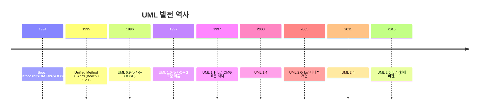

**주요 기여자**:
- **Grady Booch**: Booch Method
- **James Rumbaugh**: OMT (Object Modeling Technique)
- **Ivar Jacobson**: OOSE (Object-Oriented Software Engineering)

### UML 2.5 다이어그램 분류

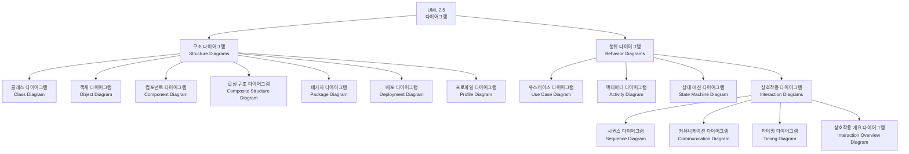

### UML의 목적과 활용

| 목적 | 설명 | 활용 시나리오 |
|------|------|---------------|
| **시각화** | 시스템을 그래픽으로 표현 | 아키텍처 리뷰, 설계 회의 |
| **명세** | 시스템의 구조와 행위 정의 | 상세 설계, 인터페이스 명세 |
| **구축** | 모델로부터 코드 생성 | MDD, 자동 코드 생성 |
| **문서화** | 시스템 이해를 위한 문서 작성 | 유지보수, 지식 전달 |

---

## 📦 클래스 다이어그램 심화

### 클래스 표기법 상세

#### 완전한 클래스 표기

```
┌───────────────────────────────────┐
│         <<stereotype>>             │ ← 스테레오타입
│           ClassName                │ ← 클래스 이름
├───────────────────────────────────┤
│ + publicAttribute: Type            │
│ - privateAttribute: Type           │
│ # protectedAttribute: Type         │ ← 속성
│ ~ packageAttribute: Type           │
│ / derivedAttribute: Type           │
├───────────────────────────────────┤
│ + publicMethod(): ReturnType       │
│ - privateMethod(param: Type): Type │ ← 메서드
│ # protectedMethod(): void          │
│ {abstract} abstractMethod()        │
└───────────────────────────────────┘
```

#### 가시성 (Visibility)

| 기호 | 가시성 | 접근 범위 |
|------|--------|-----------|
| `+` | public | 모든 클래스 |
| `-` | private | 자신의 클래스만 |
| `#` | protected | 자신과 자식 클래스 |
| `~` | package | 같은 패키지 내 |

#### 속성 표기법

**전체 구문**:
```
visibility name: type [multiplicity] = defaultValue {property-string}
```

**예시**:
```
+ name: String
- age: int = 0
# scores: double[*] = {}
~ address: Address [0..1]
/ fullName: String {readOnly}
```

#### 메서드 표기법

**전체 구문**:
```
visibility name(parameter-list): return-type {property-string}
```

**예시**:
```
+ getName(): String
- calculateAge(birthYear: int): int
# validate(): boolean {abstract}
~ toString(): String {query}
```

### 관계 (Relationships) 심화

#### 1. 연관 (Association)

**일반 연관**:
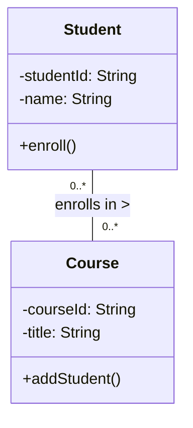

**단방향 연관**:
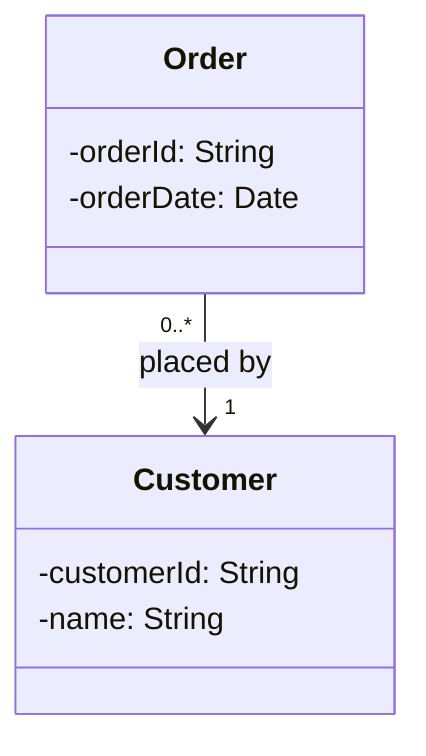

**양방향 연관**:
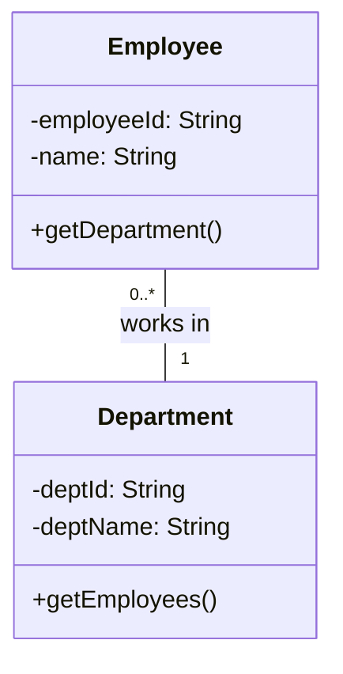

#### 연관 클래스 (Association Class)

다대다 관계에서 추가 정보를 저장할 때 사용:

```mermaid
classDiagram
    class Student {
        -studentId: String
        -name: String
    }

    class Course {
        -courseId: String
        -title: String
    }

    class Enrollment {
        -enrollDate: Date
        -grade: String
        -semester: String
        +getGrade()
        +setGrade()
    }

    Student "0..*" -- "0..*" Course
    (Student, Course) .. Enrollment
```

#### 2. 집약 (Aggregation) vs 컴포지션 (Composition)

**집약 (Aggregation)**: 부분이 전체와 독립적으로 존재 가능

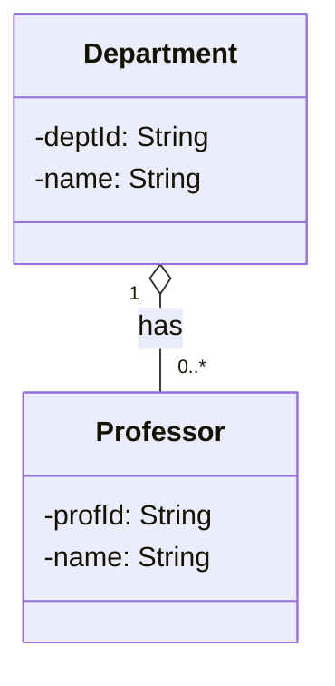
- Department가 삭제되어도 Professor는 존재 가능
- "has-a" 관계 (약한 소유)

**컴포지션 (Composition)**: 부분이 전체에 종속적

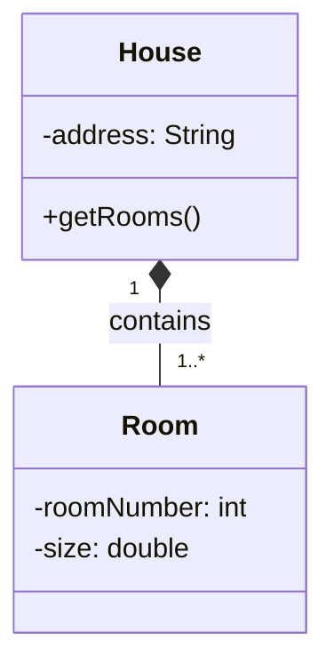
- House가 삭제되면 Room도 함께 삭제
- "part-of" 관계 (강한 소유)

#### 3. 일반화 (Generalization) - 상속

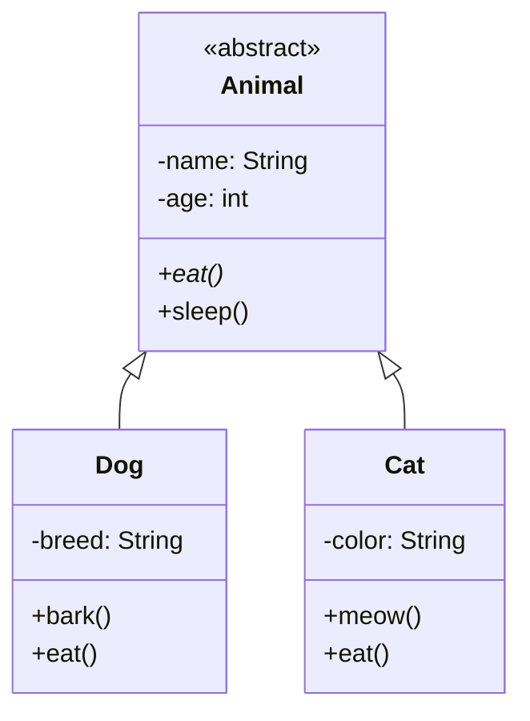

**추상 클래스와 구체 클래스**:
- **추상 클래스**: `<<abstract>>` 또는 이름을 이탤릭체로 표기
- **추상 메서드**: `{abstract}` 또는 이름을 이탤릭체로 표기

#### 4. 실체화 (Realization) - 인터페이스 구현

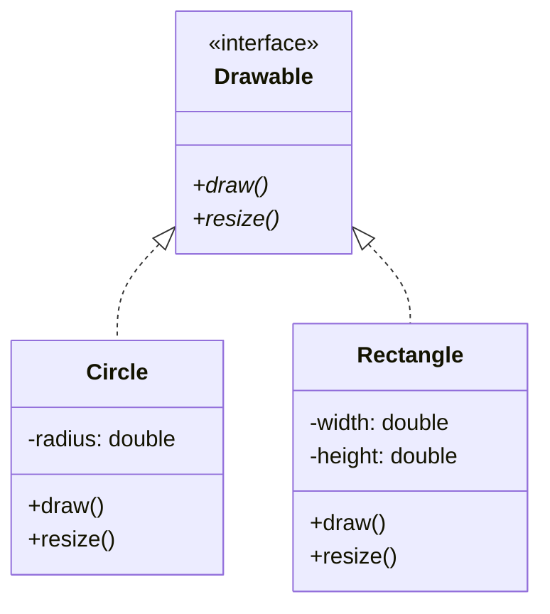

#### 5. 의존 (Dependency)

한 클래스가 다른 클래스를 사용하지만 속성으로 가지지 않음:

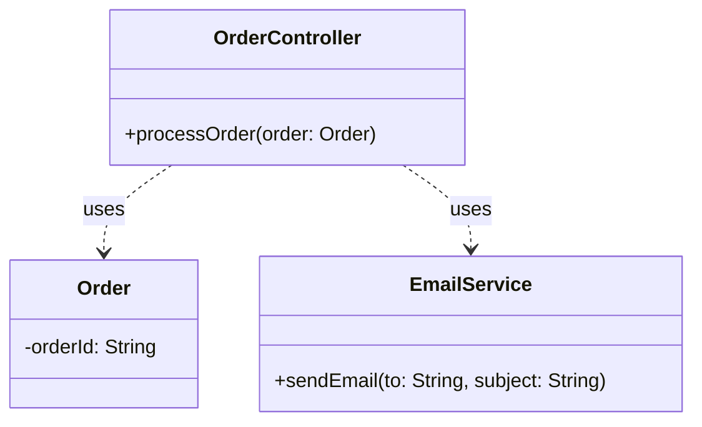

### 다중성 (Multiplicity)

| 표기 | 의미 | 예시 |
|------|------|------|
| `1` | 정확히 1개 | 주문은 정확히 1명의 고객이 함 |
| `0..1` | 0개 또는 1개 | 학생은 0개 또는 1개의 사물함을 가짐 |
| `0..*` 또는 `*` | 0개 이상 | 부서는 0명 이상의 직원을 가짐 |
| `1..*` | 1개 이상 | 회사는 최소 1명 이상의 직원을 가짐 |
| `m..n` | m개부터 n개 | 팀은 5~10명의 멤버를 가짐 |

### 제약 조건 (Constraints)

중괄호 `{}` 안에 제약 조건을 명시:

```mermaid
classDiagram
    class Person {
        -birthDate: Date
        -deathDate: Date
        {birthDate < deathDate}
    }

    class BankAccount {
        -balance: double
        {balance >= 0}
    }
```

**표준 제약 조건**:
- `{readOnly}`: 읽기 전용
- `{ordered}`: 순서가 있음
- `{unique}`: 유일함
- `{subset}`: 부분집합
- `{xor}`: 배타적 선택

### 스테레오타입 (Stereotypes)

클래스의 특별한 의미를 나타냄:

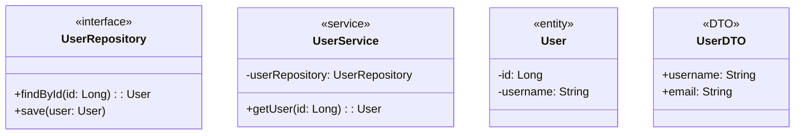

**일반적인 스테레오타입**:
- `<<interface>>`: 인터페이스
- `<<abstract>>`: 추상 클래스
- `<<entity>>`: 데이터베이스 엔티티
- `<<service>>`: 비즈니스 로직 서비스
- `<<controller>>`: 컨트롤러
- `<<repository>>`: 데이터 접근 계층
- `<<DTO>>`: 데이터 전송 객체

### 실전 예시: 온라인 쇼핑몰 시스템

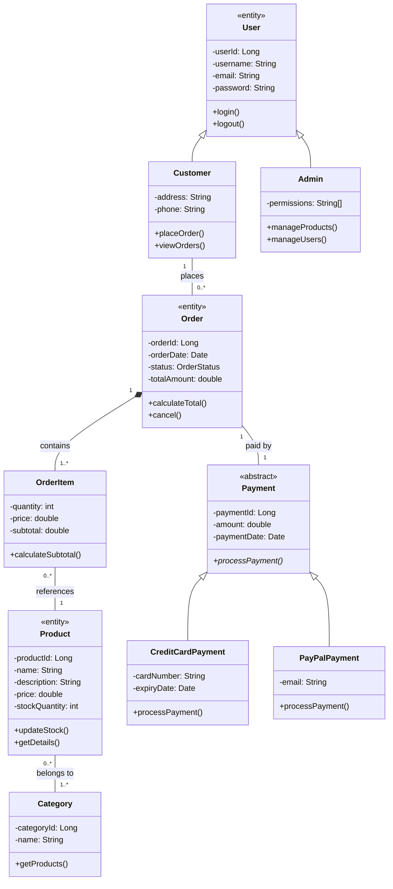

---

## 🎨 객체 다이어그램

### 객체 다이어그램이란?

**객체 다이어그램 (Object Diagram)**은 특정 시점의 시스템 인스턴스를 보여주는 스냅샷입니다.

#### 클래스 다이어그램 vs 객체 다이어그램

| 구분 | 클래스 다이어그램 | 객체 다이어그램 |
|------|-------------------|-----------------|
| **표현** | 클래스 (타입) | 객체 (인스턴스) |
| **시점** | 정적 구조 | 특정 시점의 상태 |
| **목적** | 시스템 설계 | 실행 시나리오 설명 |
| **표기** | 클래스 이름 | 객체이름:클래스이름 (밑줄) |

### 객체 표기법

```
┌────────────────────────┐
│ objectName:ClassName   │ ← 밑줄 표시
├────────────────────────┤
│ attribute1 = value1    │ ← 실제 값
│ attribute2 = value2    │
└────────────────────────┘
```

### 예시: 대학교 시스템

**클래스 다이어그램**:
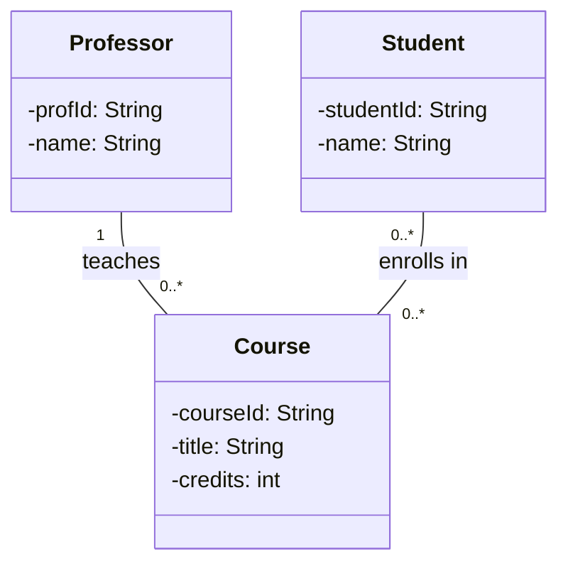

**객체 다이어그램** (2025년 1학기 시나리오):
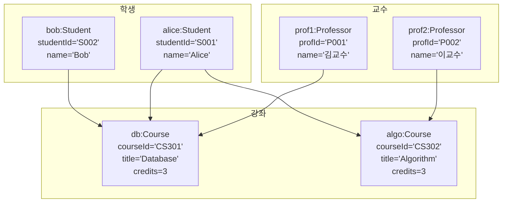

### 활용 시나리오

1. **테스트 케이스 설명**
   - 특정 테스트 시나리오의 초기 상태 표현
   - 예상 결과 상태 표현

2. **디자인 패턴 설명**
   - 패턴 적용 후 객체 구조 시각화
   - 객체 간 협력 관계 명시

3. **복잡한 관계 설명**
   - 다대다 관계의 구체적 예시
   - 재귀적 관계의 실제 인스턴스

---

## 📦 패키지 다이어그램

### 패키지란?

**패키지 (Package)**는 관련된 요소들을 그룹화하는 네임스페이스입니다.

#### 패키지 표기법

```
┌─────────────────┐
│ 📦 PackageName  │
└─────────────────┘

또는

┌───────────────────────┐
│ 📦 PackageName        │
├───────────────────────┤
│ + PublicClass         │
│ - PrivateClass        │
└───────────────────────┘
```

### 패키지 간 관계

#### 1. 의존 (Dependency)

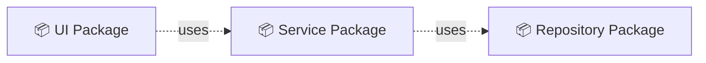

#### 2. 임포트 (Import)

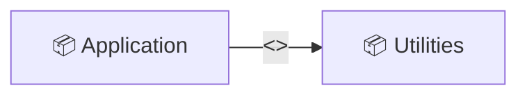

#### 3. 병합 (Merge)

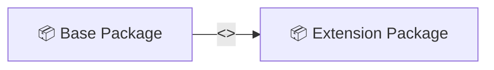

### 예시: 레이어드 아키텍처

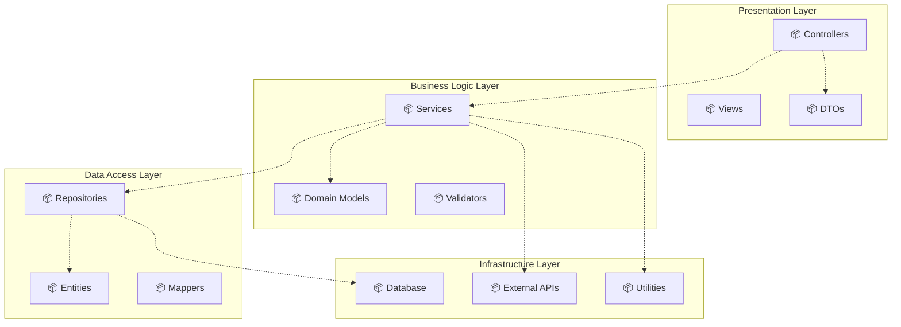

### 패키지 설계 원칙

#### 1. Common Closure Principle (CCP)
같이 변경되는 클래스들을 같은 패키지에 배치

#### 2. Common Reuse Principle (CRP)
함께 재사용되는 클래스들을 같은 패키지에 배치

#### 3. Acyclic Dependencies Principle (ADP)
패키지 의존성 그래프에 순환이 없어야 함

```mermaid
graph LR
    A[📦 Package A] --> B[📦 Package B]
    B --> C[📦 Package C]
    C -.->|❌ 순환 의존| A

    style C fill:#ffcccc
```

#### 4. Stable Dependencies Principle (SDP)
안정적인 패키지에 의존해야 함

#### 5. Stable Abstractions Principle (SAP)
패키지의 추상화 정도는 안정성에 비례해야 함

---

## 🔧 컴포넌트 다이어그램

### 컴포넌트란?

**컴포넌트 (Component)**는 시스템의 모듈화된 부분으로, 잘 정의된 인터페이스를 통해 다른 컴포넌트와 상호작용합니다.

#### 컴포넌트 표기법

```
┌───────────────────────┐
│  ⚙️ ComponentName     │
└───────────────────────┘

또는

┌───────────────────────┐
│ <<component>>         │
│  ComponentName        │
└───────────────────────┘
```

### 인터페이스 표기

#### 제공 인터페이스 (Provided Interface)

```
   ┌─────────┐
   │Component│
   └────○────┘
        │
        └─── IInterface (제공)
```

#### 요구 인터페이스 (Required Interface)

```
   ┌─────────┐
   │Component│
   └────◐────┘
        │
        └─── IInterface (요구)
```

### 예시: 웹 애플리케이션 아키텍처

```mermaid
graph TB
    subgraph "Frontend Components"
        A[⚙️ Web UI]
        B[⚙️ Mobile UI]
    end

    subgraph "Backend Components"
        C[⚙️ API Gateway]
        D[⚙️ Auth Service]
        E[⚙️ Order Service]
        F[⚙️ Product Service]
    end

    subgraph "Data Components"
        G[⚙️ User DB]
        H[⚙️ Order DB]
        I[⚙️ Product DB]
    end

    subgraph "External Components"
        J[⚙️ Payment Gateway]
        K[⚙️ Email Service]
    end

    A -->|HTTP| C
    B -->|HTTP| C
    C --> D
    C --> E
    C --> F

    D --> G
    E --> H
    F --> I

    E --> J
    E --> K
```

### 컴포넌트 상세 설계

```mermaid
graph LR
    A[⚙️ OrderService] -->|provides| B((IOrderManagement))
    A -->|requires| C((IPaymentProcessor))
    A -->|requires| D((IInventoryService))

    E[⚙️ PaymentService] -->|provides| C
    F[⚙️ InventoryService] -->|provides| D
```

### 포트와 어댑터 (Hexagonal Architecture)

```mermaid
graph TB
    subgraph "Core Domain"
        A[⚙️ Business Logic]
    end

    subgraph "Inbound Ports"
        B1[📥 HTTP Port]
        B2[📥 Message Port]
    end

    subgraph "Outbound Ports"
        C1[📤 Database Port]
        C2[📤 Email Port]
    end

    subgraph "Adapters"
        D1[REST Controller]
        D2[Kafka Consumer]
        E1[PostgreSQL Adapter]
        E2[SMTP Adapter]
    end

    D1 --> B1
    D2 --> B2
    B1 --> A
    B2 --> A

    A --> C1
    A --> C2
    C1 --> E1
    C2 --> E2
```

---

## 🌐 배포 다이어그램

### 배포 다이어그램이란?

**배포 다이어그램 (Deployment Diagram)**은 시스템의 물리적 아키텍처를 나타내며, 하드웨어 노드와 소프트웨어 아티팩트의 배치를 보여줍니다.

### 주요 요소

#### 1. 노드 (Node)

**하드웨어 또는 실행 환경**:
```
┌───────────────┐
│  <<device>>   │
│   NodeName    │
└───────────────┘

또는

┌───────────────┐
│ <<execution   │
│  environment>>│
│   NodeName    │
└───────────────┘
```

#### 2. 아티팩트 (Artifact)

**배포 가능한 소프트웨어 조각**:
```
┌───────────────┐
│ <<artifact>>  │
│ ArtifactName  │
└───────────────┘
```

#### 3. 통신 경로 (Communication Path)

노드 간 네트워크 연결:
```
Node1 -------- Node2
      protocol
```

### 예시: 3-Tier 웹 애플리케이션

```mermaid
graph TB
    subgraph "Client Tier"
        A[💻 User's Browser<br/><<device>>]
    end

    subgraph "Web Tier - DMZ"
        B[🖥️ Web Server 1<br/><<device>>]
        C[🖥️ Web Server 2<br/><<device>>]
        D[⚖️ Load Balancer<br/><<device>>]
    end

    subgraph "Application Tier - Internal Network"
        E[🖥️ App Server 1<br/><<device>>]
        F[🖥️ App Server 2<br/><<device>>]
    end

    subgraph "Data Tier - Secure Network"
        G[💾 DB Server Master<br/><<device>>]
        H[💾 DB Server Replica<br/><<device>>]
        I[💾 Cache Server<br/><<device>>]
    end

    A -->|HTTPS| D
    D -->|HTTP| B
    D -->|HTTP| C
    B -->|RPC| E
    B -->|RPC| F
    C -->|RPC| E
    C -->|RPC| F

    E -->|JDBC| G
    F -->|JDBC| G
    E -->|TCP| I
    F -->|TCP| I
    G -.->|Replication| H
```

### 클라우드 배포 아키텍처

```mermaid
graph TB
    subgraph "AWS Cloud"
        subgraph "VPC - Region: us-east-1"
            subgraph "Public Subnet - AZ1"
                A[🔒 NAT Gateway]
                B[⚖️ Application Load Balancer]
            end

            subgraph "Private Subnet - AZ1"
                C[🖥️ EC2 Instance 1<br/>App Server]
                D[🖥️ EC2 Instance 2<br/>Worker]
            end

            subgraph "Private Subnet - AZ2"
                E[🖥️ EC2 Instance 3<br/>App Server]
                F[🖥️ EC2 Instance 4<br/>Worker]
            end

            subgraph "Database Subnet"
                G[💾 RDS Primary<br/>PostgreSQL]
                H[💾 RDS Standby<br/>PostgreSQL]
                I[💾 ElastiCache<br/>Redis]
            end
        end

        J[📦 S3 Bucket<br/>Static Assets]
        K[📧 SES<br/>Email Service]
    end

    L[👥 Users] -->|HTTPS| B
    B --> C
    B --> E
    C --> G
    E --> G
    C --> I
    E --> I
    D --> G
    F --> G
    G -.->|Async Replication| H

    C --> J
    E --> J
    D --> K
    F --> K
```

### 아티팩트 배포 상세

```mermaid
graph TB
    subgraph "Application Server"
        A[🖥️ Ubuntu 20.04 LTS]

        subgraph "Artifacts"
            B[📦 app.jar<br/><<artifact>>]
            C[⚙️ JRE 17<br/><<execution env>>]
            D[📄 application.yml<br/><<artifact>>]
        end
    end

    subgraph "Database Server"
        E[🖥️ CentOS 8]

        subgraph "Artifacts"
            F[💾 PostgreSQL 14<br/><<execution env>>]
            G[📄 pg_hba.conf<br/><<artifact>>]
        end
    end

    C --> B
    A --> C
    E --> F

    B -.->|JDBC| F
```

### 배포 제약 조건

배포 다이어그램에 제약 조건을 명시할 수 있습니다:

```mermaid
graph TB
    A[🖥️ Web Server<br/>{OS = Linux}<br/>{RAM >= 8GB}<br/>{CPU >= 4 cores}]
    B[💾 DB Server<br/>{OS = Linux}<br/>{RAM >= 32GB}<br/>{Storage >= 1TB}<br/>{RAID = 10}]
    C[💾 Cache Server<br/>{RAM >= 16GB}<br/>{Network = 10Gbps}]

    A --> B
    A --> C
```

---

## 📝 요약

### 구조 다이어그램 비교

| 다이어그램 | 목적 | 주요 용도 | 상세 수준 |
|-----------|------|-----------|----------|
| **클래스** | 시스템 정적 구조 | 상세 설계, 코드 생성 | 높음 |
| **객체** | 런타임 인스턴스 | 시나리오 설명, 테스트 | 높음 |
| **패키지** | 논리적 그룹화 | 아키텍처 구성, 의존성 관리 | 중간 |
| **컴포넌트** | 모듈화 구조 | 시스템 분해, 재사용 | 중간 |
| **배포** | 물리적 아키텍처 | 인프라 설계, 배포 계획 | 낮음 |

### 다이어그램 선택 가이드

```mermaid
graph TD
    A{무엇을 표현하고 싶은가?} -->|클래스 구조와 관계| B[클래스 다이어그램]
    A -->|특정 시점의 객체 상태| C[객체 다이어그램]
    A -->|시스템 모듈 구조| D{논리적? 물리적?}
    A -->|배포 환경| E[배포 다이어그램]

    D -->|논리적 그룹화| F[패키지 다이어그램]
    D -->|물리적 모듈| G[컴포넌트 다이어그램]

    B --> H[상세 설계 단계]
    C --> I[테스트/디버깅]
    F --> J[아키텍처 설계]
    G --> K[시스템 분해]
    E --> L[배포 계획]
```

### 실무 적용 팁

1. **점진적 상세화**
   - 초기: 패키지/컴포넌트 다이어그램으로 큰 그림
   - 중기: 클래스 다이어그램으로 상세 설계
   - 후기: 객체 다이어그램으로 시나리오 검증

2. **적절한 추상화 수준**
   - 모든 속성/메서드를 표시하지 않음
   - 목적에 맞는 정보만 포함

3. **일관성 유지**
   - 명명 규칙 준수
   - 스테레오타입 일관성
   - 다이어그램 간 정합성

4. **도구 활용**
   - **설계 도구**: StarUML, Enterprise Architect, Visual Paradigm
   - **협업 도구**: Lucidchart, Draw.io, PlantUML
   - **코드 생성**: AndroMDA, Eclipse Modeling Framework

---

## 🔗 참고 자료

- **UML 2.5 Specification**: [OMG Official Spec](https://www.omg.org/spec/UML/2.5/)
- **도구**:
  - [StarUML](https://staruml.io/)
  - [PlantUML](https://plantuml.com/)
  - [Mermaid](https://mermaid-js.github.io/)
- **서적**:
  - "UML Distilled" - Martin Fowler
  - "Applying UML and Patterns" - Craig Larman
  - "Object-Oriented Analysis and Design with Applications" - Grady Booch

---

> 다음 포스트에서는 **Introduction to UML Part 2**를 다룰 예정입니다. 행위 다이어그램(시퀀스, 액티비티, 상태 다이어그램)을 깊이 있게 학습합니다.
