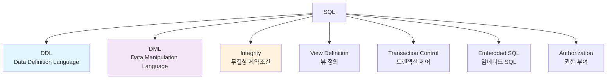

# SQL (Structured Query Language)

한양대학교 데이터베이스시스템및응용 강의의 세 번째 내용으로, SQL의 기본 구조와 핵심 기능들을 자세히 살펴보겠습니다.

## 1. SQL 개요

### 📚 SQL의 구성 요소

**SQL (Structured Query Language)**는 관계형 데이터베이스의 표준 언어로, 다음과 같이 구성됩니다:



### 🏛️ SQL의 역사
- **IBM System R**: 최초의 관계형 DBMS 프로토타입
- **SEQUEL**: SQL의 전신 (Structured English Query Language)
- **표준화**: SQL-86, SQL-89, SQL-92, SQL:1999, SQL:2003, SQL:2008, SQL:2011...

## 2. 데이터 정의 언어 (DDL)

### 🎯 DDL의 목적
**데이터베이스 스키마를 정의하고 관리**하는 언어

### 📊 도메인 타입 (Domain Types)

#### **기본 도메인 타입**
- **char(n)**: 고정 길이 문자열 (n자리)
- **varchar(n)**: 가변 길이 문자열 (최대 n자리)
- **int**: 정수 타입
- **smallint**: 작은 정수 타입
- **numeric(p,d)**: 고정소수점 (전체 p자리, 소수점 이하 d자리)
- **real, double precision**: 부동소수점
- **float(n)**: 최소 n자리 정밀도를 가진 부동소수점

### 🏗️ CREATE TABLE 구문

#### **기본 구문 구조**
```sql
CREATE TABLE r (
    A₁ D₁,
    A₂ D₂,
    ...,
    Aₙ Dₙ,
    <integrity-constraint₁>,
    ...,
    <integrity-constraintₖ>
);
```

#### **실제 예시: 대학 데이터베이스**

```sql
-- 학과 테이블
CREATE TABLE department (
    dept_name    varchar(20),
    building     varchar(15),
    budget       numeric(12,2),
    primary key  (dept_name)
);

-- 교수 테이블
CREATE TABLE instructor (
    ID           char(5),
    name         varchar(20) not null,
    dept_name    varchar(20),
    salary       numeric(8,2),
    primary key  (ID),
    foreign key  (dept_name) references department
);

-- 과목 테이블
CREATE TABLE course (
    course_id    varchar(8),
    title        varchar(50),
    dept_name    varchar(20),
    credits      numeric(2,0) check (credits > 0),
    primary key  (course_id),
    foreign key  (dept_name) references department
);
```

### 🔒 무결성 제약조건 (Integrity Constraints)

#### **기본키 (Primary Key)**
```sql
primary key (A₁, A₂, ..., Aₙ)
```

#### **외래키 (Foreign Key)**
```sql
foreign key (A₁, A₂, ..., Aₙ) references r
```

#### **검사 조건 (Check)**
```sql
check (P)  -- P는 조건식
```

**예시**:
```sql
CREATE TABLE section (
    course_id     varchar(8),
    sec_id        varchar(8),
    semester      varchar(6) check (semester in ('Fall','Winter','Spring','Summer')),
    year          numeric(4,0) check (year > 1701 and year < 2100),
    building      varchar(15),
    room_number   varchar(7),
    time_slot_id  varchar(4),
    primary key   (course_id, sec_id, semester, year),
    foreign key   (course_id) references course
);
```

## 3. 기본 쿼리 구조

### 🎯 SELECT 문의 기본 형태

```sql
SELECT A₁, A₂, ..., Aₙ
FROM r₁, r₂, ..., rₘ
WHERE P;
```

**각 절의 역할**:
- **SELECT**: 결과에 나타날 속성들을 나열
- **FROM**: 쿼리에서 접근할 관계들을 나열  
- **WHERE**: 조건을 만족하는 튜플들만 선택

### 📋 SELECT 절

#### **속성 나열**
```sql
SELECT name, salary
FROM instructor;
```

#### **DISTINCT: 중복 제거**
```sql
-- 중복 포함 (기본값)
SELECT dept_name
FROM instructor;

-- 중복 제거
SELECT DISTINCT dept_name
FROM instructor;
```

#### **ALL: 중복 허용 (명시적)**
```sql
SELECT ALL dept_name
FROM instructor;
```

#### **애스터리스크(*): 모든 속성**
```sql
SELECT *
FROM instructor;
```

#### **리터럴 값과 산술 연산**
```sql
SELECT ID, name, salary/12 as monthly_salary
FROM instructor;

SELECT ID, name, dept_name, salary*1.1 as raised_salary
FROM instructor;

-- 문자열 리터럴
SELECT ID, name, '강사' as position
FROM instructor;
```

### 🔍 WHERE 절

#### **기본 비교 연산자**
```sql
SELECT name
FROM instructor
WHERE dept_name = 'Comp. Sci.' AND salary > 80000;
```

**사용 가능한 비교 연산자**: `=, <>, <, <=, >, >=`

#### **논리 연산자**
- **AND**: 논리곱
- **OR**: 논리합  
- **NOT**: 논리부정

```sql
SELECT name
FROM instructor
WHERE salary BETWEEN 90000 AND 100000;

SELECT name
FROM instructor
WHERE dept_name IN ('Biology', 'Chemistry');

SELECT name
FROM instructor
WHERE dept_name NOT IN ('Biology', 'Chemistry');
```

### 📂 FROM 절

#### **카르테시안 곱 (Cartesian Product)**
```sql
SELECT *
FROM instructor, teaches;
```

#### **자연 조인과 의미 있는 결과**
```sql
-- 교수가 실제로 가르치는 과목 찾기
SELECT name, course_id
FROM instructor, teaches
WHERE instructor.ID = teaches.ID;
```

**공통 속성 명시**:
```sql
-- 명시적인 테이블명
SELECT instructor.name, teaches.course_id
FROM instructor, teaches
WHERE instructor.ID = teaches.ID;
```

### 🔤 문자열 연산

#### **LIKE 연산자**

**와일드카드 문자**:
- `%`: 0개 이상의 임의 문자열과 매치
- `_`: 정확히 1개의 임의 문자와 매치

```sql
-- 'Comp' 문자열을 포함하는 학과
SELECT dept_name
FROM department
WHERE dept_name LIKE '%Comp%';

-- 3글자 이름
SELECT name
FROM instructor
WHERE name LIKE '___';

-- 두 번째 글자가 'a'인 이름
SELECT name
FROM instructor
WHERE name LIKE '_a%';
```

#### **ESCAPE 문자**
```sql
-- '%' 또는 '_' 문자 자체를 찾고 싶을 때
LIKE '100\%' ESCAPE '\'    -- 100%와 매치
LIKE 'ab\_cd%' ESCAPE '\'  -- ab_cd로 시작하는 문자열과 매치
```

#### **문자열 함수들**
```sql
-- 대소문자 변환
SELECT UPPER(name), LOWER(dept_name)
FROM instructor;

-- 문자열 연결
SELECT name || ' teaches in ' || dept_name as description
FROM instructor;

-- 부분 문자열
SELECT SUBSTRING(name FROM 1 FOR 3) as name_prefix
FROM instructor;
```

### 📊 ORDER BY 절

#### **기본 정렬**
```sql
-- 이름으로 오름차순 정렬
SELECT DISTINCT name
FROM instructor
ORDER BY name;
```

#### **내림차순 정렬**
```sql
SELECT name, salary
FROM instructor
ORDER BY salary DESC;
```

#### **다중 속성 정렬**
```sql
SELECT name, dept_name, salary
FROM instructor
ORDER BY dept_name, name DESC;
```

#### **숫자로 속성 지정**
```sql
SELECT name, dept_name, salary
FROM instructor
ORDER BY 2, 3 DESC;  -- dept_name, salary desc
```

## 4. 집합 연산

### 🔄 집합 연산자

#### **UNION: 합집합**
```sql
-- 2017년 가을 또는 2018년 봄에 개설된 과목
(SELECT course_id FROM section WHERE sem = 'Fall' AND year = 2017)
UNION
(SELECT course_id FROM section WHERE sem = 'Spring' AND year = 2018);
```

#### **INTERSECT: 교집합**
```sql
-- 2017년 가을과 2018년 봄 모두에 개설된 과목
(SELECT course_id FROM section WHERE sem = 'Fall' AND year = 2017)
INTERSECT
(SELECT course_id FROM section WHERE sem = 'Spring' AND year = 2018);
```

#### **EXCEPT: 차집합**
```sql
-- 2017년 가을에는 개설되었지만 2018년 봄에는 개설되지 않은 과목
(SELECT course_id FROM section WHERE sem = 'Fall' AND year = 2017)
EXCEPT
(SELECT course_id FROM section WHERE sem = 'Spring' AND year = 2018);
```

### ⚠️ 집합 연산의 조건
1. **호환성**: 두 관계의 **arity(속성 개수)가 동일**해야 함
2. **타입 호환성**: 대응되는 속성들의 **도메인이 호환**되어야 함

### 🔁 중복 처리

#### **기본값: 중복 제거**
```sql
-- 자동으로 중복 제거
SELECT course_id FROM section WHERE sem = 'Fall' AND year = 2017
UNION
SELECT course_id FROM section WHERE sem = 'Spring' AND year = 2018;
```

#### **중복 허용: ALL**
```sql
-- 중복 허용
SELECT course_id FROM section WHERE sem = 'Fall' AND year = 2017
UNION ALL
SELECT course_id FROM section WHERE sem = 'Spring' AND year = 2018;
```

## 5. NULL 값

### ❓ NULL의 의미
- **알 수 없는 값 (unknown)**
- **값이 존재하지 않음**
- **적용할 수 없음**

### 🔢 NULL과 산술 연산
```sql
-- 결과는 모두 NULL
SELECT salary + NULL as result FROM instructor;
SELECT salary * NULL as result FROM instructor;
SELECT salary / NULL as result FROM instructor;
```

### 🔍 NULL과 비교 연산

#### **3-값 논리 (Three-valued Logic)**
- **TRUE**
- **FALSE**  
- **UNKNOWN**

```sql
-- 결과는 UNKNOWN
SELECT * FROM instructor WHERE salary > NULL;
SELECT * FROM instructor WHERE salary = NULL;
```

#### **IS NULL과 IS NOT NULL**
```sql
-- 올바른 NULL 검사
SELECT name
FROM instructor
WHERE salary IS NULL;

SELECT name  
FROM instructor
WHERE salary IS NOT NULL;
```

### ⚖️ 논리 연산과 UNKNOWN

**AND 진리표**:
| AND | TRUE | FALSE | UNKNOWN |
|-----|------|-------|---------|
| TRUE | TRUE | FALSE | UNKNOWN |
| FALSE | FALSE | FALSE | FALSE |
| UNKNOWN | UNKNOWN | FALSE | UNKNOWN |

**OR 진리표**:
| OR | TRUE | FALSE | UNKNOWN |
|----|------|-------|---------|
| TRUE | TRUE | TRUE | TRUE |
| FALSE | TRUE | FALSE | UNKNOWN |
| UNKNOWN | TRUE | UNKNOWN | UNKNOWN |

**NOT**:
- NOT(TRUE) = FALSE
- NOT(FALSE) = TRUE
- NOT(UNKNOWN) = UNKNOWN

## 6. 집계 함수 (Aggregate Functions)

### 📊 기본 집계 함수

#### **5가지 기본 함수**
```sql
-- COUNT: 튜플 개수
SELECT COUNT(*) FROM instructor;
SELECT COUNT(DISTINCT dept_name) FROM instructor;

-- AVG: 평균값
SELECT AVG(salary) FROM instructor WHERE dept_name = 'Comp. Sci.';

-- MIN: 최솟값
SELECT MIN(salary) FROM instructor;

-- MAX: 최댓값  
SELECT MAX(salary) FROM instructor;

-- SUM: 합계
SELECT SUM(salary) FROM instructor WHERE dept_name = 'Comp. Sci.';
```

### 🎯 GROUP BY 절

#### **그룹별 집계**
```sql
-- 학과별 평균 급여
SELECT dept_name, AVG(salary) as avg_salary
FROM instructor
GROUP BY dept_name;

-- 학과별 교수 수
SELECT dept_name, COUNT(*) as instructor_count
FROM instructor
GROUP BY dept_name;
```

#### **다중 속성 그룹화**
```sql
-- 학과와 급여 구간별 교수 수
SELECT dept_name, 
       CASE 
           WHEN salary < 50000 THEN 'Low'
           WHEN salary < 80000 THEN 'Medium'
           ELSE 'High'
       END as salary_range,
       COUNT(*) as count
FROM instructor
GROUP BY dept_name, 
         CASE 
             WHEN salary < 50000 THEN 'Low'
             WHEN salary < 80000 THEN 'Medium'
             ELSE 'High'
         END;
```

### 🔍 HAVING 절

#### **그룹에 대한 조건**
```sql
-- 평균 급여가 50000 이상인 학과
SELECT dept_name, AVG(salary)
FROM instructor
GROUP BY dept_name
HAVING AVG(salary) > 50000;

-- 교수가 3명 이상인 학과의 평균 급여
SELECT dept_name, COUNT(*), AVG(salary)
FROM instructor
GROUP BY dept_name
HAVING COUNT(*) >= 3;
```

#### **WHERE vs HAVING**


```sql
-- WHERE: 그룹화 전 개별 튜플 조건
-- HAVING: 그룹화 후 그룹 조건
SELECT dept_name, AVG(salary)
FROM instructor
WHERE salary > 30000        -- 급여 30000 이상인 교수만
GROUP BY dept_name
HAVING COUNT(*) > 2;        -- 교수가 2명 초과인 그룹만
```

### ⚠️ 집계 함수 사용 시 주의사항

#### **NULL 값 처리**
```sql
-- NULL 값은 집계에서 제외됨 (COUNT(*) 제외)
SELECT COUNT(salary), COUNT(*)
FROM instructor;  -- salary가 NULL인 경우 차이 발생
```

#### **SELECT 절의 제약**
```sql
-- ❌ 잘못된 예: 그룹화되지 않은 속성
SELECT dept_name, name, AVG(salary)
FROM instructor
GROUP BY dept_name;

-- ✅ 올바른 예
SELECT dept_name, AVG(salary)
FROM instructor
GROUP BY dept_name;
```

## 7. 중첩 부질의 (Nested Subqueries)

### 🔗 부질의의 개념
**다른 SQL 문 안에 포함된 SELECT 문**

### 📝 집합 멤버십

#### **IN 연산자**
```sql
-- Comp. Sci. 학과에서 2017년 가을에 개설한 과목들
SELECT DISTINCT course_id
FROM section
WHERE semester = 'Fall' AND year = 2017 AND
      course_id IN (SELECT course_id
                    FROM course
                    WHERE dept_name = 'Comp. Sci.');
```

#### **NOT IN 연산자**
```sql
-- 2017년과 2018년에 개설되지 않은 과목들
SELECT course_id, title
FROM course
WHERE course_id NOT IN (SELECT course_id
                        FROM section
                        WHERE year = 2017 OR year = 2018);
```

### 🔢 집합 비교

#### **SOME (= ANY) 연산자**
```sql
-- Biology 학과의 어떤 교수보다 급여가 높은 교수들
SELECT name
FROM instructor
WHERE salary > SOME (SELECT salary
                     FROM instructor
                     WHERE dept_name = 'Biology');
```

#### **ALL 연산자**
```sql
-- Biology 학과의 모든 교수보다 급여가 높은 교수들
SELECT name
FROM instructor
WHERE salary > ALL (SELECT salary
                   FROM instructor
                   WHERE dept_name = 'Biology');
```

### 🔍 존재 테스트

#### **EXISTS 연산자**
```sql
-- 2017년 가을에 개설된 과목이 있는 학과들
SELECT dept_name
FROM department
WHERE EXISTS (SELECT *
              FROM course
              WHERE department.dept_name = course.dept_name AND
                    course_id IN (SELECT course_id
                                 FROM section
                                 WHERE semester = 'Fall' AND year = 2017));
```

#### **NOT EXISTS 연산자**
```sql
-- 한 번도 과목을 개설하지 않은 학과들
SELECT dept_name
FROM department
WHERE NOT EXISTS (SELECT *
                  FROM course
                  WHERE department.dept_name = course.dept_name);
```

### 🎯 상관 부질의 (Correlated Subquery)

#### **외부 질의와 내부 질의의 상관관계**
```sql
-- 각 학과에서 급여가 가장 높은 교수들
SELECT name, dept_name, salary
FROM instructor I1
WHERE salary = (SELECT MAX(salary)
                FROM instructor I2
                WHERE I1.dept_name = I2.dept_name);
```

#### **UNIQUE 연산자**
```sql
-- 2017년에 최대 한 번만 개설된 과목들
SELECT course_id
FROM course
WHERE UNIQUE (SELECT *
              FROM section
              WHERE course.course_id = section.course_id AND
                    year = 2017);
```

## 8. 데이터베이스 수정

### ➕ INSERT 문

#### **단일 튜플 삽입**
```sql
INSERT INTO course
VALUES ('CS-437', 'Database Systems', 'Comp. Sci.', 4);

INSERT INTO course (course_id, title, dept_name, credits)
VALUES ('CS-437', 'Database Systems', 'Comp. Sci.', 4);
```

#### **부질의 결과 삽입**
```sql
-- Music 학과의 모든 교수를 student 테이블에 추가
INSERT INTO student
SELECT ID, name, dept_name, 0
FROM instructor
WHERE dept_name = 'Music';
```

### ✏️ UPDATE 문

#### **기본 업데이트**
```sql
-- 모든 교수의 급여를 5% 인상
UPDATE instructor
SET salary = salary * 1.05;

-- Comp. Sci. 학과 교수의 급여를 10% 인상
UPDATE instructor
SET salary = salary * 1.10
WHERE dept_name = 'Comp. Sci.';
```

#### **부질의를 사용한 업데이트**
```sql
-- 평균보다 급여가 낮은 교수들의 급여를 평균으로 조정
UPDATE instructor
SET salary = (SELECT AVG(salary) FROM instructor)
WHERE salary < (SELECT AVG(salary) FROM instructor);
```

#### **CASE 문을 사용한 조건부 업데이트**
```sql
UPDATE instructor
SET salary = CASE
                WHEN salary <= 100000 THEN salary * 1.05
                ELSE salary * 1.03
             END;
```

### ❌ DELETE 문

#### **조건부 삭제**
```sql
-- Finance 학과의 모든 교수 삭제
DELETE FROM instructor
WHERE dept_name = 'Finance';

-- 급여가 평균보다 낮은 교수들 삭제
DELETE FROM instructor
WHERE salary < (SELECT AVG(salary) FROM instructor);
```

#### **전체 테이블 삭제**
```sql
-- 모든 튜플 삭제 (테이블 구조는 유지)
DELETE FROM instructor;
```

## 9. 실습 예제

### 🎓 대학 데이터베이스 종합 예제

#### **복잡한 질의 예제들**

```sql
-- 1. 2018년에 가장 많은 과목을 개설한 학과
SELECT dept_name, COUNT(*) as course_count
FROM course NATURAL JOIN section
WHERE year = 2018
GROUP BY dept_name
HAVING COUNT(*) = (SELECT MAX(course_count)
                   FROM (SELECT dept_name, COUNT(*) as course_count
                         FROM course NATURAL JOIN section
                         WHERE year = 2018
                         GROUP BY dept_name) as dept_courses);

-- 2. 모든 과목을 수강한 학생들 (관계 나눗셈)
SELECT ID, name
FROM student
WHERE NOT EXISTS (SELECT course_id
                  FROM course
                  WHERE NOT EXISTS (SELECT *
                                   FROM takes
                                   WHERE student.ID = takes.ID AND
                                         course.course_id = takes.course_id));

-- 3. 각 학과별 최고 급여 교수의 정보
SELECT I1.dept_name, I1.name, I1.salary
FROM instructor I1
WHERE I1.salary = (SELECT MAX(I2.salary)
                   FROM instructor I2
                   WHERE I1.dept_name = I2.dept_name);
```

## 10. 정리 및 다음 학습

### 📝 핵심 내용 정리

1. **DDL**: CREATE TABLE로 스키마 정의, 무결성 제약조건 설정
2. **기본 쿼리**: SELECT-FROM-WHERE 구조의 이해
3. **집계 함수**: COUNT, AVG, MIN, MAX, SUM과 GROUP BY/HAVING
4. **집합 연산**: UNION, INTERSECT, EXCEPT로 관계 결합
5. **중첩 부질의**: IN, EXISTS, SOME, ALL로 복잡한 조건 표현
6. **데이터 수정**: INSERT, UPDATE, DELETE로 데이터 조작

### 🔜 다음 학습 계획

다음 포스트에서는 **고급 SQL 기능**에 대해 학습하겠습니다:
- 조인의 다양한 형태 (INNER, OUTER, NATURAL JOIN)
- 뷰(Views)와 인덱스(Indexes)
- 저장 프로시저와 함수
- 트랜잭션과 동시성 제어

---

## 📚 참고 자료
- 한양대학교 데이터베이스시스템및응용 강의자료
- Database System Concepts (Silberschatz, Galvin, Gagne)

> 💡 **학습 팁**: SQL을 익히는 가장 좋은 방법은 직접 쿼리를 작성해보는 것입니다. 간단한 예제부터 시작해서 점진적으로 복잡한 쿼리를 만들어보세요!