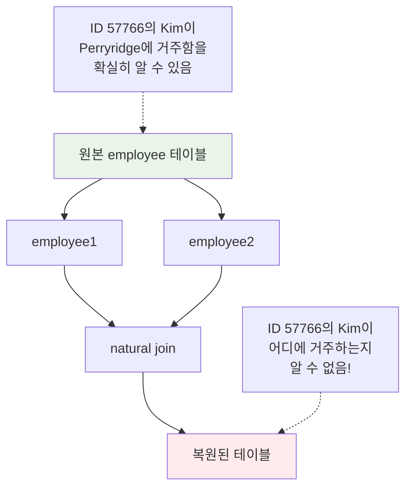
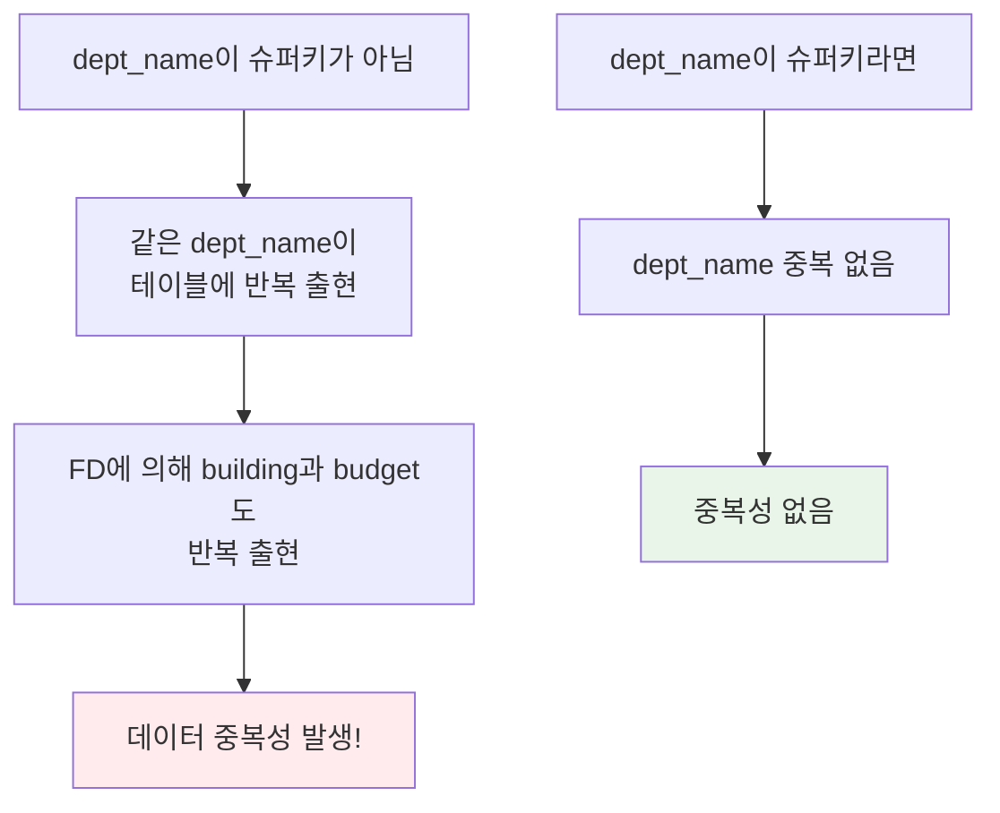

# 관계형 데이터베이스 설계와 정규화 (1)

한양대학교 데이터베이스시스템및응용 강의의 다섯 번째 내용으로, 관계형 데이터베이스 설계와 정규화 이론의 기초를 자세히 살펴보겠습니다.

## 1. 데이터베이스 설계의 목표

### 🎯 설계 목적

**관계형 데이터베이스 설계**: 정보 요구사항을 위한 "좋은" 관계 스키마 집합을 찾는 과정

**설계 목표**:
- 필요한 모든 정보를 **피할 수 있는 중복 없이** 표현할 수 있는 데이터베이스 스키마 설계
- 데이터베이스의 관계(테이블)와 각 관계의 스키마를 정의

```
R = (A B C D E)           : 단일 관계 스키마
DB = {R₁, ..., Rₙ}       : 데이터베이스 스키마 (관계 스키마들의 집합)
```

### ⚠️ 나쁜 설계의 문제점

**나쁜 설계가 야기하는 문제**:
1. **특정 정보를 표현할 수 없음** (Inability to represent certain information)
2. **정보의 반복** (Repetition of Information)
3. **정보의 손실** (Loss of information)

**설계 원칙**:
- 속성 간의 관계가 표현되도록 보장
- 중복 데이터 회피
- 데이터베이스 무결성 제약조건의 강제를 용이하게 함

## 2. 좋은 설계와 나쁜 설계

### 📋 나쁜 설계의 예시

instructor와 department를 결합한 in_dep 관계를 생각해봅시다:

```sql
in_dep (ID, name, salary, dept_name, building, budget)
```

| ID | name | salary | dept_name | building | budget |
|---|---|---|---|---|---|
| 22222 | Einstein | 95000 | Physics | Watson | 70000 |
| 12121 | Wu | 90000 | Finance | Painter | 120000 |
| 32343 | El Said | 60000 | History | Painter | 50000 |
| 45565 | Katz | 75000 | Comp. Sci. | Taylor | 100000 |
| 98345 | Kim | 80000 | Elec. Eng. | Taylor | 85000 |
| 76766 | Crick | 72000 | Biology | Watson | 90000 |
| 10101 | Srinivasan | 65000 | Comp. Sci. | Taylor | 100000 |
| 58583 | Califieri | 62000 | History | Painter | 50000 |
| 83821 | Brandt | 92000 | Comp. Sci. | Taylor | 100000 |

**문제점**:
1. **정보의 중복** (Redundancy): Comp. Sci. 학과 정보가 여러 번 반복됨
2. **NULL 값 필요**: 교수가 없는 새 학과를 추가할 때 NULL 사용 필요
3. **기본키 문제**: ID에 NULL이 가능하므로 `(ID, dept_name)`을 기본키로 사용해야 함

### 🔴 중복성이 야기하는 이상 현상 (Anomalies)

**Codd가 정의한 세 가지 이상 현상**:

#### **1️⃣ 삽입 이상 (Insertion Anomaly)**
- **문제**: 교수가 없는 새 학과를 추가할 수 없음
- **원인**: NULL 값 사용이 바람직하지 않음

#### **2️⃣ 삭제 이상 (Deletion Anomaly)**
- **문제**: 학과의 유일한 교수를 삭제하면? (예: Music 학과의 Mozart)
- **원인**: 학과 정보를 보존하기 위해 NULL 값 필요, 복잡한 삭제 로직 필요

#### **3️⃣ 갱신 이상 (Update Anomaly)**
- **문제**: CS 학과 예산이 변경되면?
- **원인**: CS 학과의 모든 중복 레코드를 업데이트해야 함

**근본 원인**: 데이터 중복성 → 여러 개체(instructor, department)가 하나의 테이블에 공존

**해결책**: **분해 (Decomposition)**

## 3. 분해 (Decomposition)

### 🔧 분해의 개념

**목적**: in_dep 스키마의 정보 반복 문제를 피하려면 두 개의 스키마로 분해

```sql
-- 분해된 스키마
instructor (ID, name, salary, dept_name)
department (dept_name, building, budget)
```

**장점**: 분해된 스키마는 이전 문제들을 가지지 않음!

### ❌ 나쁜 분해의 예

모든 분해가 좋은 것은 아닙니다:

```sql
-- 원본
employee (ID, name, street, city, salary)

-- 나쁜 분해
employee1 (ID, name)
employee2 (name, street, city, salary)
```

**문제**: 동명이인이 있는 경우



### 🔒 무손실 분해 (Lossless Decomposition)

**정의**: R을 R₁과 R₂로 분해할 때, 정보 손실이 없으면 무손실 분해

**형식적 정의**:
```
Π_R1(r) ⋈ Π_R2(r) = r
```

여기서 r은 스키마 R을 가진 관계

**손실 분해 (Lossy Decomposition)**:
```
r ⊂ Π_R1(r) ⋈ Π_R2(r)
```

> **주의**: `Π_R1(r) ⋈ Π_R2(r) ⊂ r`은 절대 발생하지 않음!

#### **무손실 분해 예시**

```sql
-- R = (A, B, C)를 R1 = (A, B), R2 = (B, C)로 분해
```

| A | B | C |
|---|---|---|
| α | 1 | A |
| β | 2 | B |

분해 후:

**Π_A,B(r)**:

| A | B |
|---|---|
| α | 1 |
| β | 2 |

**Π_B,C(r)**:

| B | C |
|---|---|
| 1 | A |
| 2 | B |

조인 결과:

**Π_A,B(r) ⋈ Π_B,C(r)**:

| A | B | C |
|---|---|---|
| α | 1 | A |
| β | 2 | B |

✅ 원본과 동일! → **무손실 분해**

## 4. 정규화 이론 (Normalization Theory)

### 🎯 정규화의 목표

**정규화**: 관계형 데이터베이스를 설계하는 과정

**과정**:
1. 특정 관계 R이 "좋은 형태"인지 판단
2. 좋은 형태가 아니라면, {R₁, R₂, ..., Rₙ}으로 분해:
   - 각 관계가 **정규형(normal form)**을 만족
   - 분해가 **무손실 분해**
   - **종속성 보존** (가능하면)

**이론적 기반**:
- **함수적 종속성** (Functional Dependencies) - 가장 일반적 접근
- **다치 종속성** (Multivalued Dependencies) - 수업에서 다루지 않음

## 5. 함수적 종속성 (Functional Dependencies)

### 📚 개념과 정의

**실세계 제약조건의 예**:
- 학생과 교수는 ID로 고유하게 식별됨
- 각 학생과 교수는 하나의 이름만 가짐
- 각 교수와 학생은 주로 하나의 학과와 연관됨
- 각 학과는 예산과 건물에 대해 하나의 값만 가짐

**법적 인스턴스 (Legal Instance)**: 모든 실세계 제약조건을 만족하는 관계 인스턴스

### 🔍 함수적 종속성 정의

**관계 스키마** R에서 α ⊆ R이고 β ⊆ R일 때,

**함수적 종속성** α → β가 R에서 성립한다는 것은:

> 모든 법적 관계 r(R)에 대해, 두 튜플 t₁과 t₂가 속성 α에서 일치하면,
> 속성 β에서도 반드시 일치한다

**형식적 표현**:
```
t₁[α] = t₂[α]  ⟹  t₁[β] = t₂[β]
```

#### **예시**

관계 r(A, B):

| A | B |
|---|---|
| 1 | 4 |
| 1 | 5 |
| 3 | 7 |

이 인스턴스에서:
- ✅ **B → A 성립**: B 값이 같으면 A 값도 같음
- ❌ **A → B 성립하지 않음**: A 값이 1인 두 튜플의 B 값이 다름 (4와 5)

### 🔐 키와 함수적 종속성

**슈퍼키 정의**:
```
K는 슈퍼키 ⟺ K → R
```

**후보키 정의**:
```
K는 후보키 ⟺ K → R이고, K의 진부분집합 α에 대해 α → R이 성립하지 않음
```

#### **함수적 종속성의 활용**

**in_dep 스키마**:
```sql
in_dep (ID, name, salary, dept_name, building, budget)
```

**예상되는 함수적 종속성**:
```
dept_name → building
ID → building
```

**예상되지 않는 함수적 종속성**:
```
dept_name → salary  (학과가 급여를 결정하지 않음)
```

### 📊 함수적 종속성의 특성

#### **자명한 함수적 종속성 (Trivial FD)**

**정의**: 모든 인스턴스(법적이든 아니든)에서 만족되는 함수적 종속성

**예시**:
- `ID, name → ID`
- `name → name`

**일반 규칙**: α → β가 자명함 ⟺ β ⊆ α

#### **함수적 종속성 테스트**

**관계 r이 함수적 종속성 집합 F를 만족** (r satisfies F):
- r이 F의 모든 함수적 종속성을 만족하는 법적 관계

**F가 R에서 성립** (F holds on R):
- R의 모든 법적 관계가 F를 만족

> **주의**: 특정 인스턴스가 우연히 어떤 함수적 종속성을 만족할 수 있지만,
> 그것이 모든 법적 인스턴스에서 성립하는 것은 아님

## 6. 폐포 (Closure)

### 🔄 함수적 종속성 집합의 폐포

**함수적 종속성 집합 F**가 주어졌을 때, F로부터 **논리적으로 유도되는** 다른 함수적 종속성들이 존재

**예시**:
- A → B이고 B → C이면, **A → C**를 추론할 수 있음

**폐포 (Closure) F⁺**: F에 의해 논리적으로 유도되는 모든 함수적 종속성의 집합

## 7. 무손실 분해와 함수적 종속성

### 🔗 무손실 분해 조건

R을 R₁과 R₂로 분해할 때, **무손실 분해**가 되려면:

다음 중 **최소한 하나의 함수적 종속성**이 F⁺에 존재해야 함:

```
R₁ ∩ R₂ → R₁
또는
R₁ ∩ R₂ → R₂
```

**의미**: 두 분해된 스키마의 **공통 속성**이 둘 중 하나의 스키마를 **결정**해야 함

### 📝 예시

```sql
-- R = (A, B, C)
-- F = {A → B, B → C}

-- 분해 1: R1 = (A, B), R2 = (B, C)
```

**검증**:
- R₁ ∩ R₂ = {B}
- B → BC이므로 B → R₂
- ✅ 무손실 분해!

```sql
-- 분해 2: R1 = (A, B), R2 = (A, C)
```

**검증**:
- R₁ ∩ R₂ = {A}
- A → AB이므로 A → R₁
- ✅ 무손실 분해!

## 8. 종속성 보존 (Dependency Preservation)

### 🎯 종속성 보존의 필요성

**문제**: 데이터베이스가 업데이트될 때마다 함수적 종속성 제약조건을 테스트하는 것은 비용이 많이 듦

**목표**: 함수적 종속성 테스트를 **하나의 관계만 고려**하여 효율적으로 수행

**종속성 보존 분해**: 함수적 종속성 강제를 계산적으로 어렵게 만들지 않는 분해

### 📊 종속성 보존 예시

```sql
-- 원본 관계
Name → City, Prefecture
City → Prefecture
```

| Name | City | Prefecture |
|---|---|---|
| Kim | Suwon | Kyungki-do |

#### **✅ 종속성 보존 분해**

```sql
-- 분해 1
R1: (Name, City)
R2: (City, Prefecture)
```

| Name | City |
|---|---|
| Kim | Suwon |

| City | Prefecture |
|---|---|
| Suwon | Kyungki-do |

**확인**:
- R1: `Name → City` 검증 가능
- R2: `City → Prefecture` 검증 가능
- ✅ 조인 없이 모든 함수적 종속성 검증 가능!

#### **❌ 종속성 보존하지 않는 분해**

```sql
-- 분해 2
R1: (Name, City)
R2: (Name, Prefecture)
```

| Name | City |
|---|---|
| Kim | Suwon |

| Name | Prefecture |
|---|---|
| Kim | Kyungki-do |

**문제**:
- `City → Prefecture`를 검증하려면 **조인 필요**!
- ❌ 종속성 보존 분해가 아님!

## 9. 분해의 목표

### 🎯 분해 시 달성해야 할 목표

함수적 종속성 집합 F를 가진 관계 스키마 R을 R₁, R₂, ..., Rₙ으로 분해할 때:

**세 가지 목표**:
1. **무손실 분해** (Lossless Decomposition)
2. **중복성 제거** (No Redundancy)
3. **종속성 보존** (Dependency Preservation)

## 10. 제1정규형 (First Normal Form, 1NF)

### 📋 1NF의 정의

**원자적 도메인 (Atomic Domain)**: 원소들이 더 이상 나눌 수 없는 단위로 간주되는 도메인

**비원자적 도메인의 예**:
- 이름들의 집합, 복합 속성
- `CS101`과 같이 부분으로 나눌 수 있는 식별 번호

**제1정규형**: 모든 속성의 도메인이 **원자적**인 관계 스키마

### 🔍 원자성의 판단

**원자성은 사용 방식에 따라 결정됨**:

**학번의 예**: `CS0012`, `EE1127`, ...
- ❌ **비원자적**: 처음 두 글자를 추출하여 학과를 찾는 경우
- ✅ **원자적**: 전체 학번을 하나의 값으로 사용하는 경우

### ⚠️ 비원자적 속성의 문제

**문제점**:
- 애플리케이션에서 정보의 **인코딩/디코딩** 필요
- 저장과 쿼리 처리를 복잡하게 만듦

> **가정**: 우리는 모든 관계가 제1정규형에 있다고 가정합니다.

## 11. 보이스-코드 정규형 (Boyce-Codd Normal Form, BCNF)

### 🎯 BCNF의 정의

함수적 종속성 집합 F를 가진 관계 스키마 R이 **BCNF**에 있으려면:

F⁺의 모든 함수적 종속성 α → β (α ⊆ R, β ⊆ R)에 대해,
**다음 중 최소한 하나**가 성립해야 함:

1. **α → β가 자명한 함수적 종속성** (β ⊆ α)
2. **α가 R의 슈퍼키** (α → R)

> **BCNF의 핵심**: '확실히' 존재해야 하는 함수적 종속성 외에는 허용하지 않음

### 📊 BCNF 위반 예시

```sql
in_dep (ID, name, salary, dept_name, building, budget)
```

**함수적 종속성**:
```
dept_name → building, budget
```

**BCNF 위반 이유**:
- `dept_name → building, budget`가 성립
- **하지만** dept_name이 슈퍼키가 아님



### 🔧 BCNF로 분해

**분해 후**:
```sql
instructor (ID, name, salary, dept_name)  -- BCNF 만족
department (dept_name, building, budget)   -- BCNF 만족
```

**확인**:
- `instructor`: ID가 슈퍼키
- `department`: dept_name이 슈퍼키

## 12. BCNF 분해 알고리즘

### 🔄 분해 절차

R이 BCNF를 만족하지 않을 때:

**1단계**: BCNF를 위반하는 함수적 종속성 α → β 찾기
- α가 R의 슈퍼키가 아님

**2단계**: R을 두 스키마로 분해:
- **(α ∪ β)**: α와 β만 포함하는 새 관계 생성
  - 이 관계에서 α → β가 성립하지만, α가 슈퍼키이므로 BCNF 위반 없음
- **(R - (β - α))**: 원본에서 β를 제거하되 α는 유지
  - 이 관계에서 α → β가 더 이상 존재하지 않음

### 📝 예시

```sql
-- in_dep에서 dept_name → building, budget가 BCNF 위반
```

**분해**:
- α = dept_name
- β = {building, budget}

**결과**:
- (α ∪ β) = `(dept_name, building, budget)`
- (R - (β - α)) = `(ID, name, salary, dept_name)`

## 13. BCNF 분해 예시

### 📊 예시 1

```sql
-- R = (A, B, C)
-- F = {A → B, B → C}
-- F⁺ = {A → B, B → C, A → C}
```

**문제**: R이 BCNF에 있지 않음
- B → C가 성립하지만 B가 슈퍼키가 아님

**분해 옵션 1**: R₁ = (A, B), R₂ = (B, C)
- ✅ 무손실 조인: R₁ ∩ R₂ = {B}, B → BC
- ✅ 종속성 보존: R₁에서 A → B, R₂에서 B → C
  - A → C는 A → B와 B → C로 보장됨

**분해 옵션 2**: R₁ = (A, B), R₂ = (A, C)
- ✅ 무손실 조인: R₁ ∩ R₂ = {A}, A → AB
- ❌ 종속성 보존 아님: B → C를 R₁ ⋈ R₂ 없이 검증 불가

## 14. BCNF와 종속성 보존

### ⚠️ BCNF의 한계

**중요**: BCNF와 종속성 보존을 **동시에 달성할 수 없는 경우**가 존재

### 📝 예시

```sql
dept_advisor (student_ID, instructor_ID, dept_name)
```

**함수적 종속성**:
```
instructor_ID → dept_name
student_ID, dept_name → instructor_ID
```

**가정**: 학생은 서로 다른 학과에서 여러 지도교수를 가질 수 있음

**후보키**:
- `{student_ID, dept_name}`
- `{student_ID, instructor_ID}`

**BCNF 위반**:
- `instructor_ID → dept_name`가 성립
- 하지만 instructor_ID는 슈퍼키가 아님

**문제**: dept_advisor의 어떤 분해도 `student_ID, dept_name → instructor_ID`를 보존하지 못함

## 15. 제3정규형 (Third Normal Form, 3NF)

### 🎯 3NF의 동기

**상황**:
- BCNF가 종속성 보존이 안 되는 경우가 있음
- 업데이트 시 함수적 종속성 위반을 효율적으로 검사하는 것이 중요함

**해결책**: 더 약한 정규형인 **제3정규형 (3NF)** 정의

**3NF의 특징**:
- 일부 중복을 허용
- 하지만 조인 없이 개별 관계에서 함수적 종속성 검사 가능

### 📋 3NF 정의

관계 스키마 R이 **제3정규형 (3NF)**에 있으려면:

F⁺의 모든 α → β에 대해, **다음 중 하나**가 성립:

1. **α → β가 자명함** (β ⊆ α)
2. **α가 R의 슈퍼키**
3. **β - α의 각 속성 A가 R의 어떤 후보키에 포함됨**
   (주의: 각 속성이 서로 다른 후보키에 포함될 수 있음)

> **관계**: BCNF ⊂ 3NF
> BCNF를 만족하면 3NF도 만족 (조건 3이 BCNF의 최소 완화)

### 🔍 3NF vs BCNF

**BCNF**:
- 조건 1, 2만 만족하면 됨
- 더 엄격함

**3NF**:
- 조건 3을 추가로 허용
- BCNF의 최소 완화
- **종속성 보존을 보장하기 위한** 완화

### 📊 3NF 예시

```sql
dept_advisor (student_ID, instructor_ID, dept_name)
```

**함수적 종속성**:
```
instructor_ID → dept_name
student_ID, dept_name → instructor_ID
```

**후보키**:
- `{student_ID, dept_name}`
- `{student_ID, instructor_ID}`

**BCNF 확인**:
- `instructor_ID → dept_name`에서 instructor_ID는 슈퍼키가 아님
- ❌ BCNF 아님

**3NF 확인**:
- `student_ID, dept_name → instructor_ID`: student_ID, dept_name이 슈퍼키 ✅
- `instructor_ID → dept_name`에서:
  - instructor_ID는 슈퍼키가 아님
  - 하지만 {dept_name} - {instructor_ID} = {dept_name}
  - dept_name은 후보키 `{student_ID, dept_name}`에 포함됨 ✅
- ✅ 3NF 만족!

### 🔄 3NF의 장단점

**장점**:
- **항상** 무손실이고 종속성 보존하는 3NF 분해 존재

**단점**:
- 의미 있는 관계를 나타내기 위해 **NULL 값** 사용 필요
- **정보 반복** 문제 존재

### 📉 3NF의 중복성 예시

```sql
-- R = (J, K, L)
-- F = {JK → L, L → K}
-- 후보키: JK, JL
```

| J | L | K |
|---|---|---|
| j₁ | l₁ | k₁ |
| j₂ | l₁ | k₁ |
| j₃ | l₁ | k₁ |
| null | l₂ | k₂ |

**문제점**:
- (l₁, k₁) 정보의 반복
- (l₂, k₂) 관계를 나타내기 위해 NULL 값 필요

## 16. BCNF의 한계

### 🤔 BCNF도 충분하지 않은 경우

BCNF인데도 충분히 정규화되지 않은 것처럼 보이는 경우가 있습니다.

```sql
inst_info (ID, child_name, phone)
```

**가정**: 한 교수가 여러 전화번호와 여러 자녀를 가질 수 있음

**인스턴스 예시**:

| ID | child_name | phone |
|---|---|---|
| 99999 | David | 512-555-1234 |
| 99999 | David | 512-555-4321 |
| 99999 | William | 512-555-1234 |
| 99999 | William | 512-555-4321 |

**BCNF 확인**:
- 비자명한 함수적 종속성이 없음
- ✅ BCNF 만족

**삽입 이상**:
- ID 99999에 전화번호 981-992-3443을 추가하려면:
  - (99999, David, 981-992-3443)
  - (99999, William, 981-992-3443)
  - 두 튜플을 모두 추가해야 함!

**더 나은 분해**:
```sql
inst_child (ID, child_name)
inst_phone (ID, phone)
```

| ID | child_name |
|---|---|
| 99999 | David |
| 99999 | William |

| ID | phone |
|---|---|
| 99999 | 512-555-1234 |
| 99999 | 512-555-4321 |

**해결**: 제4정규형 (4NF) - **다치 종속성 (Multivalued Dependencies)** 기반

## 17. 정규화 목표 정리

### 🎯 정규화의 최종 목표

함수적 종속성 집합 F를 가진 관계 스키마 R을 분해할 때:

**반드시 달성해야 할 목표**:
1. **각 관계 스키마가 좋은 형태** (정규형)
2. **무손실 분해**

**가능하면 달성해야 할 목표**:
3. **종속성 보존**

### 📊 정규형 비교

| 정규형 | 조건 | 중복성 | 종속성 보존 |
|--------|------|--------|-------------|
| **1NF** | 원자적 속성 | 많음 | - |
| **3NF** | 완화된 조건 | 일부 허용 | ✅ 항상 가능 |
| **BCNF** | 엄격한 조건 | 없음 | ❌ 항상 가능하지 않음 |
| **4NF** | 다치 종속성 | 없음 | - |

## 18. 정리 및 다음 학습

### 📝 핵심 내용 정리

1. **나쁜 설계**는 삽입/삭제/갱신 이상을 야기
2. **분해**는 중복성을 제거하지만, 무손실과 종속성 보존이 중요
3. **함수적 종속성**은 속성 간의 제약조건을 표현
4. **제1정규형 (1NF)**: 모든 속성이 원자적
5. **BCNF**: 슈퍼키가 아닌 결정자를 허용하지 않음
6. **제3정규형 (3NF)**: BCNF의 완화, 종속성 보존 보장
7. **종속성 보존**: 조인 없이 제약조건 검사 가능

### 🔜 다음 학습 계획

다음 포스트에서는 **정규화 알고리즘과 고급 개념**을 학습하겠습니다:
- BCNF 분해 알고리즘
- 3NF 분해 알고리즘
- 함수적 종속성의 추론 규칙
- 정규화 과정의 실무 적용

---

## 📚 참고 자료
- 한양대학교 데이터베이스시스템및응용 강의자료
- Database System Concepts (Silberschatz, Galvin, Gagne)

> 💡 **학습 팁**: 정규화 이론은 처음에는 추상적으로 느껴질 수 있습니다. 각 정규형의 예시를 직접 만들어보고, 왜 특정 설계가 문제를 일으키는지 생각해보세요. 실제 프로젝트에서 테이블을 설계할 때 정규화 원칙을 적용하면 훨씬 더 깊이 이해할 수 있습니다!
